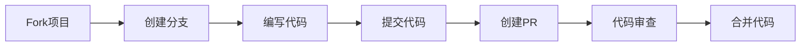

# 贡献指南 🤝

> **欢迎为 TaskFlowInsight 做出贡献！** 每一个贡献都会让这个项目变得更好。

## 🚀 快速开始

### 我能做什么贡献？

- 🐛 **报告Bug** - 发现问题就是贡献
- 💡 **提出新功能** - 分享你的想法
- 📝 **改进文档** - 让文档更清晰
- 🔧 **提交代码** - 修复问题或添加功能
- 🧪 **编写测试** - 提高代码质量
- 🌍 **翻译文档** - 帮助更多人使用
- 📋 **回答问题** - 帮助其他用户

### 贡献流程概览



---

## 📋 贡献类型

### 🐛 Bug报告

**在提交Bug之前，请确保**：
- [ ] 搜索了现有的[Issues](https://github.com/shiyongyin/TaskFlowInsight/issues)
- [ ] 查阅了[FAQ](FAQ.md)和[故障排除指南](TROUBLESHOOTING.md)
- [ ] 能够稳定复现问题

**Bug报告模板**：
```markdown
## Bug描述
[简要描述Bug现象]

## 复现步骤
1. 执行操作A
2. 调用方法B
3. 查看结果C

## 期望结果
[描述期望发生的情况]

## 实际结果
[描述实际发生的情况]

## 环境信息
- TFI版本: 2.1.0
- Spring Boot版本: 3.5.5
- Java版本: 21
- 操作系统: macOS 14.0

## 附加信息
- 日志输出: [粘贴相关日志]
- 配置文件: [粘贴相关配置]
- 重现代码: [提供最小重现示例]
```

### 💡 功能请求

**功能请求模板**：
```markdown
## 功能描述
[清晰描述希望添加的功能]

## 使用场景
[描述在什么情况下需要这个功能]

## 建议的解决方案
[如果有想法，描述如何实现]

## 替代方案
[描述其他可能的解决方案]

## 附加信息
[添加任何其他相关信息]
```

### 📝 文档改进

文档贡献包括：
- 修复拼写/语法错误
- 改进示例代码
- 添加使用场景
- 翻译到其他语言
- 改善文档结构

---

## 🔧 开发环境设置

### 前置要求

```bash
# 检查Java版本 (需要21+)
java -version

# 检查Maven版本 (需要3.6+)
mvn -version

# 检查Git版本
git --version
```

### 环境搭建

1. **Fork项目**
   ```bash
   # 在GitHub上点击Fork按钮
   # 然后克隆你的fork
   git clone https://github.com/YOUR_USERNAME/TaskFlowInsight.git
   cd TaskFlowInsight
   ```

2. **添加上游仓库**
   ```bash
   git remote add upstream https://github.com/shiyongyin/TaskFlowInsight.git
   git remote -v
   ```

3. **构建项目**
   ```bash
   # 清理并编译
   ./mvnw clean compile
   
   # 运行测试
   ./mvnw test
   
   # 运行演示程序
   ./mvnw exec:java -Dexec.mainClass="com.syy.taskflowinsight.demo.TaskFlowInsightDemo"
   ```

4. **IDE配置**

   **IntelliJ IDEA**:
   ```bash
   # 导入项目
   File -> Open -> 选择项目根目录
   
   # 配置Lombok
   Settings -> Plugins -> 安装Lombok插件
   Settings -> Annotation Processors -> 启用注解处理
   ```

   **VS Code**:
   ```bash
   # 安装扩展
   code --install-extension vscjava.vscode-java-pack
   code --install-extension GabrielBB.vscode-lombok
   ```

---

## 🏗️ 开发流程

### 分支管理

```bash
# 创建功能分支
git checkout -b feature/your-feature-name

# 创建修复分支
git checkout -b fix/issue-number-description

# 创建文档分支
git checkout -b docs/documentation-improvement
```

**分支命名规范**：
- `feature/` - 新功能
- `fix/` - Bug修复
- `docs/` - 文档更新
- `test/` - 测试相关
- `refactor/` - 代码重构
- `style/` - 代码格式
- `chore/` - 构建过程或辅助工具

### 开发最佳实践

#### 代码规范

1. **Java代码风格**
   ```java
   // ✅ 好的例子
   @TfiTask("用户注册")
   public UserRegistrationResult registerUser(UserRegistrationRequest request) {
       validateRequest(request);
       
       User user = createUser(request);
       TFI.track("user", user);
       
       return new UserRegistrationResult(user);
   }
   
   // ❌ 避免的例子
   @TfiTask("")  // 空描述
   public Object doSomething(Object o) {  // 不明确的命名
       // 没有追踪
       return null;
   }
   ```

2. **测试规范**
   ```java
   @Test
   @DisplayName("应该在用户注册时正确追踪用户信息")
   void shouldTrackUserInfoDuringRegistration() {
       // Given
       UserRegistrationRequest request = createTestRequest();
       
       // When
       TFI.start("用户注册测试");
       UserRegistrationResult result = userService.registerUser(request);
       TFI.end();
       
       // Then
       assertThat(result.isSuccess()).isTrue();
       // 验证TFI追踪数据
       assertThat(TfiTestContext.getTrackedObjects()).containsKey("user");
   }
   ```

3. **文档规范**
   ```java
   /**
    * 处理用户注册流程
    * 
    * @param request 用户注册请求，包含用户名、邮箱、密码等信息
    * @return 注册结果，包含用户信息和注册状态
    * @throws UserValidationException 当用户信息验证失败时
    * @throws DuplicateUserException 当用户已存在时
    */
   @TfiTask("用户注册")
   public UserRegistrationResult registerUser(UserRegistrationRequest request) {
       // 实现代码
   }
   ```

#### 提交规范

使用[Conventional Commits](https://www.conventionalcommits.org/zh-hans/)格式：

```bash
# 格式
<类型>[可选的作用域]: <描述>

[可选的正文]

[可选的脚注]
```

**提交类型**：
- `feat`: 新功能
- `fix`: Bug修复
- `docs`: 文档更新
- `style`: 代码格式（不影响代码运行）
- `refactor`: 重构（既不是新增功能，也不是修复bug）
- `test`: 添加测试
- `chore`: 构建过程或辅助工具的变动

**提交示例**：
```bash
# 新功能
git commit -m "feat(api): 添加数据脱敏功能

- 支持注解配置敏感字段
- 支持全局配置脱敏规则
- 添加常见敏感数据类型预设

Closes #123"

# Bug修复
git commit -m "fix(context): 修复异步上下文传播丢失问题

在使用CompletableFuture时，TFI上下文没有正确传播到子线程。
现在使用TaskDecorator确保上下文正确传播。

Fixes #456"

# 文档更新
git commit -m "docs: 更新API文档示例

- 添加更多实际使用场景
- 修复代码示例中的语法错误
- 改进文档结构"
```

---

## 🧪 测试指南

### 测试类型

1. **单元测试**
   ```java
   @ExtendWith(MockitoExtension.class)
   class TfiApiTest {
       
       @Test
       void shouldStartSessionSuccessfully() {
           // 测试TFI.start()方法
           TFI.start("测试会话");
           
           assertThat(TFI.getCurrentSession()).isNotNull();
           assertThat(TFI.getCurrentSession().getName()).isEqualTo("测试会话");
           
           TFI.end();
       }
   }
   ```

2. **集成测试**
   ```java
   @SpringBootTest
   @TestMethodOrder(OrderAnnotation.class)
   class TfiIntegrationTest {
       
       @Autowired
       private TestService testService;
       
       @Test
       @Order(1)
       void shouldIntegrateWithSpringBootSuccessfully() {
           // 测试Spring Boot集成
           testService.performOperation();
           
           // 验证追踪数据
           assertThat(TfiContext.getActiveSessions()).hasSize(1);
       }
   }
   ```

3. **性能测试**
   ```java
   @Test
   void shouldMeetPerformanceRequirements() {
       // 性能基准测试
       long startTime = System.currentTimeMillis();
       
       for (int i = 0; i < 10000; i++) {
           TFI.start("性能测试-" + i);
           TFI.track("data", "test-data-" + i);
           TFI.end();
       }
       
       long duration = System.currentTimeMillis() - startTime;
       assertThat(duration).isLessThan(5000); // 5秒内完成10000次操作
   }
   ```

### 运行测试

```bash
# 运行所有测试
./mvnw test

# 运行特定测试类
./mvnw test -Dtest=TfiApiTest

# 运行特定测试方法
./mvnw test -Dtest=TfiApiTest#shouldStartSessionSuccessfully

# 运行集成测试
./mvnw verify

# 生成测试覆盖率报告
./mvnw jacoco:report
open target/site/jacoco/index.html
```

---

## 📤 提交Pull Request

### PR准备清单

提交PR前请确保：

- [ ] **代码质量**
  - [ ] 代码符合项目风格
  - [ ] 没有编译警告
  - [ ] 通过所有测试
  - [ ] 添加了必要的测试
  - [ ] 更新了相关文档

- [ ] **提交规范**
  - [ ] 提交信息符合规范
  - [ ] 提交历史清晰
  - [ ] 没有无关的文件变更

- [ ] **功能完整性**
  - [ ] 功能按预期工作
  - [ ] 处理了边界情况
  - [ ] 有适当的错误处理
  - [ ] 性能影响可接受

### PR模板

```markdown
## 变更概述
[简要描述这个PR做了什么]

## 变更类型
- [ ] Bug修复 (非破坏性变更，修复问题)
- [ ] 新功能 (非破坏性变更，添加功能)
- [ ] 破坏性变更 (会导致现有功能不正常工作的修复或功能)
- [ ] 文档更新 (文档改进，没有代码变更)

## 变更详情
### 添加的功能
- 功能A: 描述
- 功能B: 描述

### 修复的问题
- 修复了问题X
- 修复了问题Y

### 其他变更
- 重构了模块Z
- 优化了性能

## 测试
### 新增测试
- [ ] 单元测试
- [ ] 集成测试
- [ ] 性能测试

### 测试场景
1. 测试场景A：预期结果A
2. 测试场景B：预期结果B

## 兼容性
- [ ] 向后兼容
- [ ] 有破坏性变更 (请在下方详细说明)

### 破坏性变更详情
[如果有破坏性变更，请详细描述]

## 文档
- [ ] 更新了相关文档
- [ ] 添加了API文档
- [ ] 更新了示例代码

## 审查清单
- [ ] 我已经对我的代码进行了自审
- [ ] 我的代码遵循了项目的代码规范
- [ ] 我已经添加了必要的注释
- [ ] 我已经添加了测试来证明我的修复是有效的或我的功能是正常工作的
- [ ] 新的和现有的单元测试在本地通过
- [ ] 我的变更没有产生新的警告

## 关联Issue
Closes #(issue编号)
```

### PR审查流程

1. **自动检查**
   - CI/CD流水线运行
   - 代码质量检查
   - 测试覆盖率检查
   - 安全扫描

2. **代码审查**
   - 至少需要1个审查者批准
   - 核心维护者的最终审查
   - 解决所有审查意见

3. **合并策略**
   - 使用"Squash and merge"合并小型PR
   - 使用"Create a merge commit"合并大型功能PR

---

## 👥 社区参与

### 沟通渠道

- **GitHub Issues**: 报告Bug、功能请求
- **GitHub Discussions**: 技术讨论、问题求助
- **Pull Request Reviews**: 代码审查讨论

### 行为准则

我们致力于创建一个开放、友好的社区环境：

1. **友善和尊重**: 对所有参与者保持友善和尊重
2. **建设性反馈**: 提供有建设性的反馈和建议
3. **包容性**: 欢迎不同背景和经验水平的贡献者
4. **协作精神**: 积极协作，共同改进项目

### 认可贡献者

- 所有贡献者都会在[CONTRIBUTORS.md](CONTRIBUTORS.md)中被感谢
- 重要贡献者会在项目README中被特别提及
- 持续贡献者可能被邀请成为项目维护者

---

## 🎯 贡献指导

### 新手友好的Issue

寻找标有以下标签的Issue开始贡献：
- `good first issue` - 适合新手的简单问题
- `help wanted` - 需要帮助的问题
- `documentation` - 文档改进
- `enhancement` - 功能增强

### 贡献建议

1. **从小处开始**: 先修复简单的Bug或改进文档
2. **理解代码库**: 花时间了解项目结构和代码风格
3. **与社区互动**: 在Discord讨论想法，获得反馈
4. **保持耐心**: 代码审查可能需要时间
5. **持续学习**: 从审查意见中学习和改进

### 常见问题

**Q: 我想贡献，但不知道从哪里开始？**
A: 查看标有`good first issue`的Issue，或者改进文档是很好的开始。

**Q: 我的PR被拒绝了，该怎么办？**
A: 仔细阅读审查意见，按照建议修改代码，然后重新提交。

**Q: 我可以自己添加新功能吗？**
A: 对于重大功能，建议先创建Issue讨论设计方案，获得社区认可后再开始开发。

**Q: 测试失败了怎么办？**
A: 检查错误信息，确保你的改动没有破坏现有功能。如果需要帮助，可以在PR中寻求帮助。

---

## 🙏 感谢

感谢所有为TaskFlowInsight做出贡献的开发者！每一个贡献，无论大小，都让这个项目变得更好。

### 当前维护者

- **[shiyongyin](https://github.com/shiyongyin)** - 项目创建者和主要维护者

### 贡献者

感谢所有贡献者的付出！查看完整的贡献者列表：[CONTRIBUTORS.md](CONTRIBUTORS.md)

---

**准备好开始贡献了吗？** 🚀

1. Fork这个项目
2. 查看[good first issue](https://github.com/shiyongyin/TaskFlowInsight/labels/good%20first%20issue)
3. 按照这个指南开始你的第一个贡献！

如果有任何问题，随时在[GitHub Discussions](https://github.com/shiyongyin/TaskFlowInsight/discussions)中提问。

**让我们一起让TaskFlowInsight变得更好！** ✨