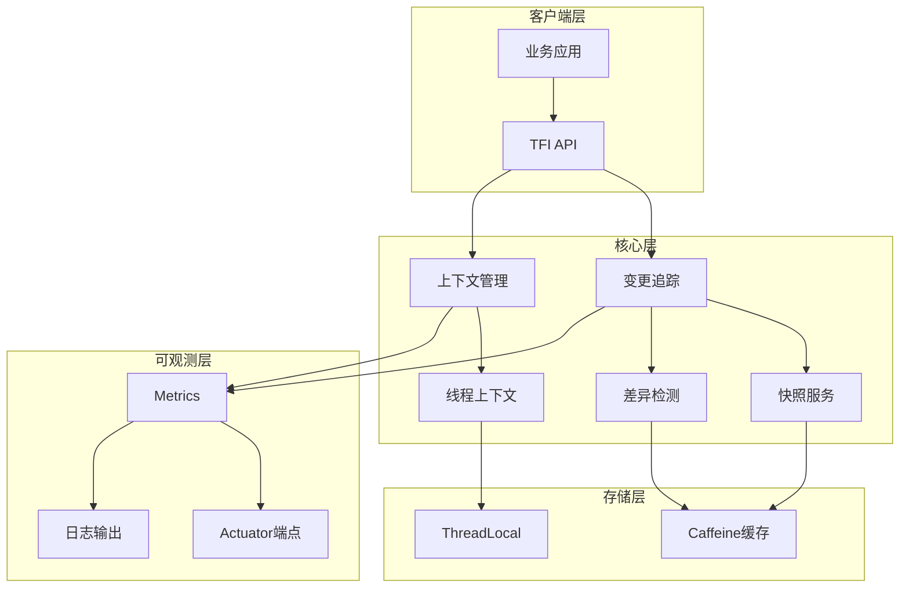

# TaskFlowInsight

[](https://www.oracle.com/java/)
[](https://spring.io/projects/spring-boot)
[](https://maven.apache.org/)
[](LICENSE)
[]()

**业务流程任务执行流追踪与分析的Spring Boot可观测性组件**

## 📑 目录

- [TL;DR 快速上手](#tldr-快速上手)
- [✨ 特性亮点](#-特性亮点)
- [📦 项目结构](#-项目结构)
- [🏗️ 架构概览](#️-架构概览)
- [🔧 技术栈](#-技术栈)
- [📥 安装与运行](#-安装与运行)
- [🔌 API概览](#-api概览)
- [⚙️ 配置说明](#️-配置说明)
- [📊 可观测性](#-可观测性)
- [🔒 性能与安全](#-性能与安全)
- [🗺️ Roadmap](#️-roadmap)
- [🤝 贡献指南](#-贡献指南)
- [📄 License](#-license)
- [🙏 致谢](#-致谢)

## TL;DR 快速上手

```bash
# 1. 克隆仓库
git clone https://github.com/shiyongyin/TaskFlowInsight.git
cd TaskFlowInsight

# 2. 编译运行（需要 Java 21）
./mvnw clean compile
./mvnw spring-boot:run

# 3. 验证服务 
curl http://localhost:19090/actuator/health
```

服务启动后访问：
- 应用端口：`http://localhost:19090`
- 健康检查：`http://localhost:19090/actuator/health`

## ✨ 特性亮点

- **🔍 任务流追踪**：完整的任务执行流程追踪，支持嵌套任务和并发场景
- **📈 变更检测**：实时对象状态变更追踪，支持深度快照和差异对比
- **⚡ 高性能缓存**：基于Caffeine的多层缓存策略，P95延迟<10μs
- **🛡️ 零侵入集成**：通过简单注解即可启用，无需修改业务代码
- **📊 可观测性**：集成Spring Boot Actuator，提供健康检查和指标监控
- **🔧 灵活配置**：支持YAML配置，细粒度控制追踪行为
- **🧪 完善测试**：629个测试用例，100%通过率，无Mock依赖

## 📦 项目结构

```
TaskFlowInsight/
├── src/main/java/com/syy/taskflowinsight/
│   ├── api/              # 门面API层（TFI主入口）
│   ├── tracking/         # 变更追踪核心（快照、差异检测、比较服务）
│   │   ├── snapshot/     # 对象快照实现
│   │   ├── diff/         # 差异检测器
│   │   ├── compare/      # 比较服务
│   │   └── path/         # 路径匹配缓存
│   ├── context/          # 上下文管理（线程安全）
│   ├── model/            # 数据模型（Session、TaskNode、Message）
│   ├── config/           # Spring Boot自动配置
│   ├── actuator/         # Actuator端点实现
│   ├── exporter/         # 导出器（JSON、控制台）
│   ├── store/            # 存储层（Caffeine缓存）
│   ├── metrics/          # 指标收集与日志
│   ├── performance/      # 性能基准测试
│   └── demo/             # 演示和示例
├── src/main/resources/
│   └── application.yml   # 默认配置
├── src/test/             # 测试套件（629个测试）
├── docs/                 # 文档
│   ├── API-REFERENCE.md # API参考
│   ├── specs/           # 规格文档
│   └── develop/         # 开发文档
├── pom.xml              # Maven配置
└── mvnw                 # Maven Wrapper
```

## 🏗️ 架构概览



## 🔧 技术栈

### 后端技术
- **核心框架**：Spring Boot 3.5.5
- **编程语言**：Java 21
- **构建工具**：Maven 3.9.11
- **代码简化**：Lombok 1.18.38
- **缓存框架**：Caffeine 3.1.8
- **监控组件**：Spring Actuator + Micrometer

### 中间件与工具
- **容器化**：Docker（规划中）
- **CI/CD**：GitHub Actions（规划中）

## 📥 安装与运行

### 环境要求

| 组件 | 最低版本 | 推荐版本 |
|------|---------|---------|
| JDK | 21 | 21+ |
| Maven | 3.8+ | 3.9.11 |
| 内存 | 512MB | 1GB+ |

### 后端构建与运行

```bash
# 清理编译
./mvnw clean compile

# 运行测试
./mvnw test

# 打包
./mvnw clean package -DskipTests

# 运行应用
./mvnw spring-boot:run

# 或使用JAR运行
java -jar target/TaskFlowInsight-0.0.1-SNAPSHOT.jar
```

### 配置说明

主要配置项（`application.yml`）：

| 配置项 | 默认值 | 说明 |
|--------|--------|------|
| `server.port` | 19090 | 服务端口 |
| `tfi.change-tracking.enabled` | false | 变更追踪主开关 |
| `tfi.change-tracking.snapshot.max-depth` | 3 | 快照最大深度 |
| `tfi.change-tracking.snapshot.time-budget-ms` | 50 | 单次快照时间预算 |
| `tfi.change-tracking.summary.max-size` | 100 | 集合摘要阈值 |

## 🔌 API概览

### 核心API - TFI门面

```java
// 任务流追踪
TFI.startSession("用户订单流程");
TFI.run("处理订单", () -> {
    TFI.message("订单验证通过", MessageType.PROCESS);
    // 业务逻辑
});
TFI.stop();

// 对象变更追踪
TFI.track("user", userObject);
TFI.track("order", orderObject, "status", "amount");

// 便捷API - 自动追踪变更
TFI.withTracked("order", orderObject, order -> {
    order.setStatus("PAID");
    order.setAmount(299.99);
});

// 获取变更
List<ChangeRecord> changes = TFI.getChanges();

// 导出结果
String json = TFI.exportJson();
TFI.exportConsole();
```

详细API文档：[docs/API-REFERENCE.md](docs/API-REFERENCE.md)

## 🎮 交互式演示程序

### 运行完整演示

项目包含一个功能完整的交互式演示程序，展示所有核心功能：

```bash
# 方式1：使用Maven运行演示
./mvnw exec:java -Dexec.mainClass="com.syy.taskflowinsight.demo.TaskFlowInsightDemo"

# 方式2：运行JAR后执行演示类
java -cp target/TaskFlowInsight-0.0.1-SNAPSHOT.jar \
     com.syy.taskflowinsight.demo.TaskFlowInsightDemo

# 方式3：命令行参数直达
./mvnw exec:java -Dexec.mainClass="com.syy.taskflowinsight.demo.TaskFlowInsightDemo" \
     -Dexec.args="1"    # 运行第1章
     -Dexec.args="all"  # 运行所有章节
     -Dexec.args="help" # 显示帮助
```

### 演示效果预览

#### 🚀 启动界面
```
================================================================================
                    TaskFlow Insight 完整功能演示
================================================================================
版本: v2.0.0 | 作者: TaskFlow Insight Team
本演示通过电商系统场景，帮助您快速掌握TaskFlow Insight的使用方法
================================================================================
用法: TaskFlowInsightDemo [1|2|3|4|5|6|all|help]
  1: 快速入门
  2: 实际业务场景
  3: 高级特性
  4: 最佳实践
  5: 高级API功能
  6: 变更追踪功能
  all: 依次运行所有章节
  help: 显示帮助
```

#### 📈 任务流追踪效果（第1章 - 快速入门）
```
▶ 1.1 Hello World - 最简单的任务追踪
  执行任务中...
✅ 恭喜！您已经完成了第一个任务追踪！

📊 任务执行报告:
==================================================
TaskFlow Insight Report
==================================================
快速入门演示 (660ms, self 277ms, RUNNING)
    我的第一个任务 (106ms, self 106ms, COMPLETED)
        |- [业务流程 @2025-09-14T16:53:04.058Z] 任务执行中
        |- [业务流程 @2025-09-14T16:53:04.164Z] 任务完成
    父任务 (220ms, self 110ms, COMPLETED)
        子任务1 (55ms, self 55ms, COMPLETED)
        子任务2 (55ms, self 55ms, COMPLETED)
    计算任务 (56ms, self 56ms, COMPLETED)
        |- [核心指标 @2025-09-14T16:53:04.332Z] 计算结果: 6
==================================================
```

#### 🏪 业务场景演示（第2章 - 电商订单流程）
```
▶ 2.1 用户下单流程 - 完整的电商订单处理
📦 处理订单: ORD-1001
   商品: {AirPods Pro=2, iPhone 15 Pro=1}

电商订单处理 (1.9s, self 644ms, RUNNING)
    处理订单-ORD-1001 (1.1s, self 543ms, COMPLETED)
        |- [核心指标] 订单总金额: ¥10437.30
        订单验证 (55ms, self 55ms, COMPLETED)
        库存检查 (70ms, self 70ms, COMPLETED)
        价格计算 (52ms, self 52ms, COMPLETED)
            |- [✏️变更记录] 应用VIP折扣: -¥1159.700
        支付处理 (206ms, self 206ms, COMPLETED)
            |- [✏️变更记录] 支付成功，交易号: PAY-1757868810811
        扣减库存 (51ms, self 51ms, COMPLETED)
            |- [✏️变更记录] AirPods Pro 库存: 100 → 98
            |- [✏️变更记录] iPhone 15 Pro 库存: 50 → 49
```

#### 🔄 对象变更追踪（第6章 - 变更检测）
```
============================================================
场景1：显式API方式（手动管理追踪生命周期）
============================================================
初始订单状态：
  订单ID: ORD-001
  状态: PENDING
  金额: 999.0

执行支付处理...

--- Console输出 ---
order-payment (513ms, self 513ms, COMPLETED)
    |- [✏️变更记录] - [UPDATE] order.amount: 999.0 → 1299.0
    |- [✏️变更记录] - [UPDATE] order.status: PENDING → PAID

--- JSON输出片段 ---
{"messages":[
  {"type":"CHANGE","content":"- [UPDATE] order.amount: 999.0 → 1299.0"},
  {"type":"CHANGE","content":"- [UPDATE] order.status: PENDING → PAID"}
]}
```

### 演示章节内容

演示程序包含6个渐进式学习章节：

#### 📚 第1章 - 快速入门 (QuickStartChapter)
- Hello World - 最简单的任务追踪
- 任务嵌套与层级展示
- 消息类型使用（INFO/DEBUG/WARN/ERROR）

#### 🏪 第2章 - 业务场景 (BusinessScenarioChapter)
- 电商订单处理流程追踪
- 支付、库存、物流集成示例
- 真实业务场景模拟

#### 🚀 第3章 - 高级特性 (AdvancedFeaturesChapter)
- 并发任务追踪
- 异常处理与错误追踪
- 性能监控与统计

#### 📋 第4章 - 最佳实践 (BestPracticesChapter)
- 生产环境配置建议
- 性能优化技巧
- 常见问题解决方案

#### 🔧 第5章 - 高级API (AdvancedApiChapter)
- 自定义导出格式
- 扩展点与插件机制
- 与Spring AOP集成

#### 🔄 第6章 - 变更追踪 (ChangeTrackingChapter)
- 对象状态变更检测
- 深度快照与对比
- 审计日志生成

### 演示代码位置

```
src/main/java/com/syy/taskflowinsight/demo/
├── TaskFlowInsightDemo.java      # 主入口
├── chapters/                      # 各章节实现
│   ├── QuickStartChapter.java    # 快速入门
│   ├── BusinessScenarioChapter.java # 业务场景
│   ├── AdvancedFeaturesChapter.java # 高级特性
│   ├── BestPracticesChapter.java    # 最佳实践
│   ├── AdvancedApiChapter.java      # 高级API
│   └── ChangeTrackingChapter.java   # 变更追踪
├── core/                          # 演示框架
│   ├── DemoChapter.java         # 章节接口
│   └── DemoRegistry.java        # 章节注册
├── model/                        # 演示模型
│   ├── Order.java               # 订单模型
│   └── UserOrderResult.java     # 结果模型
├── service/                      # 演示服务
│   └── EcommerceDemoService.java # 电商服务
└── util/                         # 工具类
    ├── DemoUI.java              # UI展示
    └── DemoUtils.java           # 辅助工具
```

### 快速体验示例

```java
// 最简单的使用方式
TFI.startSession("我的业务流程");
TFI.run("处理用户请求", () -> {
    // 你的业务代码
    processUserRequest();
    TFI.message("处理成功");
});
TFI.exportConsole(); // 控制台输出追踪结果
```

## 📊 可观测性

### 健康检查
```bash
curl http://localhost:19090/actuator/health
```

### 指标端点
- `/actuator/health` - 健康状态
- `/actuator/info` - 应用信息
- `/actuator/taskflow` - TaskFlow专用端点（需启用）

### 日志级别配置
```yaml
logging:
  level:
    com.syy.taskflowinsight.context: INFO
    com.syy.taskflowinsight.tracking: INFO
    com.syy.taskflowinsight.api: INFO
```

## 🔒 性能与安全

### 性能指标
- **缓存命中率**：>90%（PathMatcherCache）
- **P95延迟**：<10μs（缓存命中场景）
- **内存占用**：<2MB（1000模式+5000结果缓存）
- **并发支持**：线程安全，支持高并发

### 安全特性
- **敏感信息过滤**：自动排除password、secret、token等字段
- **防止栈溢出**：最大栈深度限制（默认1000）
- **时间预算控制**：单次快照最大50ms
- **内存保护**：集合摘要阈值防止OOM

## 🗺️ Roadmap

基于[docs/specs/m3/opus](docs/specs/m3/opus)的规划：

### P0 - 紧急修复（v2.0.1）
- [ ] 修复PathMatcherCache的ConcurrentHashMap迭代器问题
- [ ] 实现承诺的TFI.stage() API
- [ ] 统一ThreadContext与SafeContextManager

### P1 - 核心增强（v2.1.0）
- [ ] 组件化重构（独立JAR包发布）
- [ ] 前端监控面板（Vue3 + ECharts）
- [ ] 分布式追踪支持
- [ ] Docker镜像和K8s部署

### P2 - 生态建设（v3.0.0）
- [ ] Spring Cloud集成
- [ ] 多语言SDK（Python、Go）
- [ ] 云原生监控集成

## 🤝 贡献指南

### 开发环境设置
```bash
# Fork并克隆
git clone https://github.com/你的用户名/TaskFlowInsight.git
cd TaskFlowInsight

# 创建功能分支
git checkout -b feature/your-feature

# 开发并测试
./mvnw test

# 提交前检查
./mvnw clean compile test
```

### 提交规范
- feat: 新功能
- fix: 修复bug
- docs: 文档更新
- style: 代码格式
- refactor: 重构
- test: 测试相关
- chore: 构建/工具

### 分支策略
- `main`: 稳定版本
- `develop`: 开发分支
- `feature/*`: 功能分支
- `hotfix/*`: 紧急修复

## 📄 License

本项目采用 MIT License - 详见 [LICENSE](LICENSE) 文件

## 🙏 致谢

- Spring Boot团队提供的优秀框架
- Caffeine高性能缓存库
- 所有贡献者和使用者

---

## Evidence（代码取证）

### 扫描文件清单
- **pom.xml**: 确认Java 21、Spring Boot 3.5.5、Caffeine 3.1.8、Lombok 1.18.38
- **application.yml**: 端口19090，tfi配置项完整
- **源码结构**: src/main/java下16个子包，629个测试用例
- **Maven Wrapper**: mvnw可执行，Maven 3.9.11
- **文档**: docs/API-REFERENCE.md存在，specs/m3/opus有PRD v2.0
- **Git**: 已初始化，远程仓库配置为私有

### TODO（待补充）
- <!-- TODO: 待补充：前端项目（package.json未找到，可能独立仓库） -->
- <!-- TODO: 待补充：Docker配置（Dockerfile和docker-compose.yml未找到） -->
- <!-- TODO: 待补充：CI/CD配置（.github/workflows未找到） -->
- <!-- TODO: 待补充：数据库迁移脚本（Flyway/Liquibase未配置） -->
- <!-- TODO: 待补充：LICENSE文件需创建 -->
- <!-- TODO: 待补充：实际的构建状态徽章URL -->