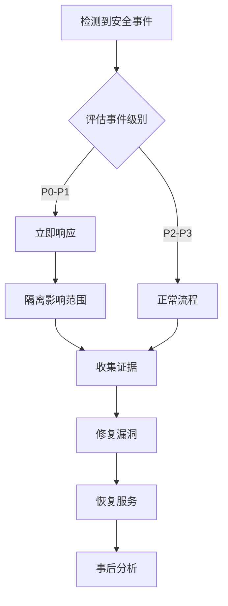

# 安全配置指南 🔐

> **保护你的TaskFlowInsight部署** - 全面的安全配置和最佳实践

## 📋 目录

- [🛡️ 安全概述](#️-安全概述)
- [🔒 数据安全](#-数据安全)
- [🚪 访问控制](#-访问控制)
- [🔍 监控端点安全](#-监控端点安全)
- [📡 网络安全](#-网络安全)
- [💾 存储安全](#-存储安全)
- [🔐 加密配置](#-加密配置)
- [📊 审计日志](#-审计日志)
- [🏭 生产环境安全](#-生产环境安全)
- [🚨 安全事件响应](#-安全事件响应)

---

## 🛡️ 安全概述

### 安全原则

TaskFlowInsight遵循以下安全原则：

1. **最小权限原则**: 仅提供必要的权限
2. **深度防御**: 多层次安全保护
3. **数据保护**: 敏感数据自动脱敏
4. **透明度**: 完整的审计日志
5. **可配置性**: 灵活的安全配置

### 威胁模型

潜在的安全威胁包括：
- 敏感数据泄露
- 未授权访问
- 注入攻击
- 拒绝服务攻击
- 数据篡改

---

## 🔒 数据安全

### 敏感数据脱敏

#### 自动脱敏配置

```yaml
tfi:
  security:
    # 启用全局数据脱敏
    mask-sensitive-data: true
    
    # 预定义敏感字段
    sensitive-fields:
      - password
      - passwd
      - secret
      - token
      - key
      - cardNumber
      - creditCard
      - ssn
      - phone
      - mobile
      - email
      - idCard
      - bankAccount
    
    # 脱敏规则
    masking:
      # 脱敏字符
      mask-char: "*"
      
      # 保留前缀长度
      prefix-length: 2
      
      # 保留后缀长度
      suffix-length: 2
      
      # 最小脱敏长度
      min-mask-length: 3
```

#### 注解方式脱敏

```java
// 方法级别脱敏
@TfiTrack(value = "userInfo", mask = "password,phone,email")
public void processUser(User user) {
    // 处理用户信息
}

// 字段级别脱敏
public class User {
    private String username;
    
    @TfiMask
    private String password;
    
    @TfiMask(pattern = "phone")
    private String phoneNumber;
    
    @TfiMask(strategy = MaskStrategy.PARTIAL, keepPrefix = 3, keepSuffix = 4)
    private String creditCard;
}
```

#### 自定义脱敏规则

```java
@Configuration
public class SecurityConfig {
    
    @Bean
    public MaskingProvider customMaskingProvider() {
        return new MaskingProvider() {
            @Override
            public String mask(String fieldName, Object value) {
                if ("customField".equals(fieldName)) {
                    // 自定义脱敏逻辑
                    return applyCustomMasking(value);
                }
                return value.toString();
            }
        };
    }
}
```

### 数据分类

```yaml
tfi:
  security:
    data-classification:
      # 公开数据 - 不需要保护
      public:
        - id
        - name
        - status
        - timestamp
      
      # 内部数据 - 内部访问
      internal:
        - userId
        - sessionId
        - operationType
      
      # 受限数据 - 需要授权
      restricted:
        - email
        - phone
        - address
      
      # 机密数据 - 严格保护
      confidential:
        - password
        - token
        - cardNumber
        - ssn
```

---

## 🚪 访问控制

### Spring Security集成

```java
@Configuration
@EnableWebSecurity
public class TfiSecurityConfig {
    
    @Bean
    public SecurityFilterChain filterChain(HttpSecurity http) throws Exception {
        http
            .authorizeHttpRequests(authz -> authz
                // 公开端点
                .requestMatchers("/actuator/health").permitAll()
                .requestMatchers("/actuator/info").permitAll()
                
                // TFI监控端点需要认证
                .requestMatchers("/actuator/tfi/**").hasRole("ADMIN")
                
                // 其他端点
                .anyRequest().authenticated()
            )
            .httpBasic(Customizer.withDefaults())
            .csrf(csrf -> csrf.disable());
        
        return http.build();
    }
}
```

### 基于角色的访问控制 (RBAC)

```yaml
tfi:
  security:
    rbac:
      enabled: true
      roles:
        # 管理员 - 完全访问
        admin:
          permissions:
            - "tfi:read"
            - "tfi:write"
            - "tfi:admin"
            - "tfi:export"
        
        # 监控员 - 只读访问
        monitor:
          permissions:
            - "tfi:read"
            - "tfi:export"
        
        # 开发者 - 基础访问
        developer:
          permissions:
            - "tfi:read"
```

### API密钥认证

```yaml
tfi:
  security:
    api-key:
      enabled: true
      header-name: "X-TFI-API-Key"
      keys:
        - name: "admin-key"
          value: "${TFI_ADMIN_API_KEY}"
          roles: ["admin"]
          expires: "2025-12-31"
        
        - name: "monitor-key"
          value: "${TFI_MONITOR_API_KEY}"
          roles: ["monitor"]
          expires: "2025-06-30"
```

---

## 🔍 监控端点安全

### 端点安全配置

```yaml
management:
  endpoints:
    web:
      exposure:
        # 仅暴露必要的端点
        include: ["health", "info"]
      
      # 基础路径
      base-path: "/actuator"
    
    # 禁用敏感端点的Web暴露
    enabled-by-default: false
  
  endpoint:
    # 健康检查
    health:
      enabled: true
      show-details: "when-authorized"
      roles: ["admin", "monitor"]
    
    # 基本信息
    info:
      enabled: true
    
    # TFI端点
    tfi:
      enabled: true
      sensitive: true
      roles: ["admin"]
```

### 自定义端点保护

```java
@Component
public class TfiEndpointSecurityEnforcer implements TfiSecurityEnforcer {
    
    @Override
    public boolean hasPermission(String endpoint, Authentication auth) {
        // 检查用户权限
        if ("/actuator/tfi/sessions".equals(endpoint)) {
            return auth.getAuthorities().stream()
                .anyMatch(a -> "ROLE_ADMIN".equals(a.getAuthority()));
        }
        
        if ("/actuator/tfi/export".equals(endpoint)) {
            return auth.getAuthorities().stream()
                .anyMatch(a -> Arrays.asList("ROLE_ADMIN", "ROLE_MONITOR")
                    .contains(a.getAuthority()));
        }
        
        return false;
    }
}
```

### IP白名单

```yaml
tfi:
  security:
    ip-whitelist:
      enabled: true
      allowed-ips:
        - "192.168.1.0/24"    # 内网段
        - "10.0.0.0/8"        # 私有网络
        - "127.0.0.1"         # 本地访问
      
      # 监控工具IP
      monitoring-ips:
        - "192.168.100.10"    # Grafana
        - "192.168.100.11"    # Prometheus
```

---

## 📡 网络安全

### HTTPS配置

```yaml
server:
  port: 8443
  ssl:
    enabled: true
    key-store: classpath:keystore.p12
    key-store-password: ${SSL_KEYSTORE_PASSWORD}
    key-store-type: PKCS12
    key-alias: tfi-server
    
    # 安全协议配置
    protocol: TLS
    enabled-protocols: ["TLSv1.2", "TLSv1.3"]
    ciphers: [
      "TLS_AES_256_GCM_SHA384",
      "TLS_CHACHA20_POLY1305_SHA256",
      "TLS_AES_128_GCM_SHA256"
    ]
```

### 请求限制

```yaml
tfi:
  security:
    rate-limiting:
      enabled: true
      
      # 全局限制
      global:
        requests-per-minute: 1000
        burst-size: 100
      
      # 端点特定限制
      endpoints:
        "/actuator/tfi/export":
          requests-per-minute: 10
          burst-size: 5
        
        "/actuator/tfi/sessions":
          requests-per-minute: 60
          burst-size: 10
```

### CORS配置

```yaml
tfi:
  security:
    cors:
      enabled: true
      allowed-origins:
        - "https://monitor.company.com"
        - "https://dashboard.company.com"
      
      allowed-methods:
        - GET
        - POST
        - OPTIONS
      
      allowed-headers:
        - "Content-Type"
        - "Authorization"
        - "X-TFI-API-Key"
      
      max-age: 3600
```

---

## 💾 存储安全

### 数据库安全

```yaml
tfi:
  storage:
    type: database
    database:
      # 连接加密
      url: jdbc:postgresql://localhost:5432/tfi?ssl=true&sslmode=require
      username: ${DB_USERNAME}
      password: ${DB_PASSWORD}
      
      # 连接池安全
      hikari:
        leak-detection-threshold: 60000
        max-lifetime: 1800000
        connection-test-query: "SELECT 1"
      
      # 数据加密
      encryption:
        enabled: true
        algorithm: "AES-256-GCM"
        key-source: "vault"  # vault | env | file
```

### Redis安全

```yaml
tfi:
  storage:
    type: redis
    redis:
      # 连接安全
      host: ${REDIS_HOST}
      port: ${REDIS_PORT}
      password: ${REDIS_PASSWORD}
      ssl: true
      
      # 数据加密
      encryption:
        enabled: true
        key: ${REDIS_ENCRYPTION_KEY}
      
      # 网络安全
      timeout: 5000ms
      pool:
        max-active: 20
        max-idle: 10
        min-idle: 5
```

### 文件存储安全

```yaml
tfi:
  storage:
    type: file
    file:
      # 安全路径
      base-path: "/var/lib/tfi/data"
      
      # 文件权限
      permissions: "600"
      
      # 加密存储
      encryption:
        enabled: true
        algorithm: "ChaCha20-Poly1305"
        key-rotation: true
        rotation-interval: "P30D"  # 30天
```

---

## 🔐 加密配置

### 密钥管理

```yaml
tfi:
  security:
    encryption:
      # 密钥提供方式
      key-provider: "vault"  # vault | env | file | hsm
      
      # Vault配置
      vault:
        url: "https://vault.company.com"
        token: "${VAULT_TOKEN}"
        path: "secret/tfi/keys"
      
      # 环境变量配置
      env:
        master-key: "${TFI_MASTER_KEY}"
        salt: "${TFI_SALT}"
      
      # 密钥轮换
      rotation:
        enabled: true
        interval: "P90D"  # 90天
        retain-old-keys: 2
```

### 传输加密

```yaml
tfi:
  security:
    transport:
      # 强制HTTPS
      require-ssl: true
      
      # HSTS配置
      hsts:
        enabled: true
        max-age: 31536000
        include-subdomains: true
        preload: true
      
      # TLS配置
      tls:
        min-version: "1.2"
        cipher-suites:
          - "TLS_AES_256_GCM_SHA384"
          - "TLS_CHACHA20_POLY1305_SHA256"
```

---

## 📊 审计日志

### 审计配置

```yaml
tfi:
  security:
    audit:
      enabled: true
      
      # 审计事件
      events:
        - "session.created"
        - "session.ended"
        - "data.exported"
        - "config.changed"
        - "security.violation"
      
      # 审计日志格式
      format: "json"
      
      # 日志输出
      outputs:
        - type: "file"
          path: "/var/log/tfi/audit.log"
          rotation: "daily"
          retention: "P90D"
        
        - type: "syslog"
          facility: "LOG_AUTH"
          severity: "LOG_INFO"
        
        - type: "database"
          table: "tfi_audit_log"
```

### 审计事件示例

```json
{
  "timestamp": "2024-09-19T10:30:00Z",
  "event_type": "session.created",
  "user": "admin@company.com",
  "session_id": "sess_123456",
  "client_ip": "192.168.1.100",
  "user_agent": "Mozilla/5.0...",
  "metadata": {
    "session_name": "订单处理",
    "duration": 0,
    "tracking_enabled": true
  }
}
```

### 安全事件监控

```java
@Component
public class SecurityEventListener {
    
    @EventListener
    public void handleSecurityViolation(SecurityViolationEvent event) {
        // 记录安全违规事件
        auditLogger.warn("Security violation detected", event);
        
        // 发送告警
        alertService.sendSecurityAlert(event);
        
        // 可能的响应措施
        if (event.getSeverity() == Severity.HIGH) {
            // 临时封禁IP
            ipBlockingService.blockIp(event.getClientIp(), Duration.ofHours(1));
        }
    }
}
```

---

## 🏭 生产环境安全

### 安全清单

#### 部署前检查
- [ ] **配置检查**
  - [ ] 所有敏感配置使用环境变量
  - [ ] 启用HTTPS和适当的TLS配置
  - [ ] 配置正确的CORS策略
  - [ ] 设置合适的会话超时

- [ ] **认证授权**
  - [ ] 配置强认证机制
  - [ ] 实施最小权限原则
  - [ ] 设置API密钥或JWT认证
  - [ ] 配置IP白名单

- [ ] **数据保护**
  - [ ] 启用敏感数据脱敏
  - [ ] 配置数据加密存储
  - [ ] 设置数据保留策略
  - [ ] 验证备份安全性

- [ ] **监控审计**
  - [ ] 启用审计日志
  - [ ] 配置安全事件监控
  - [ ] 设置安全告警
  - [ ] 建立事件响应流程

#### 运行时监控

```yaml
tfi:
  security:
    monitoring:
      # 安全指标监控
      metrics:
        enabled: true
        export-to: ["prometheus", "cloudwatch"]
      
      # 异常检测
      anomaly-detection:
        enabled: true
        thresholds:
          failed-auth-rate: 0.1      # 10%认证失败率
          suspicious-ip-count: 5     # 可疑IP数量
          data-export-size: "100MB"  # 单次导出大小
      
      # 自动响应
      auto-response:
        enabled: true
        actions:
          - condition: "failed_auth_rate > 0.2"
            action: "block_ip"
            duration: "PT1H"
          
          - condition: "data_export_size > 500MB"
            action: "alert_admin"
            severity: "high"
```

### 容器安全

```dockerfile
# 使用非root用户
FROM openjdk:21-jre-slim

# 创建应用用户
RUN groupadd -r tfi && useradd -r -g tfi tfi

# 设置安全的工作目录
WORKDIR /app

# 复制应用文件
COPY --chown=tfi:tfi target/TaskFlowInsight-2.1.0.jar app.jar

# 切换到非root用户
USER tfi

# 安全的JVM参数
ENV JAVA_OPTS="-XX:+UseContainerSupport \
               -XX:MaxRAMPercentage=75.0 \
               -Djava.security.egd=file:/dev/./urandom \
               -Dspring.profiles.active=production"

EXPOSE 8080

ENTRYPOINT ["java", "$JAVA_OPTS", "-jar", "app.jar"]
```

### Kubernetes安全

```yaml
apiVersion: apps/v1
kind: Deployment
metadata:
  name: taskflowinsight
spec:
  template:
    spec:
      # 安全上下文
      securityContext:
        runAsNonRoot: true
        runAsUser: 1000
        runAsGroup: 1000
        fsGroup: 1000
      
      containers:
      - name: tfi
        image: taskflowinsight:2.1.0
        
        # 容器安全配置
        securityContext:
          allowPrivilegeEscalation: false
          readOnlyRootFilesystem: true
          capabilities:
            drop:
              - ALL
        
        # 资源限制
        resources:
          limits:
            memory: "2Gi"
            cpu: "1000m"
          requests:
            memory: "1Gi"
            cpu: "500m"
        
        # 环境变量
        env:
        - name: TFI_DB_PASSWORD
          valueFrom:
            secretKeyRef:
              name: tfi-secrets
              key: db-password
```

---

## 🚨 安全事件响应

### 事件分类

#### 安全事件级别
- **P0 - 紧急**: 数据泄露、系统入侵
- **P1 - 高**: 认证绕过、权限提升
- **P2 - 中**: 异常访问、配置错误
- **P3 - 低**: 可疑活动、策略违规

### 响应流程



### 应急响应脚本

```bash
#!/bin/bash
# emergency-response.sh

case "$1" in
    "data-breach")
        echo "🚨 数据泄露应急响应"
        # 立即禁用所有导出功能
        curl -X POST http://localhost:8080/actuator/tfi/emergency/disable-export
        
        # 强制所有用户重新认证
        curl -X POST http://localhost:8080/actuator/tfi/emergency/invalidate-sessions
        
        # 启用紧急模式
        curl -X POST http://localhost:8080/actuator/tfi/emergency/enable
        ;;
    
    "unauthorized-access")
        echo "🚨 未授权访问应急响应"
        # 封禁可疑IP
        curl -X POST http://localhost:8080/actuator/tfi/security/block-ip \
             -H "Content-Type: application/json" \
             -d "{\"ip\":\"$2\", \"duration\":\"PT1H\"}"
        ;;
    
    "config-tampering")
        echo "🚨 配置篡改应急响应"
        # 恢复默认安全配置
        curl -X POST http://localhost:8080/actuator/tfi/config/restore-defaults
        ;;
esac
```

### 事件通知

```yaml
tfi:
  security:
    notifications:
      # 通知渠道
      channels:
        - type: "email"
          recipients: ["security@company.com", "admin@company.com"]
          template: "security-incident"
        
        - type: "slack"
          webhook: "${SLACK_SECURITY_WEBHOOK}"
          channel: "#security-alerts"
        
        - type: "sms"
          service: "twilio"
          numbers: ["+1234567890"]
      
      # 通知条件
      triggers:
        - event: "security.violation"
          severity: ["high", "critical"]
          immediate: true
        
        - event: "data.export"
          size: "> 100MB"
          delay: "PT5M"
```

---

## 🔍 安全最佳实践

### 开发阶段
1. **安全编码**
   - 输入验证和清理
   - 输出编码
   - 安全的默认配置
   - 错误处理安全

2. **依赖管理**
   - 定期更新依赖
   - 漏洞扫描
   - 许可证检查
   - 供应链安全

### 部署阶段
1. **基础设施安全**
   - 网络隔离
   - 防火墙配置
   - 入侵检测
   - 漏洞管理

2. **配置管理**
   - 配置标准化
   - 敏感信息保护
   - 版本控制
   - 变更审计

### 运维阶段
1. **持续监控**
   - 安全事件监控
   - 性能异常检测
   - 日志分析
   - 威胁情报

2. **应急准备**
   - 事件响应计划
   - 备份恢复测试
   - 安全演练
   - 联系人更新

---

## 📞 安全支持

### 报告安全问题

如果发现安全漏洞，请通过以下方式报告：

- **邮箱**: security@taskflowinsight.com
- **PGP密钥**: [下载公钥](https://example.com/pgp-key.asc)
- **响应时间**: 24小时内确认，72小时内初步响应

### 安全更新

- **通知渠道**: [安全邮件列表](mailto:security-announce@taskflowinsight.com)
- **CVE数据库**: 查看已知漏洞
- **更新策略**: 安全补丁优先发布

### 安全资源

- [OWASP Top 10](https://owasp.org/www-project-top-ten/)
- [Spring Security文档](https://spring.io/projects/spring-security)
- [Java安全编码指南](https://www.oracle.com/java/technologies/javase/seccodeguide.html)

---

**安全是一个持续的过程，不是一次性的任务。定期审查和更新你的安全配置！** 🛡️