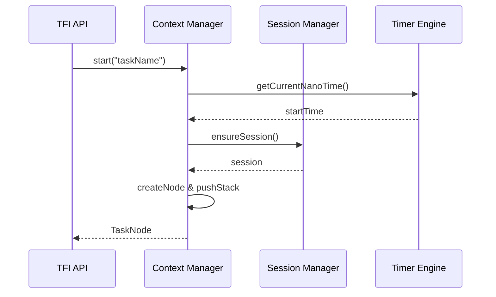

# 核心组件设计

## 组件概述

TFI 核心引擎由四个主要组件构成：上下文管理器、会话管理器、计时引擎和清理服务。

## 上下文管理器 (Context Manager)

### 职责
- 管理 ThreadLocal 上下文
- 维护任务执行栈
- 处理任务的创建和销毁

### 核心类设计

```java
public class TaskContext {
    private final Deque<TaskNode> taskStack;
    private final Deque<Session> recentSessions;
    private TaskNode currentRoot;
    private Session currentSession;
    
    public TaskNode startTask(String name);
    public void stopTask();
    public Session getCurrentSession();
    public void clear();
}
```

### 关键特性
- **线程隔离**: 每个线程独立的 ThreadLocal 存储
- **栈式管理**: 使用 ArrayDeque 管理任务调用栈
- **自动清理**: 根任务完成后自动释放 ThreadLocal

## 会话管理器 (Session Manager)

### 职责
- 管理会话的生命周期
- 维护全局会话索引
- 支持跨线程会话访问

### 核心类设计

```java
public class SessionManager {
    // 全局会话索引：threadId -> 最近N个会话
    private final ConcurrentMap<Long, Deque<Session>> allSessions;
    private final int maxSessionsPerThread;
    
    public Session createSession(long threadId);
    public void endSession(Session session);
    public List<Session> getRecentSessions(long threadId, int limit);
    public Session getSession(String sessionId);
    public void cleanup();
}
```

### 会话模型

```java
public class Session {
    private final String sessionId;    // UUID
    private final long threadId;
    private final long createdAt;
    private volatile long endedAt;     // 0 表示进行中
    private TaskNode root;             // 根任务节点
    private volatile boolean frozen;   // 冻结状态（不可变）
    
    // COW 策略：会话结束时冻结为不可变
    public void freeze();
    public boolean isFrozen();
    public TaskNode getRoot();         // 返回不可变快照
}
```

### 关键特性
- **多会话支持**: 每线程保持最近 N 个会话历史
- **COW 策略**: 会话结束时冻结为不可变树，支持无锁跨线程读取
- **全局索引**: 支持按 sessionId、threadId 查询

## 计时引擎 (Timer Engine)

### 职责
- 提供高精度时间测量
- 计算自身时长和累计时长
- 支持运行中时长查询

### 核心类设计

```java
public class TimerEngine {
    public long getCurrentNanoTime();
    public long calculateSelfDuration(TaskNode node);
    public long calculateAccDuration(TaskNode node);
    public void updateTimings(TaskNode node);
}
```

### 时长计算策略

```java
public class TaskNode {
    private final long startNano;      // 开始时间（纳秒）
    private final long startMillis;    // 开始时间（毫秒，用于展示）
    private volatile long endNano;     // 结束时间（纳秒）
    private volatile long endMillis;   // 结束时间（毫秒）
    
    private volatile long selfDurationNs;   // 自身耗时
    private volatile long accDurationNs;    // 累计耗时（自身+子树）
    
    // 运行中时长计算
    public long getCurrentSelfDuration() {
        return endNano > 0 ? (endNano - startNano) 
                           : (System.nanoTime() - startNano);
    }
    
    // 累计时长计算（包含所有子任务）
    public long getCurrentAccDuration() {
        if (endNano > 0) return accDurationNs;
        
        long selfTime = System.nanoTime() - startNano;
        long childrenTime = children.stream()
                                  .mapToLong(TaskNode::getCurrentAccDuration)
                                  .sum();
        return selfTime + childrenTime;
    }
}
```

### 关键特性
- **纳秒精度**: 使用 System.nanoTime() 确保精确测量
- **双时长口径**: 支持自身时长和累计时长
- **运行中查询**: 支持查询正在执行任务的当前时长

## 清理服务 (Cleaner Service)

### 职责
- 定期清理过期会话
- 防止内存泄漏
- 维护系统资源使用上限

### 核心类设计

```java
@Component
public class SessionCleanerService {
    private final ScheduledExecutorService scheduler;
    private final Duration cleanupInterval;
    private final Duration sessionTimeout;
    
    @PostConstruct
    public void startCleaner() {
        scheduler.scheduleAtFixedRate(
            this::cleanupExpiredSessions,
            0, // 首次不延迟
            cleanupInterval.toMillis(),
            TimeUnit.MILLISECONDS
        );
    }
    
    private void cleanupExpiredSessions() {
        long now = System.currentTimeMillis();
        allSessions.forEach((threadId, sessions) -> {
            sessions.removeIf(session -> 
                session.getEndedAt() > 0 && 
                (now - session.getEndedAt()) > sessionTimeout.toMillis()
            );
        });
    }
}
```

### 清理策略
- **仅清理已结束会话**: `endedAt > 0` 的会话
- **超时判断**: `now - endedAt > cleanupInterval`
- **保护运行中会话**: 正在执行的会话不被清理
- **可配置周期**: 默认 5 分钟，可配置

## 组件交互流程

### 任务启动流程


### 任务结束流程


## 配置参数

```yaml
tfi:
  core:
    max-sessions-per-thread: 10      # 每线程最大会话数
    max-depth: 100                   # 最大嵌套深度
    max-subtasks-per-task: 200       # 每任务最大子任务数
    max-messages-per-task: 1000      # 每任务最大消息数
    
  cleaner:
    cleanup-interval: PT5M           # 清理周期
    session-timeout: PT1H            # 会话超时时间
    enable-auto-cleanup: true        # 是否启用自动清理
    
  performance:
    sampling-rate: 1.0               # 采样率 (0-1)
    enable-cpu-tracking: false       # 是否启用CPU追踪
    async-export: true               # 异步导出
```

## 性能考虑

### 内存优化
- **环形缓存**: 使用固定大小的 Deque 避免无限增长
- **弱引用**: 适当使用 WeakReference 避免强引用链
- **延迟创建**: 按需创建对象，避免预分配

### CPU优化  
- **纳秒级时间**: 仅在必要时进行时间转换
- **无锁读取**: 不可变快照支持无锁并发读取
- **批量操作**: 清理和导出使用批量操作减少开销

### 并发优化
- **ThreadLocal**: 写操作完全无锁
- **ConcurrentMap**: 全局索引使用并发安全容器
- **COW策略**: 读多写少场景的最优解