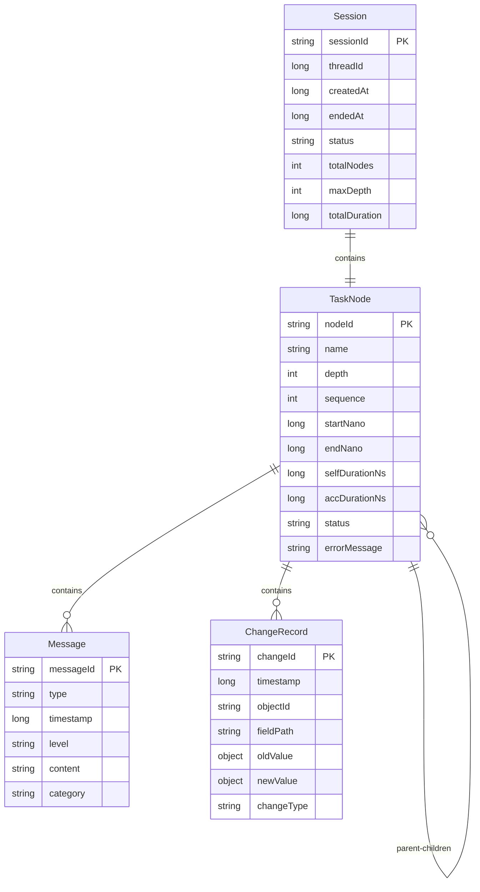

# 数据模型设计

## 核心数据模型

TFI 的数据模型围绕三个核心实体：Session（会话）、TaskNode（任务节点）和 Message（消息）。

## Session（会话）

会话是一个完整的任务执行上下文，包含从根任务开始到结束的完整执行树。

### 数据结构

```java
public class Session {
    // 基础标识
    private final String sessionId;        // UUID，全局唯一
    private final long threadId;           // 线程ID
    private final String threadName;       // 线程名称
    
    // 时间信息
    private final long createdAt;          // 创建时间（毫秒）
    private volatile long endedAt;         // 结束时间（毫秒，0表示进行中）
    
    // 任务树
    private TaskNode root;                 // 根任务节点
    private volatile boolean frozen;       // 是否已冻结（不可变）
    
    // 统计信息
    private int totalNodes;                // 总节点数
    private int maxDepth;                  // 最大深度
    private long totalDuration;            // 总耗时（纳秒）
    
    // 元数据
    private Map<String, Object> attributes; // 自定义属性
    private SessionStatus status;          // 会话状态
}
```

### 会话状态

```java
public enum SessionStatus {
    RUNNING,    // 进行中
    COMPLETED,  // 正常完成
    ERROR,      // 异常结束
    TIMEOUT,    // 超时
    CANCELLED   // 取消
}
```

### JSON Schema

```json
{
  "type": "object",
  "properties": {
    "sessionId": {"type": "string", "format": "uuid"},
    "threadId": {"type": "integer"},
    "threadName": {"type": "string"},
    "createdAt": {"type": "integer"},
    "endedAt": {"type": "integer"},
    "status": {"type": "string", "enum": ["RUNNING", "COMPLETED", "ERROR", "TIMEOUT", "CANCELLED"]},
    "totalNodes": {"type": "integer"},
    "maxDepth": {"type": "integer"},
    "totalDuration": {"type": "integer"},
    "root": {"$ref": "#/definitions/TaskNode"},
    "attributes": {"type": "object"}
  }
}
```

## TaskNode（任务节点）

任务节点表示单个任务的执行信息，支持嵌套形成树形结构。

### 数据结构

```java
public class TaskNode {
    // 基础标识
    private final String nodeId;          // 节点ID（UUID）
    private final String name;            // 任务名称
    private final int depth;              // 嵌套深度
    private final int sequence;           // 同级序号
    
    // 层次关系
    private TaskNode parent;              // 父节点
    private final List<TaskNode> children; // 子节点列表
    private final String path;            // 任务路径 (parent.name/child.name)
    
    // 时间信息（高精度）
    private final long startNano;         // 开始时间（纳秒）
    private final long startMillis;       // 开始时间（毫秒，用于展示）
    private volatile long endNano;        // 结束时间（纳秒，0表示进行中）
    private volatile long endMillis;      // 结束时间（毫秒）
    
    // 时长统计
    private volatile long selfDurationNs; // 自身耗时（纳秒）
    private volatile long accDurationNs;  // 累计耗时（纳秒，包含子任务）
    
    // 状态信息
    private volatile TaskStatus status;   // 任务状态
    private volatile String errorMessage; // 错误信息（如果有）
    private volatile String stackTrace;   // 异常堆栈（如果有）
    
    // 性能指标（可选）
    private volatile long cpuTimeNs;      // CPU时间（纳秒）
    private volatile long memoryBefore;   // 开始前内存（字节）
    private volatile long memoryAfter;    // 结束后内存（字节）
    
    // 消息和变更
    private final List<Message> messages; // 消息列表
    private final List<ChangeRecord> changes; // 变更记录
    
    // 统计信息
    private volatile int messageCount;    // 消息数量
    private volatile int childCount;      // 子任务数量
    
    // 元数据
    private final Map<String, Object> attributes; // 自定义属性
    private final Map<String, String> tags;       // 标签
}
```

### 任务状态

```java
public enum TaskStatus {
    RUNNING,    // 执行中
    COMPLETED,  // 已完成
    FAILED,     // 执行失败
    CANCELLED,  // 已取消
    TIMEOUT     // 执行超时
}
```

### JSON Schema

```json
{
  "type": "object",
  "properties": {
    "nodeId": {"type": "string"},
    "name": {"type": "string"},
    "depth": {"type": "integer"},
    "sequence": {"type": "integer"},
    "path": {"type": "string"},
    
    "startMillis": {"type": "integer"},
    "endMillis": {"type": "integer"},
    "selfDurationNs": {"type": "integer"},
    "accDurationNs": {"type": "integer"},
    
    "status": {"type": "string", "enum": ["RUNNING", "COMPLETED", "FAILED", "CANCELLED", "TIMEOUT"]},
    "errorMessage": {"type": "string"},
    
    "cpuTimeNs": {"type": "integer"},
    "memoryBefore": {"type": "integer"},
    "memoryAfter": {"type": "integer"},
    
    "messages": {"type": "array", "items": {"$ref": "#/definitions/Message"}},
    "changes": {"type": "array", "items": {"$ref": "#/definitions/ChangeRecord"}},
    "children": {"type": "array", "items": {"$ref": "#/definitions/TaskNode"}},
    
    "messageCount": {"type": "integer"},
    "childCount": {"type": "integer"},
    
    "attributes": {"type": "object"},
    "tags": {"type": "object"}
  }
}
```

## Message（消息）

消息记录任务执行过程中的关键信息，包括业务流程、性能指标、异常信息和状态变更。

### 数据结构

```java
public class Message {
    // 基础信息
    private final String messageId;       // 消息ID
    private final MessageType type;       // 消息类型
    private final long timestamp;         // 时间戳（毫秒）
    private final long nanoOffset;        // 纳秒偏移（相对任务开始）
    
    // 消息内容
    private final LogLevel level;         // 日志级别
    private final String content;         // 消息内容
    private final String category;        // 消息分类
    
    // 结构化数据
    private final Map<String, Object> keyValues; // 键值对数据
    private final Map<String, String> tags;      // 标签
    
    // 上下文信息
    private final String taskPath;        // 任务路径
    private final String sourceClass;     // 源类名
    private final String sourceMethod;    // 源方法名
    private final int sourceLine;         // 源行号
    
    // 关联信息
    private final String correlationId;   // 关联ID（用于消息关联）
    private final String parentMessageId; // 父消息ID（消息层次）
}
```

### 消息类型

```java
public enum MessageType {
    FLOW,       // 业务流程消息
    METRIC,     // 性能指标消息
    EXCEPTION,  // 异常信息消息
    CHANGE,     // 状态变更消息
    DEBUG,      // 调试信息消息
    CHECKPOINT  // 检查点消息
}
```

### 日志级别

```java
public enum LogLevel {
    TRACE, DEBUG, INFO, WARN, ERROR
}
```

## ChangeRecord（变更记录）

变更记录用于追踪对象状态的变化。

### 数据结构

```java
public class ChangeRecord {
    // 基础信息
    private final String changeId;        // 变更ID
    private final long timestamp;         // 变更时间戳
    private final long nanoOffset;        // 纳秒偏移
    
    // 对象信息
    private final String objectId;        // 对象标识
    private final String objectType;      // 对象类型
    private final String objectName;      // 对象名称
    
    // 字段信息
    private final String fieldPath;       // 字段路径 (obj.field.subfield)
    private final String fieldType;       // 字段类型
    
    // 变更内容
    private final Object oldValue;        // 旧值
    private final Object newValue;        // 新值
    private final ChangeType changeType;  // 变更类型
    
    // 上下文信息
    private final String taskPath;        // 任务路径
    private final String strategyId;      // 变更策略ID
    
    // 元数据
    private final Map<String, Object> metadata; // 元数据
}
```

### 变更类型

```java
public enum ChangeType {
    CREATE,     // 创建
    UPDATE,     // 更新
    DELETE,     // 删除
    ADD,        // 添加（集合）
    REMOVE      // 移除（集合）
}
```

## 数据关系图



## 内存布局优化

### 紧凑存储

```java
// 使用紧凑的数据结构
public class CompactTaskNode {
    // 使用 int 而不是 long（在合适的范围内）
    private int startOffset;    // 相对会话开始的偏移
    private int duration;       // 持续时间（微秒）
    
    // 使用 byte 存储枚举
    private byte status;        // TaskStatus.ordinal()
    private byte level;         // 嵌套级别
    
    // 延迟初始化集合
    private List<TaskNode> children;  // 需要时才创建
    private List<Message> messages;   // 需要时才创建
    
    // 使用位字段存储布尔标志
    private int flags;  // 多个布尔值打包存储
}
```

### 对象池化

```java
public class NodePool {
    private final ThreadLocal<Deque<TaskNode>> nodePool = 
        ThreadLocal.withInitial(() -> new ArrayDeque<>(64));
    
    public TaskNode acquireNode() {
        Deque<TaskNode> pool = nodePool.get();
        return pool.isEmpty() ? new TaskNode() : pool.pop();
    }
    
    public void releaseNode(TaskNode node) {
        node.reset();  // 清理状态
        nodePool.get().push(node);
    }
}
```

## 序列化支持

### JSON 序列化

```java
@JsonSerialize(using = TaskNodeSerializer.class)
@JsonDeserialize(using = TaskNodeDeserializer.class)
public class TaskNode {
    // 自定义序列化逻辑，支持：
    // 1. 循环引用处理
    // 2. 时间格式化
    // 3. 大对象截断
    // 4. 敏感信息脱敏
}
```

### 二进制序列化

```java
// 支持高效的二进制序列化（可选）
public class BinarySessionCodec {
    public byte[] encode(Session session);
    public Session decode(byte[] data);
}
```

## 数据验证

### 约束检查

```java
public class DataValidator {
    public static void validateSession(Session session) {
        Assert.notNull(session.getSessionId(), "sessionId cannot be null");
        Assert.isTrue(session.getCreatedAt() > 0, "createdAt must be positive");
        Assert.isTrue(session.getTotalNodes() >= 0, "totalNodes cannot be negative");
        
        if (session.getEndedAt() > 0) {
            Assert.isTrue(session.getEndedAt() >= session.getCreatedAt(), 
                         "endedAt must be after createdAt");
        }
    }
    
    public static void validateTaskNode(TaskNode node) {
        Assert.hasText(node.getName(), "name cannot be empty");
        Assert.isTrue(node.getDepth() >= 0, "depth cannot be negative");
        Assert.isTrue(node.getStartNano() > 0, "startNano must be positive");
        
        if (node.getEndNano() > 0) {
            Assert.isTrue(node.getEndNano() >= node.getStartNano(), 
                         "endNano must be after startNano");
        }
    }
}
```