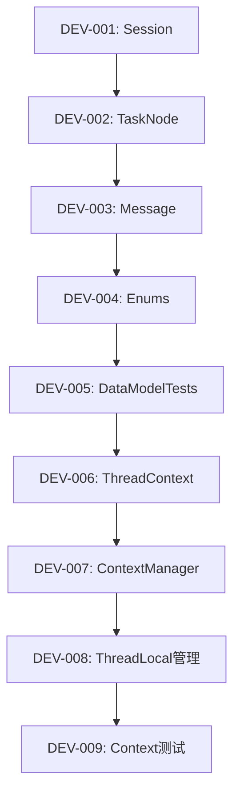
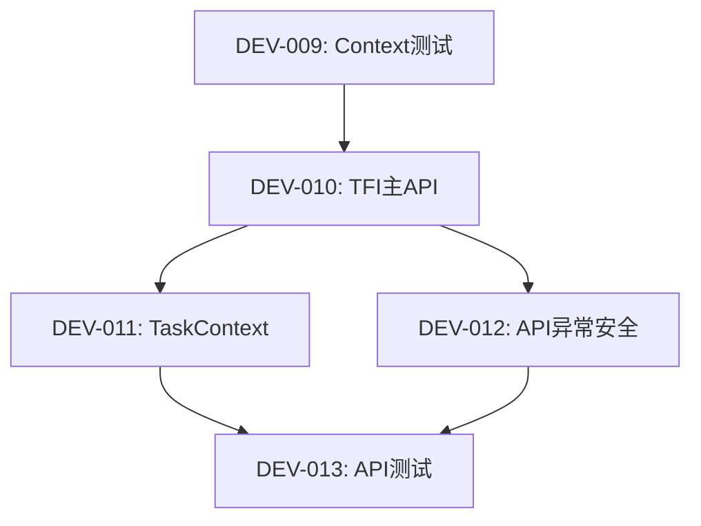
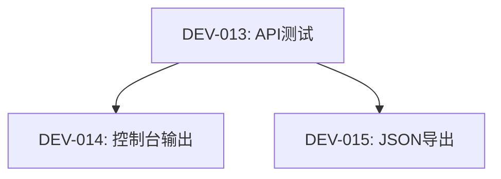
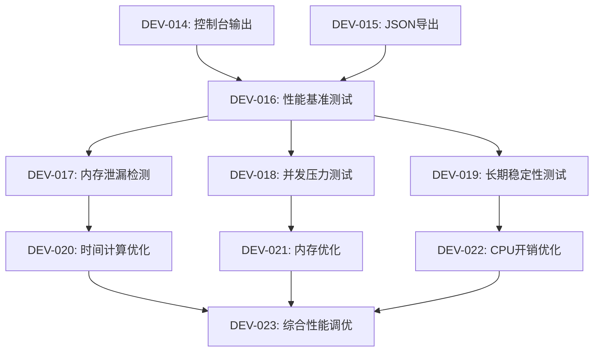

# TaskFlowInsight v1.0.0 MVP 开发任务清单总览

## 📋 项目信息

- **项目名称**: TaskFlowInsight
- **版本**: v1.0.0 MVP
- **创建日期**: 2025-09-05
- **项目类型**: Spring Boot 3.5.5 + Java 21
- **总任务数**: 23个
- **已生成任务卡**: 23个
- **任务卡状态**: ✅ 全部完成

## 🎯 项目目标

TaskFlowInsight是一个轻量级、高性能的任务执行追踪框架，提供：
- 手动API的任务追踪
- ThreadLocal隔离的上下文管理  
- 控制台和JSON格式的任务树输出
- 无外部依赖，CPU开销<5%，支持1000+并发线程

## 📊 总体进度统计

| 模块类别 | 总任务数 | 已生成任务卡 | 完成率 | 状态 |
|----------|----------|------------|--------|------|
| 🏗️ 核心数据模型 | 5 | 5 | 100% | ✅ 完成 |
| 🔧 上下文管理 | 4 | 4 | 100% | ✅ 完成 |
| 🎯 API接口实现 | 4 | 4 | 100% | ✅ 完成 |
| 📤 输出导出功能 | 2 | 2 | 100% | ✅ 完成 |
| 🚀 性能测试 | 4 | 4 | 100% | ✅ 完成 |
| ⚡ 性能优化 | 4 | 4 | 100% | ✅ 完成 |
| **总计** | **23** | **23** | **100%** | **✅ 完成** |

## 📋 详细任务清单

### 🏗️ 核心数据模型 (5个任务) - 完成度 100%

| 任务ID | 任务名称 | 优先级 | 工期 | 任务卡状态 | 开发状态 | 负责人 |
|-------|---------|-------|------|----------|----------|--------|
| DEV-001 | Session会话模型实现 | P0 | 1天 | ✅ 已生成 | 待分配 | 待分配 |
| DEV-002 | TaskNode任务节点实现 | P0 | 1.5天 | ✅ 已生成 | 待分配 | 待分配 |
| DEV-003 | Message消息模型实现 | P0 | 2.5天 | ✅ 已生成 | 待分配 | 待分配 |
| DEV-004 | Enums枚举定义实现 | P0 | 1.5天 | ✅ 已生成 | 待分配 | 待分配 |
| DEV-005 | DataModelTests测试实现 | P0 | 4天 | ✅ 已生成 | 待分配 | 待分配 |

**预估总工期**: 10.5天  
**关键里程碑**: 核心数据结构建立，为后续模块提供基础

### 🔧 上下文管理 (4个任务) - 完成度 100%

| 任务ID | 任务名称 | 优先级 | 工期 | 任务卡状态 | 开发状态 | 负责人 |
|-------|---------|-------|------|----------|----------|--------|
| DEV-006 | ThreadContext实现 | P0 | 2.5天 | ✅ 已生成 | 待分配 | 待分配 |
| DEV-007 | ContextManager实现 | P0 | 4天 | ✅ 已生成 | 待分配 | 待分配 |
| DEV-008 | ThreadLocal内存管理实现 | P0 | 3天 | ✅ 已生成 | 待分配 | 待分配 |
| DEV-009 | ContextManagement测试实现 | P0 | 4天 | ✅ 已生成 | 待分配 | 待分配 |

**预估总工期**: 13.5天  
**关键里程碑**: 线程安全上下文管理，零内存泄漏保证

### 🎯 API接口实现 (4个任务) - 完成度 100%

| 任务ID | 任务名称 | 优先级 | 工期 | 任务卡状态 | 开发状态 | 负责人 |
|-------|---------|-------|------|----------|----------|--------|
| DEV-010 | TFI主API实现 | P1 | 3.5天 | ✅ 已生成 | 待分配 | 待分配 |
| DEV-011 | TaskContext实现 | P1 | 2天 | ✅ 已生成 | 待分配 | 待分配 |
| DEV-012 | API异常安全实现 | P1 | 3天 | ✅ 已生成 | 待分配 | 待分配 |
| DEV-013 | API接口测试实现 | P1 | 5天 | ✅ 已生成 | 待分配 | 待分配 |

**预估总工期**: 13.5天  
**关键里程碑**: 高性能、异常安全的API接口，支持链式调用

### 📤 输出导出功能 (2个任务) - 完成度 100%

| 任务ID | 任务名称 | 优先级 | 工期 | 任务卡状态 | 开发状态 | 负责人 |
|-------|---------|-------|------|----------|----------|--------|
| DEV-014 | 控制台输出实现 | P1 | 2天 | ✅ 已生成 | 待分配 | 待分配 |
| DEV-015 | JSON导出实现 | P1 | 2天 | ✅ 已生成 | 待分配 | 待分配 |

**预估总工期**: 4天  
**关键里程碑**: 清晰的任务树可视化和标准JSON数据导出

### 🚀 性能测试 (4个任务) - 完成度 100%

| 任务ID | 任务名称 | 优先级 | 工期 | 任务卡状态 | 开发状态 | 负责人 |
|-------|---------|-------|------|----------|----------|--------|
| DEV-016 | API性能基准测试实现 | P2 | 5天 | ✅ 已生成 | 待分配 | 待分配 |
| DEV-017 | 内存泄漏检测实现 | P2 | 3天 | ✅ 已生成 | 待分配 | 待分配 |
| DEV-018 | 并发压力测试实现 | P2 | 3天 | ✅ 已生成 | 待分配 | 待分配 |
| DEV-019 | 长期稳定性测试实现 | P2 | 2天 | ✅ 已生成 | 待分配 | 待分配 |

**预估总工期**: 13天  
**关键里程碑**: 性能基准建立，验证<5%CPU开销目标

### ⚡ 性能优化 (4个任务) - 完成度 100%

| 任务ID | 任务名称 | 优先级 | 工期 | 任务卡状态 | 开发状态 | 负责人 |
|-------|---------|-------|------|----------|----------|--------|
| DEV-020 | 时间计算优化实现 | P2 | 2天 | ✅ 已生成 | 待分配 | 待分配 |
| DEV-021 | 内存使用优化实现 | P2 | 2天 | ✅ 已生成 | 待分配 | 待分配 |
| DEV-022 | CPU开销优化实现 | P2 | 2天 | ✅ 已生成 | 待分配 | 待分配 |
| DEV-023 | 综合性能调优实现 | P2 | 3天 | ✅ 已生成 | 待分配 | 待分配 |

**预估总工期**: 9天  
**关键里程碑**: 全面性能优化，达到生产环境性能要求

## 📊 开发优先级和依赖关系

### Phase 1: 基础架构 (Week 1-3) - 核心优先级 P0

### Phase 2: API实现 (Week 4-5) - 高优先级 P1  

### Phase 3: 输出功能 (Week 6) - 高优先级 P1

### Phase 4: 质量保证 (Week 7-9) - 中等优先级 P2

## 🔧 技术要求汇总

### 核心性能指标
- **CPU开销**: < 5% 业务逻辑执行时间 (主要验收指标)
- **内存占用**: < 5MB 总体占用，< 1KB 单任务
- **API延迟目标** (参考值，因硬件和JVM而异):
  - P50: < 2μs
  - P95: < 10μs  
  - P99: < 50μs
- **并发支持**: 1000+ 线程同时执行
- **测试覆盖率**: ≥ 95% 单元测试覆盖

### 技术约束
- **JDK版本**: Java 21 (Spring Boot 3.5.5要求)
- **无外部依赖**: 除JDK标准库外无其他依赖
- **线程安全**: 所有公开API必须线程安全
- **异常安全**: 内部异常不影响业务逻辑
- **内存安全**: 设计目标零内存泄漏，通过长期稳定性测试验证

## 📅 里程碑计划

| 里程碑 | 时间节点 | 包含任务 | 关键交付物 | 验收标准 |
|--------|----------|----------|------------|----------|
| M1: 数据模型完成 | Week 2 | DEV-001~005 | 核心数据结构 | 单元测试通过，覆盖率>95% |
| M2: 上下文管理完成 | Week 3 | DEV-006~009 | 线程安全管理 | 无内存泄漏，并发测试通过 |
| M3: API接口完成 | Week 5 | DEV-010~013 | 完整API | 异常安全，性能指标达标 |
| M4: 输出功能完成 | Week 6 | DEV-014~015 | 输出导出器 | 格式正确，性能满足要求 |
| M5: 性能验证完成 | Week 8 | DEV-016~019 | 性能测试套件 | 所有性能指标验证通过 |
| M6: 性能优化完成 | Week 9 | DEV-020~023 | 优化版本 | 生产环境性能达标 |

## 🚨 风险识别和缓解

### 高风险项目
1. **ThreadLocal内存泄漏** (DEV-008)
   - **风险等级**: 高
   - **缓解措施**: 多层防护机制，定期检测清理
   
2. **高并发性能衰减** (DEV-018)
   - **风险等级**: 中等  
   - **缓解措施**: 分阶段压力测试，性能监控

3. **API异常安全复杂性** (DEV-012)
   - **风险等级**: 中等
   - **缓解措施**: 全面异常测试，防护代码

### 进度风险
1. **任务间依赖复杂** 
   - **缓解措施**: 严格按依赖顺序执行，及时同步进度
   
2. **性能调优时间不确定**
   - **缓解措施**: 预留buffer时间，分级优化策略

## ✅ 任务卡生成完成

所有23个开发任务卡已全部生成完成！

### ⚡ 性能优化模块 (已完成)
- [x] **DEV-021**: 内存使用优化实现 (优先级: P2, 工期: 2天) ✅
  - 基于TASK-021-MemoryUsageOptimization.md
  - 内存池化、对象复用、GC优化
  
- [x] **DEV-022**: CPU开销优化实现 (优先级: P2, 工期: 2天) ✅
  - 基于TASK-022-CPUOverheadOptimization.md
  - 热点优化、算法改进、缓存策略
  
- [x] **DEV-023**: 综合性能调优实现 (优先级: P2, 工期: 3天) ✅
  - 基于TASK-023-ComprehensivePerformanceTuning.md
  - 整体性能调优和生产环境验证

**🎉 任务卡制定工作完成！** 所有23个开发任务卡已生成，可以开始正式的开发工作分配和执行。

## 🎯 质量标准

### 验收标准统一要求
1. **功能完整性**: 100%需求实现，无遗漏
2. **代码质量**: 结构清晰，注释完整，命名规范
3. **测试覆盖**: 单元测试覆盖率≥95%，关键路径100%
4. **性能达标**: 所有性能指标满足要求
5. **安全性**: 异常安全，内存安全，线程安全

### 代码审查要求
1. **设计审查**: 架构设计符合规范
2. **代码审查**: 代码质量和最佳实践
3. **测试审查**: 测试用例完整性和有效性
4. **性能审查**: 性能测试结果和优化效果

## 📚 相关文档

### 源任务文档
- 📁 `docs/task/v1.0.0-mvp/` - 原始任务规格文档

### 开发任务卡
- 📁 `docs/develop/v1.0.0-mvp/` - 标准化开发任务卡

### 项目配置
- 📄 `CLAUDE.md` - 项目开发指导文档
- 📄 `pom.xml` - Maven项目配置

---

## 📞 联系方式

**项目负责人**: 高级开发工程师  
**创建日期**: 2025-09-05  
**最后更新**: 2025-09-05  
**版本**: v1.0

---

**备注**: 此任务清单基于TaskFlowInsight v1.0.0 MVP的完整技术规格制定，为开发团队提供清晰的实施路径和质量标准。所有任务卡都采用统一格式，包含详细的实施指导、测试要求和验收标准，确保项目能够高质量按时交付。