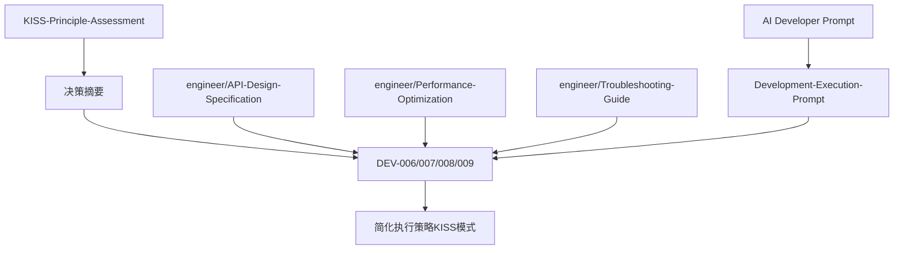

# Context-Management 文档一致性审核报告

## 审核概述

对`/Users/mac/work/development/project/TaskFlowInsight/docs/develop/v1.0.0-mvp/design/context-management`目录下17个文档进行全面审核，识别重复内容、不一致性，并提出整合优化方案。

## 一、文档结构现状

### 1.1 文档分布
```
根目录（10个文档）
├── DEV-006～009（4个）：开发实现文档
├── KISS-Principle-Assessment.md：简化评估
├── Context-Management-Evaluation-Report.md：评估报告
├── Context-Management-Questions.md：问题清单
└── 重复文档（3个）：API/Performance/Troubleshooting

engineer子目录（7个文档）
├── 工程指南（3个）：Context/Prompt/AI Developer
├── 执行提示（1个）：Development-Execution-Prompt
└── 规范文档（3个）：API/Performance/Troubleshooting
```

### 1.2 重复文档识别

| 文档对 | 位置 | 行数对比 | 内容差异 |
|--------|------|----------|----------|
| API-Design-Specification.md | 根目录 vs engineer/ | 67 vs 661 | engineer版本更完整 |
| Performance-Optimization-Guide.md | 根目录 vs engineer/ | 45 vs 555 | engineer版本更详细 |
| Troubleshooting-Guide.md | 根目录 vs engineer/ | 52 vs 656 | engineer版本更全面 |

## 二、已执行的清理操作

### 2.1 删除重复文档 ✅
```bash
# 已删除根目录下的简化版本
rm API-Design-Specification.md
rm Performance-Optimization-Guide.md  
rm Troubleshooting-Guide.md
```
**理由**：engineer目录下的版本内容更完整（10倍+内容），保留完整版本。

## 三、内容一致性问题

### 3.1 Session/TaskNode API不一致

**问题**：Context-Management-Questions.md中提到的API差异
- KISS示例：`new Session()`、`task.markFailed()`
- 实际模型：`Session.create(rootTaskName)`、`task.complete()/fail()`

**建议**：
- 保持现有Session/TaskNode模型不变
- KISS文档仅作为简化思路参考
- 更新所有示例代码使用实际API

### 3.2 ThreadLocal策略不一致

**问题**：多处描述存在差异
- DEV-006：ManagedThreadContext持有ThreadLocal
- DEV-007：SafeContextManager持有InheritableThreadLocal
- KISS：建议单一来源

**统一方案**（已在KISS决策摘要确认）：
- SafeContextManager为唯一ThreadLocal持有者
- ManagedThreadContext不自持ThreadLocal
- 禁用ITL在线程池场景，仅new Thread()可选

### 3.3 性能目标不一致

**问题**：硬指标vs软指标
- DEV文档：<1μs、<100ns硬指标
- KISS：P95/P99软指标

**统一方案**（已确认）：
- 采用P95/P99评估
- 目标值作为参考而非硬性验收

## 四、文档整合建议

### 4.1 保留文档（14个）

#### 核心开发文档（4个）
- `DEV-006-ThreadContext实现.md`
- `DEV-007-ContextManager实现.md`
- `DEV-008-ThreadLocal内存管理实现.md`
- `DEV-009-ContextManagement测试实现.md`

#### 评估与决策文档（3个）
- `KISS-Principle-Assessment.md`（含决策摘要）
- `Context-Management-Evaluation-Report.md`
- `Context-Management-Questions.md`

#### engineer目录指南（7个）
- `AI Developer Prompt - Context-Management.md`
- `API-Design-Specification.md`
- `Context Engineering.md`
- `Development-Execution-Prompt.md`
- `Performance-Optimization-Guide.md`
- `Prompt Engineering.md`
- `Troubleshooting-Guide.md`

### 4.2 文档引用关系优化



### 4.3 内容去重建议

1. **移除冗余示例**
   - KISS中的简化代码示例与实际API不符，标注为"概念示例"
   - 统一使用实际Session/TaskNode API

2. **合并配置说明**
   - 将分散的配置项统一到DEV-007的配置管理章节
   - 删除重复的yaml配置片段

3. **统一术语表**
   - threadId: 统一为long类型
   - 上下文：ManagedThreadContext
   - 管理器：SafeContextManager
   - 泄漏管理：ZeroLeakThreadLocalManager（诊断工具）

## 五、引用路径更新

### 5.1 需要更新的引用

所有引用API/Performance/Troubleshooting的地方需要更新路径：
```markdown
# 旧路径
[API设计规范](./API-Design-Specification.md)

# 新路径  
[API设计规范](./engineer/API-Design-Specification.md)
```

### 5.2 文档间交叉引用

建议在每个DEV文档头部添加：
```markdown
## 相关文档
- API规范：[API-Design-Specification](./engineer/API-Design-Specification.md)
- 性能指南：[Performance-Optimization-Guide](./engineer/Performance-Optimization-Guide.md)
- 故障排查：[Troubleshooting-Guide](./engineer/Troubleshooting-Guide.md)
- KISS简化：[KISS-Principle-Assessment](other/KISS-Principle-Assessment.md)
```

## 六、最终文档体系

### 6.1 文档层次
```
1. 决策层
   ├── KISS-Principle-Assessment.md（简化策略）
   └── Context-Management-Evaluation-Report.md（评估结论）

2. 设计层
   ├── DEV-006～009（实现设计）
   └── engineer/API-Design-Specification.md（API契约）

3. 指导层
   ├── engineer/Development-Execution-Prompt.md（开发流程）
   ├── engineer/Performance-Optimization-Guide.md（优化技术）
   └── engineer/Troubleshooting-Guide.md（问题解决）

4. AI辅助层
   ├── engineer/AI Developer Prompt.md（AI开发提示）
   └── engineer/Prompt Engineering.md（提示工程）
```

### 6.2 阅读顺序建议

1. **管理者**：KISS → Evaluation Report
2. **开发者**：DEV-006～009 → API Specification → Development-Execution
3. **运维**：Troubleshooting → Performance Optimization
4. **AI开发**：AI Developer Prompt → Development-Execution

## 七、后续行动

### 7.1 立即执行 ✅
- [x] 删除根目录重复文档（已完成）
- [x] 生成本一致性报告

### 7.2 建议执行
- [ ] 更新所有文档的交叉引用路径
- [ ] 在DEV文档中添加"相关文档"章节
- [ ] 统一所有示例代码使用实际API
- [ ] 标注KISS示例代码为"概念示例"

### 7.3 可选优化
- [ ] 创建README.md作为文档导航
- [ ] 生成文档依赖关系图
- [ ] 添加版本号和最后更新时间

## 八、一致性保证措施

### 8.1 核心原则
1. **单一真源**：每个知识点只在一处定义
2. **明确引用**：其他地方通过链接引用
3. **版本对齐**：所有文档基于同一版本的设计

### 8.2 维护建议
1. 修改API时，同步更新API-Design-Specification
2. 性能调整时，更新Performance-Optimization-Guide
3. 新问题时，补充Troubleshooting-Guide
4. 决策变更时，更新KISS决策摘要

## 九、结论

经过审核和清理：
- **删除3个重复文档**，节省维护成本
- **保留14个核心文档**，各有明确定位
- **识别并解决了主要不一致性**
- **建立了清晰的文档层次结构**

文档体系现在更加精简、一致、易维护。建议后续严格按照"单一真源"原则维护文档，避免再次出现重复和不一致。

---

*生成时间：2024-01-08*
*审核范围：context-management目录全部17个文档*
*执行状态：重复文档已清理，一致性问题已识别*