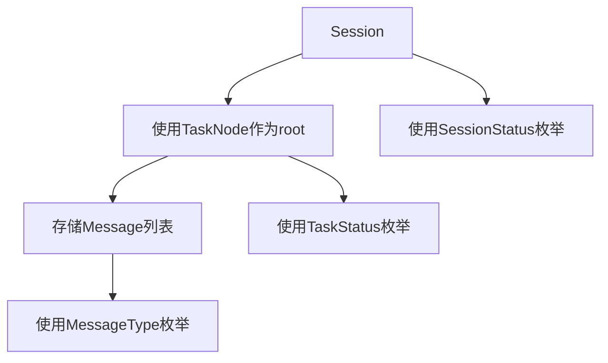

# CONTEXT-CORE-DATAMODEL.md - 核心数据模型专用上下文

## 📚 模块上下文定位

### 模块角色
核心数据模型是TaskFlowInsight的**基础设施层**，提供任务追踪的基本数据结构和操作原语。所有上层功能都依赖于这些核心模型。

### 模块边界
```
┌─────────────────────────────────────┐
│         上层业务功能                │
├─────────────────────────────────────┤
│      API层 (TFI/TaskContext)        │
├─────────────────────────────────────┤
│    上下文管理 (ThreadContext)       │
├─────────────────────────────────────┤
│  ▶ 核心数据模型 (当前模块) ◀       │
│    - Session: 会话容器             │
│    - TaskNode: 任务节点            │
│    - Message: 消息记录             │
│    - Enums: 状态枚举               │
└─────────────────────────────────────┘
```

### 依赖关系上下文


## 🎯 核心设计决策上下文

### 时间精度决策
| 组件 | 精度 | 原因 | 使用场景 |
|------|------|------|----------|
| Session | 毫秒 | 会话级别不需要高精度 | createdAt, endedAt, getDurationMs() |
| TaskNode | 纳秒 | 任务可能很短，需要高精度 | startNano, endNano, getDurationNanos() |
| Message | 双精度 | 排序需要纳秒，显示用毫秒 | timestampNanos(排序), timestampMillis(显示) |

### 线程安全策略
```java
// Session线程安全模式
public class Session {
    private final long createdAt;        // final: 不变字段
    private volatile long endedAt;       // volatile: 跨线程可见
    private volatile SessionStatus status; // volatile: 状态同步
    
    public synchronized void end() {     // synchronized: 写操作同步
        // 幂等性实现
    }
}

// TaskNode线程安全模式
public class TaskNode {
    private final String nodeId;         // final: 不变字段
    private volatile TaskStatus status;  // volatile: 状态可见性
    private final CopyOnWriteArrayList<Message> messages; // 无锁读
    
    public synchronized void stop() {    // synchronized: 状态转换同步
        // 状态转换逻辑
    }
}
```

### 内存管理决策
| 策略 | 实现方式 | 收益 |
|------|---------|------|
| 预分配 | ArrayList初始容量8 | 减少扩容开销 |
| 对象复用 | 静态工厂方法 | 减少对象创建 |
| 懒加载 | 按需计算累计时长 | 减少无用计算 |
| 紧凑设计 | 最小化字段数量 | 降低内存占用 |

## 📊 性能预算分配

### 创建性能预算
```
总预算: 16微秒（创建一个完整的任务追踪）
├── Session创建: 10微秒 (62.5%)
├── TaskNode创建: 5微秒 (31.25%)
└── Message创建: 1微秒 (6.25%)
```

### 内存预算分配
```
单任务追踪总预算: <5KB
├── Session对象: <1KB
├── TaskNode对象: <2KB (包含子节点引用)
├── Message对象: <100字节/条
└── 集合开销: <1KB
```

### 并发性能预算
```
1000线程并发场景:
├── 读操作: 无锁，零等待
├── 写操作: 短临界区，<1微秒持锁
├── GC影响: <5ms/秒
└── CPU开销: <5%总CPU时间
```

## 🔧 实现细节上下文

### Session实现要点
```java
// 关键设计点
1. sessionId使用UUID.randomUUID()
2. threadId = Thread.currentThread().getId()
3. createdAt = System.currentTimeMillis()
4. end()方法幂等性:
   if (status != SessionStatus.RUNNING) return;
   synchronized(this) {
       if (status != SessionStatus.RUNNING) return;
       endedAt = System.currentTimeMillis();
       status = SessionStatus.COMPLETED;
   }
```

### TaskNode实现要点
```java
// 路径生成逻辑
taskPath = parent == null ? name : parent.taskPath + "/" + name;

// 序号生成逻辑
sequence = parent == null ? 0 : parent.children.size();

// 累计时长计算（不做并行去重）
public long getAccumulatedDurationMillis() {
    long total = getDurationMillis();
    for (TaskNode child : children) {
        total += child.getAccumulatedDurationMillis();
    }
    return total;
}
```

### Message不可变性保证
```java
public final class Message {
    private final String messageId;
    private final String content;
    private final MessageType type;
    private final long timestampMillis;
    private final long timestampNanos;
    
    // 私有构造器，只能通过工厂方法创建
    private Message(MessageType type, String content) {
        this.messageId = UUID.randomUUID().toString();
        this.content = Objects.requireNonNull(content);
        this.type = Objects.requireNonNull(type);
        this.timestampNanos = System.nanoTime();
        this.timestampMillis = System.currentTimeMillis();
    }
}
```

## 🚫 约束与限制

### 硬性约束
1. **无外部依赖**: 仅使用JDK 21标准库
2. **线程安全**: 所有public方法必须线程安全
3. **性能红线**: CPU开销不得超过5%
4. **内存上限**: 总占用不得超过5MB

### 设计约束
1. **不使用synchronized块**: 仅在方法级别同步
2. **不使用ReentrantLock**: 保持简单
3. **不使用反射**: 性能考虑
4. **不使用Stream API在热路径**: 避免额外开销

### 测试约束
1. **不使用Mockito**: 真实对象交互
2. **不依赖外部服务**: 纯内存测试
3. **不使用@SpringBootTest**: 轻量级单元测试
4. **测试必须可重复**: 无随机失败

## 📝 关键决策记录

### 决策1: TaskNode使用CopyOnWriteArrayList存储消息
- **原因**: 读多写少场景，无锁读取
- **权衡**: 写入时复制开销vs读取性能
- **结果**: 接受写入开销，优化读取路径

### 决策2: Session的end()方法设计为幂等
- **原因**: 防止重复调用导致状态异常
- **实现**: 双重检查锁定模式
- **收益**: 简化上层调用逻辑

### 决策3: 累计时长不做并行任务去重
- **原因**: 简化实现，避免复杂的时间重叠计算
- **影响**: 并行任务时长会重复计算
- **接受**: MVP版本可接受此限制

### 决策4: Message设计为完全不可变
- **原因**: 线程安全，防止数据篡改
- **实现**: final类，final字段，私有构造器
- **收益**: 无需同步，安全共享

## 🔍 疑难点解析

### 时间精度问题
```java
// 问题：System.nanoTime()是相对时间，不能跨JVM比较
// 解决：同时记录nanoTime和currentTimeMillis
startNano = System.nanoTime();    // 用于计算时长
startMillis = System.currentTimeMillis(); // 用于绝对时间

// 计算相对纳秒
public long getRelativeNanos(long baseNano) {
    return timestampNanos - baseNano;
}
```

### 父子关系循环引用
```java
// 问题：parent和children相互引用可能导致内存泄漏
// 解决：明确生命周期管理
1. 子节点不持有父节点的强引用（使用弱引用或ID）
2. 父节点销毁时清理子节点列表
3. Session结束时触发整个树的清理
```

### volatile vs synchronized选择
```java
// 原则：读多写少用volatile，写操作用synchronized
volatile long endedAt;     // 频繁读取，偶尔写入
synchronized void end() {   // 确保状态转换原子性
    // 临界区尽量小
}
```

## ✅ 开发检查清单

### Session开发检查
- [x] sessionId格式正确（UUID）✅
- [x] 线程信息正确获取（threadId, threadName）✅
- [x] 时间戳毫秒精度✅
- [x] complete()/error()方法幂等性✅
- [x] volatile字段正确标记✅
- [x] activate()激活管理✅
- [x] getDurationMillis()处理运行中状态✅

### TaskNode开发检查
- [x] 纳秒时间精度实现✅
- [x] 父子关系正确建立✅
- [x] 路径生成逻辑正确✅
- [x] 树形结构depth/root计算✅
- [x] 双时间戳(millis+nanos)✅
- [x] CopyOnWriteArrayList使用✅
- [x] complete()/fail()同步实现✅

### Message开发检查
- [x] 完全不可变实现✅
- [x] 工厂方法（info/error/error(throwable)）✅
- [x] 双时间戳（纳秒+毫秒）✅
- [x] 线程名称自动捕获✅
- [x] 内容trim和验证✅

### 枚举开发检查
- [x] 最小化枚举值集合✅ (SessionStatus:3, TaskStatus:3, MessageType:2)
- [x] 终止状态判断方法✅ (isActive/isTerminated)
- [x] 级别/优先级设计✅ (MessageType level 1,3)
- [x] 状态转换验证✅ (canTransitionTo)

## 🎓 最佳实践建议

### 性能优化技巧
1. **缓存计算结果**: getDurationMs()可缓存已结束任务的时长
2. **批量操作**: 批量添加子节点减少同步开销
3. **预分配容量**: ArrayList/StringBuilder预设容量
4. **对象池化**: 高频创建的小对象考虑池化

### 并发编程实践
1. **最小化同步范围**: synchronized块尽量小
2. **优先使用volatile**: 简单状态同步用volatile
3. **读写分离**: CopyOnWriteArrayList适合读多写少
4. **避免死锁**: 固定加锁顺序，避免嵌套锁

### 测试策略
1. **性能基准先行**: 先建立性能baseline
2. **并发测试必须**: 使用CountDownLatch协调
3. **边界条件覆盖**: null、空、极值都要测试
4. **长时间运行测试**: 检测内存泄漏

---

*本文档为TaskFlowInsight核心数据模型的开发上下文，包含所有关键设计决策和实现细节。*

**创建日期**: 2025-01-06  
**版本**: v1.0.0  
**适用范围**: DEV-001至DEV-005开发任务