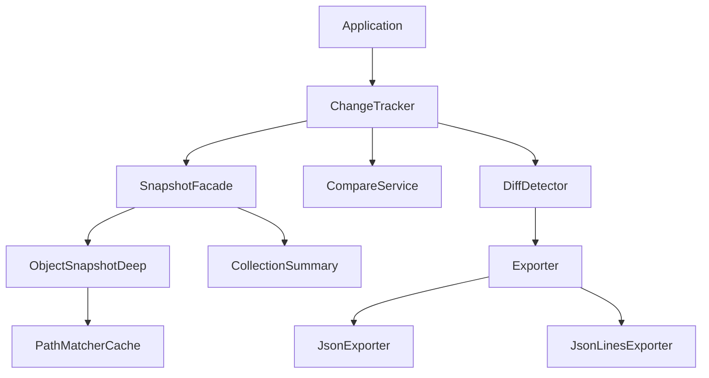

# PROMPT-M2M1-070-Documentation 开发提示词

## 1) SYSTEM
你是**资深 Java 开发工程师**与**AI 结对编程引导者**。你需要基于下述"上下文与证据"，**按步骤**完成实现并给出**可提交的变更**（代码/测试/文档）。

## 2) CONTEXT & SOURCES（务必具体）
- 任务卡：../../task/v2.1.0-vip/docs-examples/M2M1-070-Documentation.md
- 相关代码：
  - src/main/java/com/syy/taskflowinsight#所有模块代码
  - src/test/java/com/syy/taskflowinsight#测试示例
- 文档位置：
  - README.md - 项目主文档
  - docs/api/ - API文档
  - docs/guides/ - 使用指南
  - docs/examples/ - 示例代码
- 文档工具：
  - Spring REST Docs
  - Swagger/OpenAPI 3.0
  - AsciiDoc/Markdown
- 工程操作规范：../../develop/开发工程师提示词.txt（必须遵循）

## 3) GOALS（卡片→可执行目标）
- 业务目标：提供使用指南、配置清单、最佳实践与端到端示例，支撑快速集成与问题定位
- 技术目标：
  - 完整的README文档
  - API参考文档（OpenAPI）
  - 快速开始指南
  - 配置参考手册
  - 示例项目
  - 故障排查指南

## 4) SCOPE
- In Scope（当次实现必做）：
  - [ ] 更新 README.md 主文档
  - [ ] 创建快速开始指南
  - [ ] 编写配置参考文档
  - [ ] 生成 OpenAPI 规范
  - [ ] 创建示例项目
  - [ ] 编写最佳实践文档
  - [ ] 创建故障排查指南
  - [ ] 生成 Javadoc
- Out of Scope（排除项）：
  - [ ] 视频教程
  - [ ] 多语言文档

## 5) CODING PLAN（按《开发工程师提示词.txt》的动作顺序）
1. 主文档结构：
```markdown
# TaskFlowInsight v2.1.0

[]()
[]()
[]()

## 📋 Overview

TaskFlowInsight 是一个高性能的 Java 对象变更追踪框架，提供深度对象快照、智能差异检测和灵活的导出功能。

### ✨ Key Features

- 🔍 **深度对象快照** - 支持复杂对象图的深度遍历和循环检测
- 📊 **智能集合摘要** - 自动生成集合摘要，避免性能问题
- 🎯 **路径匹配缓存** - 高性能的路径模式匹配和缓存
- 🔄 **灵活的比较策略** - 可配置的值规范化和容差比较
- 📤 **多格式导出** - 支持 JSON/JSONL 等多种导出格式
- 🚀 **Spring Boot 集成** - 提供开箱即用的 Spring Boot Starter
- 📈 **可观测性** - 内置指标收集和 Actuator 端点

## 🚀 Quick Start

### Maven
```xml
<dependency>
    <groupId>com.syy</groupId>
    <artifactId>taskflowinsight-spring-boot-starter</artifactId>
    <version>2.1.0</version>
</dependency>
```

### Gradle
```gradle
implementation 'com.syy:taskflowinsight-spring-boot-starter:2.1.0'
```

### Basic Usage
```java
@RestController
public class UserController {
    
    @Autowired
    private ChangeTracker changeTracker;
    
    @PutMapping("/users/{id}")
    public User updateUser(@PathVariable Long id, @RequestBody User updated) {
        // 获取原始对象
        User original = userService.findById(id);
        
        // 开始追踪
        changeTracker.startTracking("session-" + id, getTraceId());
        changeTracker.capture("before", original);
        
        // 执行更新
        User saved = userService.update(updated);
        
        // 捕获变更
        changeTracker.capture("after", saved);
        List<Change> changes = changeTracker.detectChanges();
        
        // 导出变更
        String json = changeTracker.exportAsJson(changes);
        auditService.log(json);
        
        return saved;
    }
}
```

## 📝 Configuration

### application.yml
```yaml
tfi:
  change-tracking:
    enabled: true
    mode: balanced  # minimal | balanced | aggressive
    
    snapshot:
      enable-deep: true
      max-depth: 3
      max-stack-depth: 1000
      excludes:
        - "**.password"
        - "**.secret"
    
    summary:
      enabled: true
      max-size: 1000
      max-examples: 10
    
    path-matcher:
      cache-size: 1000
      pattern-max-length: 512
      max-wildcards: 32
      preload:
        - "**/id"
        - "**/uuid"
        - "user.**"
    
    compare:
      tolerance: 0.0
      normalize-enabled: true
      identity-paths:
        - "**/id"
        - "**/uuid"
    
    store:
      enabled: false  # 可选功能
      max-size: 10000
      ttl-seconds: 300
    
    export:
      format: json  # json | jsonl
      mode: compat  # compat | enhanced
      pretty-print: false
      sanitize: true
```

### 预设配置模式

| 模式 | max-depth | max-size | cache-size | 适用场景 |
|-----|-----------|----------|------------|---------|
| minimal | 1 | 100 | 100 | 低开销，简单对象 |
| balanced | 3 | 1000 | 1000 | 默认推荐，平衡性能 |
| aggressive | 5 | 10000 | 5000 | 深度追踪，不考虑性能 |

## 🔧 Advanced Usage

### 自定义配置
```java
@Configuration
public class TrackingConfig {
    
    @Bean
    public SnapshotConfig customSnapshotConfig() {
        return SnapshotConfig.builder()
            .maxDepth(5)
            .includes(Set.of("user.**", "order.**"))
            .excludes(Set.of("**.internal"))
            .build();
    }
    
    @Bean
    public CompareContext customCompareContext() {
        return CompareContext.builder()
            .tolerance(0.001)  // 数值容差
            .trimStrings(true)
            .lowercaseStrings(true)
            .utcDates(true)
            .build();
    }
}
```

### 扩展点
```java
// 自定义值序列化
@Component
public class CustomSerializer implements ValueSerializer {
    @Override
    public String serialize(Object value) {
        if (value instanceof Money) {
            return ((Money) value).format();
        }
        return defaultSerialize(value);
    }
}

// 自定义导出格式
@Component
public class CustomExporter implements Exporter {
    @Override
    public String export(List<Change> changes, ExportContext context) {
        // 自定义导出逻辑
    }
}
```

## 📊 Monitoring

### Actuator Endpoints
```bash
# 查看有效配置
GET /actuator/tfi/effective-config

# 查看指标摘要
GET /actuator/tfi/metrics

# 健康检查
GET /actuator/health/tfi
```

### Metrics (Micrometer)
- `tfi.snapshot.depth.limit` - 深度限制触发次数
- `tfi.snapshot.cycle.skip` - 循环引用跳过次数
- `tfi.pathmatcher.cache.hit/miss` - 缓存命中率
- `tfi.collection.degrade.count` - 集合降级次数
- `tfi.change.tracking.duration` - 追踪耗时

### Grafana Dashboard
导入 `docs/monitoring/grafana-dashboard.json` 到 Grafana。

## 🏗️ Architecture



## 🧪 Testing

```bash
# 运行单元测试
mvn test

# 运行集成测试
mvn integration-test

# 运行性能测试
mvn test -Pperformance

# 生成测试报告
mvn test jacoco:report
```

## 🐛 Troubleshooting

### 常见问题

#### 1. OutOfMemoryError
**症状**: 处理大对象时内存溢出

**解决方案**:
```yaml
tfi:
  change-tracking:
    snapshot:
      max-depth: 2  # 降低深度
    summary:
      max-size: 100  # 降低集合大小限制
```

#### 2. 性能问题
**症状**: CPU 占用高

**解决方案**:
```yaml
tfi:
  change-tracking:
    mode: minimal  # 使用最小模式
    path-matcher:
      cache-size: 5000  # 增加缓存
    warmup:
      enabled: true  # 启用预热
```

#### 3. 循环引用
**症状**: StackOverflowError

**解决方案**: 框架自动检测循环引用，确保版本 >= 2.1.0

### 日志调试
```yaml
logging:
  level:
    com.syy.taskflowinsight: DEBUG
    com.syy.taskflowinsight.metrics: TRACE
```

## 📚 Examples

完整示例项目见 `examples/` 目录：

- `examples/spring-boot-web` - Spring Boot Web 应用示例
- `examples/spring-batch` - Spring Batch 集成示例
- `examples/performance` - 性能测试示例
- `examples/custom-exporter` - 自定义导出器示例

## 🤝 Contributing

见 [CONTRIBUTING.md](CONTRIBUTING.md)

## 📄 License

Apache License 2.0 - 见 [LICENSE](LICENSE)

## 🔗 Links

- [API Documentation](https://xxx.github.io/taskflowinsight/)
- [Release Notes](CHANGELOG.md)
- [Issue Tracker](https://github.com/xxx/taskflowinsight/issues)

## 📞 Support

- 📧 Email: support@taskflowinsight.com
- 💬 Slack: [#taskflowinsight](https://xxx.slack.com)
- 📖 Wiki: [GitHub Wiki](https://github.com/xxx/taskflowinsight/wiki)
```

2. OpenAPI 规范：
```java
// OpenApiConfig.java
@Configuration
public class OpenApiConfig {
    
    @Bean
    public OpenAPI customOpenAPI() {
        return new OpenAPI()
            .info(new Info()
                .title("TaskFlowInsight API")
                .version("2.1.0")
                .description("Object change tracking and diff detection API")
                .contact(new Contact()
                    .name("TaskFlowInsight Team")
                    .email("support@taskflowinsight.com"))
                .license(new License()
                    .name("Apache 2.0")
                    .url("https://www.apache.org/licenses/LICENSE-2.0")))
            .externalDocs(new ExternalDocumentation()
                .description("TaskFlowInsight Documentation")
                .url("https://docs.taskflowinsight.com"));
    }
}

// 在控制器中添加 OpenAPI 注解
@RestController
@Tag(name = "Change Tracking", description = "Object change tracking operations")
public class ChangeTrackingController {
    
    @Operation(
        summary = "Track object changes",
        description = "Capture before/after snapshots and detect changes"
    )
    @ApiResponses({
        @ApiResponse(
            responseCode = "200",
            description = "Changes detected successfully",
            content = @Content(
                mediaType = "application/json",
                schema = @Schema(implementation = ChangeResponse.class),
                examples = @ExampleObject(
                    name = "Simple change",
                    value = """
                    {
                      "sessionId": "session-123",
                      "changes": [
                        {
                          "path": "user.name",
                          "oldValue": "Alice",
                          "newValue": "Bob",
                          "valueKind": "STRING"
                        }
                      ],
                      "metadata": {
                        "timestamp": "2024-01-01T12:00:00Z",
                        "duration": 45
                      }
                    }
                    """
                )
            )
        ),
        @ApiResponse(
            responseCode = "400",
            description = "Invalid request",
            content = @Content(
                mediaType = "application/json",
                schema = @Schema(implementation = ErrorResponse.class)
            )
        )
    })
    @PostMapping("/track")
    public ChangeResponse trackChanges(
        @Parameter(description = "Change tracking request", required = true)
        @RequestBody TrackingRequest request) {
        // 实现
    }
}
```

3. 示例项目：
```java
// examples/spring-boot-web/src/main/java/com/example/Application.java
@SpringBootApplication
@EnableChangeTracking  // 启用变更追踪
public class ExampleApplication {
    public static void main(String[] args) {
        SpringApplication.run(ExampleApplication.class, args);
    }
}

// UserService.java
@Service
@Slf4j
public class UserService {
    
    @Autowired
    private ChangeTracker changeTracker;
    
    @Autowired
    private UserRepository repository;
    
    @Autowired
    private AuditService auditService;
    
    @Transactional
    @TrackChanges  // 自定义注解，自动追踪
    public User updateUser(Long id, UserUpdateDto dto) {
        // 获取原始数据
        User original = repository.findById(id)
            .orElseThrow(() -> new NotFoundException("User not found"));
        
        // 开始追踪
        String sessionId = "user-update-" + id;
        String traceId = MDC.get("traceId");
        
        changeTracker.startTracking(sessionId, traceId);
        changeTracker.capture("before", original);
        
        // 应用更新
        User updated = original.toBuilder()
            .name(dto.getName())
            .email(dto.getEmail())
            .profile(updateProfile(original.getProfile(), dto.getProfile()))
            .modifiedAt(Instant.now())
            .build();
        
        // 保存
        User saved = repository.save(updated);
        
        // 捕获变更
        changeTracker.capture("after", saved);
        List<Change> changes = changeTracker.detectChanges();
        
        // 审计日志
        if (!changes.isEmpty()) {
            AuditLog log = AuditLog.builder()
                .entityType("User")
                .entityId(id)
                .operation("UPDATE")
                .changes(changeTracker.exportAsJson(changes))
                .userId(getCurrentUserId())
                .timestamp(Instant.now())
                .build();
            
            auditService.log(log);
            
            // 发送事件
            publishChangeEvent(id, changes);
        }
        
        return saved;
    }
    
    private void publishChangeEvent(Long userId, List<Change> changes) {
        UserChangedEvent event = UserChangedEvent.builder()
            .userId(userId)
            .changes(changes)
            .timestamp(Instant.now())
            .build();
        
        applicationEventPublisher.publishEvent(event);
    }
}

// 自定义注解实现
@Aspect
@Component
public class ChangeTrackingAspect {
    
    @Autowired
    private ChangeTracker changeTracker;
    
    @Around("@annotation(trackChanges)")
    public Object trackChanges(ProceedingJoinPoint pjp, TrackChanges trackChanges) 
            throws Throwable {
        
        String sessionId = generateSessionId(pjp);
        changeTracker.startTracking(sessionId, MDC.get("traceId"));
        
        try {
            Object result = pjp.proceed();
            
            // 自动导出变更
            if (trackChanges.autoExport()) {
                List<Change> changes = changeTracker.detectChanges();
                if (!changes.isEmpty()) {
                    log.info("Changes detected: {}", 
                        changeTracker.exportAsJson(changes));
                }
            }
            
            return result;
        } finally {
            changeTracker.stopTracking();
        }
    }
}
```

4. 配置参考文档：
```markdown
# Configuration Reference

## 配置项详细说明

### tfi.change-tracking.enabled
- **类型**: `boolean`
- **默认值**: `true`
- **描述**: 是否启用变更追踪功能
- **示例**: 
  ```yaml
  tfi.change-tracking.enabled: true
  ```

### tfi.change-tracking.mode
- **类型**: `string`
- **默认值**: `balanced`
- **可选值**: `minimal`, `balanced`, `aggressive`
- **描述**: 预设配置模式
- **影响的配置**:
  - `minimal`: maxDepth=1, maxSize=100, cacheSize=100
  - `balanced`: maxDepth=3, maxSize=1000, cacheSize=1000
  - `aggressive`: maxDepth=5, maxSize=10000, cacheSize=5000

### tfi.change-tracking.snapshot.max-depth
- **类型**: `int`
- **默认值**: `3`
- **范围**: `0-10`
- **描述**: 对象遍历的最大深度
- **性能影响**: 深度越大，CPU和内存开销越高
- **建议**: 
  - 简单对象: 1-2
  - 中等复杂: 3-4
  - 深度嵌套: 5+

[继续列出所有配置项...]
```

## 6) DELIVERABLES（输出必须包含）
- 文档文件：
  - README.md（主文档）
  - docs/guides/quick-start.md
  - docs/guides/configuration.md
  - docs/guides/best-practices.md
  - docs/guides/troubleshooting.md
  - docs/api/openapi.yaml
- 示例项目：
  - examples/spring-boot-web/
  - examples/performance/
  - examples/custom-exporter/
- 生成文档：
  - target/generated-docs/javadoc/
  - target/generated-docs/api-docs.html

## 7) API & MODELS（必须具体化）
- 文档格式：
  - Markdown（README、指南）
  - OpenAPI 3.0（API规范）
  - Javadoc（代码文档）
  - AsciiDoc（Spring REST Docs）
- 示例覆盖：
  - 基础用法
  - 高级配置
  - 自定义扩展
  - 性能优化

## 8) DATA & STORAGE
- 文档版本控制：Git
- 文档发布：GitHub Pages / GitBook
- API文档：Swagger UI

## 9) PERFORMANCE & RELIABILITY
- 文档构建：< 1分钟
- 示例运行：开箱即用
- 文档搜索：全文索引

## 10) TEST PLAN（可运行、可断言）
- 文档测试：
  - [ ] 示例代码可编译
  - [ ] 配置示例有效
  - [ ] 链接无死链
- 示例测试：
  - [ ] 所有示例可运行
  - [ ] 输出结果正确

## 11) ACCEPTANCE（核对清单，默认空）
- [ ] README完整
- [ ] 快速开始可用
- [ ] 配置文档全面
- [ ] API文档生成
- [ ] 示例项目运行

## 12) RISKS & MITIGATIONS
- 文档过时：代码更新未同步 → CI自动检查
- 示例失效：依赖版本变化 → 定期测试
- 理解困难：概念复杂 → 增加图示

## 13) DIFFERENCES & SUGGESTIONS（文档 vs 代码冲突）
- 建议使用 Spring REST Docs 自动生成API文档

## 14) OPEN QUESTIONS & ACTIONS（必须列出）
- [ ] 问题1：是否需要中文文档？
  - 责任人：产品组
  - 期限：发布前确认
  - 所需：用户群体分析