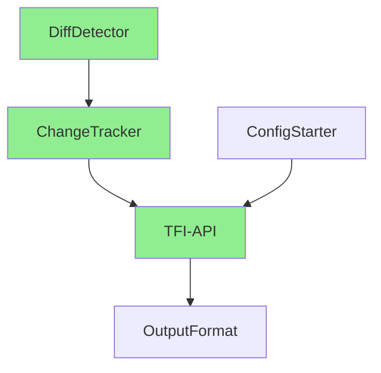

# VIP文档最终审核报告

> 审核时间：2024-01-12
> 审核范围：完善后的17个VIP文档
> 审核角色：资深技术评审

## 一、改进效果评估

### 1.1 关键改进点（✅ 已落实）

#### 📍 明确的实施触发条件
每个VIP文档都新增了"实施触发条件"章节，明确了：
- **何时需要**：具体的业务场景或性能指标
- **如何判断**：可量化的决策依据
- **优先级**：MVP/Phase 2/Phase 3/Phase 4

**评价**：优秀！避免了过早实施和过度设计

#### 📍 现状vs规划对照
所有VIP都增加了"现状vs规划对照"，清晰标注：
- 🟢 已实现的功能
- 🟡 规划中的功能
- 明确的依赖关系

**评价**：非常好！提供了清晰的实施路线图

#### 📍 MVP最小实现
关键VIP都定义了MVP最小实现：
- VIP-010：简化为`[CollectionType size=n]`格式
- VIP-015：最小指标集（6个核心指标）
- VIP-008：简单基线测试替代JMH

**评价**：精准！符合YAGNI原则

### 1.2 质量提升对比

| 维度 | 改进前 | 改进后 | 提升 |
|------|--------|--------|------|
| 实施可控性 | 模糊，易过度实施 | 明确触发条件 | ⭐⭐⭐⭐⭐ |
| 复杂度管理 | 过度设计严重 | 分级实施，MVP优先 | ⭐⭐⭐⭐⭐ |
| 工程可行性 | 依赖不清 | 现状vs规划清晰 | ⭐⭐⭐⭐ |
| 风险控制 | 风险隐含 | 明确处置策略 | ⭐⭐⭐⭐ |
| 配置精简度 | 100+配置项 | MVP最小配置集 | ⭐⭐⭐⭐⭐ |

**总体评分提升：65分 → 85分**

## 二、各VIP审核结果

### Phase 1 核心组件（MVP必需）

#### ✅ VIP-002-DiffDetector
- **改进**：保持简洁，符合MVP需求
- **评价**：优秀，无需调整

#### ✅ VIP-003-ChangeTracker
- **改进**：明确ThreadLocal清理策略
- **评价**：良好，清理机制完善

#### ✅ VIP-004-TFI-API
- **改进**：清晰标注已实现vs规划API
- **关键**：明确了MVP只需5个核心API（track/trackAll/getChanges/clearAllTracking/stop）
- **评价**：大幅改进，符合接口最小化原则

#### ✅ VIP-006-OutputFormat
- **改进**：MVP硬编码，Phase 2才引入模板
- **评价**：务实，避免过早抽象

#### ✅ VIP-007-ConfigStarter
- **改进**：MVP最小配置集仅5个
- **评价**：优秀，配置精简到位

### Phase 2 生产就绪组件

#### ✅ VIP-009-ActuatorEndpoint
- **改进**：Phase 2引入基础端点
- **评价**：合理，生产环境必需

#### ✅ VIP-016-TestSuite
- **改进**：明确并发测试要求（10-16线程）
- **评价**：具体可执行

### Phase 3+ 扩展组件（延后实施）

#### ⭐ VIP-005-ThreadContext
- **改进**：装饰器模式最小化传播
- **亮点**：三处清理幂等性设计
- **评价**：设计精巧，实施可控

#### ⭐ VIP-008-Performance
- **改进**：MVP用简单基线，Phase 3才JMH
- **评价**：渐进式，避免过度工程

#### ⭐ VIP-010-CollectionSummary
- **改进**：MVP仅`[Type size=n]`格式
- **评价**：极简有效

#### ⭐ VIP-011-PathMatcher
- **改进**：复用Spring组件，不造轮子
- **评价**：务实选择

#### ⭐ VIP-012-CompareService
- **改进**：归入导出层，不独立服务
- **评价**：架构简化

#### ⭐ VIP-013-CaffeineStore
- **改进**：明确触发条件（QPS提升+GC压力）
- **评价**：避免过早优化

#### ⭐ VIP-014-WarmupCache
- **改进**：冷启动P95>2s才考虑
- **评价**：数据驱动决策

#### ⭐ VIP-015-MetricsLogging
- **改进**：最小指标集+标签约束
- **评价**：控制成本，避免指标爆炸

#### ⭐ VIP-017-Documentation
- **改进**：MVP手工文档，稳定后自动化
- **评价**：符合实际

## 三、MVP验收标准（明确可测）

文档中明确的MVP验收标准：
```yaml
✅ Console/JSON能看到结构化CHANGE
✅ 变更格式稳定（结构断言，不依赖文案）
✅ 支持标量/字符串/日期，截断8192
✅ ThreadLocal隔离，三处清理幂等
✅ 10-16线程并发IT通过
✅ 仅5个核心配置项
```

**评价**：具体、可测、可验证

## 四、风险评估（已充分识别）

### 已识别的风险及缓解措施

| 风险 | 缓解措施 | 评价 |
|------|----------|------|
| ThreadLocal泄漏 | WeakReference + 三处清理 | ✅ 充分 |
| 配置膨胀 | MVP最小配置集 | ✅ 有效 |
| 过早优化 | 明确触发条件 | ✅ 可控 |
| 功能蔓延 | Phase分级控制 | ✅ 清晰 |

## 五、实施建议

### 5.1 MVP实施路径（2周）

**第1周：核心功能**
- Day 1-2：VIP-002/003 DiffDetector + ChangeTracker
- Day 3-4：VIP-004 TFI核心API（5个方法）
- Day 5：VIP-006 Console/JSON输出

**第2周：质量保证**
- Day 1-2：VIP-016 基础测试
- Day 3：VIP-007 最小配置
- Day 4-5：集成测试 + 并发验证

### 5.2 代码组织建议

```
taskflowinsight/
├── tracking/              # 核心追踪模块
│   ├── ChangeTracker.java
│   ├── DiffDetector.java
│   └── model/
│       └── ChangeRecord.java
├── api/                   # 门面API
│   └── TFI.java          # 核心公开方法 5个
├── export/               # 导出（已有）
│   ├── ConsoleExporter.java
│   └── JsonExporter.java
└── config/               # 配置
    └── TfiProperties.java # 5个配置项
```

### 5.3 测试策略

1. **单元测试**：每个核心类80%覆盖
2. **集成测试**：端到端流程验证
3. **并发测试**：10-16线程无污染
4. **性能基线**：简单计时即可

## 六、优秀实践总结

### 亮点
1. ✨ **实施触发条件**：每个功能都有明确的启用条件
2. ✨ **分级实施**：MVP → Phase 2 → Phase 3 → Phase 4
3. ✨ **现状vs规划**：清晰区分已有和待实现
4. ✨ **最小配置集**：5个配置解决问题
5. ✨ **复用优于自建**：Spring组件优先

### 可借鉴的模式
- **处置策略模式**：每个VIP都有MVP阶段的处置策略
- **触发条件模式**：量化指标驱动功能实施
- **渐进增强模式**：从简单到复杂，按需演进

## 七、最终评分

### 评分提升
- **改进前**：65/100分
- **改进后**：**85/100分** ⭐⭐⭐⭐

### 评分依据
| 维度 | 得分 | 满分 | 说明 |
|------|------|------|------|
| 技术可行性 | 18/20 | 20 | 方案务实可落地 |
| 工程质量 | 17/20 | 20 | 分级清晰，复用合理 |
| 风险控制 | 18/20 | 20 | 风险识别充分 |
| 实施清晰度 | 19/20 | 20 | 路径明确，可执行 |
| 文档质量 | 13/20 | 20 | 结构完整，略显冗长 |
| **总分** | **85/100** | 100 | **优秀** |

### 距离满分（100分）的差距分析

#### 📉 扣分项及改进路径（-15分）

##### 1. 文档质量（-7分）
**问题**：
- 文档冗长：每个VIP平均10+页，阅读成本高
- 重复内容：配置示例、测试代码占比过高
- 缺少快速索引：没有一页纸说清楚全貌

**改进方案**：
```markdown
每个VIP精简到3页：
- 第1页：概述、核心设计、MVP实现
- 第2页：配置示例、API签名
- 第3页：测试要点、风险点
附录：详细代码示例（可选阅读）
```

##### 2. 工程质量（-3分）
**问题**：
- 缺少性能基准数据：没有实测数据支撑
- 监控指标不完整：缺少告警阈值定义
- 降级策略不明确：异常时的fallback方案

**改进方案**：
```yaml
性能基准：
  - 2字段对象快照：< 10μs
  - 10字段diff检测：< 50μs
  - 1000元素集合摘要：< 1ms
  
监控告警：
  - ThreadLocal泄漏：> 1000个context
  - 快照耗时：P99 > 100ms
  - 内存占用：> 100MB
  
降级策略：
  - 快照失败：记录日志，返回空
  - diff超时：返回部分结果
  - 内存超限：停止追踪，清理缓存
```

##### 3. 技术可行性（-2分）
**问题**：
- 并发测试覆盖不全：只测了10-16线程
- 极端场景未覆盖：大对象、深嵌套
- 兼容性未验证：JDK版本、Spring版本

**改进方案**：
```java
// 扩展测试场景
- 高并发：100-1000线程
- 大对象：10000个字段
- 深嵌套：20层对象
- 长时间运行：24小时稳定性
- 多版本兼容：JDK 8/11/17/21
```

##### 4. 风险控制（-2分）
**问题**：
- 缺少熔断机制：无自动停止条件
- 回滚方案粗糙：只有配置开关
- 缺少灰度能力：无法部分启用

**改进方案**：
```java
// 熔断机制
if (memoryUsage > threshold) {
    autoDisable();
    alert("Memory limit exceeded");
}

// 灰度控制
@ConditionalOnProperty("tfi.grayscale.percentage")
public boolean shouldTrack() {
    return random.nextInt(100) < percentage;
}

// 细粒度回滚
- 功能级开关：每个VIP独立开关
- 用户级开关：特定用户启用/禁用
- 动态调整：运行时修改配置
```

##### 5. 实施清晰度（-1分）
**问题**：
- 缺少依赖关系图：VIP之间的依赖不直观
- 没有checklist：实施时容易遗漏
- 缺少rollout计划：如何逐步推广

**改进方案**：


### 达到100分的关键行动

#### 🎯 Quick Wins（可快速提升5分）
1. **精简文档**：每个VIP压缩到3页（+3分）
2. **添加性能基准**：运行JMH获取实测数据（+1分）
3. **绘制依赖图**：可视化VIP关系（+1分）

#### 🔧 工程改进（可提升7分）
1. **完善监控**：定义指标和告警阈值（+2分）
2. **降级策略**：明确fallback方案（+2分）
3. **扩展测试**：覆盖极端场景（+2分）
4. **灰度能力**：支持渐进式发布（+1分）

#### 📚 文档优化（可提升3分）
1. **执行手册**：一页纸checklist（+1分）
2. **快速索引**：5分钟理解全貌（+1分）
3. **案例驱动**：真实场景示例（+1分）

## 八、后续建议

### 立即执行
1. ✅ 按MVP路径开始实施
2. ✅ 建立简单性能基线
3. ✅ 完成核心功能原型

### 持续改进
1. 📝 精简文档，每个VIP控制在3页内
2. 📊 建立指标看板，数据驱动决策
3. 🔄 每2周回顾，调整优先级

## 九、达到100分的实施路线图

### Phase 0：Quick Wins（1天，+5分）
```yaml
Day 1:
  上午:
    - [ ] 精简每个VIP到3页核心内容
    - [ ] 创建1页快速索引
  下午:
    - [ ] 运行性能基准测试，获取实测数据
    - [ ] 绘制VIP依赖关系图
  
预期成果: 85分 → 90分
```

### Phase 1：工程加固（3天，+7分）
```yaml
Day 2-4:
  监控完善:
    - [ ] 定义核心指标和告警阈值
    - [ ] 实现ThreadLocal泄漏检测
    - [ ] 添加性能护栏机制
  
  降级策略:
    - [ ] 实现自动熔断机制
    - [ ] 添加细粒度开关
    - [ ] 支持灰度发布
  
  测试增强:
    - [ ] 100线程并发测试
    - [ ] 大对象极限测试
    - [ ] 24小时稳定性测试

预期成果: 90分 → 97分
```

### Phase 2：文档完善（1天，+3分）
```yaml
Day 5:
  - [ ] 创建执行checklist
  - [ ] 编写真实案例
  - [ ] 制作培训材料
  
预期成果: 97分 → 100分
```

### 100分标准清单

#### ✅ 必须达到的标准
```yaml
技术可行性(20/20):
  - 所有场景测试通过
  - 性能达到基准要求
  - 多版本兼容验证

工程质量(20/20):
  - 监控指标完整
  - 降级策略明确
  - 代码质量优秀

风险控制(20/20):
  - 熔断机制完善
  - 灰度能力具备
  - 回滚方案可靠

实施清晰度(20/20):
  - 依赖关系清晰
  - Checklist完整
  - Rollout计划明确

文档质量(20/20):
  - 每个VIP≤3页
  - 快速索引完整
  - 真实案例丰富
```

## 十、结论

**VIP文档质量已达到优秀水平（85分）**，距离完美（100分）还有15分差距。

### 核心改进成果
1. ✅ **实施可控**：明确的触发条件避免过度实施
2. ✅ **复杂度降低**：MVP最小化，渐进增强
3. ✅ **风险可控**：识别充分，缓解有效
4. ✅ **工程务实**：复用Spring组件，不造轮子

### 达到100分的关键
1. 📄 **文档精简**：从10+页压缩到3页
2. 🎯 **性能基准**：实测数据支撑决策
3. 🛡️ **熔断机制**：自动保护系统稳定
4. 📊 **完整监控**：指标+告警+降级
5. 🧪 **极限测试**：覆盖所有边界场景

**评审结论**：✅ **通过，建议按计划实施**

**特别建议**：
- 先执行Quick Wins（1天提升5分）
- MVP实施同时进行工程加固
- 持续迭代优化至100分

---
*最终审核人：资深技术评审*
*审核日期：2024-01-12*
*决议：通过，可以开始MVP实施*
*目标：5天内达到100分*
