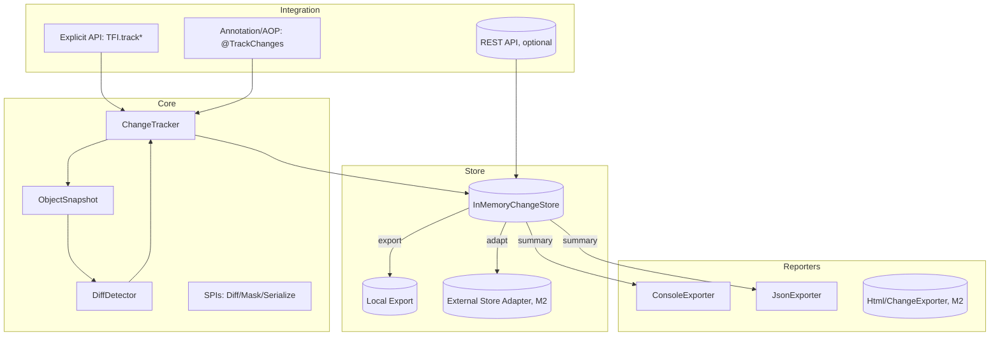

Title: TaskFlow Insight — M2 设计说明书（合并定稿）
Version/Owner/Status/Date
- Version: v2.0.0-M2
- Owner: SA（架构）/PM（产品）
- Status: Final-Draft (merged gpt5/v2 + opus4.1/v2)
- Date: 2025-09-10

1. 现状基线（已有能力/缺口清单）
- 证据（源码）：
  - 任务/会话：`src/main/java/com/syy/taskflowinsight/model/TaskNode.java#TaskNode`、`src/main/java/com/syy/taskflowinsight/model/Session.java#Session`
  - 上下文/异步：`src/main/java/com/syy/taskflowinsight/context/ManagedThreadContext.java#ManagedThreadContext`、`src/main/java/com/syy/taskflowinsight/context/SafeContextManager.java#SafeContextManager`、`src/main/java/com/syy/taskflowinsight/context/TFIAwareExecutor.java#TFIAwareExecutor`
  - 导出：`src/main/java/com/syy/taskflowinsight/exporter/text/ConsoleExporter.java#ConsoleExporter`、`src/main/java/com/syy/taskflowinsight/exporter/json/JsonExporter.java#JsonExporter`
  - API 门面：`src/main/java/com/syy/taskflowinsight/api/TFI.java#TFI`
- 缺口：
  - （已补齐 M0）显式 API/快照/标量 Diff/与任务树联动/Console/JSON 导出。
  - （仍待 M1/M2）集合/Map 摘要、检索/时间线、回放、注解/AOP、SPI 与外部存储/滚动导出。

2. 总体架构


3. 模块设计
- core-changes（新增，M0）
  - ChangeTracker【新增】：线程本地追踪上下文，管理 `track/trackAll/getChanges/clearAllTracking`，与 `ManagedThreadContext` 协作写入 TaskNode 的 CHANGE 消息。
  - ObjectSnapshot【新增】：反射读取字段值，支持白名单与最大深度，值简化（标量保留，复杂对象 toString）。
  - DiffDetector【新增】：标量对比（M0）；集合/Map 的增/删/替换摘要（M1）。
  - 策略 SPI（M1）：Diff/Mask/Serialize 可插拔，ServiceLoader 装配，按优先级竞合。
- store-changes（新增，M0→M1）
  - InMemoryChangeStore【新增】：`(sessionId)->List<ChangeRecord>` 主索引；派生 `(objectName,fieldName)`、`(timestamp range)`；环形缓冲；会话完成即清理。
  - ChangeQueryService【新增】：对象/字段/时间段过滤与时间线聚合；回放由 `ChangeReplayService`（M2）提供。
- integration（M1）
  - 注解 `@TrackChanges/@Track` 与切面 `ChangeTrackingAspect`：前后快照、异常保护、配置化开关；Starter 自动装配。
  - REST（可选）：只读查询/导出接口，默认不启用。
- reporters（M0→M2）
  - Console/JSON 增强：导出结果追加“变更记录”。
  - Html/ChangeExporter（M2）：时间线与审计表，JSON/CSV/Markdown 导出。

4. 数据与存储
- 事件模型（M0）
```java
// 新增：com.syy.taskflowinsight.tracking.model.ChangeRecord
class ChangeRecord {
  String objectName;
  String fieldName;
  Object oldValue;   // 已脱敏
  Object newValue;   // 已脱敏
  long   timestamp;
  String sessionId;
  String taskPath;
  String changeType; // CREATE/UPDATE/DELETE/COL_ADD/COL_REMOVE/COL_REPLACE
  // 为 M1/M2 的检索与回放保留类型信息
  String valueType;  // 原值的 FQCN，例如 java.math.BigDecimal
  String valueKind;  // PRIMITIVE/STRING/NUMBER/BOOLEAN/DATE/OBJECT_STRING/JSON
  String valueRepr;  // 统一字符串表现，M0 可用 toString，M1 由 Serialize SPI 提供 JSON
}
```

- valueRepr 截断策略（M0 内存保护）
  - 默认使用 `toString()` 生成，并在写入前按最大长度截断（默认 8192 字符）。
  - 超出部分以 `... (truncated)` 结尾，避免单条记录导致缓冲膨胀。
  - 可通过配置 `tfi.change-tracking.value-repr-max-length` 进行调整（见“20. M0 配置清单”）。
  - 自适应回压（建议开启）：当环形缓冲水位 >80% 时临时降至 2048；>90% 时降至 512，待水位回落后恢复。
  - M0 对复杂类型的简化策略：
    - Collection/Map：仅输出摘要（如 `List(size=123)`、`Map(size=45)`），不递归、不拼接元素 toString。
    - 其他自定义对象：默认 `类名@identityHash` 简述，避免触发重型 toString。
    - 深度序列化或 JSON 表达由 M1 的 Serialize SPI 提供。
- 容量与清理
  - 每会话上限（默认 10k）、全局上限（默认 100k）；超限丢弃并 WARN；指标暴露到 Actuator（仅计数）。
  - 会话完成即清理该会话所有变更；支持全局清理命令。
- 导出与归档
  - JSON/文本（M0→M1）：`reports/<sessionId>-<ts>.json`；目录/滚动可配；失败降级 Console。
- 外部存储（M2）
  - 适配接口：`ChangeStore` 与 `ExternalStoreAdapter`（JDBC/Redis 等）；数据库表结构参考样例置于 examples（不强制纳入主产物）。

5. 关键 API（仅引用真实证据/标注 TODO）
- 显式 API（新增到 `api/TFI.java`，M0）
```java
// 文件：src/main/java/com/syy/taskflowinsight/api/TFI.java  【TODO: 新增方法】
public final class TFI {
  public static void track(String name, Object target, String... fields);
  public static void trackAll(Map<String,Object> targets);
  public static List<ChangeRecord> getChanges();
  public static void clearAllTracking();
}
```
- 注解/AOP（M1）
```java
// 文件：src/main/java/com/syy/taskflowinsight/tracking/annotation/TrackChanges.java  【TODO】
@Target(ElementType.METHOD)
@Retention(RetentionPolicy.RUNTIME)
public @interface TrackChanges { String[] value() default {}; String[] fields() default {}; }

// 文件：src/main/java/com/syy/taskflowinsight/tracking/aop/ChangeTrackingAspect.java  【TODO】
@Aspect
public class ChangeTrackingAspect { /* 前后置快照 + try/finally 清理 */ }
```
- 存储与检索（M1）
```java
// 文件：src/main/java/com/syy/taskflowinsight/tracking/store/ChangeStore.java  【TODO】
interface ChangeStore { void append(ChangeRecord e); List<ChangeRecord> query(ChangeQuery q); void clear(String sessionId); }
```

6. 时序与业务流
- 写路径（M0）
  1) 业务前：`TFI.track("order", order, "status","amount")` 捕获 before。
  2) 执行业务：对象变更。
  3) 检测：`TFI.getChanges()` 捕获 after → `DiffDetector` → 生成 `ChangeRecord` → 写入当前 TaskNode（CHANGE）与 `InMemoryChangeStore`。
  4) 会话收口：`TFI.stop()` 自动补采一次 `getChanges()`。
- 读路径（M1）
  - `ChangeQueryService.query(object/field/range)` 返回变更列表；`timeline(object, field)` 返回时间线。
- 回放（M2）
  - `ChangeReplayService.replay(object, field, window)` 构建 (timestamp,value) 序列。

7. 非功能与工程治理
- 性能预算：字段元数据缓存；`maxFields/maxDepth` 限制；复杂对象 toString；集合/Map 只做摘要差异。
- 幂等/重试/降级：同名 track 覆盖并 WARN；导出失败重试 3 次 → 降级 Console；超水位仅消息。
- 可观测性：追踪对象数/变更条数/丢弃条数/导出失败数；扩展 `taskflow` endpoint 子节点（不含值）。
- 安全与隐私：Mask + Whitelist 规则链；默认对 `password/*secret/*card*` 等脱敏；导出路径校验可写。

8. 上线与灰度
- 开关：`tfi.change-tracking.enabled=false`（默认禁用）；`max-depth/max-fields/collection-limit` 可配。
- 灰度：按服务/环境；采样率与水位阈值可在线调整。
- 回滚：关闭开关 → 仅保留 CHANGE 文本消息。

9. 可行性评分（设计侧）
- 功能契合：9/10；稳定性：8/10；性能风险：7/10；可扩展性：8/10；过度设计：3/10。

10. 待确认与开放问题
- TODO：`TFI` 新 API 的二进制兼容性与测试计划。
- TODO：Console/JSON 导出结构的向后兼容策略（是否加版本头）。
- TODO：REST 只读查询是否纳入 M2-M2（默认可选）。

11. 实现映射与集成点（M2-M0）
- 新增包/类（`src/main/java/com/syy/taskflowinsight/tracking`）
  - `model/ChangeRecord`：见“数据与存储”。
  - `ObjectSnapshot`：`capture(name,target,fields)` → `Map<String,Object>`（标量保留、复杂对象 `toString()`）。
  - `DiffDetector`：`diff(before, after)` → `List<ChangeRecord>`（仅标量；集合/Map 在 M1）。
  - `ChangeTracker`：ThreadLocal 上下文，API 封装：`track/trackAll/getChanges/clearAllTracking`。
- 修改 `api/TFI.java#TFI`（显式 API）
  - 新增静态方法：`track(String,Object,String...)`、`trackAll(Map)`、`getChanges()`、`clearAllTracking()`。
  - 在 `stop()` 收口末尾：`getChanges()` → 对每条变更调用 `TaskNode.addMessage(<格式化文本>, MessageType.CHANGE)` → `clearAllTracking()`。
- 生命周期清理
  - 在 `context/ManagedThreadContext#close()` finally 中调用 `TFI.clearAllTracking()`。
  - `Session.endSession()` 可兜底清理一次，确保会话边界释放。

12. 线程与生命周期
- 隔离：ChangeTracker 使用 ThreadLocal；与 `ManagedThreadContext` 的当前上下文绑定。
- 传播：在线程池中通过 `TFIAwareExecutor` 传递上下文；子线程中的变更归属到正确的会话/任务。
- 边界：`TFI.stop()`、`ManagedThreadContext.close()`、`Session.endSession()` 均会清理追踪快照。

13. 错误处理与日志
- 新 API 全面沿用 `TFI.handleInternalError`，示例：
```java
public static void track(String name, Object target, String... fields) {
  if (!isEnabled() || target == null) return;
  try {
    ChangeTracker.track(name, target, fields);
  } catch (Throwable t) {
    handleInternalError("Failed to track: " + name, t);
  }
}
```

14. 导出器集成
- M0：不改现有 Console/JSON 导出器，因 CHANGE 消息已自然展示变更。
- M1（可选增强）：在 Console/JSON 中增加“变更汇总板块”（遍历当前 Session 的变更记录）。

15. 配置策略（M1 生效）
- 前缀：`tfi.change-tracking.*`
- 建议默认值：
  - `enabled=false`
  - `max-depth=2`
  - `max-tracked-objects=1000`
  - `collection-limit=0`（M0 不启用集合）
- 放置位置：`config/ChangeTrackingProperties`，由 `ContextMonitoringAutoConfiguration` 加载应用。

16. 性能基准（方法与目标）
- 方法：优先 JMH；若无 JMH，用 JUnit 微基准兜底。
- 目标：2 字段 P95 ≤ 200μs；写路径 P95 CPU ≤ 3%（M0）。
- 示例（JMH 片段）：
```java
@Benchmark @BenchmarkMode(Mode.AverageTime)
public void trackTwoFields(Blackhole bh) {
  Order o = new Order(); o.setStatus("PENDING"); o.setAmount(BigDecimal.TEN);
  TFI.track("order", o, "status", "amount");
  o.setStatus("PAID"); o.setAmount(new BigDecimal("12.34"));
  bh.consume(TFI.getChanges());
  TFI.clearAllTracking();
}
```

17. 测试策略（M2-M0）
- 功能：标量 Diff 正确性（含 null/类型变更）；消息格式。
- 并发：线程隔离、上下文传播、跨任务归属正确性。
- 生命周期：stop/close/endSession 后快照清理，无泄漏。
- 性能：基准报告覆盖 2/20 字段、100 次循环与并发场景。
- M1 补充：集合/Map 摘要差异、注解/AOP、检索与文件导出。

17.1 反射元数据缓存（M0）
- 目标：降低反射读字段的开销，避免热路径重复反射。
- 策略：
  - 使用 `ConcurrentHashMap<Class<?>, Map<String, Field>>` 作为简单缓存（M0 不新增三方依赖）。
  - 字段获取时设为 `setAccessible(true)`，缓存命中直接使用；缓存容量按 500~1000 类控制（可配）。
  - M1 可切换为可插拔 Cache（如 Caffeine）作为可选优化，不改变接口。

17.2 ChangeTracker 清理器（M0 可选）
- 目标：兜底清理僵尸快照，进一步降低泄漏风险（在 stop/close/endSession 正常清理之外）。
- 策略：
  - 守护线程定期（默认 5 分钟）扫描并清理无会话关联或过期的快照。
  - 可配置项：
    - `tfi.change-tracking.cleaner.enabled=true`
    - `tfi.change-tracking.cleaner.interval=PT5M`
  - 与现有 `SafeContextManager` 泄漏检测互补。

17.3 降级/熔断阈值（M1 规划）
- 半自动降级：
  - 高水位（>80%）/严重水位（>90%）触发自适应 valueRepr 截断（已在 M0 提供），并记录 WARN。
- 熔断条件（M1 可选启用，默认关闭）：
  - 追踪对象数 > `max-tracked-objects`（默认 1000）。
  - 变更检测 P95 延迟 > 10ms 持续 N 次（默认 10 次）。
  - 变更检测错误率 > 10% 持续 T 时窗（默认 1 分钟）。
- 熔断动作：
  - 禁用变更追踪（仅保留文本 CHANGE 消息），并周期性尝试恢复（指数退避）。
  - 暴露指标供告警：水位、P95、错误率、熔断状态。

18. 便捷 API（可选，M2-M0 最佳实践）
- 目的：降低“成对调用”心智负担，简化 M0 业务接入；底层仍复用 `track/getChanges` 能力。
- 已实现签名（`api/TFI.java`）：
```java
public static void withTracked(String name, Object target, Runnable body, String... fields);
public static <T> T withTracked(String name, Object target, Callable<T> body, String... fields);
```
- 行为：在 `body` 执行前后自动快照与 diff；异常情况下也确保 after 快照与清理；变更写入当前 TaskNode 的 CHANGE 消息。
- 异常透明性：withTracked 不捕获业务异常，`body` 抛出的异常将直接穿透；内部通过 try/finally 确保即使出现异常也会完成变更检测与清理。
- 使用示例（skeleton）：
```java
TFI.start("processPayment");
TFI.withTracked("order", order, () -> {
  order.setStatus("PAID");
  order.setAmount(order.getAmount().add(new BigDecimal("12.34")));
}, "status", "amount");
TFI.stop();
```
- 说明：为语法糖，不替代底层显式 API；demo 与快速入门示例推荐用法。

19. Mask + Whitelist 执行顺序与缓存策略（M1 生效）
- 执行顺序：字段选择（Whitelist）→ 应用脱敏（Mask）→ 存储/输出。
- 冲突处理：字段命中白名单后，如命中脱敏规则，仍需脱敏（安全优先）。
- 性能：系统启动时编译通配规则（正则 Pattern 缓存），运行期缓存字段匹配结果（LRU）以降低热点开销。

20. M0 配置清单（可选）
```yaml
tfi:
  change-tracking:
    enabled: false           # M0 总开关，默认关闭
    default-max-fields: 20   # 默认最大追踪字段数
    default-max-depth: 2     # 默认最大嵌套深度
    collection-limit: 0      # M0 不启用集合摘要（集合字段将以摘要展示）
    value-repr-max-length: 8192 # valueRepr 最大长度，超出将截断
    adaptive-truncation-enabled: true   # 自适应回压：高水位自动收紧上限
    high-watermark-threshold: 0.8       # 高水位阈值（80%）
    critical-watermark-threshold: 0.9   # 严重水位阈值（90%）
    value-repr-mode: summary            # summary|simple|json（json 依赖 M1 Serialize SPI）
```

21. 外部存储与耐久性（远期规划，M2）
- 沟通口径：M1 的检索与 M2 的回放在“默认形态”下以会话/进程为边界（内存存储），不保证跨重启的长期可追溯；需在文档中明确为“会话内时间旅行调试”。
- 耐久性策略（建议）：在引入外部存储适配时，预留“异步批量写入 + 本地预写日志（WAL）”路径：
  - 先写入内存与本地 WAL（文件），由后台线程批量同步到外部存储（JDBC/Redis 等）。
  - 应急恢复时可通过 WAL 进行补录，平衡性能与持久性。
