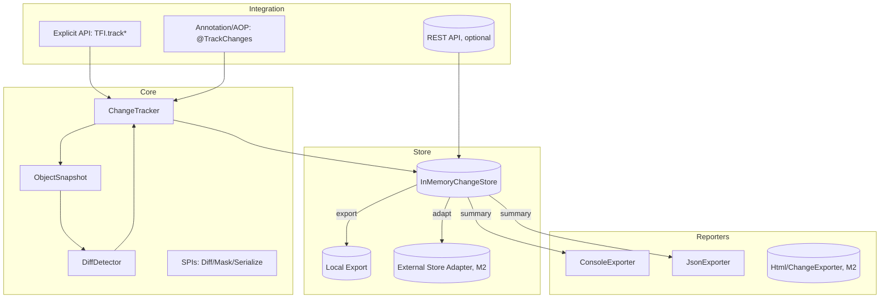

Title: TaskFlow Insight — M2 设计说明书（最佳合成稿）
Version/Owner/Status/Date
- Version: v2.0.0-M2
- Owner: SA（开发架构师）/PM（产品经理）
- Status: Draft-for-Dev (evidence-based)
- Date: 2025-09-10

1. 现状基线（已有能力/缺口清单）
- 证据（源码）：
  - 任务/会话：`src/main/java/com/syy/taskflowinsight/model/TaskNode.java#TaskNode`、`src/main/java/com/syy/taskflowinsight/model/Session.java#Session`
  - 上下文/异步：`src/main/java/com/syy/taskflowinsight/context/ManagedThreadContext.java#ManagedThreadContext`、`src/main/java/com/syy/taskflowinsight/context/SafeContextManager.java#SafeContextManager`、`src/main/java/com/syy/taskflowinsight/context/TFIAwareExecutor.java#TFIAwareExecutor`
  - 导出：`src/main/java/com/syy/taskflowinsight/exporter/text/ConsoleExporter.java#ConsoleExporter`、`src/main/java/com/syy/taskflowinsight/exporter/json/JsonExporter.java#JsonExporter`
  - API 门面：`src/main/java/com/syy/taskflowinsight/api/TFI.java#TFI`
- 缺口：
  - 变更追踪 API/引擎/快照/检索/回放不在仓库中；注解/AOP、持久化/导出（变更段）缺失。

2. 总体架构


3. 模块设计
- core-changes（新增，M0）
  - ChangeTracker【新增】：线程本地追踪上下文，管理 `track/trackAll/getChanges/clearAllTracking`，与 `ManagedThreadContext` 协作写入 TaskNode 消息（CHANGE）。
  - ObjectSnapshot【新增】：反射读取字段值，支持白名单与最大深度，值简化（标量原值，复杂对象 toString）。
  - DiffDetector【新增】：标量对比（M0）；集合/Map 的增/删/替换摘要（M1）。
  - 策略 SPI（M1）：Diff/Mask/Serialize 可插拔，ServiceLoader 装配，按优先级竞合。
- store-changes（新增，M0→M1）
  - InMemoryChangeStore【新增】：按 `sessionId/object/field/time` 建索引；环形缓冲；会话完成即清理。
  - ChangeQueryService【新增】：对象/字段/时间段过滤与时间线聚合；回放由 `ChangeReplayService`（M2）提供。
- integration（M1）
  - 注解 `@TrackChanges/@Track` 与切面 `ChangeTrackingAspect`：前后快照、异常保护、配置化开关。
  - REST（可选）：变更查询/导出只读接口。
- reporters（M0→M2）
  - Console/JSON 增强：在导出结果中追加“变更记录”。
  - Html/ChangeExporter（M2）：时间线与审计表视图，JSON/CSV/Markdown 导出。

4. 数据与存储
- 事件模型（M0）
```java
// 新增：com.syy.taskflowinsight.tracking.model.ChangeRecord
class ChangeRecord {
  String objectName;
  String fieldName;
  Object oldValue;   // 已脱敏
  Object newValue;   // 已脱敏
  long   timestamp;
  String sessionId;
  String taskPath;
  String changeType; // CREATE/UPDATE/DELETE/COL_ADD/COL_REMOVE/COL_REPLACE
}
```
- 索引与容量
  - 主索引：`(sessionId) -> List<ChangeRecord>`；派生：`(objectName, fieldName)`、`(timestamp range)`。
  - 容量保护：每会话上限（默认 10k）、全局上限（默认 100k）；超限丢弃并 WARN；计数暴露到 Actuator。
- 导出与归档
  - JSON/文本（M0→M1）：`reports/<sessionId>-<ts>.json`；可配置目录/滚动策略，失败降级为 Console。
- 外部存储（M2）
  - 适配接口：`ChangeStore` 与 `ExternalStoreAdapter`（JDBC/Redis 等）；参考 opus4.1 提案中的表结构作为样例，不在 M2-M0/M1 强制落地。

5. 关键 API（仅引用真实证据/标注 TODO）
- 显式 API（新增到 `api/TFI.java`，M0）
```java
// 文件：src/main/java/com/syy/taskflowinsight/api/TFI.java  【TODO: 新增方法】
public final class TFI {
  public static void track(String name, Object target, String... fields);  // 显式追踪
  public static void trackAll(Map<String,Object> targets);                 // 批量追踪
  public static List<ChangeRecord> getChanges();                           // 检测并返回变更
  public static void clearAllTracking();                                   // 清除追踪
}
```
- 注解/AOP（M1）
```java
// 文件：src/main/java/com/syy/taskflowinsight/tracking/annotation/TrackChanges.java  【TODO】
@Target(ElementType.METHOD)
@Retention(RetentionPolicy.RUNTIME)
public @interface TrackChanges { String[] value() default {}; String[] fields() default {}; }

// 文件：src/main/java/com/syy/taskflowinsight/tracking/aop/ChangeTrackingAspect.java  【TODO】
@Aspect
public class ChangeTrackingAspect { /* 前后置快照 + try/finally 清理 */ }
```
- 存储与检索（M1）
```java
// 文件：src/main/java/com/syy/taskflowinsight/tracking/store/ChangeStore.java  【TODO】
interface ChangeStore { void append(ChangeRecord e); List<ChangeRecord> query(ChangeQuery q); void clear(String sessionId); }
```

6. 时序与业务流
- 写路径（M0）
  1) 业务前：`TFI.track("order", order, "status","amount")` 捕获 before。
  2) 执行业务：对象变更。
  3) 变更检测：`TFI.getChanges()` 捕获 after → `DiffDetector` → 生成 `ChangeRecord` → 写入当前 TaskNode 的 CHANGE 消息与 `InMemoryChangeStore`。
  4) 会话收口：`TFI.stop()` 自动补采一次 `getChanges()`。
- 读路径（M1）
  - `ChangeQueryService.query(object/field/range)` 返回变更列表；`timeline(object, field)` 返回时间线。
- 回放（M2）
  - `ChangeReplayService.replay(object, field, window)` 构建 (timestamp,value) 序列。

7. 非功能与工程治理
- 性能预算
  - 快照：字段元数据缓存；`maxFields/maxDepth` 限制；复杂对象 toString。
  - Diff：标量 O(1)；集合/Map 仅摘要（增删替换），不做深层对齐。
- 幂等/重试/降级
  - `track` 幂等：同名覆盖并 WARN；导出失败重试 3 次，失败降级 Console；高水位仅消息。
- 可观测性
  - 指标：追踪对象数、变更条数、丢弃条数、导出失败次；扩展现有 `taskflow` endpoint 的子节点（不含值）。
- 安全与隐私
  - Mask + Whitelist 规则链；默认对 `password/*secret/*card*` 等字段脱敏；导出需显式开启并校验目录权限。

8. 上线与灰度
- 开关：`tfi.change-tracking.enabled=false`（默认关闭）；`tfi.change-tracking.max-depth/max-fields/collection-limit` 可配。
- 灰度：按服务/环境启用；采样率与水位阈值可在线调整。
- 回滚：关闭开关后仅保留 CHANGE 文本消息。

9. 可行性评分（设计侧）
- 功能契合：9/10（按阶段演进）
- 稳定性：8/10（异常隔离+内存保护）
- 性能风险：7/10（反射/集合需限流）
- 可扩展性：8/10（SPI+适配层）
- 过度设计：3/10（M0 收敛，M1/M2 拓展）

10. 待确认与开放问题
- TODO：`TFI` 新 API 的二进制兼容性与测试计划。
- TODO：Console/JSON 导出结构的向后兼容策略（是否带版本头）。
- TODO：REST 只读查询是否纳入 M2-M2（默认可选，不强制）。

