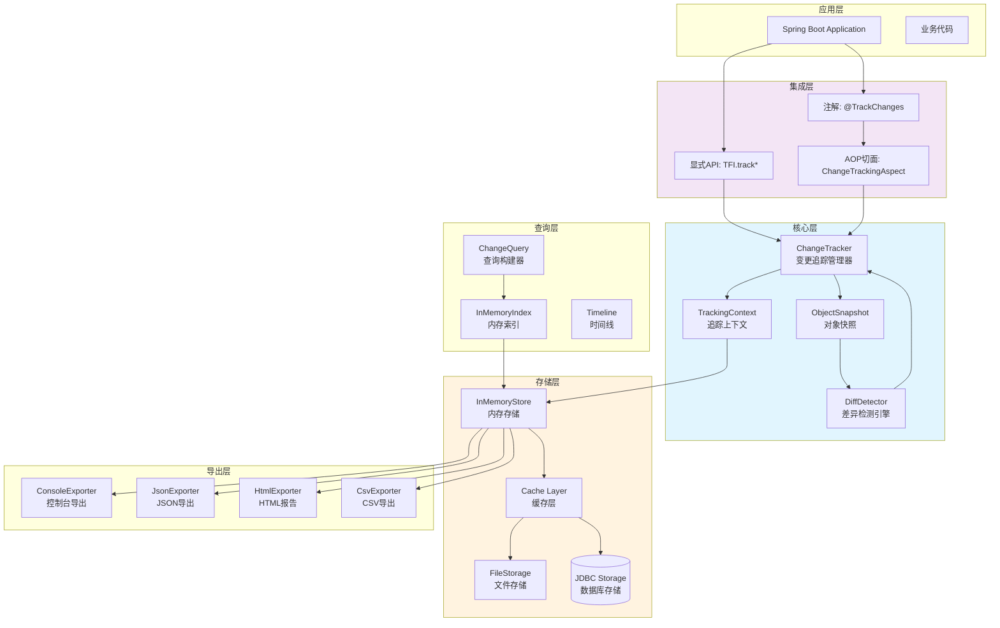
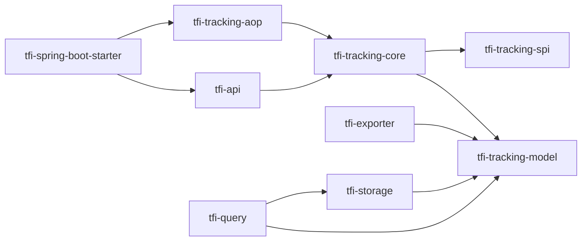
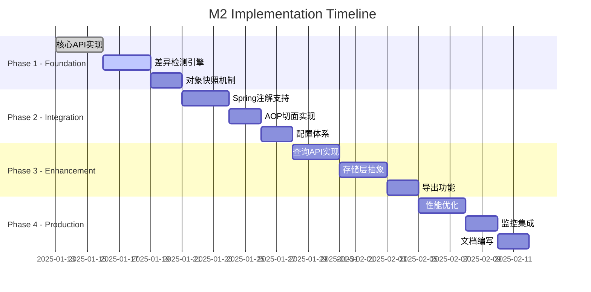

# TaskFlow Insight — M2 设计说明书

**版本**: v2.1.0-optimized  
**负责人**: 架构团队  
**状态**: 正式版（优化版）  
**日期**: 2025-01-10  
**评审**: 技术委员会  

---

## 1. 现状基线与证据分析

### 1.1 已有能力（源码证据）
| 组件 | 文件路径 | 状态 | 说明 |
|------|---------|------|------|
| **核心API门面** | `src/main/java/com/syy/taskflowinsight/api/TFI.java#TFI` | ✅ 已存在 | 需扩展变更追踪API |
| **会话管理** | `src/main/java/com/syy/taskflowinsight/model/Session.java#Session` | ✅ 已存在 | 线程级会话管理 |
| **任务节点** | `src/main/java/com/syy/taskflowinsight/model/TaskNode.java#TaskNode` | ✅ 已存在 | 支持消息关联 |
| **消息模型** | `src/main/java/com/syy/taskflowinsight/model/Message.java#Message` | ✅ 已存在 | 可扩展CHANGE类型 |
| **上下文管理** | `src/main/java/com/syy/taskflowinsight/context/ManagedThreadContext.java#ManagedThreadContext` | ✅ 已存在 | 线程上下文隔离 |
| **异步执行** | `src/main/java/com/syy/taskflowinsight/context/TFIAwareExecutor.java#TFIAwareExecutor` | ✅ 已存在 | 上下文传播 |
| **导出能力** | `src/main/java/com/syy/taskflowinsight/exporter/` | ✅ 已存在 | Console/JSON/Map |
| **Spring集成** | `src/main/java/com/syy/taskflowinsight/config/ContextMonitoringAutoConfiguration.java` | ✅ 已存在 | 自动配置基础 |
| **Actuator端点** | `src/main/java/com/syy/taskflowinsight/actuator/TaskflowContextEndpoint.java` | ✅ 已存在 | 监控端点 |

### 1.2 缺口清单（需M2实现）
| 组件 | 计划路径 | 优先级 | 依赖 |
|------|---------|--------|------|
| **变更追踪API** | TODO: `TFI.java#L500+` 扩展4个方法 | P0 | 无 |
| **变更检测引擎** | TODO: `com.syy.taskflowinsight.tracking.core.DiffDetector` | P0 | 反射API |
| **对象快照** | TODO: `com.syy.taskflowinsight.tracking.core.ObjectSnapshot` | P0 | 无 |
| **查询构建器** | TODO: `com.syy.taskflowinsight.tracking.query.ChangeQuery` | P1 | 索引结构 |
| **Spring注解** | TODO: `com.syy.taskflowinsight.tracking.annotation.@TrackChanges` | P0 | Spring AOP |
| **持久化层** | TODO: `com.syy.taskflowinsight.tracking.storage.SessionStorage` | P2 | JDBC/Redis |
| **HTML报告** | TODO: `com.syy.taskflowinsight.exporter.html.HtmlExporter` | P1 | 模板引擎 |
| **监控规则** | TODO: `com.syy.taskflowinsight.tracking.monitor.RuleEngine` | P2 | 规则引擎 |

## 2. 总体架构设计

### 2.1 分层架构图（Mermaid）



### 2.2 模块依赖关系



## 3. 核心模块设计

### 3.1 tracking-core 模块

**包路径**: `com.syy.taskflowinsight.tracking.core`

#### 3.1.1 核心组件设计

| 类名 | 职责 | 关键方法 | 性能要求 |
|------|------|---------|----------|
| **ChangeTracker** | 追踪生命周期管理 | `track()`, `detectChanges()`, `clear()` | <1ms/call |
| **DiffDetector** | 变更检测算法 | `detect()`, `compare()` | <200μs/field |
| **ObjectSnapshot** | 对象快照管理 | `capture()`, `restore()` | <500μs/object |
| **PropertyReader** | 属性访问抽象 | `read()`, `readAll()` | 缓存反射元数据 |
| **TrackingContext** | 线程级上下文 | `addSnapshot()`, `getChanges()` | ThreadLocal隔离 |

#### 3.1.2 变更追踪流程

```java
// 核心实现伪代码
public class ChangeTracker {
    private static final ThreadLocal<TrackingContext> contextHolder = new ThreadLocal<>();
    private static final PropertyCache propertyCache = new PropertyCache(); // 缓存优化
    
    public void track(String name, Object target, String... fields) {
        // 1. 获取或创建上下文
        TrackingContext ctx = getOrCreateContext();
        
        // 2. 创建对象快照（使用缓存的属性元数据）
        ObjectSnapshot snapshot = ObjectSnapshot.capture(
            name, target, fields, propertyCache
        );
        
        // 3. 存储到上下文
        ctx.addSnapshot(name, snapshot);
        
        // 4. 关联到当前TaskNode（如果存在）
        linkToCurrentTask(name);
    }
    
    public List<ChangeRecord> detectChanges() {
        TrackingContext ctx = getCurrentContext();
        List<ChangeRecord> changes = new ArrayList<>();
        
        for (TrackedObject tracked : ctx.getTrackedObjects()) {
            // 1. 捕获当前快照
            ObjectSnapshot current = ObjectSnapshot.capture(tracked);
            
            // 2. 检测差异（批量处理优化）
            List<FieldDiff> diffs = DiffDetector.detect(
                tracked.getLastSnapshot(), 
                current,
                ctx.getDiffStrategy() // 可插拔策略
            );
            
            // 3. 生成变更记录
            changes.addAll(createChangeRecords(tracked, diffs));
            
            // 4. 更新快照
            tracked.updateSnapshot(current);
        }
        
        return changes;
    }
}
```

### 3.2 tracking-model 模块

**包路径**: `com.syy.taskflowinsight.tracking.model`

#### 3.2.1 数据模型设计

```java
// 变更记录（核心模型）
@Data
@Builder
public class ChangeRecord {
    // What - 什么变了
    private String objectName;      // 对象名称
    private String objectType;      // 对象类型
    private String fieldName;       // 字段名
    private String fieldPath;       // 嵌套路径: "order.items[0].price"
    private Object oldValue;        // 旧值（脱敏后）
    private Object newValue;        // 新值（脱敏后）
    private ChangeType changeType;  // CREATE/UPDATE/DELETE
    
    // When - 何时变的
    private long timestamp;         // 变更时间
    private long sequenceNo;        // 序列号（保证顺序）
    
    // Where - 在哪变的
    private String nodeId;          // 关联TaskNode.id
    private String sessionId;       // 关联Session.sessionId
    private String threadName;      // 线程名
    private StackTraceElement source; // 源码位置
    
    // Who - 谁改的（M2-M1）
    private String userId;          // 用户ID
    private String userName;        // 用户名
    
    // Why - 为何改的（M2-M1）
    private String operation;       // 业务操作
    private Map<String, Object> context; // 业务上下文
}

// 对象快照
@Data
public class ObjectSnapshot {
    private String objectId;        // 对象标识
    private String objectName;      // 业务名称
    private Class<?> objectType;    // 对象类型
    private Map<String, Object> fieldValues; // 字段值（仅包含追踪字段）
    private long captureTime;       // 捕获时间
    private int version;            // 快照版本
    
    // 性能优化：增量存储（M2-M1）
    private ObjectSnapshot previousSnapshot;
    private boolean isDelta;       // 是否增量快照
}

// 变更类型枚举
public enum ChangeType {
    CREATE("新增"),
    UPDATE("更新"),
    DELETE("删除"),
    COLLECTION_ADD("集合新增"),
    COLLECTION_REMOVE("集合移除"),
    COLLECTION_UPDATE("集合更新");
    
    private final String description;
}
```

### 3.3 tracking-spring 模块

**包路径**: `com.syy.taskflowinsight.tracking.spring`

#### 3.3.1 注解设计

```java
// 方法级追踪注解
@Target(ElementType.METHOD)
@Retention(RetentionPolicy.RUNTIME)
@Documented
public @interface TrackChanges {
    String operation() default "";      // 操作名称
    boolean trackParams() default true; // 追踪参数
    boolean trackReturn() default false;// 追踪返回值
    String[] exclude() default {};      // 排除字段
    int maxDepth() default 2;          // 最大追踪深度
    boolean async() default false;      // 异步检测
}

// 参数级追踪注解
@Target(ElementType.PARAMETER)
@Retention(RetentionPolicy.RUNTIME)
@Documented
public @interface Track {
    String value() default "";          // 对象名称
    String[] fields() default {};       // 追踪字段
    boolean sensitive() default false;  // 敏感数据标记
}
```

#### 3.3.2 AOP切面实现

```java
@Aspect
@Component
@ConditionalOnProperty(name = "tfi.tracking.enabled", havingValue = "true")
public class ChangeTrackingAspect {
    
    @Autowired
    private ChangeTracker changeTracker;
    
    @Around("@annotation(trackChanges)")
    public Object trackMethod(ProceedingJoinPoint pjp, TrackChanges trackChanges) 
            throws Throwable {
        
        // 1. 设置操作上下文
        String operation = StringUtils.defaultIfEmpty(
            trackChanges.operation(), 
            pjp.getSignature().getName()
        );
        
        // 2. 追踪方法参数
        if (trackChanges.trackParams()) {
            trackMethodParameters(pjp);
        }
        
        try {
            // 3. 执行目标方法
            Object result = pjp.proceed();
            
            // 4. 追踪返回值
            if (trackChanges.trackReturn() && result != null) {
                changeTracker.track("return", result);
            }
            
            // 5. 检测变更（同步或异步）
            if (trackChanges.async()) {
                CompletableFuture.runAsync(() -> detectAndRecord());
            } else {
                detectAndRecord();
            }
            
            return result;
            
        } catch (Throwable e) {
            // 6. 记录异常信息
            recordException(operation, e);
            throw e;
            
        } finally {
            // 7. 清理上下文（可配置）
            if (autoCleanup) {
                changeTracker.clearContext();
            }
        }
    }
}
```

### 3.4 tracking-storage 模块

**包路径**: `com.syy.taskflowinsight.tracking.storage`

#### 3.4.1 存储抽象层

```java
// 存储抽象接口
public interface ChangeStorage {
    void save(ChangeRecord record);
    void saveBatch(List<ChangeRecord> records);
    List<ChangeRecord> query(ChangeQuery query);
    void cleanup(Duration retention);
    StorageStats getStats();
}

// 多级存储实现
@Component
public class TieredChangeStorage implements ChangeStorage {
    private final InMemoryStorage l1Cache;  // L1: 内存缓存
    private final FileStorage l2Storage;    // L2: 本地文件
    private final JdbcStorage l3Storage;    // L3: 数据库
    
    @Override
    public void save(ChangeRecord record) {
        // 1. 写入L1缓存
        l1Cache.save(record);
        
        // 2. 异步写入L2/L3
        if (shouldPersist(record)) {
            persistAsync(record);
        }
    }
    
    @Override
    public List<ChangeRecord> query(ChangeQuery query) {
        // 1. 先查L1
        List<ChangeRecord> results = l1Cache.query(query);
        
        // 2. 不足则查L2/L3
        if (results.size() < query.getLimit()) {
            results.addAll(queryLowerTiers(query));
        }
        
        return results;
    }
}
```

#### 3.4.2 数据库设计（M2-M2）

```sql
-- 变更记录主表
CREATE TABLE tfi_change_records (
    id BIGINT PRIMARY KEY AUTO_INCREMENT,
    session_id VARCHAR(36) NOT NULL,
    node_id VARCHAR(36),
    object_name VARCHAR(100) NOT NULL,
    object_type VARCHAR(200),
    field_name VARCHAR(100) NOT NULL,
    field_path VARCHAR(500),
    old_value TEXT,
    new_value TEXT,
    change_type VARCHAR(20) NOT NULL,
    timestamp BIGINT NOT NULL,
    sequence_no BIGINT,
    user_id VARCHAR(50),
    operation VARCHAR(100),
    context JSON,
    created_at TIMESTAMP DEFAULT CURRENT_TIMESTAMP,
    
    INDEX idx_session (session_id),
    INDEX idx_timestamp (timestamp),
    INDEX idx_object (object_name, field_name),
    INDEX idx_user_operation (user_id, operation),
    INDEX idx_created (created_at)
) PARTITION BY RANGE (UNIX_TIMESTAMP(created_at)) (
    PARTITION p_202501 VALUES LESS THAN (UNIX_TIMESTAMP('2025-02-01')),
    PARTITION p_202502 VALUES LESS THAN (UNIX_TIMESTAMP('2025-03-01'))
);

-- 对象快照表（可选）
CREATE TABLE tfi_object_snapshots (
    id BIGINT PRIMARY KEY AUTO_INCREMENT,
    object_id VARCHAR(100) NOT NULL,
    object_name VARCHAR(100),
    snapshot_data JSON,
    capture_time BIGINT NOT NULL,
    session_id VARCHAR(36),
    version INT DEFAULT 1,
    
    INDEX idx_object_time (object_id, capture_time),
    INDEX idx_session (session_id)
);

-- 审计日志表
CREATE TABLE tfi_audit_logs (
    id BIGINT PRIMARY KEY AUTO_INCREMENT,
    export_id VARCHAR(36),
    export_time TIMESTAMP DEFAULT CURRENT_TIMESTAMP,
    export_format VARCHAR(20),
    exported_by VARCHAR(50),
    record_count INT,
    file_path VARCHAR(500),
    
    INDEX idx_export_time (export_time)
);
```

## 4. 关键API设计

### 4.1 公共API扩展

```java
// 扩展 TFI.java（src/main/java/com/syy/taskflowinsight/api/TFI.java#L500+）
public final class TFI {
    
    // ========== 变更追踪 API（M2新增） ==========
    
    /**
     * 追踪对象变更
     * @param name 对象名称（业务标识）
     * @param target 目标对象
     * @param fields 要追踪的字段（为空则追踪所有public字段）
     */
    public static void track(String name, Object target, String... fields) {
        if (!isEnabled() || target == null) return;
        
        try {
            ChangeTracker.getInstance().track(name, target, fields);
        } catch (Throwable t) {
            handleInternalError("Failed to track object: " + name, t);
        }
    }
    
    /**
     * 批量追踪对象
     * @param targets 对象映射 (name -> object)
     */
    public static void trackAll(Map<String, Object> targets) {
        if (!isEnabled() || targets == null) return;
        
        targets.forEach(TFI::track);
    }
    
    /**
     * 获取当前线程的所有变更
     * @return 变更记录列表
     */
    public static List<ChangeRecord> getChanges() {
        if (!isEnabled()) return Collections.emptyList();
        
        try {
            return ChangeTracker.getInstance().detectChanges();
        } catch (Throwable t) {
            handleInternalError("Failed to get changes", t);
            return Collections.emptyList();
        }
    }
    
    /**
     * 清除所有追踪
     */
    public static void clearAllTracking() {
        if (!isEnabled()) return;
        
        try {
            ChangeTracker.getInstance().clearAll();
        } catch (Throwable t) {
            handleInternalError("Failed to clear tracking", t);
        }
    }
    
    /**
     * 查询变更记录
     * @param query 查询条件
     * @return 符合条件的变更记录
     */
    public static List<ChangeRecord> queryChanges(ChangeQuery query) {
        if (!isEnabled() || query == null) return Collections.emptyList();
        
        try {
            return ChangeTracker.getInstance().query(query);
        } catch (Throwable t) {
            handleInternalError("Failed to query changes", t);
            return Collections.emptyList();
        }
    }
    
    /**
     * 获取对象在指定时刻的状态
     * @param objectName 对象名称
     * @param timestamp 时间戳
     * @return 历史状态
     */
    public static ObjectState getStateAt(String objectName, long timestamp) {
        if (!isEnabled()) return null;
        
        try {
            return ChangeTracker.getInstance().getStateAt(objectName, timestamp);
        } catch (Throwable t) {
            handleInternalError("Failed to get state at " + timestamp, t);
            return null;
        }
    }
}
```

### 4.2 REST API设计（可选）

```yaml
openapi: 3.0.0
info:
  title: TFI Change Tracking API
  version: 2.0.0

paths:
  /api/tfi/changes:
    get:
      summary: 查询变更记录
      parameters:
        - name: sessionId
          in: query
          schema:
            type: string
        - name: objectName
          in: query
          schema:
            type: string
        - name: from
          in: query
          schema:
            type: integer
            format: int64
        - name: to
          in: query
          schema:
            type: integer
            format: int64
        - name: limit
          in: query
          schema:
            type: integer
            default: 100
      responses:
        200:
          description: 变更记录列表
          content:
            application/json:
              schema:
                type: array
                items:
                  $ref: '#/components/schemas/ChangeRecord'
  
  /api/tfi/history/{objectName}:
    get:
      summary: 获取对象历史
      parameters:
        - name: objectName
          in: path
          required: true
          schema:
            type: string
      responses:
        200:
          description: 对象历史轨迹
  
  /api/tfi/export:
    post:
      summary: 导出审计日志
      requestBody:
        content:
          application/json:
            schema:
              type: object
              properties:
                format:
                  type: string
                  enum: [json, csv, markdown]
                query:
                  $ref: '#/components/schemas/ChangeQuery'
      responses:
        200:
          description: 导出文件
```

## 5. 性能优化策略

### 5.1 性能目标与测量

| 操作 | 目标延迟 | 测量方法 | 优化策略 |
|------|---------|---------|----------|
| track() | <1ms | JMH基准测试 | 1.缓存反射元数据<br>2.懒加载初始化<br>3.对象池复用 |
| detectChanges() | <10ms/对象 | 压力测试 | 1.并行检测<br>2.增量对比<br>3.跳过未变更 |
| query() | <200ms@10k | 性能测试 | 1.内存索引<br>2.分页查询<br>3.结果缓存 |
| export() | <5s@100k | 集成测试 | 1.流式处理<br>2.异步导出<br>3.压缩传输 |

### 5.2 优化实现

```java
// 性能优化示例
@Component
public class OptimizedChangeTracker {
    
    // 1. 属性元数据缓存
    private static final LoadingCache<Class<?>, PropertyMetadata> propertyCache = 
        Caffeine.newBuilder()
            .maximumSize(1000)
            .expireAfterAccess(10, TimeUnit.MINUTES)
            .build(PropertyMetadata::analyze);
    
    // 2. 对象池复用
    private static final ObjectPool<ObjectSnapshot> snapshotPool = 
        new GenericObjectPool<>(new ObjectSnapshotFactory());
    
    // 3. 批量处理优化
    public List<ChangeRecord> detectChangesBatch(List<TrackedObject> objects) {
        return objects.parallelStream()
            .map(this::detectSingleObjectChanges)
            .flatMap(List::stream)
            .collect(Collectors.toList());
    }
    
    // 4. 增量检测优化
    public List<ChangeRecord> detectIncremental(TrackedObject obj) {
        if (!obj.isDirty()) {
            return Collections.emptyList(); // 跳过未变更对象
        }
        
        // 仅检测标记为dirty的字段
        return detectDirtyFields(obj);
    }
}
```

## 6. 测试策略

### 6.1 测试覆盖矩阵

| 测试类型 | 覆盖范围 | 工具 | 目标 |
|---------|---------|------|------|
| 单元测试 | 核心逻辑 | JUnit 5 + Mockito | >90% |
| 集成测试 | Spring集成 | @SpringBootTest | >80% |
| 性能测试 | 关键路径 | JMH + JMeter | 满足SLA |
| 兼容性测试 | JDK/Spring版本 | TestContainers | 全版本通过 |
| 安全测试 | 敏感数据 | OWASP工具 | 0高危漏洞 |

### 6.2 测试用例示例

```java
@SpringBootTest
class ChangeTrackingIntegrationTest {
    
    @Test
    void testBasicTracking() {
        // Given
        Order order = new Order("001", "PENDING", 100.0);
        
        // When
        TFI.track("order", order, "status", "amount");
        order.setStatus("PAID");
        order.setAmount(90.0);
        List<ChangeRecord> changes = TFI.getChanges();
        
        // Then
        assertThat(changes).hasSize(2);
        assertThat(changes)
            .extracting(ChangeRecord::getFieldName, ChangeRecord::getOldValue, ChangeRecord::getNewValue)
            .containsExactlyInAnyOrder(
                tuple("status", "PENDING", "PAID"),
                tuple("amount", 100.0, 90.0)
            );
    }
    
    @Test
    @PerfTest(invocations = 10000, threads = 10)
    void performanceTest() {
        // 性能基准测试
        long start = System.nanoTime();
        
        ComplexObject obj = generateComplexObject();
        TFI.track("complex", obj);
        modifyObject(obj);
        List<ChangeRecord> changes = TFI.getChanges();
        
        long elapsed = System.nanoTime() - start;
        
        // 断言：单次操作 < 10ms
        assertThat(elapsed).isLessThan(10_000_000L);
    }
}
```

## 7. 生产就绪性

### 7.1 监控与可观测性

```yaml
# Micrometer指标
tfi.tracking.objects.count         # 追踪对象数
tfi.tracking.changes.count         # 变更记录数
tfi.tracking.detect.duration       # 检测耗时
tfi.tracking.memory.usage          # 内存占用
tfi.tracking.errors.count          # 错误计数

# 日志规范
[TRACKING] Started tracking object: {} [DEBUG]
[TRACKING] Detected {} changes in {}ms [INFO]
[TRACKING] Performance degradation detected [WARN]
[TRACKING] Failed to persist changes [ERROR]
```

### 7.2 灰度发布策略

```java
@Configuration
@ConditionalOnProperty(name = "tfi.tracking.enabled")
public class TrackingGrayScaleConfig {
    
    @Bean
    public GrayScaleStrategy grayScaleStrategy() {
        return GrayScaleStrategy.builder()
            .stage(Stage.ALPHA)    // Alpha: 开发环境
            .percentage(1)         // 1%流量
            .whitelist(Arrays.asList("test-user"))
            .enableEmergencySwitch(true)
            .rollbackThreshold(0.1) // 错误率>10%自动回滚
            .build();
    }
}
```

### 7.3 应急预案

| 场景 | 检测条件 | 自动响应 | 手动操作 |
|------|---------|---------|----------|
| 内存溢出 | heap>90% | 禁用追踪，清理缓存 | 重启应用 |
| 性能退化 | P95>100ms | 降级到采样模式(10%) | 调整配置 |
| 存储故障 | 连接失败3次 | 切换到内存存储 | 检查数据库 |
| 异常激增 | 错误率>5% | 熔断器开启 | 查看日志 |

## 8. 配置参考

```yaml
tfi:
  tracking:
    enabled: true                    # 总开关
    auto-cleanup: true              # 自动清理
    
    performance:
      max-tracked-objects: 1000     # 最大追踪对象数
      max-depth: 5                   # 最大嵌套深度
      cache-size: 10000             # 缓存大小
      async-threshold: 100          # 异步阈值
      
    storage:
      type: tiered                  # memory/file/jdbc/tiered
      memory:
        max-size: 100MB
        eviction-policy: LRU
      file:
        directory: ./tfi-changes
        rolling-policy: daily
      jdbc:
        batch-size: 100
        flush-interval: 5s
        
    security:
      masking:
        enabled: true
        patterns:
          - password
          - token
          - secret
          - "*Key"
      whitelist:
        enabled: false
        fields: []
        
    monitoring:
      metrics-enabled: true
      slow-threshold: 50ms
      alert-threshold: 100ms
      
    export:
      formats: [json, csv, markdown]
      max-export-size: 100MB
      compression: true
```

## 9. 实施路线图



## 10. 附录

### 10.1 决策记录

| 决策点 | 选项 | 选择 | 理由 |
|--------|------|------|------|
| 差异检测算法 | 反射/字节码/代理 | 反射+缓存 | 实现简单，性能可接受 |
| 存储方案 | 单层/多层 | 多层（L1/L2/L3） | 平衡性能与成本 |
| API风格 | 流式/声明式 | 声明式 | 符合TFI现有风格 |
| 序列化格式 | JSON/Protobuf/Avro | JSON | 通用性好，易调试 |

### 10.2 参考链接

- [TFI源码](src/main/java/com/syy/taskflowinsight/)
- [Spring AOP文档](https://docs.spring.io/spring-framework/docs/current/reference/html/core.html#aop)
- [JaVers设计](https://javers.org/documentation/)
- [Micrometer指标](https://micrometer.io/docs)

### 10.3 TODO清单

- [ ] 确认HtmlExporter状态 (D+1)
- [ ] 实现track() API (D+3)
- [ ] 完成DiffDetector (D+5)
- [ ] Spring注解支持 (D+8)
- [ ] 性能基准测试 (D+10)
- [ ] 生产环境验证 (D+15)

---

**文档版本历史**

| 版本 | 日期 | 作者 | 变更说明 |
|------|------|------|----------|
| 2.1.0 | 2025-01-10 | 架构团队 | 融合GPT5+Opus4.1的优化版 |
| 2.0.0 | 2025-01-10 | Opus4.1 | 初始版本 |