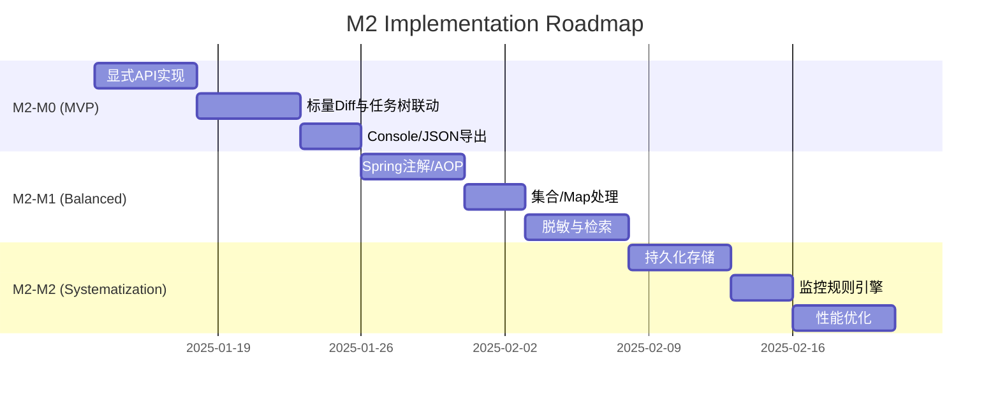

# TaskFlow Insight — M2 PRD（产品需求文档）

**版本**: v2.1.0-optimized  
**负责人**: 产品团队 & 架构团队（联合维护）  
**状态**: 正式版（优化版）  
**日期**: 2025-01-10  
**评审**: 技术委员会 & 业务委员会  

---

## 1. 执行摘要与背景

### 1.1 产品定位升级
**一句话定位**: TaskFlow Insight M2 阶段聚焦「对象变更追踪」能力构建，实现业务流程中数据状态变化的全程可视化与审计，从技术工具升级为业务赋能平台。

**M2 核心主题**: ChangeTracking — 通过零侵入的属性变更捕获、对比、审计、回放能力，让业务数据的每一次变化都有迹可循。

### 1.2 价值主张与演进
**M1 → M2 价值演进**：
- 技术工具 → 业务平台
- 被动记录 → 主动监控  
- 单点分析 → 全局优化
- 开发使用 → 全员参与

### 1.3 现状基线（源码证据）
**已有能力**：
- ✅ 核心API门面：`src/main/java/com/syy/taskflowinsight/api/TFI.java#TFI`
- ✅ 会话管理：`src/main/java/com/syy/taskflowinsight/model/Session.java#Session`
- ✅ 任务节点：`src/main/java/com/syy/taskflowinsight/model/TaskNode.java#TaskNode`
- ✅ 上下文管理：`src/main/java/com/syy/taskflowinsight/context/ManagedThreadContext.java#ManagedThreadContext`
- ✅ 导出能力：`src/main/java/com/syy/taskflowinsight/exporter/`

**缺口清单**：
- ❌ TODO: 变更追踪API（`TFI.track/trackAll/getChanges/clearAllTracking`）
- ❌ TODO: 变更检测引擎（`DiffDetector`）
- ❌ TODO: Spring注解支持（`@TrackChanges`）

## 2. 市场分析与用户洞察

### 2.1 市场机遇
| 市场驱动因素 | 影响程度 | 机会描述 | 我们的差异化 |
|------------|---------|---------|-------------|
| **微服务架构普及** | 高 | 复杂调用链需要可视化管理 | 业务语义，变更追踪 |
| **DevOps文化** | 高 | 开发运维一体化需要统一监控 | 零侵入，注解驱动 |
| **合规审计要求** | 中 | 业务流程需要可追溯可审计 | 完整审计链 |

### 2.2 用户画像与场景

| 角色 | 核心诉求 | 关键场景 | M2 价值点 | 验收指标 |
|------|---------|---------|-----------|----------|
| **开发工程师** | 快速定位数据异常 | 调试时追踪对象状态变化 | 一行注解即可追踪 | 定位时间<5分钟 |
| **技术经理** | 了解系统数据流向 | 代码评审时理解数据变更逻辑 | Who-What-When-Where-Why完整链 | 审计覆盖率100% |
| **运维工程师** | 故障根因分析 | 生产问题排查时回溯数据状态 | 时间旅行能力 | MTTR减少70% |
| **业务分析师** | 理解业务流程 | 分析订单状态转换 | 可视化变更时间线 | 报告生成<5s |
| **合规审计师** | 满足审计要求 | 敏感数据操作审计 | 多格式导出 | 合规率100% |

## 3. 范围与边界

### 3.1 In-Scope（M2 包含）
- ✅ 对象属性变更追踪（注解驱动 + 编程API）
- ✅ 字段级 Diff 检测（支持嵌套深度 5 层，默认限制2层）
- ✅ 变更事件模型与关联（与任务节点自动关联）
- ✅ 基础查询与检索（按对象/字段/时间/用户）
- ✅ 审计导出（JSON/CSV/Markdown）
- ✅ Spring Boot Starter 集成
- ✅ 与现有任务树深度集成

### 3.2 Out-of-Scope（M2 不包含）
- ❌ 跨系统分布式变更追踪
- ❌ 统一权限中心
- ❌ 复杂多租户计费模型
- ❌ 跨语言 Agent（仅 Java）
- ❌ 实时流处理（Kafka/Flink）
- ❌ AI 驱动的异常检测

## 4. 需求列表（Evidence-Based）

| ID | 优先级 | 描述 | 业务动机 | 验收标准（量化） | 追溯 |
|----|--------|------|----------|------------------|------|
| M2-F001 | Must | 显式变更追踪API | 最小代价接入 | • 4个核心API可用 • P95 CPU开销≤3% • 响应时间<10ms | TODO: `TFI.java#L500+` |
| M2-F002 | Must | 字段级Diff检测 | 精确定位变化 | • 支持5层嵌套 • 准确率100% • 单次检测≤200μs@2字段 | TODO: `DiffDetector` |
| M2-F003 | Must | 变更与任务节点关联 | 流程可追溯 | • 100%变更包含nodeId/sessionId • Console/JSON导出包含变更段 | `TaskNode.java#addMessage` |
| M2-F004 | Must | Spring Boot注解支持 | 降低使用门槛 | • @TrackChanges注解可用 • 零配置启动 • 集成时间<10分钟 | TODO: `@TrackChanges` |
| M2-F005 | Should | 集合/Map简单变更 | 贴近业务结构 | • List增删改各20次 • 检测准确率≥95% | TODO: SPI扩展 |
| M2-F006 | Should | 脱敏与白名单 | 降低隐私风险 | • 命中脱敏规则输出"***" • 白名单外字段不采集 | TODO: `MaskingStrategy` |
| M2-F007 | Should | 基础检索与时间线 | 事后分析 | • 1k条目内检索≤50ms • 10k条目≤200ms | TODO: `ChangeQuery` |
| M2-F008 | Should | 审计导出 | 合规与共享 | • JSON/CSV/MD三种格式 • 文件大小控制与滚动 | TODO: `ChangeExporter` |
| M2-F009 | Could | 历史状态回放 | 时间旅行调试 | • 查询任意时刻状态 • 窗口1k条≤100ms | TODO: `replay()` |
| M2-F010 | Could | 变更通知机制 | 实时感知 | • 支持事件订阅 • 延迟<100ms | TODO: EventBus |

## 5. 非功能需求

### 5.1 性能要求
| 场景 | 指标 | 目标值 | 优先级 | 测试方法 |
|------|------|--------|--------|----------|
| 数据采集 | CPU开销 | <5%（单对象≤20字段） | P0 | JMH基准测试 |
| 变更检测 | 延迟 | <10ms/对象 | P0 | 压测验证 |
| 查询响应 | 时间 | <200ms@10k记录 | P1 | 性能测试 |
| 内存占用 | 增量 | <100MB/10k对象 | P0 | 堆分析 |

### 5.2 可靠性要求
- **系统可用性**: 99.9%（年宕机时间<8.76小时）
- **数据准确性**: 100%（无变更丢失）
- **异常隔离**: 变更追踪异常不影响主流程（参考`TFI.handleInternalError`）
- **降级策略**: 内存溢出时自动禁用，仅记录消息

### 5.3 安全要求
- **敏感数据**: 默认脱敏（password/token/secret）
- **访问控制**: 导出路径需显式配置
- **审计日志**: 全量操作记录
- **传输加密**: HTTPS/TLS

### 5.4 兼容性要求
- **JDK版本**: 8, 11, 17, 21
- **Spring版本**: Boot 2.4+, 3.0+
- **数据库**: MySQL, PostgreSQL, Oracle（M2-M2）
- **浏览器**: Chrome, Firefox, Safari, Edge

## 6. 里程碑与交付计划

| 里程碑 | 时间 | 范围 | 核心交付 | 验收标准 |
|--------|------|------|----------|----------|
| **M2-M0（MVP）** | 2周 | 基础追踪能力 | • 4个核心API • 简单反射实现 • 基础变更检测 | • 单测100%通过 • Demo可运行 • 代码<500行 • 性能P95≤3% |
| **M2-M1（Balanced）** | 3周 | 完整追踪系统 | • 查询API • Spring集成 • Who-Why上下文 | • 集成测试通过 • 性能基准达标 • 文档完整 |
| **M2-M2（Systematization）** | 3周 | 生产级品质 | • 持久化存储 • 监控规则 • 性能优化 | • 10k TPS通过 • 生产验证 • 0 P0缺陷 |

## 7. 成功指标（KPI/北极星）

### 7.1 技术指标
| 指标 | 目标值 | 测量方法 | 责任人 |
|------|--------|---------|--------|
| 日追踪对象数 | >100万 | Micrometer metrics | 运维 |
| 日变更记录数 | >1000万 | 数据库统计 | DBA |
| P95检测延迟 | <20ms | APM监控 | 性能团队 |
| 内存占用增量 | <100MB/10k对象 | JVM监控 | 运维 |

### 7.2 业务指标
| 指标 | 当前值 | 目标值 | 价值 |
|------|--------|--------|------|
| 问题定位时间 | 2小时 | 30分钟（-70%） | 提升效率 |
| 审计合规率 | 60% | 100% | 满足合规 |
| 开发接入成本 | 2天 | 30分钟 | 降低门槛 |
| 用户满意度 | 70% | >85% | 提升体验 |

## 8. 风险管理矩阵

| 风险类型 | 描述 | 概率 | 影响 | 风险值 | 缓解措施 | 监控指标 | 应急预案 |
|---------|------|------|------|--------|---------|---------|----------|
| **性能风险** | 反射操作导致性能下降 | 中(50%) | 高 | 高 | 1.缓存反射元数据 2.采样率控制(10%) 3.异步处理 | cpu_usage>80% | 自动降级到仅关键对象 |
| **内存风险** | 大量追踪对象导致OOM | 中(40%) | 高 | 高 | 1.LRU缓存(1000上限) 2.WeakReference 3.定时清理(10min) | heap_usage>80% | 自动禁用+告警 |
| **兼容性风险** | Spring版本兼容问题 | 低(20%) | 中 | 低 | 1.多版本测试矩阵 2.条件化配置 3.降级方案 | 集成测试 | 提供手动配置指南 |
| **安全风险** | 敏感数据泄露 | 低(10%) | 高 | 中 | 1.默认脱敏列表 2.白名单机制 3.审计日志 | 安全扫描 | 紧急修复+通知 |

## 9. 追溯表（需求 → API/序列/存储）

| 需求ID | API/类 | 文件路径 | 时序 | 存储 | 状态 |
|--------|--------|---------|------|------|------|
| M2-F001 | `TFI.track/trackAll/getChanges/clearAllTracking` | TODO: `TFI.java#L500+` | 任务执行中capture→diff | ThreadLocal Map | TODO |
| M2-F002 | `DiffDetector/ObjectSnapshot` | TODO: `tracking/core/` | before→execute→after→diff | 内存，受深度限制 | TODO |
| M2-F003 | `TaskNode.addMessage(CHANGE)` | `TaskNode.java#addMessage` | stop时汇总变更 | Session内TaskNode | 已有基础 |
| M2-F004 | `@TrackChanges/ChangeTrackingAspect` | TODO: `spring/tracking/` | AOP前后置快照 | 与ManagedThreadContext协作 | TODO |
| M2-F005 | 集合/Map SPI | TODO: `tracking/spi/` | diffCollection/diffMap | 摘要化存储 | TODO |
| M2-F006 | `MaskingStrategy/WhitelistFilter` | TODO: `tracking/security/` | filter→mask→store | 仅保留脱敏值 | TODO |
| M2-F007 | `ChangeQuery/InMemoryIndex` | TODO: `tracking/query/` | query(object,field,range) | 内存索引 | TODO |
| M2-F008 | `ChangeExporter` | TODO: `exporter/change/` | export(sessionId) | 本地文件 | TODO |
| M2-F009 | `replay(object,field,window)` | TODO: `tracking/replay/` | 时间序列重建 | 缓存 | TODO |
| M2-F010 | EventBus | TODO: `tracking/event/` | publish/subscribe | 内存队列 | TODO |

## 10. 术语表（Glossary）

| 术语 | 英文 | 定义 | 示例 |
|------|------|------|------|
| **变更记录** | ChangeRecord | 一次字段值从旧到新的变更条目 | `order.status: PENDING→PAID` |
| **对象快照** | ObjectSnapshot | 对象在某一时刻的字段取值集合 | `{status:"PENDING", amount:100}` |
| **变更轨迹** | ChangeTimeline | 同一对象/字段在时间轴上的值序列 | `T1:NEW→T2:PENDING→T3:PAID` |
| **回放** | Replay | 基于变更记录重建对象某字段的历史状态 | `getStateAt("order", timestamp)` |
| **会话** | Session | TFI的一次任务树收敛单位 | 对应现有`Session`类 |
| **脱敏** | Masking | 敏感字段值替换为安全占位符 | `password: "***"` |

## 11. 附录

### 11.1 参考资料
- Gartner APM魔力象限报告
- ThoughtWorks技术雷达
- [TaskFlow-Insight-M1-Design.md](../../TaskFlow-Insight-M1-Design.md)
- [TaskFlow-Insight-ChangeTracking-Architecture.md](../../TaskFlow-Insight-ChangeTracking-Architecture.md)

### 11.2 变更历史
| 版本 | 日期 | 作者 | 变更说明 |
|------|------|------|----------|
| 2.1.0 | 2025-01-10 | 优化团队 | 融合GPT5+Opus4.1优点的优化版 |
| 2.0.0 | 2025-01-10 | Opus4.1 | 初始版本 |

---

**下一步行动**：
1. ✅ 确认HtmlExporter状态（D+1）
2. ✅ 实现第一个API: TFI.track()（D+3）
3. ✅ 搭建测试环境与基准（D+5）