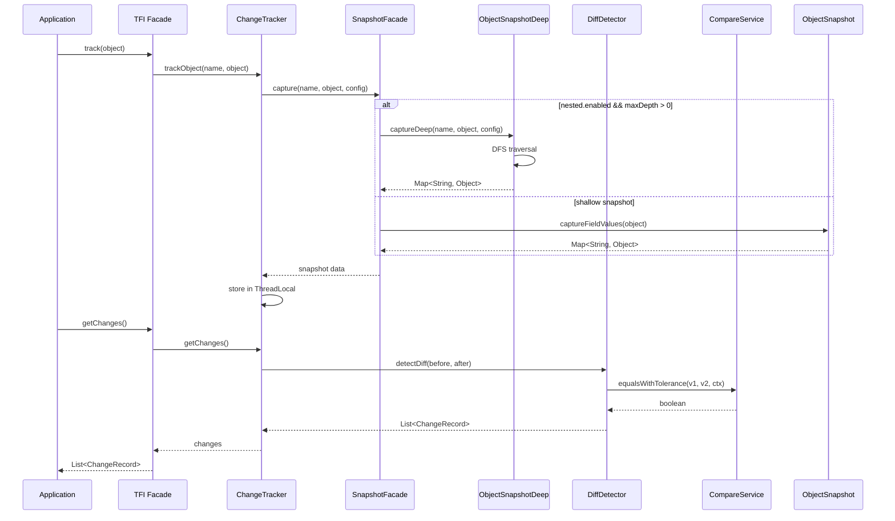

# TaskFlow Insight — M1 + M2.1 设计说明（Design）

## 文档信息
| 属性 | 值 |
|------|-----|
| Version | v2.0.0‑M2‑m1 |
| Owner | 架构/研发 |
| Status | Scope-locked for M1 + M2.1 |
| Date | 2025‑01‑11 |

---

## 1. 概述

本设计说明基于《TaskFlow‑Insight‑M2‑m1阶段‑PRD.md》的需求，结合当前代码实现（M0 基线与部分 M1 能力），给出“最佳停止点”方案：M1 核心能力 + M2.1 最小产品化（Starter 与基础运维可见性）。目标是在保持 M0 兼容与性能护栏的前提下，完成 PRD 的 P0 能力与 P1（Store/Export 简版），并提供 Starter 封装与基础诊断端点。所有 M2‑m2 的高阶能力仅作为展望，不在本阶段实现或默认启用。

范围（M1 + M2.1）：
- M1（P0）：嵌套对象扁平化（深度/循环护栏）、集合/Map 摘要（size‑only 降级，示例 STRING 排序）、自定义消息格式（模板）、自定义比较规则（绝对容差）、护栏与监控、Spring 集成基础。
- M1（P1）：内存 Store+Query（Caffeine）、文件导出（JSON/JSONL，基本元数据）。
- M2.1（最小产品化）：Spring Boot Starter 封装、基础 Actuator 只读端点（effective‑config），预热（preload）+ 有界缓存（PathMatcher/规则）与最小指标。

非目标（留待 M2‑m2 或后续）：逐项深度集合 Diff、导入校验、Locale/重音折叠比较、复杂 Comparator/Repository、自定义 Deep‑Merge/Profile、并行 DFS、复杂导出并发（StripedLock/文件锁回退/重试）。

---

## 2. 系统架构

逻辑分层（与 PRD 6.1 一致）：

```
┌─────────────────────────────────────┐
│         Application Layer           │
├─────────────────────────────────────┤
│     TFI API (Facade Pattern)        │
├──────────┬──────────┬───────────────┤
│ Tracking │ Format   │  Compare      │
│  Core    │ Engine   │  Strategy     │
├──────────┴──────────┴───────────────┤
│    Storage & Query (Optional)       │
├─────────────────────────────────────┤
│   Spring Boot Integration           │
└─────────────────────────────────────┘
```

关键模块：
- Tracking Core：对象快照/对比/结果写入（现有 `ChangeTracker`、`DiffDetector`、`ObjectSnapshot`）。
- Format Engine：模板化格式输出（新增轻量模板引擎与选择器）。
- Compare Strategy：数值/时间/字符串的规范化与容差（简化 Context）。
- Storage & Query：可选的内存存储与查询（Caffeine），文件导出。
- Spring Integration：AutoConfiguration、@ConfigurationProperties（使用 Spring 标准 profiles）、监控与护栏。

---

## 3. 模块设计

### 3.1 Tracking Core（变更追踪内核）

现状：
- `ChangeTracker`：线程级快照管理（ThreadLocal），对比与刷新；已在 `TFI.stop()` 等处对接。
- `DiffDetector`：按字段字典序对比，当前支持标量与 Date 归一化；不含嵌套/集合摘要。
- `ObjectSnapshot`：仅采集标量字段、简易反射缓存（上限 1024 类），字符串转义与截断（默认 8192）。

#### 3.1.1 核心组件架构

```
TFI (Facade)
  └─> ChangeTracker
        ├─> SnapshotFacade (新)
        │     ├─> ObjectSnapshot (标量)
        │     └─> ObjectSnapshotDeep (嵌套)
        │           ├─> PathMatcherCache
        │           └─> CollectionSummary
        └─> DiffDetector
              ├─> CompareService
              └─> ValueReprUtil
```

#### 3.1.2 数据流序列图



设计变更：
- 类关系与职责：
  - 采用组合而非继承：新增 `ObjectSnapshotDeep` 与现有 `ObjectSnapshot` 并列，`ChangeTracker`/`DiffDetector` 通过组合调用两者；
  - `ObjectSnapshot` 继续负责“标量浅快照”；`ObjectSnapshotDeep` 负责“嵌套展平 + 集合摘要”；避免静态继承污染与二义性。
- 嵌套扁平化：提供 `ObjectSnapshotDeep.captureDeep(String rootName, Object target, DeepConfig cfg) : Map<String,Object>`，输出点分路径 `a.b.c`；
  - DFS 实现：
    - 入口：从 `target` 入栈（path=""），节点进入前先做“白/黑名单”预判（Ant 匹配，命中黑名单则剪枝，命中白名单才继续展开；若白名单为空，默认允许）；
    - 类型分派：
      - 标量/枚举/日期：终止展开，放入 `path`→值；
      - Bean（getter/字段可反射）：对子属性入栈；
      - 数组/集合/Map：不展开为索引路径，委托 `CollectionSummary` 生成摘要对象，写入 `path`→摘要（见 3.2）；
      - 二进制（byte[]/ByteBuffer）：写入长度/可选短哈希摘要；不直接支持 InputStream（单次消费流），如需支持需调用方先读取为 byte[] 或自定义提取器计算摘要。
    - 子属性遍历顺序（确定性保证）：
      - Bean 子属性默认基于 `getDeclaredFields()`（含父类，最多 2 层）收集；按“字段名字典序（NAME_ASC）”排序后遍历，确保跨 JVM 一致；
      - 当某些字段不可访问且需回退到 getter 时，同样按方法名（去除 `get/is` 前缀）字典序排序；
      - 可配置：`tfi.nested.bean.field-order: NAME_ASC|DECLARED`（默认 NAME_ASC）。
    - 深度限制：遇到 `depth > cfg.maxDepth` 立即剪枝并累计 `nested.depth.limitCount`；
    - 循环检测（路径栈法）：使用 `Set<Object> currentPath = Collections.newSetFromMap(new IdentityHashMap<>())`；
      - 进入节点：`if (!currentPath.add(node))` → 触发循环策略（cut/marker/error）；
      - 退出节点：`currentPath.remove(node)`（放在 finally 中确保异常也清理）。
    - 局部提交（明确实现）：
      - 单线程 DFS：为每个节点维护局部 `Map<String,Object> localBuf`，节点退出且未异常时一次性 `result.putAll(localBuf)`；
      - 嵌套结构：使用 `Deque<Map<String,Object>> bufStack` 对齐 DFS 入栈/出栈；兄弟分支互不影响；
      - 异常清理：`try { ... } finally { bufStack.pop(); currentPath.remove(node); }` 确保异常路径不合并；
      - 并发说明（M1 + M2.1）：强制串行 DFS；并行 DFS 为 M2‑m2 展望，不在本阶段实现或开启。
    - 线程安全：
      - DFS 为单线程实现，`result` 使用普通 `HashMap`；本阶段无并行场景，避免误用 `ConcurrentHashMap` 带来额外开销与伪并发语义；
      - 若未来开启并行 DFS，将在父节点合并点使用受控并发容器或分区缓冲区合并，确保确定性。
    - 栈深度保护：
      - 设定实现常量 `MAX_STACK_DEPTH=1000`；当 `bufStack.size()` 或 `depth` 超过该阈值时，立即停止展开并计数（depth.limit），防止 `StackOverflowError`；
      - 该阈值在运行时不可配置，作为安全护栏。
    - 字段访问权限（Java 9+ 模块系统）：
      - 读取反射属性时使用 `field.trySetAccessible()`；如因模块边界触发 `InaccessibleObjectException`，记录 DEBUG 并跳过该字段；
      - 不建议修改 JVM 启动参数（如 `--add-opens`）作为前置条件，默认按“尽力而为”策略。
  - 白/黑名单匹配时机：在“节点进入”时执行（遍历中）；对于未进入的分支不做反射与子节点入栈，降低开销；匹配器使用 `PathMatcherCache`（LRU）。
    - PathMatcherCache 大小：默认最大条目 `1000`（有界 LRU）；达到上限时 LRU 淘汰；统计命中/编译失败并暴露指标，避免 Pattern 无限增长导致 OOM（配置项不对外暴露）。
    - 可选配置（高级）：`tfi.change-tracking.path-matcher.max-size`（默认 1000，不建议在 balanced 配置中修改）。
    - Pattern 编译失败降级策略：固定回退为“字面量相等匹配（literal）”，即按原始字符串执行精确匹配；skip 仅为内部调试路径，不对外暴露。
    - ReDoS 防护：
      - 语法限制：使用 Ant 风格通配（`*`, `**`, `?`）的有限状态匹配器，避免复杂正则；
      - 上限控制：`tfi.change-tracking.path-matcher.max-pattern-length: 512`，`max-wildcards-per-pattern: 32` 超限拒绝；
      - 白名单预编译：`tfi.change-tracking.path-matcher.preload: ["order/**","user/*/name"]`；启动时预编译热点，降低冷启动抖动。
    - 实现说明：
      - 匹配器实现为“点分隔字段路径”的简化 Ant‑Matcher（自研），非 Web 路由的路径匹配；不依赖 Spring 的 AntPathMatcher；
      - 预热时机：`@PostConstruct` 读取 preload 列表并编译，编译失败按 literal 退化；首次使用仍会对未预热的 pattern 按需编译；
      - 内存占用：1000 条 pattern 级别的缓存内存占用约为几十 KB（字符串与有限状态机结构），对应用影响极小。
  - Map/集合：在 DFS 中不再展开子元素，统一交由 `CollectionSummary` 生成摘要（保证稳定性与性能一致性）。
- Diff 扩展：`DiffDetector` 对 before/after 的“展平快照”（标量 + 扁平嵌套 + 集合摘要字段）进行字典序对比，补充 `valueKind` 与 `valueRepr`；
  - `valueKind`：SCALAR/ENUM/NULL/MISSING/COLLECTION/ARRAY/MAP/NESTED/CYCLE/BINARY；
  - `valueRepr`：用于展示/排序的稳定字符串，遵循配置的 identity‑paths 和 ISO‑8601 时间统一；
  - 简化 Context：时间按 `zoneId` 统一；字符串仅支持 trim/lowercase；数值比较采用“绝对容差”配置（无 strict 模式）。

实现步骤（伪代码）：
```pseudo
function captureDeep(rootName, target, cfg): Map
  result = new Map()
  pathStack = IdentityHashMap<Object,String>()
  dfs(rootName, target, 0, pathStack, result, cfg)
  return result

function dfs(path, obj, depth, pathStack, result, cfg): void
  // 1) 空/标量/枚举/日期：直接写入
  if obj == null or isScalarOrEnumOrDate(obj):
    result.put(path, normalizeScalar(obj))
    return

  // 2) 循环检测
  if pathStack.containsKey(obj):
    metrics.increment("tfi.diff.nested.cycle.skip.count")
    return

  // 3) 深度限制
  if depth >= cfg.maxDepth:
    metrics.increment("tfi.diff.nested.depth.limit.count")
    return

  // 4) 入栈（确保 finally 出栈）
  pathStack.put(obj, path)
  try:
    // 5) 类型分派
    if isCollectionOrMap(obj):
      summary = CollectionSummary.summarize(obj, cfg.collection)
      result.put(path, summary)
      return

    if isBinary(obj):
      result.put(path, summarizeBinary(obj))
      return

    if isBean(obj):
      for prop in getDeclaredOrderedProperties(obj): // 字段名排序
        childPath = path + "." + prop.name
        // 6) 名单剪枝（先黑后白）
        if matches(cfg.blacklist, childPath): continue
        if not cfg.whitelist.isEmpty() and not matches(cfg.whitelist, childPath): continue
        child = prop.read(obj)
        dfs(childPath, child, depth+1, pathStack, result, cfg)
      return

    // 7) 其他类型回退
    result.put(path, obj.toString())
  finally:
    pathStack.remove(obj)
```

统一入口：
- `SnapshotFacade.capture(rootName, target, cfg)`：根据配置（`nested.enabled` 与 `maxDepth>0`）选择 `ObjectSnapshot` 或 `ObjectSnapshotDeep`；对上层保持单一 API。

核心类/方法（新增/修改）：
- `ObjectSnapshotDeep`（新）：封装 DFS 展开、循环检测、白/黑名单、depth 计数与统计；
- `CollectionSummary`（新）：提供集合/Map 摘要、降级、示例项提取与排序；
- `ValueReprUtil`（新）：统一生成 valueRepr，支持 identity‑paths 与长度上限；
- `PathMatcherCache`（新）：LRU 缓存 pattern 字符串 → Pattern；
- `DiffDetector`（改）：接收“展平后快照”，构造 `ChangeRecord` 并填充 `valueKind/valueRepr`；
- `ChangeTracker`（保留）：接口不变；内部依旧以“展平后字段集”作为对比输入。

错误恢复与降级恢复：
- 局部失败：DFS 子分支异常不会影响已提交的兄弟分支（局部缓冲仅在成功退出时合并）；整体捕获失败时返回当前已收集的最小集合并记录错误（WARN/ERROR）；
- 降级恢复：`size-only` 与深度剪枝为“逐次调用”级别的即时策略，不跨调用保留状态；无“自动恢复”概念，下一次调用若未触发条件即回归正常模式；
- 熔断机制：M1 + M2.1 不引入全局熔断；通过指标与日志告警驱动人工干预；如需熔断，请在调用侧使用断路器（如 Resilience4j）。

### 3.2 集合/Map 摘要

目标：
- 列表/集合：报告新增/删除数量，必要时示例项（Top‑N）；不做逐项深度 Diff；
- Map：报告 key 增删数量；示例仅展示 key；
- 降级：当任一侧 size > `collection.max-size` 或触发护栏，摘要降级为 size‑only。

算法：
- 稳定键（stableKey）生成：统一使用 `ValueReprUtil.stableKeyOf(value)`，避免直接 `toString()` 不稳定；
  - 标量/枚举：规范化字符串；数字：`BigDecimal` 统一（去除尾随 0）再转字符串；日期：ISO‑8601（按 `zoneId`）；
  - Bean：优先 identity‑paths（如 id/code/name），否则回退 `ClassSimpleName`；
  - 注意：stableKey 用于摘要与排序，不改变业务对比语义；
  - 回退冲突规避：当缺少 identity‑paths 时，不直接使用 `ClassSimpleName`，而是生成 `ClassSimpleName#h{fnv1a32}` 的结构化稳定哈希键（见下文“ValueRepr 与 stableKey 细节”）。
- List/Set：计算 beforeKeys/afterKeys 为 `Set<String>`；新增=`afterKeys - beforeKeys`，删除=`beforeKeys - afterKeys`；
- Map：比较 `before.keySet()` 与 `after.keySet()`（非标量 key 先转 stableKey）；
- 示例项：从新增/删除中各取 `examples.topN`；M1 + M2.1 仅支持 `STRING` 排序（按稳定字符串比较）。
- 降级：任一侧 size > `collection.max-size` 或触发护栏 → `mode=size-only`。

实现细则：
- 重复元素处理：
  - List 中的重复元素在摘要的 set 差集中会“去重”处理（以 stableKey 维度）；M1 不统计重复次数，避免额外复杂度；
  - 如需保留多重性，交由 M2‑m2 展望。
- null 元素：
  - null 的 stableKey 固定为字符串 `"NULL"`；
  - 示例项输出时也显示为 `"NULL"`。
- 大集合优化：
  - 当集合规模远超 `collection.max-size`（如 > 10_000）时，即使未超限，也可直接降级为 size-only，避免 O(N log N) 排序与 set 差集开销；
  - 默认阈值 10000（实现常量，不对外配置）。

变更记录渲染约定（集合/Map 字段）：
- 当字段本身为集合/Map 时，不在 `ChangeRecord.oldValue/newValue` 中携带原始对象（避免巨大对象图）；
- `ChangeRecord.valueKind` 置为 `COLLECTION`/`MAP`，`valueRepr` 使用 `Summary` 文本摘要：
  - 完整模式：`"added:%d, removed:%d, size:%d->%d"`（示例使用 stableKey 受限，仅在 examples 展示 TopN）；
  - 降级模式（size-only）：`"size-only:%d->%d"`；
- 模板占位符 `#[old]/#[new]` 默认渲染为摘要字符串（见 3.4 占位渲染规则）；
- 示例项输出：仅在 examples 中输出 TopN 的 stableKey 列表，不参与 `#[old]/#[new]`。

类与职责：
- `CollectionSummary`：
  - `summarize(before, after, config) -> Summary`（含 counts、examples、degradeFlag）；
  - 统一排序器 `ExampleSorter`（支持三种 sort‑mode）。

注：NUMERIC/NATURAL 排序为 M2‑m2 展望，因成本较高且收益有限，当前阶段不提供。

ValueRepr 与 stableKey 细节：
- `ValueReprUtil.valueReprOf(v)`：标量/枚举→字符串；日期→ISO‑8601（按 `zoneId`）；Bean→identity‑paths 否则 `ClassSimpleName`；统一转义与截断（默认 120，可配）。
- `ValueReprUtil.stableKeyOf(v)`（摘要/排序用）：优先 identity‑paths；若缺失则生成“结构化稳定哈希”`ClassSimpleName#h{fnv1a32}`：提取 Bean 可读标量字段（字段名排序）→ 规范串 `name=value;` → FNV‑1a 32 位哈希（实现内置）→ hex 串；BINARY 用 `Binary#len:{N}` 或附加短哈希。

FNV‑1a 32 位（参考实现）：
```java
static int fnv1a32(byte[] bytes) {
  int hash = 0x811C9DC5; // offset basis
  for (byte b : bytes) {
    hash ^= (b & 0xFF);
    hash *= 0x01000193; // FNV prime
  }
  return hash; // as unsigned 32-bit for hex
}
```
说明：非加密哈希，存在碰撞但概率低；仅用于摘要/排序键，不参与业务判等。

### 3.3 Compare Strategy（比较策略）

简化 Context（M1 + M2.1）：
- `DiffContext`：仅支持 `zoneId`；
- 数值容差：使用绝对容差（per‑path 配置）；不引入 strict‑factor。
- 字符串：可选 trim+lowercase；不使用 Collator/ICU4J。

实现要点与接口：
- `DiffContext`（Lombok `@Builder`）：
  ```java
  @lombok.Value @lombok.Builder
  public class DiffContext {
    java.time.ZoneId zoneId; // 必填，默认 UTC
  }
  ```
使用约定：
- DiffContext 事实不可变（Effectively Immutable），通过 Builder 创建后不再修改；
- 生命周期为单次 diff 调用级别，不在多线程或多请求之间共享实例；
- 若需要自定义业务属性（tenantId/actorId 等）落盘，请使用 ChangeRecord.context（见第 5 章）。
  - `CompareService`（新）：
  ```java
  public interface CompareService {
    Object normalize(Object v, DiffContext ctx);
    java.math.BigDecimal normalizeNumber(Number n);
    java.time.Instant normalizeTemporal(Object temporal, DiffContext ctx);
    String normalizeString(String s, DiffContext ctx);

    boolean equalsWithTolerance(Object a, Object b, DiffContext ctx);
    default boolean equalsNumber(Number a, Number b, java.math.BigDecimal tolerance) { /* impl */ }

    java.math.BigDecimal effectiveTolerance(java.math.BigDecimal configured, DiffContext ctx);
  }
  ```
规则解析与集成（M1 + M2.1）：
- `CompareRule`：numberTolerance(BigDecimal)、timeRounding(ChronoUnit)、stringNormalize(booleans)。
- `RuleRepository`：`CompareRule resolve(String path, Class<?> type)`；
  - 解析优先级：byPath > byType > default（byBeanName 层移至 M2‑m2 展望）；
  - 缓存：使用有界的简单 LRU（默认上限 2000；可通过 `tfi.change-tracking.rule-cache.max-size` 调整，不建议在 balanced 配置中修改）；
  - 热更新：如使用配置中心，变更事件触发清空解析缓存（最佳努力，不保证强一致）。
- `CompareService` 使用示例：
  ```java
  CompareRule rule = ruleRepo.resolve(fieldPath, valueType);
  BigDecimal tol = effectiveTolerance(rule.getNumberTolerance(), ctx);
  boolean eq = equalsWithTolerance(oldV, newV, ctx);
  ```
- `DiffDetector`：在取出 before/after 值后调用 `CompareService.equalsWithTolerance` 判断相等；不相等才产生 `ChangeRecord`；`valueRepr` 由 `ValueReprUtil` 生成。

### 3.4 Format Engine（模板与 Formatter）

模板语法：统一使用 `#[...]` 占位（#[object]/#[field]/#[old]/#[new]/#[valueKind]/#[time]/#[type]）。

组件：
- `TemplateEngine`（新）：
  - 仅占位替换，不含脚本；
  - 模板选择：按路径优先级（byPath > byType > default）。
- `FormatService`（新）：
  - `formatChange(ChangeRecord, Template)` 生成最终消息；
  - 统计 `tfi.format.template.miss.count`。

占位渲染规则：
- `#[object]`、`#[field]`、`#[type]`、`#[valueKind]` 等标量占位符按字面值输出；
- `#[old]` 与 `#[new]`：
  - 当值为 null：渲染为字符串 `"null"`（可通过 `format.null-string` 覆盖，默认 `"null"`）；
  - 当值为内部标记 MISSING：渲染为空字符串 `""`（可通过 `format.missing-string` 覆盖，默认 `""`）；
  - 对于集合/Map 字段：渲染为 `Summary` 文本摘要（见 3.2“变更记录渲染约定”）；
- 配置键：`tfi.change-tracking.format.null-string`，`tfi.change-tracking.format.missing-string`。

### 3.5 Storage & Query（P1，可选）

设计：
- 接口 `ChangeStore`：`put(ChangeRecord)`、`query(filter)`、`evict(policy)`；
- 实现 `InMemoryChangeStore`：Caffeine 支持 maximumSize+expireAfterWrite（支持 `caffeine-spec` 或编程构建）；
- 查询维度：时间窗口、sessionId、objectName、fieldPath、changeType；
- 指标：put/get/eviction 计数，耗时直方图（可选）。

查询参数规范（M1 + M2.1）：
- 过滤器字段（AND 关系）：
  - `fromTs`/`toTs`（long, ms）：时间窗口（闭区间），可选；
  - `sessionId`（string）：精确匹配，可选；
  - `objectName`（string）：精确匹配，可选；
  - `fieldPath`（string）：精确匹配，可选；
  - `changeType`（enum）：CREATE|UPDATE|DELETE，可选；
- 分页与排序：
  - `limit`（int）：默认 100，最大 1000（超出按 1000 处理）；
  - `offset`（int）：默认 0；
  - 排序：`timestamp DESC, sessionId ASC, objectName ASC, fieldName ASC`（确定性）；
- 返回结构：
  - `Page<ChangeRecord>`：`items: List<ChangeRecord>`，`nextOffset: int`，`hasMore: boolean`；
- 语义约束：
  - 不支持通配符/正则匹配（M1 保持简单）；需要前缀/模式匹配的场景移至 M2 展望；
  - 查询仅对内存存储生效；未来持久化层会扩展查询能力（保持向后兼容）。

### 3.6 Export（P1，可选）

目标（M1 + M2.1）：
- JSON/JSONL 文件导出：包含元数据 `profile/tfiVersion/timestamp/host/instanceId(pid)`；
- 并发：进程内单锁（synchronized/ReentrantLock）+ 同卷原子移动；不支持跨进程文件锁；
- 导入校验：M2 预留，不在本阶段实现。

类：
- `FileExporter`（新）：`export(Session|List<ChangeRecord>, ExportOptions)`。
并发与异常处理（简化版）：
- 单路径单锁：写入顺序为“获取锁 → 写临时文件 → 原子移动 → 释放锁”；
- 同卷原子移动：临时文件创建在目标目录中，确保 `Files.move(ATOMIC_MOVE)` 在同一文件系统内；跨卷场景回退为 `copy+fsync+rename` 并 WARN；
- 碎片治理：提供滚动归档与可选压缩（运维侧文档化）。
- 失败场景：
  - IO 异常/磁盘空间不足：抛出 `TfiResourceException(3001/3002)` 并递增 `tfi.export.failure.count`；不进行部分回退写入，保证幂等；
  - 原子移动失败（跨卷/权限）：回退 `copy+fsync+rename`；仍失败则终止当前导出并记录错误；
  - Kill‑switch：`tfi.export.enabled=false` 可在运行中关闭导出，业务继续；
  - 监控：建议对 `tfi.export.failure.count` 设置告警阈值（如 5 分钟 > 0）。

滚动策略建议与示例：
- 按日滚动（推荐）：
  - 路径建议：`/var/log/tfi/export/yyyy-MM-dd/session-%s.jsonl`（按日期分目录或文件后缀）；
  - 归档：将前一日文件移动至 `/var/log/tfi/archive/yyyy-MM/`，按月归档，压缩可选（.gz）。
- 按大小滚动（需要稳定磁盘占用时）：
  - 阈值建议：100MB；命名：`export-%s-%03d.jsonl`（序号自增）；
  - 归档：达到阈值后移动至 `/var/log/tfi/archive/size/` 并压缩；滚动操作同样遵循先写临时→原子移动的流程。

实现细则：
- 文件命名冲突：
  - 推荐命名：`%s-%d-%s.jsonl`（sessionId, createdNanos, 8位随机后缀），确保同毫秒多并发导出不冲突；
- 可用空间检查：
  - 写入前使用 `Files.getFileStore(target).getUsableSpace()` 进行估算检查（目标大小*2）；不足则抛出 `TfiResourceException`；
- 临时文件清理：
  - 失败后删除临时文件；异常情况下注册 `deleteOnExit()` 作为兜底。

Fork/Join 嵌套调用风险与防护：
- 风险：在 DFS 任务中访问目标对象的 getter 若内部再次触发 TFI（如 TFI.track），可能导致 F/J 池饥饿或死锁；
- 防护：
  - 禁止嵌套（默认）：进入 DFS 时设置线程本地“reentry guard”，在 DFS 内部调用 TFI 直接抛出受检异常并记录 `tfi.nested.call.block.count`；
  - 受控阻塞：如确需访问阻塞型资源，使用 `ForkJoinPool.ManagedBlocker` 包裹；
  - 文档约束：对外明确 getter 中不要进行跟踪或重计算逻辑。

### 3.7 Spring Integration（集成与配置）

现状：
- `ContextMonitoringAutoConfiguration` 已注册 `ChangeTrackingProperties` 并应用到 `TFI` 与 `ObjectSnapshot`。

扩展（M1 + M2.1 范围）：
- `ChangeTrackingProperties` 核心配置：
  - `nested`（maxDepth/whitelist/blacklist/cycle.policy 固定 cut），
  - `collection`（maxSize/summaryOnly/examples.topN|maxLen|lineMaxLen/degrade.enabled），
  - `format`（template/templates），
  - `compare`（rules/zoneId/absolute-tolerance），
  - `valueRepr`（identityPaths/maxLen/require‑identity‑paths‑in‑prod|fail‑on‑missing），
  - `store`（enabled、maximum‑size、expire‑after‑write），
  - `export`（enabled、path、rollingPolicy）。
- Profile 使用：依赖 Spring Boot 标准 `application-{profile}.yml`；不实现自定义 Deep‑Merge；护栏为硬上限，对最终生效值进行夹取（clamp）。

### 3.9 Guard Rails（护栏）实现与切入点

配置期校验（`GuardRailsValidator`）：
- 触发：`AutoConfiguration` 的 `@PostConstruct` 中；
- 行为：
  - 值域检查（如 max‑depth/max‑size 合理区间）；
  - fail‑on‑missing：扫描关键类型（@Entity/@Document/扩展注解/包前缀/SPI），必要时抛出 `TfiConfigException(TFI‑1001)`；
（移除）NATURAL 排序 WARN：仅适用于 M2‑m2。

运行期强制（`GuardRailsEnforcer`）：
- 集合摘要：若 `size > max-size` → 强制 `mode=size-only` 并递增 `tfi.collection.summary.degrade.count`；
- 嵌套展开：若 `depth > max-depth` 或命中循环策略→ 剪枝并累加计数；
- 模板缺失：回退到默认模板并递增 `tfi.format.template.miss.count`。

切入点（保证覆盖）：
- `ObjectSnapshotDeep.captureDeep(..)`：深度/循环/名单护栏；
- `CollectionSummary.summarize(..)`：size 超限降级护栏；
- `FormatService.formatChange(..)`：模板 miss 护栏；
- `ChangeStore.put/query`（P1）：容量/TTL 护栏；
- 导出 `FileExporter.export(..)`：路径安全/锁获取护栏。

通知机制：
- Micrometer 指标计数；可选聚合 WARN（周期性汇总日志）；降级回调使用内部接口（非对外 SPI）。
- 校验：
  - `require‑identity‑paths‑in‑prod` 与 `fail‑on‑missing`（仅 @Entity/@Document/扩展注解/包前缀 判定的关键类型）；
（移除）NATURAL sort WARN：仅适用于 M2‑m2。

### 3.8 监控与日志

日志：统一 SLF4J；错误码参见 8.3。关键 WARN：
（删除）NATURAL 排序启用：M1 + M2.1 不提供。
- Field cache 上限触发；
- Profile/Schema 校验警告；
- Collection degrade 触发汇总（可选）。

Metrics（Micrometer，点分隔命名）：
- `tfi.diff.count`
- `tfi.diff.nested.cycle.skip.count`
- `tfi.diff.nested.depth.limit.count`
- `tfi.collection.summary.degrade.count`
- `tfi.format.template.miss.count`
  - `tfi.pathmatcher.compile.failure.count`
  - `tfi.valuerepr.truncate.count`
  - `tfi.store.put.count` / `tfi.store.get.count` / `tfi.store.eviction.count`
  - `tfi.export.success.count` / `tfi.export.failure.count`
  - `tfi.perf.diff.timer`
采集与频率：
- 计数器为累加型，采集由监控系统按拉取周期（如 Prometheus 15s scrape）获取；
- 不做额外采样/聚合，避免引入开销与复杂性；
- 指标驻留内存至进程退出；重启后从 0 开始。
埋点位置：
- `ChangeTracker.getChanges()`：`tfi.diff.count`、`tfi.perf.diff.timer`；
- `ObjectSnapshotDeep`：`tfi.diff.nested.cycle.skip.count`、`tfi.diff.nested.depth.limit.count`；
- `CollectionSummary`：`tfi.collection.summary.degrade.count`；
- `FormatService`：`tfi.format.template.miss.count`；
- `InMemoryChangeStore`：`tfi.store.put.count/get.count/eviction.count`；
- `FileExporter`：`tfi.export.success.count/failure.count`。

---

## 4. 接口设计

### 4.1 Java API（Facade & Services）

保留现有 Facade：`com.syy.taskflowinsight.api.TFI`
- 新增便捷 Diff：
  - `List<ChangeRecord> diff(Object before, Object after)`（内部构造临时名称并走展平与对比）；
  - `List<ChangeRecord> diff(Object before, Object after, DiffContext ctx)`；
- 保持 `withTracked/track/trackAll/getChanges/clearAllTracking` 兼容。

异常契约：
- `TFI.diff(..)` 在内部发生不可恢复错误（如反射/类型错误）时抛出 `TfiRuntimeException`；
- 调用方可选择捕获并降级为本地日志记录；库方不会吞掉异常返回空列表，避免隐藏问题；
- 可恢复错误（单字段不可访问等）在内部按“跳过+DEBUG 日志+继续”策略处理。

内部服务（Spring Bean）：
- `ChangeTrackingService`：封装 track/diff/flush；
- `CompareService`：归一化与容差判断；
- `FormatService`：模板格式化；
- `CollectionSummary`、`ValueReprUtil`、`PathMatcherCache` 作为组件或工具类注入；
- `ChangeStore`（可选）：InMemory 实现；
- `FileExporter`（可选）。

### 4.2 配置结构（YAML）

与 PRD 6.3 一致（此处不赘述），新增 `store` 与 `export` 示例；不实现自定义 Deep‑Merge，护栏对最终值进行夹取（clamp）。

### 4.3 Actuator/Endpoint（M2.1 最小集）

- 有效配置端点（保留）：
  - `GET /actuator/tfi/effective-config?path=order.customer.address`
  - 返回该路径的最终生效配置（compare/format/valueRepr/collection/nested）、模板/规则来源（byPath/byType/default）、以及护栏夹取说明；
- 运行统计端点（可选）：
  - `GET /actuator/tfi/stats`：返回核心计数摘要（diff/降级/循环/深度超限/导出成功失败）。
（其余端点：profile/merged、compare/rule、缓存状态、warmup 移至 M2‑m2 展望）

安全建议：
- 将 `/actuator/tfi/**` 限定在管理网络或受信任子网；
- 使用 Spring Security 基于角色授权只读访问（如 `ROLE_TFI_READ`）；
- 生产环境默认关闭非必要端点，仅保留 `effective-config`；需要时再开启 `stats`。

只读访问示例（Spring Security 6+）：
```java
@Bean
SecurityFilterChain securityFilterChain(HttpSecurity http) throws Exception {
  http
    .csrf(csrf -> csrf.disable())
    .authorizeHttpRequests(auth -> auth
      .requestMatchers(EndpointRequest.to("health", "info")).permitAll()
      .requestMatchers(EndpointRequest.to("tfi")).hasRole("TFI_READ")
      .anyRequest().authenticated())
    .httpBasic(Customizer.withDefaults());
  return http.build();
}
```
角色绑定示例（application.yml）：
```yaml
spring:
  security:
    user:
      name: ops
      password: changeme
      roles: TFI_READ
management:
  endpoints:
    web:
      exposure:
        include: "health,info,tfi"
  endpoint:
    tfi:
      enabled: true
```

返回示例：
- effective-config
```json
{
  "path": "order.customer.address",
  "source": {
    "compare": "byPath",
    "format": "default",
    "valueRepr": "default"
  },
  "effective": {
    "nested.maxDepth": 3,
    "collection.maxSize": 100,
    "compare.tolerance": 0.01
  },
  "guardrails": {"clamped": ["nested.maxDepth"]}
}
```
- stats
```json
{
  "diff.count": 1250,
  "nested.cycle.skip": 2,
  "nested.depth.limit": 5,
  "collection.degrade": 18,
  "format.template.miss": 1,
  "export.success": 12,
  "export.failure": 0
}
```

stats 字段规范（M1 + M2.1）：
- `diff.count`（long）：自进程启动以来累计的变更条数；
- `nested.cycle.skip`（long）：循环剪枝累计次数；
- `nested.depth.limit`（long）：深度超限累计次数；
- `collection.degrade`（long）：集合降级为 size-only 的累计次数；
- `format.template.miss`（long）：模板未命中回退次数；
- `export.success`（long）：导出成功次数（以文件为单位）；
- `export.failure`（long）：导出失败次数；
- 可选字段（如启用）：
  - `valuerepr.truncate`（long）：值截断累计次数；
  - 其他实验性指标不在 stats 中返回（保持稳定面）。

---

## 5. 数据模型

核心对象：
- `Session` / `TaskNode` / `Message`（已实现）；
- `ChangeRecord`：字段已覆盖（valueKind/valueRepr）并新增 `context`（必填字段，允许为空 Map），用于持久化业务上下文信息（如 tenantId/actorId 等）。在 `DiffDetector` 组装记录时，如提供 `DiffContext`，对其业务属性进行白名单筛选后浅拷贝并写入 `ChangeRecord.context`（见“上下文字段控制”）。
  - `Summary`（内部）：集合摘要结果（新增/删除计数、示例项、降级标记）。

上下文字段控制：
- 白名单：`tfi.change-tracking.record.context.whitelist: ["tenantId","actorId"]`
- 大小上限：`tfi.change-tracking.record.context.max-bytes: 4096`（序列化为 JSON 字符串估算大小，超限则截断并记录 WARN）
实现说明：
- 线程上下文传递：
  - 业务可通过 `DiffContext` 提供审计属性；同时，`ManagedThreadContext`（若存在）可提供 sessionId/taskPath 等运行上下文；
  - `DiffDetector` 聚合两类来源，按键白名单筛选后写入 `ChangeRecord.context`；
- 匹配规则：白名单为精确匹配键名（不支持通配符）；避免引入复杂模式解析；
- 4KB 限制的检查：
  - 在导出/持久化前对 `ChangeRecord.context` 进行“字符串化”评估（估算 JSON 长度）；
  - 超限时按字段粒度截断过长值或整体折叠为摘要 `{"truncated":true,"size":N}`，并递增指标/记录 WARN。

集合/Map 摘要对象（Summary）
```java
@lombok.Value
class Summary {
  int totalBefore;          // 变更前元素总数
  int totalAfter;           // 变更后元素总数
  int addedCount;           // 新增元素数量（按 stableKey 去重）
  int removedCount;         // 删除元素数量（按 stableKey 去重）
  boolean degraded;         // 是否降级为 size-only
  java.util.List<String> addedExamples;   // 新增示例（TopN 的 stableKey）
  java.util.List<String> removedExamples; // 删除示例（TopN 的 stableKey）
}
```
说明：
- 去重维度为 stableKey；不保留多重性（多次出现计为 1）；
- 当 `degraded=true` 时，仅保证 `totalBefore/totalAfter` 与计数的正确性，examples 可能为空；
- `Summary` 仅用于摘要输出与 `valueRepr` 生成，不持久化到 Store（除非使用 JSON 导出记录原文）。
- 序列化：导出时将 `context` 中的值转为字符串（统一转义+截断），禁止对象图递归，避免循环引用与敏感信息外泄。
  - 现状：项目默认使用内置 JSON 导出器（非 Jackson）。
  - 如通过 REST/Actuator 使用 Jackson 暴露，建议：
    - 对 `oldValue/newValue` 使用 `@JsonIgnore` 或 MixIn，仅暴露 `valueRepr`；
    - 或注册自定义序列化器，将复杂对象统一序列化为受控字符串并实施长度上限；
    - 避免循环：禁用自引用失败并避免双向关系：`objectMapper.configure(SerializationFeature.FAIL_ON_SELF_REFERENCES, false)`；
    - 示例：
      ```java
      @JsonIgnore public Object getOldValue();
      @JsonIgnore public Object getNewValue();
      ```

索引建议（Store 维度）：
- key：`sessionId + timestamp`；二级过滤条件 `objectName/fieldPath/changeType`；
- 便于按会话/时间窗口查询。

---

## 6. 异常处理与日志方案

错误码分类（与 PRD 一致）：
- 1xxx 配置错误：TFI‑1001..1006（缺少 identity‑paths、Profile 名非法、Pattern 编译失败、模板占位符非法、Schema 校验失败）。
- 2xxx 运行时错误：TFI‑2001 DIFF_RUNTIME_FAILURE。
- 3xxx 资源错误：TFI‑3001/3002（导出文件锁/原子移动失败）。
- 4xxx 业务错误：预留（如 Import Profile 不匹配 M2）。

异常与抛出点：
- `TfiConfigException`（extends RuntimeException）：1001/1002/1004/1005/1006；在 `AutoConfiguration` 校验、`TemplateEngine` 解析、`PathMatcherCache` 编译失败时抛出；
- `TfiRuntimeException`：2001；在 `DiffDetector/CompareService` 捕获不可恢复异常时包裹抛出（Facade 层仍兜底记录）；
- `TfiResourceException`：3001/3002；在 `FileExporter` 文件锁/原子移动失败时抛出；
错误信息格式：`"[CODE] message - context={...}"`，上下文含路径/profile/字段名等关键信息。

日志分级：
- ERROR：启动失败/导出失败/内部不可恢复异常；
- WARN：Profile/NATURAL 排序/护栏超限/FieldCache 上限；
- INFO：配置生效、Profile 合并摘要（一次性）；
- DEBUG：变更明细、循环检测路径、Pattern 编译缓存命中率（可选）。

---

## 7. 性能与扩展性

目标（基于 balanced Profile，务实口径）：
- 2 字段基础场景 P95 ≤ 0.5ms；
- 嵌套（深度 2）P95 ≤ 2ms；
- 集合示例（100 项）P95 ≤ 5ms；full 允许 +20% 放宽；
- CPU 增量 ≤ 5%，内存增量 ≤ 50MB。

关键手段：
- 反射元数据缓存（上限 1024 类，可配）；
- Pattern LRU 缓存；
- `IdentityHashMap` O(1) 路径环检测；
- 集合降级 size‑only；
- 模板仅占位替换；
- Store Caffeine maximumSize+TTL。

测试策略：
- 单元测试：`ObjectSnapshotDeepTests`（深度/循环/白黑名单剪枝/异常清理）、`CollectionSummaryTests`（增删计数/示例项/STRING 排序/降级）、`CompareServiceTests`（时间统一/字符串规范化/绝对容差）、`TemplateEngineTests`（占位替换/模板未命中回退）。
- 集成测试：
  - `TFIIntegration`：track/withTracked/flush 与消息写入；
  - Store/Export IT：并发写入 + 原子移动/失败回退；
  - Profile 合并有效性：有效配置端点校验（`/actuator/tfi/effective-config`）；
  - （移除）规则解析：规则预览端点命中层级与缓存行为（移至展望）；
  - 护栏执行：集合降级与深度剪枝的计数与日志；
  - PathMatcherCache/规则缓存：命中率与淘汰计数暴露与阈值校验。
- 性能测试：
  - 基线：JMH/微基准，2 字段/深度 2/集合 100 项；CI 仅跑 balanced 概况，full 在基准环境验证（full 目标 +20% 容忍）。
  - Profile 切换（冷启动合并）耗时评估；
  - 护栏降级收益（size-only 与深度剪枝的 P95 对比）；
  - 规则解析缓存与 PathMatcherCache 命中率与编译次数；
  - （移除）StripedLock 条带数（64/256/1024）对吞吐的影响；
  - 大量 Pattern 配置下的内存占用与 LRU 淘汰行为；
  - GC 压力测试：构造大对象图与大集合，观察 GC 次数/停顿时间与内存峰值（P95 指标基线）；
  - 稳定性长跑：2 小时 soak（M1 基线）验证堆稳定性与指标抖动（24h 长稳作为 M2‑m2 门槛）。

---

## 8. 风险与缓解

- Deep‑Merge 复杂度：边界测试 + Schema 校验；null 视为未设置；
- Profile 测试负担：CI 仅 balanced；full 线下验证；
- 导入能力未就绪：标注为 M2 预留，导出包含元数据；
（移除）NATURAL 排序开销：M1 + M2.1 不提供。
- 关键类型判定：提供注解/包前缀/SPI 扩展；
 - 文件导出并发：进程内单锁 + 原子移动（跨进程文件锁回退策略移至展望）。
 - 内存泄漏：`IdentityHashMap` 仅在单次 DFS 栈帧内使用；严格 try/finally 出栈；不缓存对象引用；
 - 目标达成风险：若深度 2 目标（500μs）在特定场景仍偏高，优先通过“名单剪枝 + 模板回落 + 集合 size‑only”降载。
 - Pattern 编译 DoS：限制语法与长度、预编译白名单、统计 `tfi.pathmatcher.compile.failure.count` 并在阈值高时告警；
 - 冷启动抖动：提供启动预热（preload），降低首次 miss 带来的延迟尖峰（warmup 端点移至展望）。
 - 内存碎片化：避免通用对象池（小对象交由 TLAB/G1/ZGC 处理），仅对重对象引入复用；减少短期分配（如复用 StringBuilder/临时缓冲）；

---

## 9. PRD → 设计落地映射

| PRD ID | 需求要点 | 设计落地 |
|--------|----------|----------|
| M1‑F001 | 嵌套对象扁平化（深度、循环、名单） | `ObjectSnapshotDeep` DFS 展开；`IdentityHashMap` 环检测；Ant 匹配与 LRU 缓存；统计计数与 DEBUG 路径日志 |
| M1‑F002 | 集合/Map 摘要（降级/示例） | `CollectionSummary` set 差集；size‑only 降级；Top‑N 示例（STRING 排序） |
| M1‑F003 | 自定义消息格式（模板） | `TemplateEngine` + `FormatService`；按路径优先级选择；仅占位替换；模板 miss 指标 |
| M1‑F004 | 自定义比较规则（Context） | `CompareService`；zoneId 时间统一、字符串 trim/lower、数值容差（precision+strict‑factor） |
| M1‑F004 | 自定义比较规则（Context） | `CompareService`；zoneId 时间统一、字符串 trim/lower、绝对容差 |
| M1‑F005 | 护栏与监控 | 配置期 WARN + 运行期强制降级；Micrometer 指标（最小集） |
| M1‑F009 | Spring 集成 | AutoConfig + @ConfigurationProperties；使用 Spring 标准 profile；不实现自定义 Deep‑Merge |
| M1‑F006 | 内存 Store（P1） | `ChangeStore` + `InMemoryChangeStore`（CaffeineSpec/Builder 映射）；基本查询接口 |
| M1‑F007 | 文件导出（P1） | `FileExporter`；JSON/JSONL，元数据（profile/tfiVersion/timestamp/host/instanceId）与并发安全 |

配置复杂度优化（补充）：
- 规则解析默认两层（byPath/byType），byBeanName 层移至展望，降低运行时分支与匹配成本。

---

## 10. 与现有代码关系（需要修改/新增）

需要修改：
- `DiffDetector`：接入 `CompareService` 与 `ValueReprUtil`，支持 `valueKind/valueRepr`；
- `ObjectSnapshot`：保留原有 API；通过 `SnapshotFacade` 统一选择浅/深快照路径；
- `TFI`：新增 `diff(before, after[, ctx])` 便捷重载；`flushChangesToCurrentTask()` 可委托 `FormatService`；
- `ContextMonitoringAutoConfiguration`：注册新增 Properties 并应用；
 - `ChangeTrackingProperties`：扩展嵌套配置结构（nested/collection/format/compare/valueRepr/store/export）；新增 `profiles/profile` 与 Deep‑Merge 应用；`GuardRailsValidator/Normalizer` 在 AutoConfiguration 中执行。

需要新增：
- `ObjectSnapshotDeep`、`CollectionSummary`、`ValueReprUtil`、`PathMatcherCache`、`CompareService`、`TemplateEngine`、`FormatService`；
- `ChangeStore` 接口与 `InMemoryChangeStore` 实现（P1）；
- `FileExporter`（P1）。

源码映射（TODO 位置指引）：
- `src/main/java/com/syy/taskflowinsight/tracking/snapshot/ObjectSnapshot.java`（保留）
- `src/main/java/com/syy/taskflowinsight/tracking/snapshot/ObjectSnapshotDeep.java`（新增）
- `src/main/java/com/syy/taskflowinsight/tracking/detector/DiffDetector.java`（修改）
- `src/main/java/com/syy/taskflowinsight/tracking/ValueReprUtil.java`（新增）
- `src/main/java/com/syy/taskflowinsight/tracking/compare/CompareService.java`、`RuleRepository.java`（新增）
- `src/main/java/com/syy/taskflowinsight/format/TemplateEngine.java`、`FormatService.java`（新增）
- `src/main/java/com/syy/taskflowinsight/store/InMemoryChangeStore.java`（新增，可选）
- `src/main/java/com/syy/taskflowinsight/exporter/FileExporter.java`（新增，可选）

不变/复用：
- `ChangeTracker`、`Session/TaskNode/Message`、现有导出器（Console/Json/Map）。

---

## 10.A M2.1 最小产品化清单（本阶段需完成）

- Starter 封装（spring-boot-starter-taskflow-insight）：
  - `AutoConfiguration` + `@ConditionalOnClass/@ConditionalOnProperty`；
  - 生成 `spring-configuration-metadata.json`；
  - 示例与 `ApplicationContextRunner` 级联测试。
- Actuator（基础端点）：
  - `GET /actuator/tfi/effective-config`（只读配置可见性）；
  - 可选 `GET /actuator/tfi/stats`（核心计数摘要）。
- 预热与有界缓存：
  - 启动预热 `path-matcher.preload` 与规则预解析（可选）；
  - 有界 LRU（固定上限，不对外暴露配额）；
  - 指标：`tfi.pathmatcher.compile.failure.count`（可选）。
- 文档与示例：
  - README/QuickStart，最小 YAML 模板（balanced profile）；
  - PRD 映射与“默认简单，按需复杂”的使用指引。

说明：并行 DFS、复杂导出并发、规则 byBeanName、额外诊断端点、Deep‑Merge 均移至 M2‑m2 展望，不在本阶段实现。

---

## 10.B 默认配置模板（balanced）

```yaml
# Balanced 默认配置（M1 + M2.1）
tfi:
  change-tracking:
    enabled: true
    nested:
      enabled: true
      max-depth: 3              # 展开深度上限（护栏硬上限再夹取）
      whitelist: ["order.**", "user.*"]
      blacklist: ["**.password", "**.secret*"]
      cycle:
        policy: cut            # 固定剪枝
    collection:
      max-size: 100            # 超限降级为 size-only
      summary-only: true
      examples:
        topN: 3
        maxLen: 64
        lineMaxLen: 120
    format:
      template: "#[object].#[field]: #[old] -> #[new]"
    compare:
      zoneId: "UTC"
      rules:                     # 路径模式 → 绝对容差
        "**.price": { tolerance: 0.01 }
        "**.rate":  { tolerance: 0.001 }
    valueRepr:
      maxLen: 8192
      identityPaths: ["id", "code", "name"]
      require-identity-paths-in-prod: false
      fail-on-missing: false
    path-matcher:
      preload: ["order/**", "user/*/name"]   # 可选预热

  store:
    enabled: true
    maximum-size: 10000          # Caffeine 上限（P1）
    expire-after-write: 10m

  export:
    enabled: true
    path: "/var/log/tfi/export" # 进程内单锁 + 同卷原子移动
    rollingPolicy: daily

management:
  endpoints:
    web:
      exposure:
        include: "health,info,tfi"
```

说明：
- 并行 DFS、复杂导出并发、byBeanName 解析、Deep‑Merge 未在本阶段暴露；护栏以硬上限夹取。
- 预热列表（path-matcher.preload）可选，有助于降低冷启动抖动。

---

## 10.C 验收清单（M1 + M2.1）

- 单元测试（Unit）
  - ObjectSnapshotDeep：深度/循环剪枝、白/黑名单剪枝、字段名字典序遍历、异常不合并。
  - CollectionSummary：size-only 降级、TopN 示例（STRING 排序）、示例截断与行宽限制。
  - CompareService：绝对容差判等、时区统一（UTC）、字符串规范化（trim/lower）。
  - DiffDetector：valueKind/valueRepr 正确、字段并集字典序、DELETE 场景 valueRepr 为空。
  - PathMatcher：Ant 语法、长度/通配上限、编译失败固定 literal 回退、预热加载。
  - JsonExporter：Session/TaskNode/Message 基本字段、ENHANCED/COMPAT 核心路径（如保留）。

- 集成测试（IT）
  - TFI Facade：track/withTracked/flush → 变更写入；会话/任务路径透传；Determinism（稳定顺序）。
  - Store：Caffeine 容量/TTL 生效；put/get/eviction 计数递增；并发读写无异常。
  - Export：单锁 + 原子移动；跨卷回退 copy+fsync+rename；滚动策略路径正确。
  - Actuator：`/actuator/tfi/effective-config` 返回合并后生效配置与护栏夹取说明；（可选）`/actuator/tfi/stats` 指标摘要正确。
  - 配置护栏：越界值被夹取并 WARN；缺失 identityPaths 在 prod 不失败（按默认）。

- 性能与稳定性（Perf/Soak）
  - Perf 冒烟：2 字段/深度 2/集合 100 项；P95 目标 ≤ 0.5/2/5ms（balanced）。
  - 冷启动：预热开启/关闭对首次请求延迟影响评估；PathMatcher 编译失败计数为 0（正常路径）。
  - Soak：2 小时长跑，堆增长稳定（无持续泄漏趋势），关键指标无异常抖动；导出/存储无错误堆积。

出厂检查（Release Checklist）
- 默认配置（balanced）可运行、端点最小集可访问、指标最小集可采集。
- 文档：QuickStart、配置参考、常见问题（循环/护栏/预热）。
- 兼容性：保留现有导出器与 API；新增行为默认关闭或仅增加可见性，不破坏用户空间。

---

## 11. 可扩展性（M2‑m2 展望）

- Compare：引入 locale/collation 与 ICU4J（可开关）；
- Collections：提供 `degrade.mode=sample|hash` 等策略；
- Import：导出文件导入校验与回放；
- Repository：持久化存储（SQL/NoSQL）与查询语言；
- Diff 引擎适配：可插拔对接 JaVers 等（adapter）。

---

## 12. 附录

---

## 13. 故障排查指南（M1 + M2.1）
- 常见问题：
  - DFS 循环/深度超限：检查 `nested.max-depth` 与名单；查看 `tfi.diff.nested.*` 指标与 DEBUG 路径日志；
  - 冷启动抖动：开启 `path-matcher.preload`；观察 `compile.failure.count`；
  - 导出失败：检查磁盘空间/权限；查看 `tfi.export.failure.count` 与异常堆栈；
  - 截断过多：关注 `tfi.valuerepr.truncate.count`，适当提高 `valueRepr.maxLen` 或收窄采集；
- 性能诊断：
  - 先看 `tfi.perf.diff.timer` 与降级计数；若 P95 偏高，优先剪枝名单与 size-only 阈值；
  - 使用采样分析器（Flight Recorder/Async Profiler）确认热点（反射/序列化/正则）。

## 14. 最佳实践
- 配置：
  - 仅开启必要采集；优先用白名单限制展开范围；
  - 合理设置 `collection.max-size`（100–1000）；大于 10k 的集合直接 size-only；
- 性能：
  - 开启预热；避免在 getter 做重计算或 I/O；
  - 对稳定字段设置 CompareRule 容差（BigDecimal 用字符串值）；
- 安全：
  - 默认脱敏：`**.password`、`**.secret*`、`**.token`、`**.ssn`；
  - 只读端点限内网与角色；生产默认仅暴露 effective-config。

## 15. 迁移指南（M0 → M1 + M2.1）
- 兼容性：
  - Public API 未破坏；新增字段（valueKind/valueRepr/context）为向后兼容扩展；
- 配置迁移：
  - 保留 `tfi.change-tracking.*` 前缀；若属性重命名将在发布说明给出映射；
- 验收：
  - 通过 10.C 清单的 Unit/IT/Perf/Soak；端点与指标可用；
  - 运行一周观察 `failure.count` 与截断/超限计数后再开放更强采集。

### 12.1 示例：变更记录格式（JSON 片段）
```json
{
  "objectName": "Order",
  "fieldName": "customer.name",
  "oldValue": "Alice",
  "newValue": "Bob",
  "timestamp": 1736563200000,
  "sessionId": "sess-123",
  "taskPath": "PlaceOrder/Pay",
  "changeType": "UPDATE",
  "valueType": "java.lang.String",
  "valueKind": "SCALAR",
  "valueRepr": "Bob"
}
```

### 12.2 示例：文件导出（JSONL 元数据头）
```json
{"tfiVersion":"2.0.0","profile":"balanced","timestamp":1736563200000,"host":"hostA","instanceId":"pid-12345"}
```

### 12.3 依赖版本建议
- Caffeine 3.1.x（与 PRD 一致；若独立管理依赖建议固定在 3.1.x）
- Spring Boot 3.5.x（本仓库 `pom.xml` 已统一管理），Java 21。

### 12.4 实施优先级（建议）
- P0（开发前明确）
  - M1 默认串行 DFS（并行 DFS 移至展望）；
  - 性能与稳定性基线：2h soak，P95 延迟与 GC 停顿指标基线；
  - Pattern/规则预编译与 ReDoS 防护（语法限制、长度上限、白名单预编译）
- P1（开发中解决）
  - 确定性保证的实现细节（字段排序、合并顺序）
  - ~~分片均衡与任务粒度（work‑stealing、leaf-threshold 调优）~~（M2-m2）
  - 规则/路径匹配的复杂度监控与异常治理（compile‑failure 指标与告警）
- P2（优化阶段）
  - 缓存预热与 warmup 端点联动
  - 临时对象分配优化（复用可变缓冲、避免无效装箱）
  - 长期稳定性验证与回归基线构建

### 12.5 核心实现示例

#### 12.5.1 ObjectSnapshotDeep 完整实现
```java
@Component
public class ObjectSnapshotDeep {
    private final PathMatcherCache pathMatcherCache;
    private final CollectionSummary collectionSummary;
    private final ValueReprUtil valueReprUtil;
    private final MetricsCollector metrics;
    
    public Map<String, Object> captureDeep(String rootName, Object target, DeepConfig config) {
        Map<String, Object> result = new ConcurrentHashMap<>();
        Set<Object> currentPath = Collections.newSetFromMap(new IdentityHashMap<>());
        Deque<DfsNode> stack = new ArrayDeque<>();
        
        stack.push(new DfsNode(rootName, target, 0));
        
        while (!stack.isEmpty()) {
            DfsNode node = stack.pop();
            
            try {
                // 循环检测
                if (!currentPath.add(node.value)) {
                    handleCycle(node, config, result);
                    continue;
                }
                
                // 深度检测
                if (node.depth > config.getMaxDepth()) {
                    metrics.increment("tfi.diff.nested.depth.limit.count");
                    continue;
                }
                
                // 路径匹配
                if (!shouldProcess(node.path, config)) {
                    continue;
                }
                
                // 类型分派处理
                processNode(node, stack, result, config);
                
            } finally {
                currentPath.remove(node.value);
            }
        }
        
        return result;
    }
}
```

#### 12.5.2 配置示例（完整版）
```yaml
# application-balanced.yml
tfi:
  enabled: true
  profile: balanced
  
  change-tracking:
    # 嵌套对象扁平化
    nested:
      enabled: true
      max-depth: 2
      whitelist: 
        - "order.**"
        - "user.profile.*"
      blacklist:
        - "*.password"
        - "*.secret*"
    
    # 集合摘要
    collection:
      enabled: true
      max-size: 100
      examples:
        top-n: 5
        sort-mode: STRING
    
    # 格式化
    format:
      enabled: true
      template: "#[object].#[field]: #[old] → #[new]"
      templates:
        "order.status": "[订单状态] #[old] => #[new]"
    
    # 比较规则
    compare:
      enabled: true
      zone-id: Asia/Shanghai
      rules:
        byPath:
          "order.amount":
            numberTolerance: 0.01
        byType:
          "java.math.BigDecimal":
            numberTolerance: 0.001
    
    # 存储（可选）
    store:
      enabled: false
      maximum-size: 100000
      expire-after-write: PT10M
    
    # 导出（可选）
    export:
      enabled: false
      dir: "/var/log/tfi/export"
      format: JSONL

# Actuator配置
management:
  endpoints:
    web:
      exposure:
        include: "health,info,tfi"
  endpoint:
    tfi:
      enabled: true
```

### 12.5 Ant 路径匹配语义（字段路径）
- 分隔符：`.`（点号）作为段分隔符，例如 `order.customer.name`。
- 通配符：
  - `*`：匹配单段中的任意字符，不跨段；例如 `order.*.name` 可匹配 `order.customer.name`。
  - `**`：匹配跨段的任意路径；例如 `order.**` 匹配 `order.customer.address.city`。
  - `?`：匹配单段中的单个字符。
- 边界与失败：
  - 最大长度：`tfi.change-tracking.path-matcher.max-pattern-length: 512`
  - 最大通配数：`max-wildcards-per-pattern: 32`
  - 编译失败回退：固定 literal 匹配（精确相等）。

### 12.6 测试用例示例

#### 12.6.1 嵌套展平测试
```java
@Test
public void testNestedFlattening() {
    // 准备测试数据
    Order order = Order.builder()
        .id(1L)
        .customer(Customer.builder()
            .name("Alice")
            .address(Address.builder()
                .city("Beijing")
                .zipCode("100000")
                .build())
            .build())
        .build();
    
    // 配置
    DeepConfig config = DeepConfig.builder()
        .maxDepth(2)
        .whitelist(Arrays.asList("order.**"))
        .build();
    
    // 执行
    Map<String, Object> snapshot = objectSnapshotDeep.captureDeep("order", order, config);
    
    // 验证
    assertEquals("Alice", snapshot.get("order.customer.name"));
    assertEquals("Beijing", snapshot.get("order.customer.address.city"));
    assertEquals("100000", snapshot.get("order.customer.address.zipCode"));
}
```

#### 12.6.2 循环引用测试
```java
@Test
public void testCycleDetection() {
    // 构造循环引用
    Node node1 = new Node("node1");
    Node node2 = new Node("node2");
    node1.setNext(node2);
    node2.setNext(node1); // 循环
    
    DeepConfig config = DeepConfig.builder()
        .maxDepth(5)
        .cyclePolicy(CyclePolicy.CUT)
        .build();
    
    // 执行不应抛异常
    Map<String, Object> snapshot = objectSnapshotDeep.captureDeep("root", node1, config);
    
    // 验证循环被切断
    assertNotNull(snapshot.get("root.name"));
    assertNotNull(snapshot.get("root.next.name"));
    assertNull(snapshot.get("root.next.next.name")); // 循环处被切断
    
    // 验证指标
    verify(metrics).increment("tfi.diff.nested.cycle.skip.count");
}
```

### 12.7 开发检查清单

### 12.8 配置示例（CompareRule）
```yaml
tfi:
  change-tracking:
    compare:
      zoneId: UTC
      rules:
        "**.amount":       # BigDecimal 容差示例（字符串表示确保精度）
          tolerance: "0.01"
        "**.discountRate": # 更小的容差
          tolerance: "0.001"
        "**.eventTime":    # 时间舍入到秒（示例字段名）
          timeRounding: SECONDS
```
说明：
- 容差建议以字符串表达，避免 YAML/JSON 浮点精度问题；
- timeRounding 的粒度在 M1+M2.1 支持到 SECONDS（更细粒度移至展望）。

#### M1 核心功能
- [ ] **ObjectSnapshotDeep 实现**
  - [ ] DFS 遍历与深度控制
  - [ ] 循环检测（IdentityHashMap）
  - [ ] 白/黑名单路径匹配
  - [ ] 异常处理与资源清理
- [ ] **CollectionSummary 实现**
  - [ ] 集合/Map 差异计算
  - [ ] 示例项提取（STRING排序）
  - [ ] size-only 降级
- [ ] **CompareService 实现**
  - [ ] 数值容差比较
  - [ ] 时间归一化（zoneId）
  - [ ] 字符串规范化（trim/lowercase）
  - [ ] 规则解析（byPath/byType）
- [ ] **TemplateEngine & FormatService**
  - [ ] #[...] 占位符解析
  - [ ] 模板选择优先级
  - [ ] 缓存与性能优化

#### M1 P1功能
- [ ] **InMemoryChangeStore**
  - [ ] Caffeine 集成
  - [ ] 查询过滤实现
  - [ ] TTL与淘汰策略
- [ ] **FileExporter**
  - [ ] JSON/JSONL 格式支持
  - [ ] 元数据生成
  - [ ] 原子文件操作
  - [ ] 并发控制

#### M2.1 产品化
- [ ] **Spring Boot Starter 封装**
  - [ ] AutoConfiguration
  - [ ] @ConfigurationProperties 完善
  - [ ] 条件装配
- [ ] **Actuator 端点**
  - [ ] effective-config 端点
  - [ ] stats 端点（可选）
- [ ] **护栏与监控**
  - [ ] GuardRailsValidator
  - [ ] Micrometer 指标集成
  - [ ] 日志与错误码规范

#### 测试覆盖
- [ ] **单元测试**
  - [ ] 各组件独立测试
  - [ ] 边界条件覆盖
  - [ ] 异常场景测试
- [ ] **集成测试**
  - [ ] Spring Boot 上下文测试
  - [ ] 配置合并测试
  - [ ] 端到端场景测试
- [ ] **性能测试**
  - [ ] JMH 基准测试
  - [ ] GC 压力测试
  - [ ] 2小时稳定性测试
### 12.9 性能基准环境与数据集
- 环境建议：
  - JDK 21；Spring Boot 3.5.x；Linux x86_64；
  - CPU：8 vCPU；内存：16 GB；SSD；
  - JVM 参数：`-Xms512m -Xmx512m -XX:+UseG1GC`；
- 数据特征：
  - 对象大小：平均 10–20 个标量字段；
  - 嵌套深度：1–3 为主，>3 为少数；
  - 集合大小：1–100 常见，1k–10k 为极端；
- 并发：
  - 基线单线程；
  - 压测时使用 4/8 线程并发调用，验证资源稳定性，但不启用并行 DFS；

### 12.10 Spring 兼容与装配
- 最低版本：Spring Boot 3.5.x（本仓库 pom）；
- 条件装配：
  - 必需：`ChangeTrackingProperties`、`TFI`、`ChangeTracker`、`DiffDetector`、`ObjectSnapshot(ObjectSnapshotDeep)`、`FormatService`、`CompareService`；
  - 可选：`ChangeStore`（P1）、`FileExporter`（P1）、Actuator 端点（tfi/effective-config，stats 可选）；
- 配置迁移：
  - 从 M0/M1 初期版本迁移无需破坏性变更；如属性重命名，将在发布说明中提供映射表；
