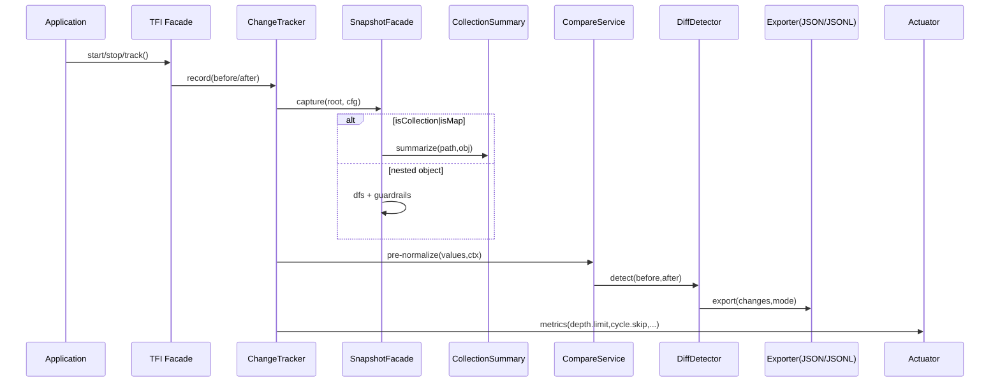

# TaskFlow Insight M2 设计（VIP 合并版 · v3）

## 1. 说明
- 约束：以 `docs/specs/m2/opus4.1/v2/TaskFlow-Insight-M2-m1阶段-vip-Design.md` 为需求与范围基线。
- 输入：
  - A 组任务：`docs/task/v2.1.0-mvp`
  - B 组任务：`docs/task/v2.1.1-mvp/tasks`
- 输出：
  - VIP 合并后任务文档：`docs/task/v2.1.0-vip/`
  - 本优化稿：当前文档。
- 原则：需求优先、KISS & YAGNI、一致性优先、可运维、可回滚。

## 2. 差异对照总表（A vs B → VIP 取舍）

| 模块 | A 任务 | B 任务 | 主要差异 | VIP 取舍 | 迁移/回滚 |
|---|---|---|---|---|---|
| tracking-core | V210-001 SnapshotFacade & Deep | M2M1-001-ObjectSnapshotDeep.md | A 引入 Facade；B 聚焦 Deep | 采用 A 的 Facade 包装 + B 的 Deep实现 | ChangeTracker 开关选择 Facade，回退旧路径 |
| tracking-core | V210-002 CollectionSummary | M2M1-002-CollectionSummary.md | 一致，A 有指标与阈值 | 采用 A 的“摘要优先”，默认开启 | 通过 summary.enabled 回退 size-only |
| tracking-core | V210-003 PathMatcherCache | M2M1-003-PathMatcherCache.md | A 强调 FSM + 上限；B 未明确 ReDoS | 采用 A FSM+上限+LRU+预热+降级 | 超限降级 literal，指标采集 |
| tracking-core | V210-004 Diff 扩展 | M2M1-004-DiffDetector-Extension.md | A 定义 valueKind/valueRepr 与排序 | 采用 A 的输出模型与排序 | compat/enhanced 双模式回滚 |
| format-engine | V210-010 轻量模板 | M2M1-010-TemplateEngine.md | 皆为轻量；A 建议最小模板对 | 最小模板对（default/compact） | 可关闭，不影响 JSON |
| compare-strategy | V210-020 CompareService | M2M1-020-CompareService.md | A 定位 pre-normalize 阶段 | 采用 A pre-normalize 定位 | 默认容差=0、UTC、trim+lowercase |
| storage-export | V210-030 CaffeineStore | M2M1-030-CaffeineStore.md | 可选组件；默认关闭 | 默认 disabled，仅 Starter 引入依赖 | 关闭即可回退 |
| storage-export | V210-031 JSON/JSONL | M2M1-031-JsonExporter.md | A 增 JSONL；B 仅 JSON | 保持 JSON 为主，JSONL 可选/延期 | compat 默认；enhanced 可开 |
| spring-integration | V210-040 Starter | M2M1-040-SpringBootStarter.md | 一致；A 提 Micrometer 桥接 | 采用 A：核心轻接口，Starter 绑定 | 不开启无影响 |
| spring-integration | V210-041 Actuator 端点 | M2M1-041-ActuatorEndpoint.md | A 建议合并到 /actuator/tfi | 采用 A 命名空间整合策略 | 旧端点留存或 alias |
| spring-integration | V210-042 预热/有界缓存 | M2M1-042-WarmupCache.md | 一致 | 采用 A 预热 + 上限配置 | 失败降级 literal |
| guardrails | V210-050 指标最小集 | M2M1-050-MetricsLogging.md | 一致；A 定最小集 | 采用 A 指标最小集 | 与端点对齐即可 |
| testing-quality | V210-060 测试套件 | M2M1-060-TestSuite.md | 一致；A 区分 compat/enhanced | 按 A 区分断言口径 | 旧断言走 compat |
| testing-quality | V210-061 性能不回退 | M2M1-061-PerformanceBaseline.md | 一致；A 提基线护栏 | 采用 A：<5% CPU + 不回退 | perf profile 单独触发 |
| docs-examples | V210-070 文档与示例 | M2M1-070-Documentation.md | 一致 | 按 A | - |

## 3. 关键决策记录（摘自 ADR）
- 集合/Map 摘要优先（ADR‑001）：默认摘要，不做元素级深度 Diff；size-only 降级、Top‑N 示例、敏感脱敏。
- Diff 输出模型与稳定性（ADR‑002）：valueKind/valueRepr、字典序稳定；Compare pre‑normalize → Diff detect → Export 统一字段规范；compat/enhanced 双模式。
- PathMatcher 与 ReDoS 防护（ADR‑003）：FSM 匹配（*, **, ?），pattern 长度与通配符上限，LRU 缓存与预热，降级 literal。
- 全局护栏与错误处理（ADR‑004）：maxDepth=3/MAX_STACK_DEPTH≈1000、循环检测、异常路径不合并、禁止并行 DFS、反射失败跳过、ThreadLocal 统一、<5% CPU + 不回退、指标最小集。

## 4. 跨模块时序与依赖（Mermaid）

## 5. 落地计划（增量/风险/回滚）
- 迭代 1：新增组件落地（SnapshotFacade/Deep/Summary/PathMatcher/Compare），不开启新路径；引入指标桥接。
- 迭代 2：ChangeTracker 开关接入 Facade；导出 compat/enhanced 并存；Actuator 有效配置端点；新增测试与基线。
- 迭代 3：perf profile 验证不回退；文档/示例完善；发布准备。
- 风险点：导出断言口径、端点冲突、ReDoS 与反射异常；
- 回滚点：关闭新路径开关；导出回退 compat；禁用新端点与 Store。

## 6. 与代码核对与迁移
- 接口/实体/枚举名与包：
  - `com.syy.taskflowinsight.tracking.snapshot.SnapshotFacade`（新增）
  - `com.syy.taskflowinsight.tracking.snapshot.ObjectSnapshotDeep`（新增）
  - `com.syy.taskflowinsight.tracking.summary.CollectionSummary`（新增）
  - `com.syy.taskflowinsight.tracking.path.PathMatcherCache`（新增/FSM）
  - `com.syy.taskflowinsight.tracking.compare.CompareService`（新增）
  - `com.syy.taskflowinsight.exporter.json.JsonLinesExporter`（可选）
  - `com.syy.taskflowinsight.changetracking.spring.ChangeTrackingAutoConfiguration`（新增）
  - `com.syy.taskflowinsight.actuator.ChangeTrackingEndpoint`（新增或合并）
- 不一致与迁移：
  - threadId 导出：compat 维持现有；enhanced 建议统一为字符串（迁移窗口内测试双断言）。
  - 旧端点：若存在 `TaskflowContextEndpoint`，合并到 `/actuator/tfi/*` 或提供 alias。
  - 反射直接 setAccessible：改为 trySetAccessible + try/catch + skip。

## 7. 输出目录对齐
- VIP 文档生成至 `docs/task/v2.1.0-vip/<模块>/<任务>.md`，命名与代码包一致（模块）+ 与 A/B 任务名一致（任务）。

---

> 详见各模块 VIP 文档（`docs/task/v2.1.0-vip`）与 ADR（`docs/adr`）。

