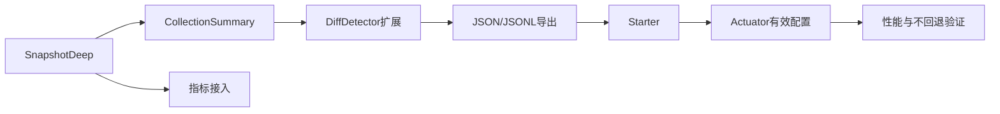

# TaskFlow Insight - v2.1.0-mvp 开发任务总览

## 0. 设计文档预评估报告

参考设计文档：`docs/specs/m2/opus4.1/v2/TaskFlow-Insight-M2-m1阶段-vip-Design.md`

- 设计亮点
  - 分层清晰：Tracking Core / Compare Strategy / Format Engine / Storage&Export / Spring Integration / Guardrails & Monitoring。
  - 边界意识强：强调深度/循环护栏、PathMatcherCache、有界缓存与预热、降级与只读端点。
  - 产品化导向：Starter 与只读 Actuator 端点（effective-config），默认 balanced 配置。

- 风险与问题（需在任务中工程化落实）
  - 集合/Map展开的性能与复杂度风险：本阶段应“一律摘要化（size-only + 示例 STRING 排序）”，禁止元素级深度 Diff。
  - 护栏细节需落文落码：MAX_STACK_DEPTH≈1000、异常路径不合并（局部提交）、循环检测入栈/出栈对称。
  - 路径匹配 ReDoS 风险：Ant 风格需采用有限状态匹配器、pattern 长度/通配符个数上限、编译失败降级 literal。
  - 规范化口径未固化为默认：时间（ZoneId/ISO‑8601）、字符串（trim/lowercase）、数值（绝对容差）、identity-paths。

- 需要澄清
  - maxDepth 默认值（建议 3）、PathMatcherCache 容量默认值（建议 1000）、示例 Top‑N（建议 3）。
  - Actuator 端点内容范围：仅“有效配置 + 聚合指标”，是否包含样例统计？（建议不含敏感与明细）

- 优化建议
  - 坚持“先测量后优化”，以“不劣化既有基线 + <5% CPU 开销护栏 + 不回退”为性能口径。
  - 以最小纵切（SnapshotDeep → CollectionSummary → Diff → Export → Starter → Actuator）快速打通端到端验证。

---

## 1. 执行摘要（Executive Summary）

- 项目范围：M1（P0+P1）+ M2.1 最小产品化（v2.1.0-mvp）
- 核心目标：
  1) 落地深度快照与集合摘要的变更追踪最小闭环；
  2) 提供可配置的比较规范化与稳定输出（valueKind/valueRepr，字典序）；
  3) 暴露护栏与缓存的最小指标集与只读有效配置端点；
  4) 提供 JSON/JSONL 导出与最小模板化格式输出；
  5) 默认 balanced 配置，严格范围与护栏，测试先行。
- 技术约束：Java 21，Spring Boot 3.5.5，包前缀 `com.syy.taskflowinsight`，构建命令 `./mvnw clean verify|test|spring-boot:run`。
- 交付计划（建议）：
  - Phase 1（M1 P0）：Tracking Core 核心与护栏（2 周）
  - Phase 2（M1 P1）：Storage&Export（1 周）
  - Phase 3（M2.1）：Starter + Actuator（1 周）
  - Phase 4：测试与发布准备（1 周）

---

## 2. 核心原则与技术约束

- YAGNI；设计阐述；测试先行；默认 balanced；核心不新增非必要依赖；新增能力需可回退/降级。
- 冲突优先级：PRD/Design > 基线规范 > 现有实现。
- 集合策略（硬约束）：一律摘要化（size-only + 示例 STRING 排序），不展开元素级深度 Diff。
- 护栏与安全：
  - 深度/栈深度：`maxDepth`（默认建议 3，可配置）；`MAX_STACK_DEPTH≈1000` 常量。
  - 循环检测：`IdentityHashMap` 路径栈；异常路径不合并（局部提交）。
  - PathMatcherCache：有界 LRU（默认 1000）、预热、编译失败降级 literal；通配符上限（≤32）、pattern 长度（≤512）；有限状态匹配（防 ReDoS）。
- 指标最小集：`depth.limit`、`cycle.skip`、`pattern.compile.fail`、`cache.hit/miss`、`degrade.count`。
- 性能口径：先测量后优化；不劣化基线 + <5% CPU 开销 + 不回退。

### 2.1 配置与属性整合策略（ChangeTrackingProperties）
- 统一以 `tfi.change-tracking.*` 作为唯一入口；在现有 `ChangeTrackingProperties` 上扩展，不新增平行入口。
- 配置建议（默认 balanced）：
  - `tfi.change-tracking.enabled=true`
  - `tfi.change-tracking.max-depth=3`
  - `tfi.change-tracking.max-stack-depth`（常量 1000，不暴露配置）
  - `tfi.change-tracking.include-paths=[]`
  - `tfi.change-tracking.exclude-paths=["**/password","**/token","**/secret"]`
  - `tfi.change-tracking.summary.enabled=true`
  - `tfi.change-tracking.summary.max-size=100`
  - `tfi.change-tracking.summary.examples.top-n=3`
  - `tfi.change-tracking.path-matcher.max-size=1000`
  - `tfi.change-tracking.path-matcher.pattern-max-length=512`
  - `tfi.change-tracking.path-matcher.max-wildcards=32`
  - `tfi.change-tracking.path-matcher.preload=[]`
  - `tfi.change-tracking.compare.tolerance-absolute=0`
  - `tfi.change-tracking.compare.zone-id=UTC`
  - `tfi.change-tracking.compare.string.normalize=true`
  - `tfi.change-tracking.compare.identity-paths=["**/id"]`
  - `tfi.change-tracking.store.enabled=false`（可选组件）
- 指标桥接：核心提供轻量指标接口；Micrometer 绑定在 Starter 中完成（核心不直接依赖 Micrometer）。

### 2.2 Include/Exclude 与匹配规则
- 评估时机：在“进入节点前”进行匹配，未命中分支不展开；
- 优先级：`exclude > include > default`；
- ReDoS 防护：pattern 长度与通配符数超限直接拒绝并降级 literal；
- 匹配器：有限状态匹配（非正则），缓存编译结果并有界 LRU。

---

## 3. 任务分解与依赖关系

### 3.1 任务统计

| 模块 | P0 | P1 | P2 | 合计 |
|---|---:|---:|---:|---:|
| A. Tracking Core | 4 | 0 | 0 | 4 |
| B. Format Engine | 1 | 0 | 0 | 1 |
| C. Compare Strategy | 1 | 0 | 0 | 1 |
| D. Storage & Export | 0 | 2 | 0 | 2 |
| E. Spring Integration | 3 | 0 | 0 | 3 |
| F. Guardrails & Monitoring | 1 | 0 | 0 | 1 |
| G. Testing & Quality | 2 | 0 | 0 | 2 |
| H. Docs & Examples | 1 | 0 | 0 | 1 |
| 合计 | 12 | 2 | 0 | 14 |

### 3.2 关键路径（概念图）



### 3.3 依赖类型
- 🔴 强依赖：未完成无法开始；🟡 弱依赖：可并行但有同步点；🟢 软依赖：建议顺序但灵活。

---

## 4. 模块与任务

目录结构：

```
docs/task/v2.1.0-mvp/
├── README.md
├── tracking-core/
├── format-engine/
├── compare-strategy/
├── storage-export/
├── spring-integration/
├── guardrails-monitoring/
├── testing-quality/
└── docs-examples/
```

详见各子目录任务卡。

任务索引（可点击跳转）：
- A. Tracking Core
  - [V210-001 SnapshotFacade 与 ObjectSnapshotDeep](tracking-core/V210-001-SnapshotFacade-and-ObjectSnapshotDeep.md)
  - [V210-002 CollectionSummary](tracking-core/V210-002-CollectionSummary.md)
  - [V210-003 PathMatcherCache](tracking-core/V210-003-PathMatcherCache.md)
  - [V210-004 DiffDetector 扩展（valueKind/valueRepr）](tracking-core/V210-004-DiffDetector-ValueKind-Repr.md)
- B. Format Engine
  - [V210-010 轻量模板引擎与选择器](../v2.1.0-mvp/format-engine/V210-010-Lightweight-Template-Engine.md)
- C. Compare Strategy
  - [V210-020 CompareService 规范化与容差](../v2.1.0-mvp/compare-strategy/V210-020-CompareService-Normalization.md)
- D. Storage & Export
  - [V210-030 内存 Store + Query（可选）](../v2.1.0-mvp/storage-export/V210-030-Caffeine-Store-Query.md)
  - [V210-031 JSON/JSONL 导出](../v2.1.0-mvp/storage-export/V210-031-Json-JsonLines-Export.md)
- E. Spring Integration
  - [V210-040 Spring Boot AutoConfiguration](../v2.1.0-mvp/spring-integration/V210-040-Spring-Boot-Starter-AutoConfig.md)
  - [V210-041 Actuator 有效配置端点](../v2.1.0-mvp/spring-integration/V210-041-Actuator-Effective-Config-Endpoint.md)
  - [V210-042 预热与有界缓存](../v2.1.0-mvp/spring-integration/V210-042-Preload-and-Bounded-Caches.md)
- F. Guardrails & Monitoring
  - [V210-050 指标最小集](../v2.1.0-mvp/guardrails-monitoring/V210-050-Metrics-Minimal-Set.md)
  - [V210-051 ThreadLocal 管理统一](../v2.1.0-mvp/guardrails-monitoring/V210-051-ThreadLocal-Manager-Unification.md)
- G. Testing & Quality
  - [V210-060 测试套件](../v2.1.0-mvp/testing-quality/V210-060-Test-Suite.md)
  - [V210-061 性能基线与不回退](../v2.1.0-mvp/testing-quality/V210-061-Performance-Baseline-NonRegression.md)
  - [V210-062 性能环境与 Profiling 指南](../v2.1.0-mvp/testing-quality/V210-062-Perf-Env-and-Profiling-Guide.md)
- H. Docs & Examples
  - [V210-070 文档与示例](../v2.1.0-mvp/docs-examples/V210-070-Docs-and-Examples.md)

---

## 5. 全局质量门槛（Definition of Done）

- 关键路径测试覆盖率 ≥ 80%；
- 基线性能不劣化，CPU 开销 < 5%（样例规模）且无显著退化；
- 指标最小集接入并可观测；
- 降级/回退路径具备并通过；
- 核心模块不新增未声明外部依赖；
- 文档与示例同步。

---

## 6. 测试矩阵

- 单元：快照/集合摘要/路径匹配/规范化/护栏触发；
- 集成：Starter 自动装配、配置生效、只读端点输出；
- 并发：上下文隔离与无竞态（必要处）；
- 性能：基线与不回退（按样例规模与真实场景）；
- 长稳：受控 profile，观测指标趋势与泄漏。

---

## 7. 可追踪性（Traceability）示例

| PRD/Design 小节 | 工作包 | 任务ID | 代码路径（建议） | 测试类（建议） |
|---|---|---|---|---|
| 嵌套扁平化 | A | V210-001 | tracking.snapshot.ObjectSnapshotDeep | ObjectSnapshotDeepTests |
| 集合摘要 | A | V210-002 | tracking.summary.CollectionSummary | CollectionSummaryTests |
| Compare 规范化 | C | V210-020 | tracking.compare.CompareService | CompareServiceTests |
| 导出 | D | V210-031 | exporter.json.JsonLinesExporter | JsonLinesExporterTests |
| 有效配置端点 | E | V210-041 | actuator.ChangeTrackingEndpoint | ChangeTrackingEndpointTests |

---

## 8. 导出字段规范（JSON / JSONL）

- 适用：`exporter.json.JsonExporter` 与 `exporter.json.JsonLinesExporter` 必须遵循相同字段语义与顺序；
- 线程与会话：`threadId` 统一为字符串；时间戳默认毫秒（兼容），增强模式支持纳秒字段；
- 统一字段（示例）：
  - 会话：`sessionId`(str), `threadId`(str), `threadName`(str), `status`(enum), `createdAt`(ms), `endedAt`(ms|null), `durationMs`(num|null)
  - 任务节点：`nodeId`(str), `name`(str), `depth`(num), `sequence`(num|0), `taskPath`(str), `startMillis`(num), `endMillis`(num|null), `durationMs`(num|null), `status`(enum), `isActive`(bool)
  - 消息：`type`(enum), `label`(str|null), `content`(str), `timestamp`(ms)
  - 变更项（Diff）：`path`(str), `kind`(enum,valueKind), `reprOld`(str|null), `reprNew`(str|null)
- 排序：路径字典序稳定输出；
- 时间：`ZoneId` 统一（默认 UTC）；
- 安全：示例与消息内容若命中敏感关键字（password/token/secret）需脱敏；
- 模式：`COMPAT`（最小字段集，毫秒）、`ENHANCED`（增加统计、纳秒、repr 自/累计时长等）。

---

## 9. 两条完整示例任务卡

见：`tracking-core/V210-001-SnapshotFacade-and-ObjectSnapshotDeep.md` 与 `tracking-core/V210-002-CollectionSummary.md`

---

## 10. Backlog（M2‑m2 及更远期）

- 并行 DFS；
- 复杂导出并发（StripedLock/文件锁回退/重试）；
- 复杂 Comparator/Repository；
- HTML 报告输出。

---

## 11. 假设与开放问题

- 默认值：`maxDepth=3`、`PathMatcherCache.size=1000`、`example.topN=3`、默认时区 UTC。
- 需决策：循环策略是否固定 cut；只读端点是否展示样例统计。

---

## 12. 参考与 ADR

- ADR-001 CollectionSummary-First 策略：`docs/adr/ADR-001-CollectionSummary-First-Strategy.md`
- ADR-002 Diff 输出模型与稳定性：`docs/adr/ADR-002-Diff-Output-Model-ValueRepr-Stability.md`
- ADR-003 PathMatcherCache 设计与 ReDoS 防护：`docs/adr/ADR-003-PathMatcherCache-Design-and-ReDoS-Protection.md`
- ADR-004 全局护栏与错误处理：`docs/adr/ADR-004-Global-Guardrails-and-Error-Handling.md`
