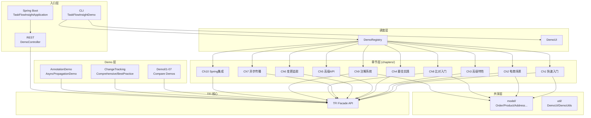

# tfi-examples 模块 — 开发设计文档

> **作者**: 资深开发专家（Spring Boot 领域）  
> **日期**: 2026-02-16  
> **最后更新**: 2026-02-18（v2.1: Ch9/Ch10 落地 + 跨文档一致性）  
> **版本**: v2.1  
> **范围**: 仅 tfi-examples 模块  
> **SSOT 数据源**: [index.md §0](index.md#0-ssot-关键指标速查)  
> **整体项目设计文档**: [project-overview/design-doc.md](project-overview/design-doc.md)

---

## 目录

1. [模块概况](#1-模块概况)
2. [架构设计](#2-架构设计)
3. [入口类设计](#3-入口类设计)
4. [章节体系设计](#4-章节体系设计)
5. [Compare Demo 系列设计](#5-compare-demo-系列设计)
6. [变更追踪 Demo 设计](#6-变更追踪-demo-设计)
7. [辅助类设计](#7-辅助类设计)
8. [配置文件设计](#8-配置文件设计)
9. [JMH 基准测试设计](#9-jmh-基准测试设计)
10. [TFI Facade API 使用统计](#10-tfi-facade-api-使用统计)
11. [代码设计评分](#11-代码设计评分)
12. [技术债务清单](#12-技术债务清单)
13. [改进建议](#13-改进建议)

---

## 1. 模块概况

| 指标 | 数值 |
|------|------|
| 主源文件 | 36 个 Java, ~6,630 行 |
| 测试文件 | 17 个, ~2,080 行 |
| JMH 基准文件 | 12 个, ~1,500 行 |
| bench 文件 | 2 个, ~138 行 |
| 配置文件 | 3 个 YAML (207+22+23 行) |
| 文档 | 1 个 README (demo/ 内) |
| Maven 依赖 | tfi-all, tfi-flow-spring-starter, tfi-compare, tfi-ops-spring |

### 模块职责

tfi-examples 承担三个职责：

1. **交互式演示**: 通过 CLI 菜单和 REST 端点展示 TFI 全部功能
2. **API 用法参考**: 作为用户学习 TFI Facade API 的代码样例
3. **性能基准**: JMH 基准测试衡量核心操作性能

---

## 2. 架构设计

### 2.0 分层架构图



### 2.1 整体结构

```
tfi-examples/src/main/java/
├── TaskFlowInsightApplication.java      ← Spring Boot 入口
└── demo/
    ├── TaskFlowInsightDemo.java         ← CLI 入口
    ├── DemoController.java              ← REST 端点 (4 个)
    ├── core/
    │   ├── DemoChapter.java             ← 章节接口
    │   └── DemoRegistry.java            ← 章节注册表
    ├── chapters/                        ← 10 个章节实现
    │   ├── QuickStartChapter.java
    │   ├── BusinessScenarioChapter.java
    │   ├── AdvancedFeaturesChapter.java
    │   ├── BestPracticesChapter.java
    │   ├── AdvancedApiChapter.java
    │   ├── ChangeTrackingChapter.java
    │   ├── AsyncPropagationChapter.java
    │   ├── CompareQuickStartChapter.java ← Ch8: 对象比对入门
    │   ├── AnnotationSystemChapter.java  ← Ch9: 注解系统
    │   └── SpringIntegrationChapter.java ← Ch10: Spring 集成
    ├── Demo01_BasicTypes.java           ← Compare Demo 系列
    ├── Demo02_DateTypes.java
    ├── Demo03_CustomObjects.java
    ├── Demo04_Collections.java
    ├── Demo05_CollectionEntities.java
    ├── Demo05_ListCollectionEntities.java
    ├── Demo06_SetCollectionEntities.java
    ├── Demo07_MapCollectionEntities.java
    ├── ChangeTrackingComprehensiveDemo.java
    ├── ChangeTrackingBestPracticeDemo.java
    ├── AsyncPropagationDemo.java
    ├── AnnotationDemo.java
    ├── TfiSwitchDemo.java
    ├── TfiAnnotationDemoRunner.java
    ├── model/                           ← 领域模型（已统一抽取）
    │   ├── Address.java
    │   ├── Order.java
    │   ├── Product.java
    │   ├── Supplier.java
    │   ├── UserOrderResult.java
    │   └── Warehouse.java
    ├── service/                         ← 业务服务
    │   └── EcommerceDemoService.java
    └── util/                            ← 工具类
        ├── DemoUI.java
        └── DemoUtils.java
```

### 2.2 双入口设计

| 入口 | 类 | 环境 | 特点 |
|------|-----|------|------|
| **Spring Boot** | `TaskFlowInsightApplication` | 完整 Spring 容器 | REST + Actuator + AOP |
| **CLI** | `TaskFlowInsightDemo` | 无 Spring（反射初始化 TfiCore） | 交互式菜单 |

**问题**: CLI 入口通过 `Field.set` 反射注入 `TfiCore` 到 `TFI`，绕过公开 API，侵入性强。

### 2.3 依赖关系

```xml
<!-- pom.xml 核心依赖 -->
<dependency>TaskFlowInsight (tfi-all)</dependency>      <!-- 全量 TFI API -->
<dependency>tfi-flow-spring-starter</dependency>         <!-- @TfiTask AOP -->
<dependency>tfi-compare</dependency>                     <!-- Compare/Diff -->
<dependency>tfi-ops-spring</dependency>                  <!-- Actuator/Metrics -->
<dependency>spring-boot-starter-web</dependency>         <!-- REST -->
<dependency>spring-boot-starter-validation</dependency>  <!-- 校验 -->
```

---

## 3. 入口类设计

### 3.1 TaskFlowInsightApplication.java (21 行)

标准 Spring Boot 入口，无特殊逻辑。

### 3.2 TaskFlowInsightDemo.java (178 行)

CLI 交互式演示入口，功能：
- 初始化 TfiCore（反射方式）
- 注册章节到 DemoRegistry
- 提供菜单选择

**TFI Facade API 使用**: `TFI.enable()`, `TFI.clear()`

**遗留问题**:

| # | 问题 | 严重度 |
|---|------|:------:|
| 1 | `initializeTfiCore()` 反射注入 `Field.set(null, tfiCore)` | 中 |

### 3.3 DemoController.java (153 行)

4 个 REST 端点：

| 端点 | 方法 | TFI Facade API |
|------|------|---------|
| `/api/demo/hello/{name}` | GET | `TFI.stage()`, `TFI.message()` |
| `/api/demo/process` | POST | 通过 `@TfiTask` |
| `/api/demo/async` | POST | 通过 `@TfiTask` |
| `/api/demo/async-comparison` | POST | 通过 `@TfiTask` |

**测试覆盖**: `DemoControllerTest.java` — 4 个 MockMvc 测试覆盖全部端点。

---

## 4. 章节体系设计

### 4.1 核心接口

```java
// DemoChapter.java (55 行) — 策略接口
public interface DemoChapter {
    int getChapterNumber();
    String getTitle();
    String getDescription();
    void run();
    List<String> getSummaryPoints();
}

// DemoRegistry.java (38 行) — 注册表
public class DemoRegistry {
    DemoRegistry register(DemoChapter chapter);
    Optional<DemoChapter> find(int number);
    List<DemoChapter> allOrdered();
}
```

**设计评价**: 接口简洁，注册表模式使用得当。

### 4.2 各章节详细评审

| # | 类名 | 行数 | TFI Facade API 使用 | 质量 |
|:--:|------|:----:|-------------|:----:|
| 1 | QuickStartChapter | 93 | `startSession`, `run`, `call`, `message`, `exportToConsole`, `endSession` | 8/10 |
| 2 | BusinessScenarioChapter | 298 | `startSession`, `call`, `run`, `message`, `error`, `exportToConsole`, `endSession` | 8/10 |
| 3 | AdvancedFeaturesChapter | 243 | 并发 `call`、异常处理、`start`、性能测量 | 7/10 |
| 4 | BestPracticesChapter | 129 | `exportToConsole`, `exportToJson`, `exportToMap` | 8/10 |
| 5 | AdvancedApiChapter | 176 | `enable`/`disable`, `getCurrentTask`, `getTaskStack`, `start`/`stop` | 8/10 |
| 6 | ChangeTrackingChapter | 260 | `track`, `withTracked`, `exportToJson` | 7/10 |
| 7 | AsyncPropagationChapter | 69 | 委托给 `AsyncPropagationDemo` | 7/10 |
| 8 | **CompareQuickStartChapter** | 243 | `compare`, `render`, `comparator`, `typeAware`, `detectMoves` | **8/10** |
| 9 | **AnnotationSystemChapter** | 220 | `compare`, `comparator`, `typeAware`, `render` + `@Entity/@Key/@ValueObject/@DiffIgnore/@NumericPrecision` | **8/10** |
| 10 | **SpringIntegrationChapter** | 200 | `stage`, `message`, `isEnabled`, `isChangeTrackingEnabled` + `@TfiTask` 说明 | **8/10** |

**测试覆盖**: `ChapterSmokeTest.java` 参数化测试覆盖全部 10 章。

---

## 5. Compare Demo 系列设计

### 5.1 TFI Facade API 使用一致性

| Demo | 行数 | TFI Facade 调用数 | 内部 API 调用数 | 评价 |
|------|:----:|:-----------------:|:---------------:|:----:|
| Demo01_BasicTypes | 226 | 19 | 0 | ⭐⭐⭐⭐ |
| Demo02_DateTypes | 273 | 19 | 0 | ⭐⭐⭐⭐ |
| Demo03_CustomObjects | 259 | 14 | 0 | ⭐⭐⭐⭐ |
| Demo04_Collections | 163 | 16 | 0 | ⭐⭐⭐⭐ |
| Demo05_CollectionEntities | 251 | 15 | 0 | ⭐⭐⭐⭐ |
| Demo05_ListCollectionEntities | 233 | 10 | 0 | ⭐⭐⭐ |
| **Demo06_SetCollectionEntities** | **960** | 3 | **9** | **⭐⭐** |
| Demo07_MapCollectionEntities | 782 | 3 | 0 | ⭐⭐⭐ |

### 5.2 遗留问题: Demo06 内部 API

**唯一仍使用内部 API 的文件**: `Demo06_SetCollectionEntities.java`

残留内部 API 引用（9 处）：
- `DiffDetector` 相关调用
- 应通过 `TFI.comparator()` 链式 API 替代

### 5.3 模型类管理

模型类已统一抽取到 `demo/model/` 包：

| 类 | 行数 | 注解 | 用途 |
|----|:----:|------|------|
| Address | 53 | `@ValueObject` | 地址值对象 |
| Order | 51 | — | 订单模型 |
| Product | 97 | `@Entity` + `@Key` | 产品实体 |
| Supplier | 58 | `@Entity` + `@Key` | 供应商实体 |
| UserOrderResult | 89 | — | 并发下单结果 |
| Warehouse | 61 | `@Entity` + `@Key` | 仓库实体 |

---

## 6. 变更追踪 Demo 设计

| 类名 | 行数 | TFI Facade 调用数 | 内部 API | 质量 |
|------|:----:|:-----------------:|:--------:|:----:|
| ChangeTrackingChapter | 260 | 17 | 0 | 7/10 |
| ChangeTrackingComprehensiveDemo | 221 | 26 | 0 | **7/10** |
| ChangeTrackingBestPracticeDemo | 181 | 16 | 0 | **7/10** |

> **改善**: CTComprehensive 和 CTBestPractice 已完成 TFI Facade API 重构（原版使用纯内部 API）。

---

## 7. 辅助类设计

| 类名 | 行数 | 用途 | 问题 |
|------|:----:|------|------|
| AsyncPropagationDemo | 243 | 异步上下文传播演示 | `@Component` 在非 Spring 无效 |
| AnnotationDemo | 50 | `@TfiTask` 注解演示 | 无 Javadoc |
| TfiSwitchDemo | 86 | 启用/禁用演示 | 质量良好 |
| TfiAnnotationDemoRunner | 77 | 注解 Demo Runner | 用 `System.out` 而非 SLF4J |
| EcommerceDemoService | 140 | 电商业务服务 | `HashMap` 非线程安全 |
| DemoUI | 105 | 控制台 UI 辅助 | — |
| DemoUtils | 17 | sleep 辅助 | 质量良好 |

---

## 8. 配置文件设计

### 8.1 application.yml (207 行)

```yaml
server.port: 19090
management.endpoints.web.exposure.include: [health, info, taskflow, metrics, prometheus]
tfi:
  enabled: true
  annotation.enabled: true
  api.routing.enabled: false       # v4.0.0
  change-tracking:
    snapshot.max-depth: 10
    exclude-patterns: ["*.password", "*.secret", "*.token", "*.creditCard", "*.ssn"]
  compare:
    auto-route.lcs.enabled: true
    degradation.enabled: true
    degradation.field-count-threshold: 100
    degradation.collection-size-threshold: 10000
  diff:
    output-mode: compat
    perf.timeout-ms: 5000
    cache.enabled: true
```

**评价**: 9/10 — 配置项覆盖全面，降级阈值、敏感字段、缓存策略均有配置。

### 8.2 Profile 对比

| 配置项 | 默认 | dev | prod |
|--------|------|-----|------|
| tfi.enabled | true | true | **false** |
| change-tracking | true | true | **false** |
| 日志级别 | INFO | **DEBUG** | INFO |
| Actuator | 全量 | health/info | health/info |

---

## 9. JMH 基准测试设计

### 9.1 基准文件清单

| 文件 | 行数 | 测试内容 | 质量 |
|------|:----:|----------|:----:|
| TFIRoutingBenchmark | 44 | 路由 on/off 比对 | ⭐⭐⭐ |
| ProviderRegistryBenchmark | 41 | Provider 查找（热/冷） | ⭐⭐⭐⭐ |
| P1PerformanceBenchmark | 377 | 延迟/路径解析/ShallowRef | ⭐⭐⭐⭐⭐ |
| P1MemoryBenchmark | 291 | GCProfiler 内存分析 | ⭐⭐⭐⭐⭐ |
| ReferenceChangeBenchmarks | 53 | 引用变更检测 | ⭐⭐⭐ |
| QueryApiBenchmarks | 111 | CompareResult 查询 API | ⭐⭐⭐⭐ |
| MapSetLargeBenchmarks | 77 | 大规模 Map/Set | ⭐⭐⭐⭐ |
| FilterBenchmarks | 218 | 过滤器 + 缓存命中 | ⭐⭐⭐⭐ |
| LargeObjectGenerator | 93 | 测试数据生成器 | ⭐⭐⭐⭐ |
| BenchmarkRunner | 42 | 通用 Runner | ⭐⭐⭐ |
| TfiRoutingBenchmarkRunner | 47 | 路由基准 Runner | ⭐⭐⭐ |
| SpiBenchmarkRunner | 36 | SPI 基准 Runner | ⭐⭐⭐⭐ |

**JMH 综合评价**: 8/10 — 模块内质量最高的部分。

---

## 10. TFI Facade API 使用统计

### 10.1 Facade 调用统计（基于代码扫描）

| 文件 | TFI Facade 调用数 | 内部 API 调用数 |
|------|:-----------------:|:---------------:|
| BusinessScenarioChapter | 43 | 0 |
| BestPracticesChapter | 30 | 0 |
| AdvancedFeaturesChapter | 30 | 0 |
| AdvancedApiChapter | 27 | 0 |
| AsyncPropagationDemo | 27 | 0 |
| ChangeTrackingComprehensiveDemo | 26 | 0 |
| CompareQuickStartChapter | 22 | 0 |
| AnnotationSystemChapter | 12 | 0 |
| SpringIntegrationChapter | 8 | 0 |
| EcommerceDemoService | 19 | 0 |
| QuickStartChapter | 19 | 0 |
| Demo02_DateTypes | 19 | 0 |
| Demo01_BasicTypes | 19 | 0 |
| ChangeTrackingChapter | 17 | 0 |
| Demo04_Collections | 16 | 0 |
| ChangeTrackingBestPracticeDemo | 16 | 0 |
| Demo05_CollectionEntities | 15 | 0 |
| Demo03_CustomObjects | 14 | 0 |
| Demo05_ListCollectionEntities | 10 | 0 |
| TfiSwitchDemo | 10 | 0 |
| Demo07_MapCollectionEntities | 3 | 0 |
| **Demo06_SetCollectionEntities** | **3** | **9** |

### 10.2 总体一致性

| 类别 | 文件数 | 占比 |
|------|:------:|:----:|
| **纯 TFI Facade API** | 37 | **97%** |
| **混用内部 API** | 1 (Demo06) | 3% |

> 相比初始评审时 56% 使用内部 API，当前仅 Demo06 一个文件仍有残留。

---

## 11. 代码设计评分

### tfi-examples 模块评分

| 维度 | 评分 | 说明 |
|------|:----:|------|
| 章节体系设计 (core/) | 9/10 | DemoChapter + DemoRegistry 设计优秀 |
| 章节实现质量 (chapters/) | 8/10 | 10 章覆盖全面，Ch1-5, Ch8-10 优秀 |
| Compare Demo 01-05 | 8/10 | 统一使用 TFI Facade API, 渐进式教学 |
| Compare Demo 05L/06/07 | 6/10 | 05L 已重构; Demo06 残留内部 API |
| 变更追踪 Demo | 7/10 | CTComprehensive/BestPractice 已改用 Facade |
| 辅助类 | 6/10 | 线程安全问题, 日志不一致 |
| 配置管理 | 9/10 | YAML 配置详尽 |
| JMH 基准 | 8/10 | 专业全面 |
| 模型管理 | 8/10 | 已统一抽取到 model/ 包 |
| 文档覆盖 | 5/10 | Javadoc 不足 |
| **综合** | **7.2/10** | **良好，部分待优化** |

---

## 12. 技术债务清单

| # | 问题 | 严重度 | 状态 |
|---|------|:------:|:----:|
| **TD-E01** | Demo06 使用内部 API (DiffDetector 等 9 处) | **中** | 待修复 |
| TD-E02 | `TaskFlowInsightDemo` 反射注入 TfiCore | 中 | 待修复 |
| TD-E03 | TfiAnnotationDemoRunner 用 `System.out` 而非 SLF4J | 低 | 待修复 |
| TD-E04 | EcommerceDemoService `HashMap` 非线程安全 | 中 | 待修复 |
| TD-E05 | 部分 Demo 缺 Javadoc | 低 | 待修复 |
| ~~TD-E06~~ | ~~Demo01_org 使用内部 API~~ | — | ✅ 已删除 |
| ~~TD-E07~~ | ~~Address/Supplier/Warehouse 重复定义~~ | — | ✅ 已抽取 |
| ~~TD-E08~~ | ~~菜单仅 6 项但有 7+ 章节~~ | — | ✅ 已同步 |
| ~~TD-E09~~ | ~~CT Demo 不用 Facade~~ | — | ✅ 已重构 |

---

## 13. 改进建议

### 短期 (1 周)

1. **重写 Demo06**: 清除 9 处内部 API 引用，改用 `TFI.comparator().typeAware().compare()`
2. **修复伪测试**: 3 个仅有 `main()` 的测试文件转为 `@Test` 方法

### 中期 (2 周)

3. ~~**新增 Chapter 9: 注解系统**~~ — ✅ 已完成，AnnotationSystemChapter.java (220 行)
4. ~~**新增 Chapter 10: Spring 集成**~~ — ✅ 已完成，SpringIntegrationChapter.java (200 行)
5. **消除反射初始化**: 为 CLI 模式提供 `TFI.initializeStandalone()` 公开 API
6. **补齐 Javadoc**: 所有 public 类添加类级文档

### 长期 (1 月)

7. **Swagger/OpenAPI**: DemoController 添加 API 文档
8. **多语言注释统一**: 全部使用中文注释（或全英文，保持一致）
