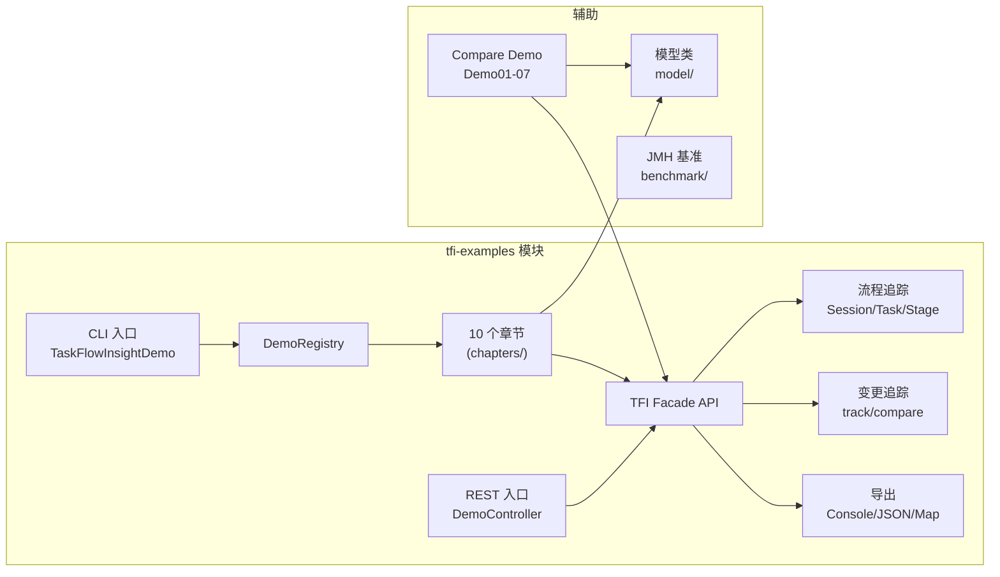
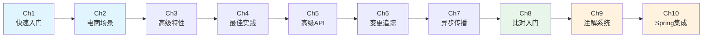

# tfi-examples 模块 — 专家小组评审总览

> **版本**: v3.0.0 → v4.0.0（feature/v4.0.0-routing-refactor 分支）  
> **评审日期**: 2026-02-16  
> **最后更新**: 2026-02-18（v2.1: 学习路径落地 + 跨文档一致性）  
> **组织方**: 资深项目经理（PM Lead）

---

<!-- SSOT: Single Source of Truth — 所有文档引用此表中的数字 -->
## 0. SSOT 关键指标速查

| 指标 | 数值 | 备注 |
|------|------|------|
| **主源文件** | 38 个 Java 文件, ~7,100 行 | `tfi-examples/src/main/java/` |
| **测试文件** | 17 个, ~2,080 行 | `tfi-examples/src/test/java/` |
| **Demo 章节** | 10 个 (Ch1-Ch10) | `chapters/` 包 |
| **Compare Demo** | 7 个 (Demo01-Demo07) | 比对演示 |
| **模型类** | 6 个 | `model/` 包 |
| **JMH 基准** | 12 个, ~1,500 行 | `benchmark/` |
| **配置文件** | 3 个 YAML (207+22+23 行) | `src/main/resources/` |
| **TFI Facade API 纯度** | 97% (37/38 文件) | 仅 Demo06 残留内部 API |
| **测试覆盖率** | ~42% (16/38 文件) | ChapterSmokeTest + DemoControllerTest |
| **综合评分** | 7.8/10 (B+) | 详见 §4 |
| **端口** | 19090 | `server.port` |
| **技术栈** | Java 21, Spring Boot 3.5.5 | `pom.xml` |

> **引用规则**: 其他文档中的统计数字应与此表保持一致。若代码发生变更，仅需更新本表即可。

---

## 1. 专家小组成员

| 角色 | 职责 | 输出物 |
|------|------|--------|
| **资深项目经理** | 统筹协调、进度管控、质量把关 | 本文档（index.md） |
| **资深开发专家** (Spring Boot) | 逐文件代码评审、设计评分、技术债务 | [design-doc.md](design-doc.md) |
| **资深产品经理** | 学习路径、用户体验、功能完整度 | [prd.md](prd.md) |
| **资深测试专家** | 17 个测试文件逐一审查、覆盖盲区、改进计划 | [test-plan.md](test-plan.md) |
| **资深运维专家** | 5 种启动方式、配置分析、基准测试运维、安全评估 | [ops-doc.md](ops-doc.md) |

---

## 2. 模块架构概览



### 学习路径图



---

## 3. 文档结构

```
tfi-examples/docs/
├── index.md                        ← 你在这里（总览）
├── design-doc.md                   ← tfi-examples 开发设计文档
├── prd.md                          ← tfi-examples 产品需求文档
├── test-plan.md                    ← tfi-examples 测试方案
├── ops-doc.md                      ← tfi-examples 运维文档
└── project-overview/               ← 整体项目文档（独立）
    ├── design-doc.md               ← 全项目架构设计 + 评分
    ├── prd.md                      ← 全项目产品 PRD
    ├── test-plan.md                ← 全项目测试方案
    └── ops-doc.md                  ← 全项目运维文档
```

---

## 3. tfi-examples 模块画像

| 指标 | 数值 |
|------|------|
| 主源文件 | 38 个 Java 文件, ~7,100 行 |
| 测试文件 | 17 个, ~2,080 行 |
| JMH 基准 | 12 个, ~1,500 行 |
| bench 文件 | 2 个, ~138 行 |
| 配置文件 | 3 个 YAML (207+22+23 行) |
| Demo 章节 | 10 个 (Chapter 1-10) |
| Compare Demo | 7 个 (Demo01-Demo07) |
| 模型类 | 6 个 (model/ 包统一管理) |
| 双入口 | Spring Boot (port 19090) + CLI (交互式菜单) |

---

## 4. 评审结论

### 4.1 各维度评分

| 维度 | 评分 | 评审人 | 关键发现 |
|------|:----:|--------|----------|
| 章节体系设计 | 9/10 | 开发专家 | DemoChapter + Registry 优秀，10 章覆盖全面 |
| 章节实现质量 | 8/10 | 开发专家 | Ch1-5, Ch8-10 优秀; Ch6-7 良好 |
| Compare Demo 01-05 | 8/10 | 开发专家 | 统一 TFI Facade API, 渐进式 |
| Compare Demo 05L/06/07 | 6/10 | 开发专家 | 05L 已重构; Demo06 仍残留内部 API |
| 变更追踪 Demo | 7/10 | 开发专家 | CTComprehensive/BestPractice 已大幅改用 Facade |
| 学习路径连贯性 | 9/10 | 产品经理 | Ch1-10 完整覆盖全部 TFI 功能 |
| 功能完整度 | 9/10 | 产品经理 | @Entity/@TfiTask/Actuator/配置 均有独立章节 |
| 配置管理 | 9/10 | 运维专家 | YAML 详尽完善 |
| 测试有效性 | 6/10 | 测试专家 | 3 个伪测试仍存在，但已新增 DemoControllerTest + ChapterSmokeTest |
| 测试覆盖率 | 7/10 | 测试专家 | ChapterSmokeTest 覆盖全部 10 章，DemoControllerTest 覆盖 4 端点 |
| JMH 基准 | 8/10 | 测试专家 | 专业全面，模块最高质量 |
| 端点安全 | 2/10 | 运维专家 | 无认证无限流（Demo 定位可接受） |

### 4.2 综合评分

| 模块 | 评分 | 评级 |
|------|:----:|------|
| **tfi-examples** | **7.8/10** | **B+ 级 — 整体良好，学习路径完整** |

> 对比整体项目 8.35/10 (A 级)，tfi-examples 经过重构已大幅缩小差距。

---

## 5. 当前 Top 5 问题

| # | 问题 | 规模 | 专家 | 状态 |
|---|------|------|------|------|
| **1** | Demo06 仍残留内部 API（DiffDetector 等 9 处引用） | 中 | 开发 | 待修复 |
| **2** | 3 个伪测试不被 JUnit 执行（Demo06Quick, FullFeature, CTDemo） | 中 | 测试 | 待修复 |
| **3** | ~~@TfiTask/@Entity 注解系统无独立章节~~ | — | — | ✅ Ch9 已新建 |
| **4** | ~~Spring 集成（Actuator/配置）无独立章节~~ | — | — | ✅ Ch10 已新建 |
| **5** | REST 端点无认证无限流（Demo 定位可接受但应标注） | 低 | 运维 | 已标注 |

### 已解决的原始问题

| 原问题 | 解决方式 | 时间 |
|--------|----------|------|
| ~~56% 代码使用内部 API~~ | Demo05_List/CTComprehensive/CTBestPractice 已重构为 Facade | v1.1 |
| ~~模型类重复 ~300 行~~ | Address/Supplier/Warehouse/Product/Order 已抽取到 model/ 包 | v1.1 |
| ~~DemoController 零测试~~ | DemoControllerTest.java 已新增 4 个 MockMvc 测试 | v1.1 |
| ~~7 章节冒烟测试缺失~~ | ChapterSmokeTest.java 参数化覆盖全部 8 章 | v1.1 |
| ~~Chapter 8 对象比对入门缺失~~ | CompareQuickStartChapter.java 已实现 | v1.1 |
| ~~Demo01_org 冗余~~ | 已删除 | v1.1 |
| ~~@TfiTask/@Entity 注解系统无独立章节~~ | AnnotationSystemChapter.java (Ch9) 已新建 | v2.1 |
| ~~Spring 集成无独立章节~~ | SpringIntegrationChapter.java (Ch10) 已新建 | v2.1 |
| ~~冒烟测试仅覆盖 8 章~~ | ChapterSmokeTest 扩展至 10 章，全部通过 | v2.1 |

---

## 6. 改进优先级

### P0 — 必须（1 周内）

| 事项 | 负责 | 工时 | 状态 |
|------|------|:----:|:----:|
| ~~Demo05_List 重写使用 Facade API~~ | 开发 | — | ✅ 已完成 |
| ~~CT Comprehensive/BestPractice 重写使用 Facade~~ | 开发 | — | ✅ 已完成 |
| ~~删除 Demo01_org（已有替代）~~ | 开发 | — | ✅ 已完成 |
| Demo06 剩余内部 API 清理 | 开发 | 1d | 待处理 |
| 修复 3 个伪测试（转为 @Test 或移除） | 测试 | 0.5d | 待处理 |

### P1 — 重要（2 周内）

| 事项 | 负责 | 工时 | 状态 |
|------|------|:----:|:----:|
| ~~模型类抽取到 model 包~~ | 开发 | — | ✅ 已完成 |
| ~~新增 Chapter 8: 对象比对入门~~ | 开发+产品 | — | ✅ 已完成 |
| ~~DemoController MockMvc 测试~~ | 测试 | — | ✅ 已完成 |
| ~~8 章节冒烟测试~~ | 测试 | — | ✅ 已完成 |
| ~~新增 Chapter 9: 注解系统~~ | 开发+产品 | — | ✅ 已完成 |
| ~~新增 Chapter 10: Spring 集成~~ | 开发+产品 | — | ✅ 已完成 |
| EcommerceDemoService 单元测试 | 测试 | 0.5d | 待处理 |
| AsyncPropagationDemo 并发测试 | 测试 | 0.5d | 待处理 |

### P2 — 锦上添花（1 月内）

| 事项 | 负责 | 工时 | 状态 |
|------|------|:----:|:----:|
| 消除反射初始化 TaskFlowInsightDemo | 开发 | 1d | 待处理 |
| 补齐 Javadoc | 开发 | 1d | 待处理 |
| Swagger/OpenAPI 文档 | 运维 | 0.5d | 待处理 |

---

## 7. 文档导航

### tfi-examples 专项文档

| 文档 | 说明 |
|------|------|
| [design-doc.md](design-doc.md) | 38 个源文件逐一评审、设计评分、技术债务追踪 |
| [prd.md](prd.md) | 10 章学习路径、TFI Facade API 覆盖 97%、产品改进建议 |
| [test-plan.md](test-plan.md) | 17 个测试逐一审查、覆盖率提升追踪、改进计划 |
| [ops-doc.md](ops-doc.md) | 5 种启动方式、配置分析、安全评估、容器化方案 |

### 整体项目文档

| 文档 | 说明 |
|------|------|
| [project-overview/design-doc.md](project-overview/design-doc.md) | 全项目架构、代码评分 8.35/10 |
| [project-overview/prd.md](project-overview/prd.md) | 全项目 PRD、竞品分析、路线图 |
| [project-overview/test-plan.md](project-overview/test-plan.md) | 全项目测试覆盖、490+ 测试分布 |
| [project-overview/ops-doc.md](project-overview/ops-doc.md) | CI/CD、监控、安全、运维就绪度 6.3/10 |

---

## 8. 版本记录

| 日期 | 版本 | 变更 |
|------|------|------|
| 2026-02-16 | v1.0 | 初始评审 |
| 2026-02-16 | v1.1 | 整体项目与 tfi-examples 文档分离 |
| 2026-02-18 | v2.0 | 数据刷新：对齐最新代码，修复 8 处事实错误，更新评分 5.9→7.2 |
| 2026-02-18 | v2.1 | 落地学习路径：新增 Ch9 注解系统 + Ch10 Spring 集成，评分 7.2→7.8 |
| 2026-02-18 | v2.2 | 跨文档一致性（SSOT）、可视化增强（Mermaid）、project-overview 扩充、专业规范 |

---

## 附录 A：术语表

| 术语 | 英文 | 定义 |
|------|------|------|
| **TFI** | TaskFlowInsight | 业务流程追踪与变更检测 Java 库 |
| **TFI Facade** | TFI Facade API | TFI 的公开统一入口类（`com.syy.taskflowinsight.api.TFI`） |
| **Session** | Session | 一次完整的追踪会话，包含多个 Task |
| **Task** | Task | 一个业务任务单元，可包含多个 Stage |
| **Stage** | Stage | 一个执行阶段，`TFI.stage()` 返回 `AutoCloseable` |
| **Message** | Message | 阶段内的日志/信息记录 |
| **ChangeRecord** | ChangeRecord | 单个字段变更记录（字段名、旧值、新值） |
| **CompareResult** | CompareResult | 对象比对结果（变更列表、相似度、算法信息） |
| **ComparatorBuilder** | ComparatorBuilder | 链式比对配置器（`TFI.comparator()`） |
| **Entity** | @Entity | 有唯一标识的实体类型注解（按 `@Key` 匹配） |
| **ValueObject** | @ValueObject | 值对象注解（按全字段比较） |
| **@Key** | @Key | 实体主键字段标注，用于集合中的匹配 |
| **@DiffIgnore** | @DiffIgnore | 标注比对时忽略的字段 |
| **@NumericPrecision** | @NumericPrecision | 数值精度控制注解（`scale` 参数） |
| **@TfiTask** | @TfiTask | 声明式任务追踪注解（AOP 驱动） |
| **SSOT** | Single Source of Truth | 单一权威数据源，本文档 §0 为所有文档的统计基准 |
| **DemoChapter** | DemoChapter | 演示章节接口，10 个实现类 |
| **DemoRegistry** | DemoRegistry | 章节注册表，管理章节的注册与查找 |
| **ChapterSmokeTest** | ChapterSmokeTest | 参数化冒烟测试，覆盖全部 10 章 |

---

## 附录 B：文档维护规范

### B.1 更新流程

1. **代码变更** → 先更新 `index.md` 中的 **§0 SSOT 关键指标速查**
2. **统计同步** → 其他文档引用 SSOT 表中的数字，无需逐文件修改
3. **版本记录** → 每次有意义的文档更新需在 **§8 版本记录** 中追加条目
4. **元数据更新** → 修改文档头部的 `最后更新` 日期和 `版本` 号

### B.2 文档风格约定

| 约定 | 说明 |
|------|------|
| 章节标题 | 中文 |
| 技术术语 | 英文（如 TFI Facade API、CompareResult） |
| 代码引用 | 使用反引号（`TFI.compare()`） |
| 图表 | 优先使用 Mermaid（可在 GitHub/IDE 中渲染） |
| 评分 | 统一使用 X/10 格式 |
| 状态标记 | ✅ 已完成 / ⚠️ 待改进 / ❌ 未覆盖 |
| 表格对齐 | 数值列居中（`:----:`），文本列左对齐 |

### B.3 质量检查清单

- [ ] SSOT §0 的数字是否与代码一致？
- [ ] 各文档的版本号和日期是否已同步更新？
- [ ] 新增/删除的源文件是否在 design-doc.md 中反映？
- [ ] 新增/删除的测试是否在 test-plan.md 中反映？
- [ ] 新增/修改的章节是否在 prd.md 的学习路径中更新？
- [ ] Mermaid 图表是否正确渲染？
- [ ] 交叉引用链接是否有效？
