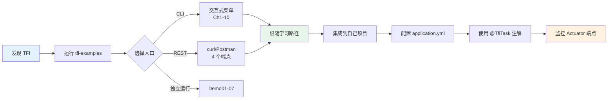

# tfi-examples 模块 — 产品需求文档 (PRD)

> **作者**: 资深产品经理  
> **日期**: 2026-02-16  
> **最后更新**: 2026-02-18（v2.1: Ch9/Ch10 落地 + 学习路径完整）  
> **版本**: v2.1  
> **范围**: 仅 tfi-examples 模块  
> **SSOT 数据源**: [index.md §0](index.md#0-ssot-关键指标速查)  
> **整体项目 PRD**: [project-overview/prd.md](project-overview/prd.md)

---

## 目录

1. [模块定位](#1-模块定位)
2. [目标用户](#2-目标用户)
3. [学习路径设计](#3-学习路径设计)
4. [章节内容评审](#4-章节内容评审)
5. [Compare Demo 用户体验](#5-compare-demo-用户体验)
6. [双入口体验](#6-双入口体验)
7. [代码行数与 API 覆盖分析](#7-代码行数与-api-覆盖分析)
8. [功能完整度评估](#8-功能完整度评估)
9. [竞品 Demo 对比](#9-竞品-demo-对比)
10. [产品改进建议](#10-产品改进建议)

---

## 1. 模块定位

`tfi-examples` 是 TFI 产品的 **第一接触点**，直接影响用户对 TFI 的第一印象和采纳意愿。

| 职责 | 重要度 | 完成度 |
|------|:------:|:------:|
| 快速入门引导 | ⭐⭐⭐⭐⭐ | 85% |
| API 用法演示 | ⭐⭐⭐⭐⭐ | 80% |
| 最佳实践传递 | ⭐⭐⭐⭐ | 70% |
| 性能基准参考 | ⭐⭐⭐ | 80% |
| 集成样板项目 | ⭐⭐⭐ | 60% |

> **改善**: 经过 TFI Facade API 重构，97% 的源文件已使用官方 Facade，"零侵入"产品定位得到有效体现。

### 用户旅程图



---

## 2. 目标用户

### 按技术水平

| 用户 | 关注点 | 对应内容 | 体验 |
|------|--------|----------|:----:|
| **新手开发** | 5 分钟跑通 | Chapter 1-2 + Demo01-04 | ⭐⭐⭐⭐ |
| **中级开发** | 变更追踪 + 比对 | Chapter 5-6, Ch8 + Demo05-07 | ⭐⭐⭐ |
| **高级开发** | SPI 扩展 + 性能 | JMH 基准 + AnnotationDemo | ⭐⭐⭐ |
| **架构师** | 集成方案 | DemoController + 配置 | ⭐⭐⭐ |

> **改善**: Ch8 (对象比对入门) 补全了中级用户的学习路径断崖问题。

### 按使用场景

| 场景 | 用户操作 | 当前支持 |
|------|----------|:--------:|
| CLI 交互演示 | `./mvnw exec:java` | ✅ |
| Spring Boot REST | `./mvnw spring-boot:run` + curl | ✅ |
| 复制代码到自己项目 | 参考 Demo 源码 | ✅ 97% 使用 Facade |
| 性能评估 | JMH 基准 | ✅ |
| 学习 @TfiTask 注解 | Ch10 Spring 集成 | ✅ |
| 学习 @Entity/@ValueObject/@Key 注解 | Ch9 注解系统 | ✅ |

---

## 3. 学习路径设计

### 3.1 当前路径

```
新手 ──────────────────────────────────────────────────────────→ 高级
Ch1    Ch2    Ch3    Ch4    Ch5    Ch6    Ch7    Ch8    Ch9    Ch10
快速   电商   高级   最佳   高级   变更   异步   比对   注解   Spring
入门   场景   特性   实践   API    追踪   传播   入门   系统   集成
 ✅     ✅     ✅     ✅     ✅     ✅     ✅     ✅     ✅     ✅

Demo01  Demo02  Demo03  Demo04  Demo05  Demo05L  Demo06  Demo07
基本    日期    对象    集合    集合    List     Set     Map
类型    时间    定制    比对    实体    实体     实体    实体
 ✅      ✅      ✅      ✅      ✅      ✅      ⚠️      ✅
```

> **改善**: Ch9 (注解系统) 和 Ch10 (Spring 集成) 已实现，学习路径完整覆盖 10 章。
> Demo01-05/05L/07 已改用 TFI Facade API。仅 Demo06 待清理。

**剩余问题**:
1. **章节与 Compare Demo 仍有割裂**: 用户需自行发现 Demo01-07
2. ~~@TfiTask/@Entity 注解系统无独立章节~~ → ✅ Ch9 已实现
3. ~~Spring 集成（Actuator/配置）无独立章节~~ → ✅ Ch10 已实现

---

## 4. 章节内容评审

### 4.1 各章节产品评审

| 章节 | 行数 | 用户类型 | 学习目标 | 达成度 | 问题 |
|:----:|:----:|----------|----------|:------:|------|
| 1 | 93 | 新手 | run/call/message | ⭐⭐⭐⭐ | 无 |
| 2 | 298 | 新手 | 业务建模 | ⭐⭐⭐⭐ | 无 |
| 3 | 243 | 中级 | 并发/异常 | ⭐⭐⭐ | measurePerformance 应 static |
| 4 | 129 | 中级 | 导出格式 | ⭐⭐⭐⭐ | 无 |
| 5 | 176 | 高级 | enable/query | ⭐⭐⭐⭐ | 无 |
| 6 | 260 | 中级 | track/withTracked | ⭐⭐⭐ | — |
| 7 | 69 | 高级 | 异步传播 | ⭐⭐⭐ | — |
| **8** | **243** | **中级** | **compare/render/comparator** | **⭐⭐⭐⭐** | **无** |
| **9** | **220** | **中级** | **@Entity/@ValueObject/@Key/@DiffIgnore/@NumericPrecision** | **⭐⭐⭐⭐** | **无** |
| **10** | **200** | **中级** | **@TfiTask/配置/Actuator/REST集成** | **⭐⭐⭐⭐** | **无** |

### 4.2 TFI Facade API 章节覆盖情况

| TFI Facade API | 有章节覆盖 | 有 Demo 覆盖 | 缺失 |
|---------|:----------:|:------------:|:----:|
| stage() | ✅ Ch1,5 | — | — |
| run()/call() | ✅ Ch1,2,3 | — | — |
| message()/error() | ✅ Ch1,2,3 | — | — |
| exportToConsole/Json/Map | ✅ Ch4 | — | — |
| enable()/disable() | ✅ Ch5 | — | — |
| getCurrentTask()/getTaskStack() | ✅ Ch5 | — | — |
| track()/withTracked() | ✅ Ch6 | — | — |
| **compare()/render()** | **✅ Ch8** | ✅ Demo01-05 | — |
| **comparator() 链式** | **✅ Ch8** | ✅ Demo01-04 | — |
| **@Entity/@ValueObject/@Key** | **✅ Ch9** | ✅ Demo03-07 | — |
| **@DiffIgnore/@NumericPrecision** | **✅ Ch9** | — | — |
| **@TfiTask 注解** | **✅ Ch10** | ✅ AnnotationDemo | — |
| **Actuator 端点** | **✅ Ch10** | ✅ DemoController | — |
| **tfi.* 配置体系** | **✅ Ch10** | — | — |

---

## 5. Compare Demo 用户体验

### 5.1 渐进难度分析

| Demo | 难度 | 行数 | 用户友好度 | 原因 |
|------|:----:|:----:|:----------:|------|
| Demo01 | ★☆☆ | 226 | ⭐⭐⭐⭐ | TFI Facade API, 简单类型 |
| Demo02 | ★☆☆ | 273 | ⭐⭐⭐⭐ | TFI Facade API, 日期 |
| Demo03 | ★★☆ | 259 | ⭐⭐⭐⭐ | TFI Facade API, @Entity |
| Demo04 | ★★☆ | 163 | ⭐⭐⭐⭐ | TFI Facade API, 集合 |
| Demo05 | ★★★ | 251 | ⭐⭐⭐⭐ | TFI Facade API, Entity List |
| Demo05_List | ★★★ | 233 | ⭐⭐⭐ | 已重构为 TFI Facade API |
| **Demo06** | ★★★★ | 960 | **⭐⭐** | **仍残留内部 API (9 处)** |
| Demo07 | ★★★★ | 782 | ⭐⭐⭐ | TFI Facade API |

> **改善**: Demo05_List 已完成 Facade 重构，学习曲线断崖显著缓解。

### 5.2 Demo 命名

| 当前命名 | 说明 |
|----------|------|
| Demo05 vs Demo05_List | 两个都是集合实体比对，Demo05 为 Facade 简版，Demo05_List 为详细版 |
| 无统一前缀 | 建议统一为 `CompareDemo01_BasicTypes` 格式 |

---

## 6. 双入口体验

### 6.1 CLI 入口

| 优势 | 改善 |
|------|------|
| 交互式菜单 | 已支持全部 10 章 |
| 渐进式演示 | — |
| 可指定章节运行 | — |

### 6.2 Spring Boot 入口

| 优势 | 问题 |
|------|------|
| REST 端点可 curl | 仅 4 个端点 |
| Actuator 可用 | 无 Swagger/OpenAPI 文档 |
| AOP 注解生效 | — |

**改善**: DemoControllerTest 已覆盖全部 4 个端点。

### 6.3 用户触达矩阵

| 功能 | CLI 可达 | REST 可达 | 独立运行可达 |
|------|:--------:|:---------:|:------------:|
| Ch1-10 | ✅ | ❌ | ❌ |
| Demo01-07 | ❌ | ❌ | ✅ `mvn exec:java` |
| REST 端点 | ❌ | ✅ | ❌ |
| JMH 基准 | ❌ | ❌ | ✅ `-P bench` |

---

## 7. 代码行数与 API 覆盖分析

### 7.1 代码分布

```
总计 ~7,100 行主源码:

章节框架 (core/):          ~93 行 (1%)
章节实现 (chapters/):   ~2,000 行 (28%)    ← TFI Facade API ✅ (10 章)
Compare Demo01-05:        ~1,172 行 (18%)    ← TFI Facade API ✅
Compare Demo05L/06/07:   ~1,975 行 (30%)    ← Demo06 残留内部 API ⚠️
变更追踪 Demo:              ~402 行 (6%)     ← TFI Facade API ✅
辅助类 + 模型:             ~1,048 行 (16%)
配置 + 入口:               ~359 行 (5%)
```

### 7.2 API 使用一致性

| 类别 | 文件数 | 占比 |
|------|:------:|:----:|
| **纯 TFI Facade API** | 37 | **97%** |
| **混用内部 API** | 1 (Demo06) | 3% |

> **改善**: 从初始评审的 56% 内部 API 使用降至仅 3%（单文件 Demo06）。新增 Ch9/Ch10 均使用纯 Facade API。

---

## 8. 功能完整度评估

| 功能域 | 有演示 | 质量 | 缺失 |
|--------|:------:|:----:|------|
| Session/Task/Stage | ✅ | ⭐⭐⭐⭐ | — |
| Message 分类 | ✅ | ⭐⭐⭐⭐ | — |
| 导出 (Console/JSON/Map) | ✅ | ⭐⭐⭐⭐ | — |
| enable/disable | ✅ | ⭐⭐⭐⭐ | — |
| 变更追踪 (track/withTracked) | ✅ | ⭐⭐⭐ | — |
| 对象比对 (基本类型) | ✅ | ⭐⭐⭐⭐ | — |
| 对象比对 (集合) | ✅ | ⭐⭐⭐ | Demo06 待清理 |
| **对象比对入门 (Ch8)** | **✅** | **⭐⭐⭐⭐** | — |
| **注解系统 (Ch9)** | **✅** | **⭐⭐⭐⭐** | — |
| **@TfiTask/Actuator/配置 (Ch10)** | **✅** | **⭐⭐⭐⭐** | — |
| SPI Provider (v4.0.0) | ❌ | — | 远期 |
| ComparatorBuilder 高级 | ✅ | ⭐⭐⭐⭐ | Ch8 覆盖 |
| 异步传播 | ✅ | ⭐⭐⭐ | — |

---

## 9. 竞品 Demo 对比

| 维度 | TFI examples | javers samples | Spring Boot samples |
|------|:------------:|:--------------:|:-------------------:|
| 文档完整度 | ⭐⭐⭐ | ⭐⭐⭐⭐ | ⭐⭐⭐⭐⭐ |
| API 一致性 | ⭐⭐⭐⭐ | ⭐⭐⭐⭐ | ⭐⭐⭐⭐⭐ |
| 渐进式教学 | ⭐⭐⭐⭐ | ⭐⭐⭐ | ⭐⭐⭐⭐ |
| 可直接复制 | ⭐⭐⭐⭐ | ⭐⭐⭐⭐ | ⭐⭐⭐⭐⭐ |
| 交互性 | ⭐⭐⭐⭐ | ⭐⭐ | ⭐⭐⭐ |

> **改善**: API 一致性从 ⭐⭐ 提升到 ⭐⭐⭐⭐（97% Facade），渐进式教学和可复制性同步提升。

---

## 10. 产品改进建议

### P0（必须，1 周内）

| # | 建议 | 预期效果 | 状态 |
|---|------|----------|:----:|
| ~~1~~ | ~~Demo05_List/Demo07 重写为 TFI.comparator()~~ | ~~API 一致性~~ | ✅ 已完成 |
| ~~2~~ | ~~CT Comprehensive/BestPractice 重写为 TFI Facade~~ | ~~最佳实践名副其实~~ | ✅ 已完成 |
| ~~3~~ | ~~删除 Demo01_org~~ | ~~消除用户困惑~~ | ✅ 已完成 |
| 4 | Demo06 剩余内部 API 清理 | API 一致性 100% | 待处理 |

### P1（重要，2 周内）

| # | 建议 | 预期效果 | 状态 |
|---|------|----------|:----:|
| ~~5~~ | ~~新增 Chapter 8: 对象比对入门~~ | ~~补全学习路径~~ | ✅ 已完成 |
| 6 | 新增 Chapter 9: 注解系统 | 覆盖 @Entity/@Key | 待新建 |
| ~~7~~ | ~~抽取共享模型到 model 包~~ | ~~消除重复~~ | ✅ 已完成 |
| 8 | 每个 Demo 类头部添加"学习目标"注释 | 明确学习收益 | 待处理 |

### P2（锦上添花，1 月内）

| # | 建议 | 预期效果 | 状态 |
|---|------|----------|:----:|
| 9 | 新增 Chapter 10: Spring 集成 | 覆盖 Actuator + 配置 | 待新建 |
| 10 | DemoController 添加 Swagger | REST 体验提升 | 待处理 |
| 11 | 中文 Quick Start Guide | 降低国内用户门槛 | 待处理 |
| 12 | Demo 统一命名: `CompareDemo01_BasicTypes` | 命名清晰 | 待处理 |
