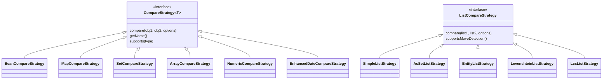

# TaskFlowInsight 整体项目 — 开发设计文档

> **SSOT 数据源**: [../index.md §0](../index.md#0-ssot-关键指标速查)  
> **作者**: 资深开发专家（Spring Boot 领域）  
> **日期**: 2026-02-16  
> **版本**: v1.1  
> **最后更新**: 2026-02-18  
> **分支**: feature/v4.0.0-routing-refactor  
> **范围**: 全项目（tfi-flow-core / tfi-compare / tfi-ops-spring / tfi-flow-spring-starter / tfi-all）

---

## 1. 架构总览

### 1.1 系统定位

TaskFlowInsight 是一个 **非侵入式、零泄漏** 的业务流程追踪与变更检测库：

- **开发调试工具**: 自动生成业务流程树，快速定位执行路径
- **变更审计引擎**: 深度对象比对，支持 Entity/ValueObject 语义
- **运行时观测**: Spring Actuator 集成，Prometheus 指标导出

### 1.2 分层架构

```
┌─────────────────────────────────────────────────┐
│                   用户层                          │
│         TFI Facade API / @TfiTask 注解           │
├─────────────────────────────────────────────────┤
│                   能力层                          │
│  ┌──────────┐  ┌──────────┐  ┌──────────┐      │
│  │ Flow     │  │ Compare  │  │ Ops      │      │
│  │ Engine   │  │ Engine   │  │ Monitor  │      │
│  └──────────┘  └──────────┘  └──────────┘      │
├─────────────────────────────────────────────────┤
│                   基础设施层                       │
│  ThreadLocal · Caffeine · Micrometer · SPI      │
├─────────────────────────────────────────────────┤
│                   Spring 集成层                    │
│  AOP · Actuator · AutoConfiguration · SpEL      │
└─────────────────────────────────────────────────┘
```

### 1.3 模块依赖图

```mermaid
flowchart TB
    subgraph external["外部依赖"]
        FC[tfi-flow-core]
    end

    subgraph internal["内部模块"]
        FS[tfi-flow-spring-starter<br/>AOP, @TfiTask]
        CMP[tfi-compare<br/>Compare, Diff, Tracking]
        OPS[tfi-ops-spring<br/>Actuator, Metrics]
    end

    subgraph aggregate["聚合层"]
        ALL[tfi-all<br/>聚合 JAR, TFI Facade]
    end

    subgraph demo["演示层"]
        EX[tfi-examples<br/>10 章节, 38 源文件, ~7,100 行]
    end

    FC --> FS
    FC --> CMP
    FC --> OPS
    FS --> ALL
    CMP --> ALL
    OPS --> ALL
    ALL --> EX
```



```
tfi-flow-core (外部)
    ↑
    ├── tfi-flow-spring-starter (AOP, @TfiTask)
    ├── tfi-compare (Compare, Diff, Tracking)
    └── tfi-ops-spring (Actuator, Metrics)
            ↑
            └── tfi-all (聚合 JAR, TFI Facade)
                    ↑
                    └── tfi-examples (演示 + 基准测试)
```

---

## 2. 各模块设计

### 2.1 tfi-flow-core（核心流引擎）

| 组件 | 职责 |
|------|------|
| `ManagedThreadContext` | ThreadLocal 流上下文管理 |
| `SafeContextManager` | 单例模式，异步传播，泄漏检测 |
| `ZeroLeakThreadLocalManager` | ThreadLocal 诊断与清理 |
| `TfiFlow` | 流操作核心（stage/message） |
| `FlowProvider` | SPI 流提供者接口 |

### 2.2 tfi-flow-spring-starter（Spring 启动器）

| 组件 | 职责 |
|------|------|
| `TfiAnnotationAspect` | @TfiTask/@TfiTrack AOP 处理 |
| `ContextMonitoringAutoConfiguration` | 上下文监控自动配置 |
| `ChangeTrackingAutoConfiguration` | 变更追踪自动配置 |

⚠️ **模块零测试覆盖是主要风险。**

### 2.3 tfi-compare（比对引擎）

**比对策略体系**:



```
CompareStrategy<T> 族:
├── BeanCompareStrategy          ← 对象字段级比对
├── MapCompareStrategy           ← Map 键值比对
├── SetCompareStrategy           ← Set 集合比对
├── ArrayCompareStrategy         ← 数组比对
├── NumericCompareStrategy       ← 数值精度（@NumericPrecision）
└── EnhancedDateCompareStrategy  ← 日期格式（@DateFormat）

ListCompareStrategy 族（列表比对，内部路由）:
├── SimpleListStrategy           ← 按索引逐一比对
├── AsSetListStrategy            ← 集合语义（无序）
├── EntityListStrategy           ← @Entity @Key 匹配
├── LevenshteinListStrategy      ← 编辑距离，移动检测
└── LcsListStrategy              ← LCS 算法，移动检测
```

**路径系统（Path System）**:

变更路径用于精确定位对象图中的变更位置，支持去重与仲裁：

| 组件 | 职责 |
|------|------|
| `PathBuilder` | 统一路径构建器，生成 `parent["key"]`、`list[0]`、`root.field` 等格式；支持 Map 键双引号/单引号、特殊字符转义、链式调用；内置 `ConcurrentHashMap` 缓存优化 |
| `PathDeduplicator` | 路径去重执行器，基于对象图的最具体路径原则；集成 `PathCollector` 收集候选、`PathArbiter` 裁决；支持 `PathDeduplicationConfig` 配置（maxCandidates、cache、depth）；提供统计（duplicatesRemoved、cacheHit） |
| `PathArbiter` | 路径裁决器，实现最具体路径选择算法：1) 深度优先（深度越大越具体）2) 访问类型权重（FIELD > MAP_KEY > ARRAY_INDEX > SET_ELEMENT）3) 字典序 4) 稳定标识；支持 `PathCandidate`、`AccessType`、`PriorityCalculator`、`PathCache` |

### 2.4 tfi-ops-spring（运维监控）

| 组件 | 职责 |
|------|------|
| `SecureTfiEndpoint` | 安全 TFI Actuator 端点 |
| `TfiHealthIndicator` | 健康检查指示器 |
| `Store` / `CaffeineStore` | 缓存存储抽象 |
| `StoreAutoDegrader` | 存储自动降级 |

⚠️ **模块零测试覆盖。**

### 2.5 tfi-all（聚合 + Facade）

| 组件 | 职责 |
|------|------|
| `TFI` | Facade 入口（60+ 公开方法） |
| `TfiCore` | 核心引擎初始化 |
| `ProviderRegistry` | SPI 提供者注册表 (v4.0.0) |

---

## 3. TFI Facade 核心 API

### 3.1 系统控制

| 方法 | 说明 |
|------|------|
| `TFI.enable()` | 启用 TFI 系统 |
| `TFI.disable()` | 禁用 TFI 系统 |
| `TFI.isEnabled()` | 检查系统是否启用 |
| `TFI.clear()` | 清理当前线程所有上下文 |

### 3.2 会话与任务

| 方法 | 说明 |
|------|------|
| `TFI.startSession(name)` → String | 开始新会话，返回 sessionId |
| `TFI.endSession()` | 结束当前会话，清理变更追踪 |
| `TFI.stage(name)` → TaskContext | 创建 AutoCloseable 阶段（推荐 try-with-resources） |
| `TFI.stage(name, StageFunction<T>)` → T | 函数式 Stage API |
| `TFI.start(name)` → TaskContext | 开始任务，返回 TaskContext |
| `TFI.stop()` | 结束当前任务，刷新变更记录 |
| `TFI.run(name, Runnable)` | 在任务中执行 Runnable |
| `TFI.call(name, Callable<T>)` → T | 在任务中执行 Callable 并返回结果 |

### 3.3 消息记录

| 方法 | 说明 |
|------|------|
| `TFI.message(content, MessageType)` | 记录指定类型消息 |
| `TFI.message(content, customLabel)` | 记录自定义标签消息 |
| `TFI.error(content)` | 记录错误消息 |
| `TFI.error(content, Throwable)` | 记录错误及异常堆栈 |

### 3.4 上下文查询

| 方法 | 说明 |
|------|------|
| `TFI.getCurrentSession()` → Session | 获取当前会话 |
| `TFI.getCurrentTask()` → TaskNode | 获取当前任务节点 |
| `TFI.getTaskStack()` → List\<TaskNode\> | 获取任务栈 |

### 3.5 变更追踪

| 方法 | 说明 |
|------|------|
| `TFI.track(name, target, fields...)` | 浅层追踪指定字段 |
| `TFI.trackAll(Map<String,Object>)` | 批量追踪多个对象 |
| `TFI.trackDeep(name, target)` | 深度追踪整个对象图 |
| `TFI.trackDeep(name, target, TrackingOptions)` | 深度追踪（可配置 maxDepth 等） |
| `TFI.trackingOptions()` → Builder | 构建追踪选项 |
| `TFI.getChanges()` → List\<ChangeRecord\> | 获取当前任务变更 |
| `TFI.getAllChanges()` → List\<ChangeRecord\> | 获取所有变更 |
| `TFI.startTracking(name)` | 开始追踪会话 |
| `TFI.recordChange(...)` | 手动记录变更 |
| `TFI.clearTracking(sessionId)` | 清理指定会话追踪 |
| `TFI.clearAllTracking()` | 清理所有追踪 |
| `TFI.withTracked(name, target, action, fields...)` | 在追踪上下文中执行动作 |
| `TFI.setChangeTrackingEnabled(boolean)` | 开关变更追踪 |
| `TFI.isChangeTrackingEnabled()` | 检查变更追踪是否启用 |

### 3.6 导出

| 方法 | 说明 |
|------|------|
| `TFI.exportToConsole()` | 导出到控制台 |
| `TFI.exportToConsole(showTimestamp)` | 导出到控制台（可选时间戳） |
| `TFI.exportToJson()` → String | 导出为 JSON |
| `TFI.exportToMap()` → Map | 导出为 Map 结构 |

### 3.7 比对与渲染

| 方法 | 说明 |
|------|------|
| `TFI.compare(a, b)` → CompareResult | 比对两个对象 |
| `TFI.comparator()` → ComparatorBuilder | 获取比对构建器 |
| `TFI.render(result, style)` → String | 将 CompareResult 渲染为 Markdown 等格式 |

### 3.8 SPI 扩展（v4.0.0）

| 方法 | 说明 |
|------|------|
| `TFI.registerComparisonProvider(provider)` | 注册比对 Provider |
| `TFI.registerTrackingProvider(provider)` | 注册追踪 Provider |
| `TFI.registerFlowProvider(provider)` | 注册流 Provider |
| `TFI.registerRenderProvider(provider)` | 注册渲染 Provider |
| `TFI.registerExportProvider(provider)` | 注册导出 Provider |
| `TFI.loadProviders(ClassLoader)` | 从 ClassLoader 加载 Provider |

---

## 4. 设计模式

| 模式 | 应用 | 质量 |
|------|------|:----:|
| Facade | TFI 统一入口 | ⭐⭐⭐⭐⭐ |
| Strategy | CompareStrategy, ListCompareStrategy | ⭐⭐⭐⭐⭐ |
| Provider/SPI | 5 类 Provider | ⭐⭐⭐⭐ |
| Builder | ComparatorBuilder, TrackingOptions.Builder | ⭐⭐⭐⭐ |
| AutoCloseable | stage() 返回 TaskContext | ⭐⭐⭐⭐⭐ |
| Double-Check Locking | TfiCore 初始化 | ⭐⭐⭐⭐ |

---

## 5. 线程安全

| 机制 | 使用场景 |
|------|----------|
| `volatile` | TfiCore 共享标志位 |
| `synchronized(TFI.class)` | 初始化互斥 |
| `ConcurrentHashMap` | 策略缓存、Store 存储 |
| `ThreadLocal` | 追踪快照、流上下文 |
| `AtomicLong` | 计数器、指标 |

---

## 6. 异常处理

> **TFI 绝不向用户代码抛出异常** — 所有异常内部捕获并记录日志。

| 级别 | 处理方式 |
|------|----------|
| WARN | 记录日志，返回安全默认值 |
| ERROR | 记录日志 + 指标，返回安全默认值 |
| FATAL | 记录日志 + 告警，触发降级 |

---

## 7. 整体项目代码评分

| 维度 | 评分 | 权重 | 加权分 |
|------|:----:|:----:|:------:|
| 架构清晰度 | 9 | 15% | 1.35 |
| API 设计 | 9 | 15% | 1.35 |
| 可扩展性 | 8 | 10% | 0.80 |
| 代码可读性 | 8 | 10% | 0.80 |
| 异常安全 | 9 | 10% | 0.90 |
| 线程安全 | 9 | 10% | 0.90 |
| 测试覆盖 | 7 | 10% | 0.70 |
| 文档完整度 | 7 | 5% | 0.35 |
| 配置管理 | 8 | 5% | 0.40 |
| Spring 集成 | 8 | 10% | 0.80 |
| **总计** | | **100%** | **8.35 (A 级)** |

### 各模块评分

| 模块 | 设计 | 实现 | 测试 | 综合 |
|------|:----:|:----:|:----:|:----:|
| tfi-flow-core | 9 | 9 | 8 | 8.5 |
| tfi-compare | 9 | 8 | 8 | 8.0 |
| tfi-all (Facade) | 9 | 9 | 8 | 8.5 |
| tfi-ops-spring | 8 | 7 | 3 | 6.0 |
| tfi-flow-spring-starter | 8 | 8 | 2 | 5.8 |

---

## 8. 整体技术债务

| # | 描述 | 优先级 |
|---|------|:------:|
| TD-01 | tfi-flow-spring-starter 零测试 | P0 |
| TD-02 | tfi-ops-spring 零测试 | P0 |
| TD-03 | SpotBugs `failOnError=false` | P0 |
| TD-04 | Checkstyle `maxAllowedViolations=30000` | P1 |
| TD-05 | TFI Facade 60+ 公开方法，API 表面积过大 | P1 |
| TD-06 | tfi-flow-core 作为外部依赖，版本同步风险 | P1 |
| TD-07 | `TfiRoutingGoldenTest` @Disabled | P1 |
| TD-08 | JaCoCo 仅 tfi-all 启用 | P2 |
| TD-09 | 配置项缺少 schema 文档 | P2 |

---

## 9. 配置体系

```yaml
tfi:
  enabled: true                              # 主开关
  annotation.enabled: true                   # @TfiTask 注解支持
  api.routing.enabled: false                 # Provider 路由 (v4.0.0)
  change-tracking:
    snapshot.max-depth: 10                   # 最大遍历深度
    snapshot.exclude-patterns: ["*.password"] # 敏感字段排除
  compare:
    auto-route.lcs.enabled: true             # LCS 移动检测
    degradation.enabled: true                # 自动降级
```

---

## 10. 关键设计决策

### 10.1 ThreadLocal vs ScopedValue

**决策**: 采用 `ThreadLocal` 管理流上下文，而非 Java 21 的 `ScopedValue`。

**理由**: TFI 需支持异步上下文传播（`TFIAwareExecutor`、`ContextPropagatingExecutor`），`ThreadLocal` 与 `InheritableThreadLocal` 组合已在生产验证；`ScopedValue` 为不可继承设计，需额外适配层。当前 `SafeContextManager` + `ZeroLeakThreadLocalManager` 已实现零泄漏保证，迁移收益有限。

**权衡**: 未来若 JDK 提供 `ScopedValue` 的继承/传播能力，可评估迁移。

### 10.2 Facade 模式作为统一入口

**决策**: 使用 `TFI` 静态 Facade 作为唯一公开 API 入口，内部委托 `TfiCore`、`CompareService`、各 Provider。

**理由**: 1) 降低用户心智负担，单类即可完成所有操作；2) 异常安全：Facade 层统一捕获异常、记录日志、返回安全默认值，绝不向用户代码抛出；3) 禁用态快速返回，避免不必要初始化；4) 便于 Spring 可选：无 Spring 时通过 `ApplicationReadyEvent` 或懒加载兜底初始化。

**权衡**: 60+ 公开方法导致 API 表面积过大（TD-05），后续可考虑按领域拆分子 Facade（如 `TFI.Flow`、`TFI.Tracking`）。

### 10.3 SPI 扩展体系

**决策**: 通过 5 类 Provider（Flow、Tracking、Comparison、Render、Export）实现可插拔扩展，v4.0.0 引入 `tfi.api.routing.enabled` 控制路由。

**理由**: 1) 支持纯 Java 与 Spring 双模式运行；2) 测试可注入 Mock Provider；3) 第三方可替换实现（如自定义 SnapshotProvider、CompareStrategy）；4) ServiceLoader 与 Spring Bean 双发现机制。

**权衡**: 路由逻辑增加分支复杂度，默认关闭以保持 v3.0.0 行为兼容。

### 10.4 变更路径去重与仲裁

**决策**: 引入 `PathBuilder` + `PathDeduplicator` + `PathArbiter` 三层路径系统，实现 CARD-CT-ALIGN 语义。

**理由**: 深度比对会产生大量冗余路径（如 `order.items[0]` 与 `order.items[0].name` 同时存在），PathDeduplicator 基于对象图收集候选，PathArbiter 按深度、访问类型权重、字典序裁决「最具体路径」，消除噪声并保证可重现。

**权衡**: 配置项（maxCandidates、cache、depth）需调优，大对象图可能触发降级。

---

## 版本变更记录

| 版本 | 日期 | 变更摘要 |
|------|------|----------|
| v1.0 | 2026-02-16 | 初版：架构总览、模块设计、API、设计模式、线程安全、异常处理、评分、技术债务、配置 |
| v1.1 | 2026-02-18 | 新增 SSOT 引用、模块依赖 Mermaid 图、比对策略类图、路径系统详解、TFI API 分类表、关键设计决策、版本变更记录 |
