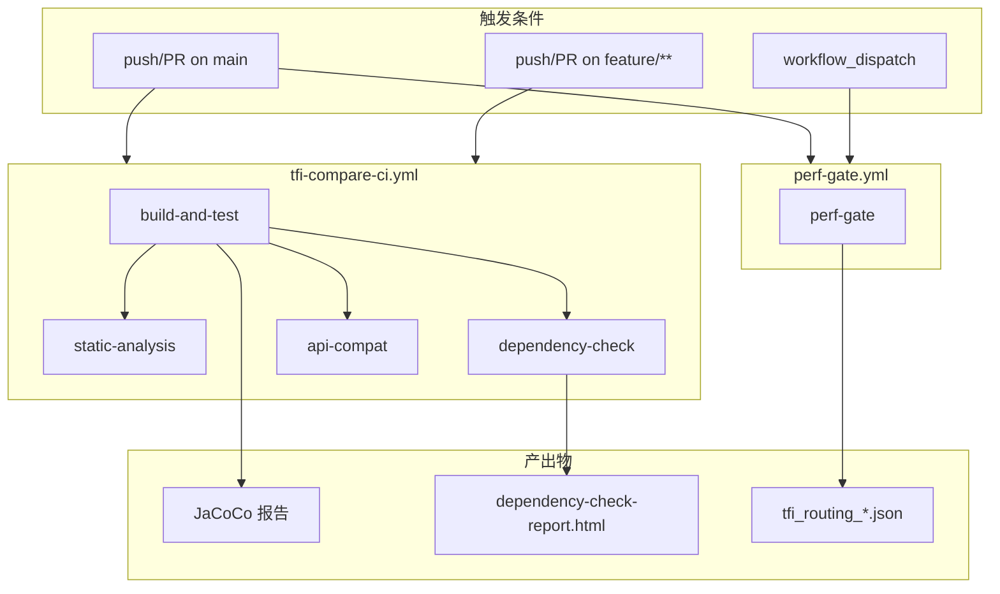

# TaskFlowInsight 整体项目 — 运维文档

> **SSOT 数据源**: [../index.md §0](../index.md#0-ssot-关键指标速查)  
> **作者**: 资深运维专家  
> **日期**: 2026-02-16  
> **版本**: v1.1  
> **最后更新**: 2026-02-18  
> **范围**: 全项目 CI/CD、监控、安全

---

## 1. 运维概述

TFI 是 Java 库，通过 Maven 依赖集成到宿主应用，运维关注：配置、监控、CI/CD、安全。

---

## 2. 构建命令

```bash
./mvnw clean verify          # 完整构建 + 测试 + 质量检查
./mvnw clean package -DskipTests  # 快速打包
./mvnw test -Dtest=ClassName  # 指定测试
./mvnw clean test jacoco:report   # 覆盖率报告
./mvnw spotbugs:check         # SpotBugs
./mvnw checkstyle:check       # Checkstyle
./mvnw pmd:check              # PMD
```

---

## 3. CI/CD 流水线

### 流水线流程图



### tfi-compare-ci.yml

- **触发**: push/PR on main, feature/**（路径过滤：tfi-compare/**）
- **并发**: 同 workflow+ref 取消进行中

| Job | 描述 | 产出物 |
|-----|------|--------|
| build-and-test | Java 21 编译、单元测试、JaCoCo 报告 | `tfi-compare/target/site/jacoco/`（保留 14 天） |
| static-analysis | SpotBugs、Checkstyle、PMD（后两者 continue-on-error） | 无 |
| dependency-check | OWASP Dependency-Check 漏洞扫描 | `dependency-check-report.html`（保留 14 天） |
| api-compat | API 表面兼容性测试（ApiSurfaceCompatibilityTests） | 无 |

### perf-gate.yml

- **触发**: push/PR on main、workflow_dispatch
- **门禁**: < 5% 性能退化（`-Dtfi.perf.strict=true`）

| Job | 描述 | 产出物 |
|-----|------|--------|
| perf-gate | 安装全模块、JMH 基准、PerfGateIT 验证 | `tfi_routing_enabled.json`, `tfi_routing_legacy.json` |

### 其他 CI 工作流

| 工作流 | 触发路径 | 主要 Job |
|--------|----------|----------|
| tfi-examples-ci | tfi-examples/** | build-and-test（单元测试） |
| tfi-all-ci | tfi-all/** | build-and-test + JaCoCo |
| tfi-flow-core-ci | tfi-flow-core/** | build-and-test |
| tfi-flow-spring-starter-ci | tfi-flow-spring-starter/** | build-and-test |
| tfi-ops-spring-ci | tfi-ops-spring/** | build-and-test |

### 流水线缺口

| 问题 | 风险 |
|------|------|
| 仅覆盖 tfi-compare | **高**: 其余模块无 CI |
| SpotBugs/Checkstyle/PMD 不阻断构建 | **高**: 质量阀门失效 |
| OWASP 仅 tfi-compare | 中 |

### 3.1 质量门禁详情

| 门禁 | 阈值/配置 | 阻断构建 |
|------|-----------|:--------:|
| **JaCoCo** | INSTRUCTION 覆盖率 ≥ 50%（排除 model/demo） | ✅ |
| **SpotBugs** | effort=Max, threshold=High | ✅ |
| **Checkstyle** | google_checks.xml, maxAllowedViolations=30000 | ❌ (continue-on-error) |
| **PMD** | bestpractices/codestyle/design/errorprone/performance/security | ❌ (continue-on-error) |
| **perf-gate** | < 5% 性能退化 | ❌ (continue-on-error) |

---

## 4. 监控

### Prometheus 指标

| 指标 | 类型 |
|------|------|
| `tfi_stage_duration_seconds` | Histogram |
| `tfi_compare_duration_seconds` | Histogram |
| `tfi_tracking_objects_count` | Gauge |
| `tfi_errors_total` | Counter |

### 健康检查 (TfiHealthIndicator)

| 维度 | 阈值 |
|------|------|
| 内存增量 | < 10MB |
| CPU | < 0.1% |
| 缓存命中率 | > 95% |
| 错误率 | < 1% |
| 健康评分 | ≥ 70: UP, < 50: DOWN |

### Grafana 仪表盘建议

| 面板 | 查询示例 | 说明 |
|------|----------|------|
| Stage P99 延迟 | `histogram_quantile(0.99, rate(tfi_stage_duration_seconds_bucket[5m]))` | 流程阶段耗时 |
| Compare P99 延迟 | `histogram_quantile(0.99, rate(tfi_compare_duration_seconds_bucket[5m]))` | 比对耗时 |
| 追踪对象数 | `tfi_tracking_objects_count` | 内存水位 |
| 错误率 | `rate(tfi_errors_total[5m])` | 内部错误趋势 |
| 健康评分 | `/actuator/health` JSON 解析 | 综合健康 |

**Scrape 配置**：`/actuator/prometheus`，建议 15s 间隔。

**Grafana 配置步骤**：

1. 添加 Prometheus 数据源，指向宿主应用 scrape 目标
2. 新建 Dashboard，导入上述查询（或使用 JSON 模板）
3. 变量：`$instance`（应用实例）、`$job`（可选）
4. 建议面板：单值图（健康评分）、折线图（P99 延迟）、仪表盘（追踪对象数）

### 4.1 告警规则建议

| 告警名 | 条件 | 严重度 | 建议动作 |
|--------|------|:------:|----------|
| TFI 错误率过高 | `rate(tfi_errors_total[5m]) > 0.1` | P1 | 检查日志、排查异常 |
| 追踪对象超限 | `tfi_tracking_objects_count > 800` | P1 | 调用 `TFI.clearAllTracking()`、检查泄漏 |
| Stage P99 延迟异常 | `histogram_quantile(0.99, tfi_stage_duration_seconds_bucket) > 5` | P2 | 排查慢阶段、优化 |
| Compare P99 延迟异常 | `histogram_quantile(0.99, tfi_compare_duration_seconds_bucket) > 5` | P2 | 检查大对象、max-depth |
| 健康评分下降 | `/actuator/health` 中 `health.score < 70` | P1 | 按 TfiHealthIndicator 维度排查 |

---

## 5. 安全

| 维度 | 状态 |
|------|------|
| 敏感字段屏蔽 | ✅ exclude-patterns |
| Actuator 安全 | ✅ SecureTfiEndpoint |
| OWASP 扫描 | ✅ tfi-compare（需扩展） |
| SpotBugs | ✅ 但未阻断构建 |

---

## 6. 配置管理

```
优先级: System Props > Env Vars > application-{profile}.yml > application.yml > 代码默认值
```

| Profile | TFI | 日志 | Actuator |
|---------|:---:|------|----------|
| dev | 启用 | DEBUG | 全开放 |
| prod | 禁用 | INFO | health/info |

---

## 7. 运维就绪度

| 维度 | 评分 |
|------|:----:|
| 可观测性 | 7/10 |
| 可部署性 | 5/10 |
| 可配置性 | 8/10 |
| 安全性 | 6/10 |
| CI/CD | 5/10 |
| **综合** | **6.3/10** |

---

## 8. 故障排查指南

| 现象 | 可能原因 | 解决方案 |
|------|----------|----------|
| **内存持续增长** | ThreadLocal 未清理、track 对象未释放 | 使用 `TFI.clear()` / try-with-resources；定期 `TFI.clearAllTracking()`；检查线程池是否调用 `TFIAwareExecutor` |
| **Compare 耗时过长** | 大对象图、max-depth 过深 | 调低 `tfi.change-tracking.snapshot.max-depth`；对重字段使用 `@DiffIgnore`；考虑 shallow 策略 |
| **上下文未传播到异步任务** | 未使用 TFIAwareExecutor | 线程池包装为 `TFIAwareExecutor`；或手动 `TFI.attach(sessionId)` |
| **健康检查 DOWN** | 内存/CPU/缓存/错误率超阈值 | 查看 `/actuator/health` 详情；按 TfiHealthIndicator 维度逐项排查 |
| **Actuator 404** | tfi-ops-spring 未引入或未启用 | 确认依赖、`tfi.enabled=true`、Actuator 暴露配置 |

---

## 9. 容量规划

| TFI 使用级别 | 内存增量 | CPU 增量 | 说明 |
|---------------|----------|----------|------|
| **轻量**（仅 stage，无 track） | ~5MB | < 0.05% | 流程追踪为主 |
| **标准**（stage + 少量 track） | ~20MB | 0.05–0.1% | 典型业务场景 |
| **重度**（大量 track + deep compare） | 50–200MB | 0.1–0.5% | 需调 max-depth、定期 clear |

*估算基于 tfi-examples 基准；实际以宿主应用压测为准。*

**配置调优建议**：

- `tfi.change-tracking.snapshot.max-depth`：默认 10，重度场景可降至 5–7
- `tfi.change-tracking.max-tracked-objects`：默认 1000，按业务 QPS 调整
- `tfi.diff.heavy.field-threshold`：超过 50 字段时启用优化路径

---

## 10. 灾难恢复

TFI 为**无状态库**，不持久化数据，恢复流程简单：

| 场景 | 影响 | 恢复步骤 |
|------|------|----------|
| 宿主应用重启 | 当前 Session/Task 丢失 | 无操作，重启后自动重建 |
| 线程池线程死亡 | 该线程上下文丢失 | 使用 TFIAwareExecutor 可减少传播失败 |
| 配置错误导致 TFI 不可用 | 功能降级为 no-op | 修正配置、重启应用 |

**建议**：生产环境 `tfi.enabled=false` 可完全禁用，零影响；启用时依赖宿主应用的备份与恢复策略。

**恢复检查清单**：

1. 应用启动后确认 `/actuator/health` 返回 UP
2. 若有 tfi-ops-spring，确认 `/actuator/taskflow` 可访问
3. 检查 Prometheus 指标是否正常采集

---

## 版本变更记录

| 版本 | 日期 | 变更 |
|------|------|------|
| v1.0 | 2026-02-16 | 初版：运维概述、构建、CI/CD、监控、安全、配置、就绪度 |
| v1.1 | 2026-02-18 | 新增 SSOT 引用；CI/CD 流程图与 Job 详情；质量门禁详情；Grafana 与告警建议；故障排查；容量规划；灾难恢复；版本变更记录 |

---

## 附录：Actuator 端点速查

| 端点 | 用途 |
|------|------|
| `/actuator/health` | 健康检查（含 TfiHealthIndicator） |
| `/actuator/taskflow` | TFI 流程/上下文查询（需 tfi-ops-spring） |
| `/actuator/taskflow-context` | 上下文详情 |
| `/actuator/metrics` | 通用指标列表 |
| `/actuator/prometheus` | Prometheus 格式指标导出 |

**tfi-examples 默认端口**：19090（`server.port` 配置于 `application.yml`）。

### 常用运维命令

| 场景 | 命令 |
|------|------|
| 本地运行 Demo | `./mvnw exec:java -Dexec.mainClass="com.syy.taskflowinsight.demo.TaskFlowInsightDemo"` |
| 运行 tfi-examples 应用 | `./mvnw spring-boot:run -pl tfi-examples` |
| 性能基准测试 | `./mvnw -pl tfi-examples -P bench exec:java -Dexec.mainClass="..."` |
| 全量质量检查 | `./mvnw clean verify` |
| API 兼容性测试 | `./mvnw test -pl tfi-compare -Dtest=ApiSurfaceCompatibilityTests` |
| 性能门禁（严格） | `./mvnw -pl tfi-all -Dtest=*PerfGateIT verify -Dtfi.perf.enabled=true -Dtfi.perf.strict=true` |

---

*本文档与 [index.md](../index.md) SSOT 保持一致；端口、技术栈等关键指标以 index §0 为准。*

**相关文档**：design-doc.md（架构）、prd.md（产品）、test-plan.md（测试）。
