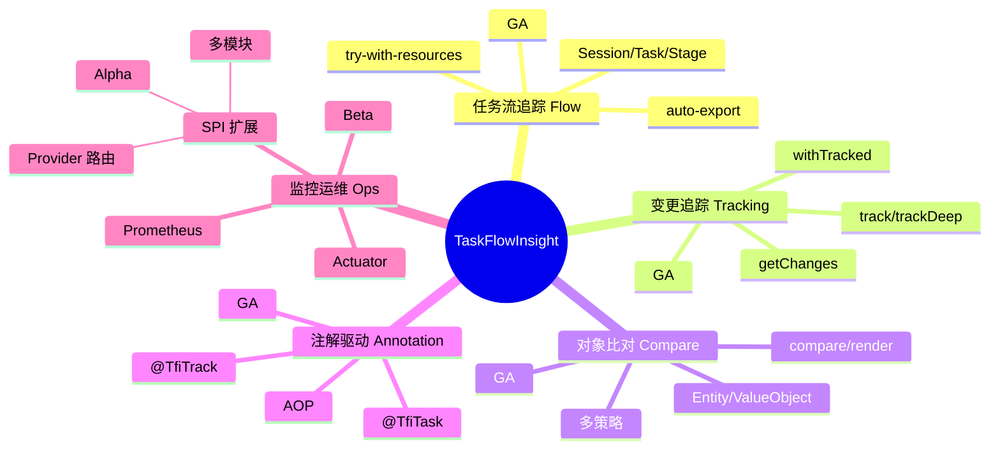
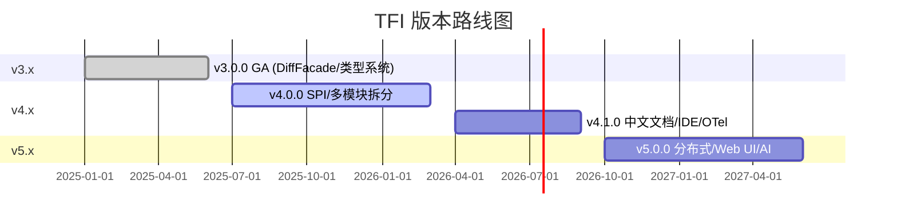

# TaskFlowInsight 整体项目 — 产品需求文档 (PRD)

> **作者**: 资深产品经理  
> **日期**: 2026-02-16  
> **版本**: v1.1  
> **最后更新**: 2026-02-18  
> **范围**: TFI 产品整体（全模块）  
> **SSOT 数据源**: [../index.md §0](../index.md#0-ssot-关键指标速查)

---

## 1. 产品概述

### 1.1 产品愿景

> 让业务流程自己"说话" —— 通过自动化可视化与变更检测，让开发者在不修改业务代码的前提下，获得业务流程的 X 光透视能力。

### 1.2 产品形态

| 形态 | 说明 |
|------|------|
| Java 库 | Maven 依赖引入，非独立服务 |
| Spring Boot Starter | 自动配置，注解驱动 |
| 独立 Facade | 纯 Java 环境也可使用 |

---

## 2. 目标用户

| 角色 | 痛点 | TFI 价值 |
|------|------|----------|
| Java 后端开发 | 断点调试效率低，日志散乱 | 自动流程树，一键可视化 |
| 技术架构师 | 难以全局把握执行路径 | 结构化流程导出，审计追踪 |
| QA 工程师 | 对象变更难以追踪 | 自动 diff，精确到字段 |
| DevOps | 缺少业务级指标 | Actuator + Prometheus 集成 |

---

## 3. 核心价值与差异化

| 维度 | APM 工具 | TFI |
|------|----------|-----|
| 粒度 | 方法/RPC 级 | **业务语义级** |
| 变更追踪 | 无 | **深度对象 diff** |
| 集成方式 | Agent / SDK | **注解 + AOP** |
| 类型系统 | 无 | **@Entity/@ValueObject/@Key** |
| 部署模式 | 独立服务 | **纯库依赖** |

### 3.1 代码对比示例

**传统日志 vs TFI 流程追踪**

```java
// 传统方式：散乱日志，难以还原调用树
log.info("开始处理订单");
orderService.validate(order);
log.info("校验完成");
orderService.calculate(order);
log.info("计算完成");
// 问题：无法自动形成层级、无法一键导出流程树

// TFI 方式：业务语义级，自动形成流程树
try (var stage = TFI.stage("订单处理")) {
    stage.message("开始处理");
    TFI.run("校验", () -> orderService.validate(order));
    TFI.run("计算", () -> orderService.calculate(order));
    stage.success();
}
TFI.exportToConsole();  // 一键输出完整流程树
```

**Javers 审计 vs TFI 变更追踪**

```java
// Javers：仅做对象版本审计，无流程上下文
Javers javers = JaversBuilder.javers().build();
javers.commit("user", order);  // 提交快照
order.setStatus("PAID");
javers.commit("user", order);  // 再次提交
// 问题：与业务流程脱节，需手动关联

// TFI：变更与流程天然绑定，自动挂载到当前 Task
TFI.track("order", order, "status", "amount");
order.setStatus("PAID");
order.setAmount(99.99);
List<ChangeRecord> changes = TFI.getChanges();  // 变更自动关联到当前 stage
```

**自建 AOP 日志 vs TFI 注解**

```java
// 自建：需维护切面、上下文、导出逻辑
@Around("@annotation(LogTask)")
public Object logTask(ProceedingJoinPoint pjp) { /* 50+ 行样板代码 */ }

// TFI：开箱即用，零样板
@TfiTask("订单创建")
public Order createOrder(OrderRequest req) {
    return orderService.create(req);
}
```

---

## 4. 功能全景

### 4.0 产品能力地图



### 4.0.1 功能矩阵表

| 能力域 | 子能力 | 成熟度 | 核心 API / 机制 | 依赖 |
|--------|--------|:------:|------------------|------|
| **Flow** | 会话管理 | GA | `startSession`, `endSession`, `clear` | tfi-flow-core |
| | 任务/Stage | GA | `stage`, `start`, `stop`, `run`, `call` | tfi-flow-core |
| | 消息记录 | GA | `message`, `error` | tfi-flow-core |
| | 查询 | GA | `getCurrentSession`, `getCurrentTask`, `getTaskStack` | tfi-flow-core |
| | 导出 | GA | `exportToConsole`, `exportToJson`, `exportToMap` | tfi-flow-core |
| **Tracking** | 浅层追踪 | GA | `track`, `trackAll` | tfi-compare |
| | 深度追踪 | GA | `trackDeep`, `TrackingOptions` | tfi-compare |
| | 变更获取 | GA | `getChanges`, `getAllChanges` | tfi-compare |
| | 生命周期 | GA | `withTracked`, `clearAllTracking` | tfi-compare |
| | 手动记录 | GA | `recordChange` | tfi-compare |
| **Compare** | 对象比对 | GA | `compare`, `comparator` | tfi-compare |
| | 渲染 | GA | `render` (Markdown) | tfi-compare |
| **Annotation** | 任务注解 | GA | `@TfiTask` | tfi-flow-spring-starter |
| | 追踪注解 | GA | `@TfiTrack` | tfi-flow-spring-starter |
| **Ops** | Actuator | Beta | `/actuator/taskflow`, `/actuator/taskflow-context` | tfi-ops-spring |
| | 指标 | Beta | Micrometer + Prometheus | tfi-ops-spring |
| **SPI** | Provider 路由 | Alpha | `register*Provider`, `loadProviders` | tfi-all |

### 4.1 TFI Facade API 能力分类

TFI 主门面类 `com.syy.taskflowinsight.api.TFI` 提供 **60+ 公共方法**，按能力域分类如下：

| 分类 | 方法数 | 示例方法 | 说明 |
|------|:------:|----------|------|
| **系统控制** | 4 | `enable`, `disable`, `isEnabled`, `clear` | 全局开关与上下文清理 |
| **会话管理** | 2 | `startSession`, `endSession` | 会话生命周期 |
| **任务/Stage** | 6 | `stage`, `start`, `stop`, `run`, `call` | 流程块与任务执行 |
| **消息记录** | 4 | `message`, `error` | 日志与消息挂载 |
| **查询** | 3 | `getCurrentSession`, `getCurrentTask`, `getTaskStack` | 上下文查询 |
| **变更追踪** | 15+ | `track`, `trackDeep`, `trackAll`, `getChanges`, `withTracked`, `clearAllTracking` | 追踪与变更获取 |
| **对象比对** | 3 | `compare`, `comparator`, `render` | 比较与 Markdown 渲染 |
| **导出** | 3 | `exportToConsole`, `exportToJson`, `exportToMap` | 流程树导出 |
| **SPI 注册** | 6 | `register*Provider`, `loadProviders` | v4.0.0 Provider 扩展 |

> tfi-examples 10 章演示覆盖上述全部能力域，详见 [§9 tfi-examples 演示模块定位](#9-tfi-examples-演示模块定位)。

---

## 5. 非功能性需求

| 指标 | 目标 |
|------|------|
| stage() 开销 | < 1μs |
| compare() 小对象 | < 100μs |
| 异常不外泄 | 100% |
| 零内存泄漏 | 100% |
| 线程安全 | 100% |

**说明**：stage() 与 compare() 目标基于 JMH 基准；异常不外泄指 TFI 内部异常不向业务代码抛出；零内存泄漏通过 try-with-resources 与 ThreadLocal 清理保证。

---

## 6. 版本路线图

| 版本 | 状态 | 关键特性 |
|------|------|----------|
| v3.0.0 | GA | 统一 DiffFacade、类型系统、多策略比对 |
| v4.0.0 | 开发中 | SPI Provider 路由、多模块拆分 |
| v4.1.0 | 规划中 | 中文文档、IDE 插件、OpenTelemetry |
| v5.0.0 | 远景 | 分布式追踪、Web UI、AI 辅助分析 |

### 6.1 路线图甘特图



---

## 7. 竞品分析

| 产品 | 类型 | TFI 差异 |
|------|------|----------|
| javers | 对象审计 | TFI = 流程 + 审计 |
| SkyWalking | APM | TFI 聚焦业务语义 |
| 自建 AOP 日志 | 自研 | TFI 开箱即用 |

---

## 8. 风险

| 风险 | 概率 | 缓解 |
|------|:----:|------|
| tfi-flow-core 版本不同步 | 中 | 统一版本管理 |
| 大对象 OOM | 低 | max-depth + 自动降级 |
| 社区采用不及预期 | 高 | 完善文档 + 布道 |

**缓解补充**：版本不同步可通过 BOM 或父 POM 统一管理；大对象 OOM 通过 `tfi.change-tracking.snapshot.max-depth` 限制深度；社区采用依赖 tfi-examples 10 章教程与持续布道。

---

## 9. tfi-examples 演示模块定位

tfi-examples 是 TFI 的**官方学习与演示模块**，提供完整学习路径与 API 覆盖验证：

| 维度 | 说明 |
|------|------|
| **定位** | 10 章渐进式教程 + 7 个 Compare Demo + JMH 基准 |
| **学习路径** | Ch1 快速入门 → Ch10 Spring 集成，覆盖 Flow / Tracking / Compare / Annotation / Ops |
| **双入口** | Spring Boot (port 19090) + CLI 交互式菜单 |
| **关联文档** | [design-doc.md](../design-doc.md)、[test-plan.md](../test-plan.md)、[ops-doc.md](../ops-doc.md) |

**章节与能力映射**：Ch1 快速入门 → Ch2 电商场景 → Ch3 高级特性 → Ch4 最佳实践 → Ch5 高级 API → Ch6 变更追踪 → Ch7 异步传播 → Ch8 比对入门 → Ch9 注解系统 → Ch10 Spring 集成。每章对应 TFI 能力域，详见 [index.md 学习路径图](../index.md#2-模块架构概览)。

详见 [tfi-examples 专家评审总览](../index.md)。

---

## 10. 用户采纳指标

用于衡量 TFI 在目标用户群体中的采纳成功度：

| KPI | 目标 | 测量方式 |
|-----|------|----------|
| **上手时间** | 30 分钟内完成首次流程追踪 | 用户调研 / 教程完成率 |
| **API 采用率** | tfi-examples 中 Facade API 纯度 ≥ 95% | 代码扫描 |
| **文档完整度** | 10 章覆盖全部核心能力 | 章节与 API 映射审计 |
| **性能达标** | stage() < 1μs，compare() 小对象 < 100μs | JMH 基准 |
| **社区反馈** | GitHub Star / Issue 活跃度 | 月度统计 |

**基线参考**（来自 [index.md §0](../index.md#0-ssot-关键指标速查)）：当前 tfi-examples Facade API 纯度 97%、10 章覆盖、端口 19090、技术栈 Java 21 + Spring Boot 3.5.5。

**追踪频率**：建议按迭代周期（如 Sprint 结束）复盘上述 KPI，与 v1.0 基线对比，识别改进机会。

**指标说明**：上手时间反映学习曲线；API 采用率验证示例代码质量；文档完整度确保能力可被学习；性能达标支撑生产可用；社区反馈反映外部认可度。

---

## 版本变更记录

| 版本 | 日期 | 变更摘要 |
|------|------|----------|
| v1.0 | 2026-02-16 | 初始 PRD |
| v1.1 | 2026-02-18 | 新增 SSOT 引用、版本/日期；扩展 §3 代码对比示例（传统日志/Javers/自建 AOP vs TFI）；§4 能力地图 mermaid、功能矩阵表、4.1 TFI Facade API 能力分类（60+ 方法）；§6.1 路线图甘特图；§9 tfi-examples 演示模块定位；§10 用户采纳指标（5 项 KPI）；版本变更记录 |

---

**参考**：项目根目录 [CLAUDE.md](../../../CLAUDE.md)、[AGENTS.md](../../../AGENTS.md) 提供开发与架构上下文；[project-overview/design-doc.md](design-doc.md) 提供全项目架构设计。

**关键术语**：Session = 会话；Task/Stage = 任务/阶段；ChangeRecord = 变更记录；CompareResult = 比对结果；Provider = v4.0.0 SPI 扩展点。**文档维护**：本文档为 TFI 整体产品 PRD；tfi-examples 模块专项 PRD 见 [tfi-examples/docs/prd.md](../prd.md)；数字类指标以 [index.md §0](../index.md#0-ssot-关键指标速查) 为 SSOT。
