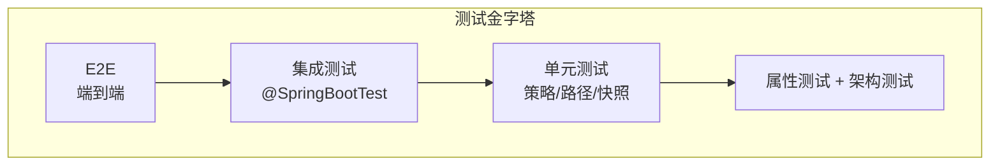

# TaskFlowInsight 整体项目 — 测试方案

> **SSOT 数据源**: [../index.md §0](../index.md#0-ssot-关键指标速查)  
> **作者**: 资深测试专家  
> **日期**: 2026-02-16  
> **版本**: v1.1  
> **最后更新**: 2026-02-18  
> **范围**: 全模块（tfi-all, tfi-compare, tfi-ops-spring, tfi-flow-spring-starter）

---

## 1. 测试策略

### 测试金字塔



```
              ╱╲        E2E
             ╱  ╲       集成测试 (@SpringBootTest)
            ╱────╲      单元测试 (策略/路径/快照)
           ╱──────╲     属性测试 + 架构测试
```

| 层级 | 比例目标 | 当前 |
|------|:--------:|:----:|
| 单元测试 | 60% | 55% |
| 集成测试 | 25% | 30% |
| 属性/架构 | 5% | 3% |
| 性能测试 | 5% | 10% |
| E2E | 5% | 2% |

**策略说明**：单元测试为主，集成测试验证 Spring 集成，属性/架构测试保障设计约束，性能测试门控回归，E2E 覆盖关键用户路径。

---

## 2. 各模块覆盖率

| 模块 | 测试文件数 | JaCoCo | 预估覆盖率 | 风险 |
|------|:----------:|:------:|:----------:|:----:|
| tfi-all | ~395 | ✅ | ~60% | 低 |
| tfi-compare | ~80 | ❌ | ~55% | 中 |
| tfi-ops-spring | 0 | ❌ | 0% | **高** |
| tfi-flow-spring-starter | 0 | ❌ | 0% | **高** |

### 2.1 tfi-all 包级分布

| 包路径 | 测试文件数 | 说明 |
|--------|:----------:|------|
| `tracking/` | 214 | 变更追踪核心（含 compare、snapshot、path、detector） |
| `tracking/compare/` | 108 | 比对策略、LCS、实体匹配 |
| `tracking/compare/list/` | 36 | 列表比对执行器 |
| `api/` | 43 | TFI Facade、路由、金标准 |
| `tracking/snapshot/` | 32 | 快照捕获与过滤 |
| `tracking/path/` | 19 | 路径构建与去重 |
| `performance/` | 14 | 性能监控与降级 |
| `context/` | 14 | ThreadLocal、SafeContextManager |
| `tracking/snapshot/filter/` | 13 | 快照过滤策略 |
| `integration/` | 13 | 端到端集成 |
| `tracking/detector/` | 10 | 变更检测器 |
| `tracking/precision/` | 9 | 数值精度、日期格式 |
| `actuator/` | 9 | Actuator 端点 |
| `store/` | 8 | 存储契约 |
| `metrics/` | 8 | Micrometer 指标 |
| `config/` | 8 | 配置解析 |
| 其他 | ~50 | spi、model、exporter、annotation、architecture 等 |

> **说明**：tfi-all 聚合 tfi-flow-core、tfi-compare、tfi-ops-spring 等依赖，测试集中在变更追踪、API、上下文与集成。

### 2.2 tfi-compare 包级分布

| 包路径 | 测试文件数 | 说明 |
|--------|:----------:|------|
| `tracking/` | 61 | 比对引擎、策略、路径 |
| `tracking/compare/` | 20 | CompareEngine、策略解析 |
| `tracking/detector/` | 11 | 变更检测 |
| `tracking/snapshot/` | 6 | 快照提供者 |
| `tracking/compare/list/` | 5 | ListExecutor 分支 |
| `config/` | 5 | 配置与解析器 |
| `tracking/path/` | 4 | 路径系统 |
| `api/` | 4 | Compare API |
| `tracking/render/` | 3 | Markdown 渲染 |
| 其他 | ~15 | query、monitoring、spi、exporter、architecture 等 |

> **说明**：tfi-compare 为独立比对模块，测试侧重 CompareEngine、策略、路径与渲染，与 tfi-all 的 tracking 测试有重叠但更聚焦。

---

## 3. 测试类型分布

| 类型 | 数量 | 工具 |
|------|:----:|------|
| 单元测试 | ~300 | JUnit 5 + AssertJ |
| 集成测试 | ~40 | @SpringBootTest + Mockito |
| 属性测试 | 1 | jqwik |
| 架构测试 | 3+ | ArchUnit |
| 金标准测试 | 6+ | ApprovalTests |
| 性能测试 | 5+ | JMH / JUnit gate |

### 3.1 各类型示例

| 类型 | 示例类 | 说明 |
|------|--------|------|
| 单元测试 | `PathBuilderTest`, `SnapshotProviderTest`, `CompareStrategyTest` | 单类/单策略隔离 |
| 集成测试 | `PrecisionIntegrationTest`, `FlowStarterIntegrationTest`, `SecureTfiEndpointComprehensiveTest` | @SpringBootTest + 真实依赖 |
| 属性测试 | `TFIPropertyTests` | jqwik 不变量与数学性质 |
| 架构测试 | `TFIArchitectureTest`, `ApiNoSpringDependencyTests`, `TfiCompareArchitectureTests` | ArchUnit 包依赖约束 |
| 金标准测试 | `TfiRoutingGoldenTest`, `PathDeduplicatorApprovalTest` | ApprovalTests 快照回归 |
| 性能测试 | `ReferenceSemanticPerformanceTests`, `PrecisionPerformanceTest`, `DegradationPerformanceTest` | JMH 或 JUnit 门控 |

### 3.2 测试命名约定

| 模式 | 用途 | 示例 |
|------|------|------|
| `*Test` | 单类单元测试（JUnit 5 默认） | `PathBuilderTest`, `JsonExporterTest` |
| `*Tests` | 多场景/参数化测试集合 | `ListExecutorBranchTests`, `CompareEngineBoundaryTests` |
| `*IntegrationTest` | 集成测试（需 Spring 上下文） | `PrecisionIntegrationTest`, `FlowStarterIntegrationTest` |
| `*PerformanceTest` | 性能/基准测试（可被 `-Pperf` 门控） | `PrecisionPerformanceTest`, `DegradationPerformanceTest` |
| `*ArchitectureTest(s)` | ArchUnit 架构约束 | `TFIArchitectureTest`, `TfiCompareArchitectureTests` |
| `*GoldenTest` | ApprovalTests 金标准回归 | `TfiRoutingGoldenTest` |

> **注意**：JUnit 5 默认匹配 `*Test`、`*Tests`、`*TestCase`、`*TestCases`，集成测试通常以 `*IT` 或 `*IntegrationTest` 命名以便 Failsafe 单独执行。

---

## 4. 关键缺口与改进

| 缺口 | 优先级 | 建议 |
|------|:------:|------|
| tfi-ops-spring 零测试 | P0 | 补齐 Actuator 端点测试 |
| tfi-flow-spring-starter 零测试 | P0 | 补齐 AOP 切面测试 |
| JaCoCo 仅 tfi-all 启用 | P1 | 扩展至 tfi-compare |
| 金标准测试部分 @Disabled | P1 | 更新 golden 文件 |
| 并发测试不足 | P1 | jcstress + CountDownLatch |
| tfi-examples 覆盖率偏低 | P2 | 增加 Demo 场景单测、Compare Demo 回归 |

---

## 5. 覆盖率目标

| 模块 | 当前 | 目标 | 时间线 |
|------|:----:|:----:|--------|
| tfi-all | ~60% | 70% | 2 周 |
| tfi-compare | ~55% | 65% | 2 周 |
| tfi-ops-spring | 0% | 50% | 3 周 |
| tfi-flow-spring-starter | 0% | 50% | 3 周 |

---

## 6. 工具链

| 工具 | 用途 |
|------|------|
| JUnit 5 | 测试框架 |
| AssertJ | 流式断言 |
| Mockito | Mock |
| jqwik | 属性测试 |
| ArchUnit | 架构测试 |
| ApprovalTests | 金标准测试 |
| JMH 1.37 | 微基准测试 |
| JaCoCo | 覆盖率 |
| Awaitility | 异步断言 |

**JaCoCo 排除**：`com/syy/taskflowinsight/model/*`、`com/syy/taskflowinsight/demo/**` 不计入覆盖率门控。

---

## 7. tfi-examples 测试概况

tfi-examples 模块共有 **17 个测试文件**（约 2,080 行），覆盖 Demo 演示与 REST 端点。

| 测试类 | 职责 |
|--------|------|
| `ChapterSmokeTest` | 10 个章节（Ch1–Ch10）冒烟测试，参数化验证每章无异常执行 |
| `DemoControllerTest` | REST 端点集成测试：`/api/demo/hello/{name}`、`/api/demo/process`、`/api/demo/async` 等 |
| `ChangeTrackingDemoTest` | 变更追踪 Demo 验证 |
| `Demo03Scenario7SortingTest` | Demo03 排序场景 |
| `Demo04FixedCollectionsTest`, `Demo04CollectionsMapFixTest` | Demo04 集合修复 |
| `Demo06QuickTest`, `Demo06SetCollectionEntitiesTest`, `Demo06FormatTest`, `Demo06DuplicateKeyManualTest`, `Demo06And07ExecutionTest` | Demo06/07 比对与格式 |
| `Demo07OutputTest` | Demo07 输出验证 |
| `TypeSystemDemoTest` | 类型系统 Demo |
| `FullFeatureVerificationTest` | 全功能验证 |
| `TestSetStrategyDirectly`, `BasicSetMapTestAfterFix` | 策略与集合回归 |

**ChapterSmokeTest 覆盖的 10 章**：QuickStart、BusinessScenario、AdvancedFeatures、BestPractices、AdvancedApi、ChangeTracking、AsyncPropagation、CompareQuickStart、AnnotationSystem、SpringIntegration。

**DemoControllerTest 覆盖的端点**：`GET /api/demo/hello/{name}`（200 + message）、`POST /api/demo/process`（200 + processed）、`POST /api/demo/async`（200 + submitted）。

**覆盖率**：约 42%（16/38 主源文件），主要由 `ChapterSmokeTest`（10 章）与 `DemoControllerTest`（REST 端点）覆盖。

---

## 8. 测试自动化与 CI 集成

各模块通过独立 GitHub Actions 工作流按路径触发：

| 工作流 | 触发路径 | 主要步骤 |
|--------|----------|----------|
| `tfi-all-ci.yml` | `tfi-all/**`, `pom.xml` | `./mvnw verify jacoco:report`、SpotBugs、Checkstyle、PMD、japicmp |
| `tfi-compare-ci.yml` | `tfi-compare/**` | 单元测试、依赖安装 |
| `tfi-flow-core-ci.yml` | `tfi-flow-core/**` | 单元测试、JaCoCo |
| `tfi-flow-spring-starter-ci.yml` | `tfi-flow-spring-starter/**` | 集成测试 |
| `tfi-ops-spring-ci.yml` | `tfi-ops-spring/**` | 单元测试 |
| `tfi-examples-ci.yml` | `tfi-examples/**` | `ChapterSmokeTest`、`DemoControllerTest` |
| `perf-gate.yml` | 手动/定时 | JMH 基准、性能门控 |

**Maven 集成**：

- `maven-surefire-plugin`：单元测试（`test` 阶段），默认排除 `**/benchmark/**`
- `maven-failsafe-plugin`：集成测试（`integration-test` 阶段）
- `jacoco-maven-plugin`：覆盖率（`jacoco.skip` 按模块配置，tfi-all 默认启用）
- 性能测试通过 `-Pperf` 或 `-Dtfi.perf.enabled=true` 门控，避免常规 CI 变慢

**CI 构建顺序**：依赖模块先 `install -DskipTests`，再对目标模块执行 `verify` 或 `test`。

**JaCoCo 报告上传**：tfi-all CI 将 `tfi-all/target/site/jacoco/` 作为 artifact 上传，保留 14 天，便于本地或第三方工具分析。

---

## 9. 测试最佳实践清单

贡献者在编写或修改测试时，建议遵循以下清单：

- [ ] **命名**：单元测试用 `*Test`，集成测试用 `*IntegrationTest`，性能测试用 `*PerformanceTest`
- [ ] **隔离**：单测不依赖 Spring 上下文，避免 `@SpringBootTest` 除非必要
- [ ] **断言**：优先使用 AssertJ 流式断言（`assertThat(x).isEqualTo(y)`）
- [ ] **清理**：使用 `@AfterEach` 或 try-with-resources 清理 TFI 上下文，避免线程泄漏
- [ ] **异步**：用 Awaitility 替代 `Thread.sleep` 做异步断言
- [ ] **金标准**：修改输出格式时同步更新 ApprovalTests golden 文件
- [ ] **性能**：性能测试加 `@Tag("perf")` 或通过 `-Pperf` 门控
- [ ] **覆盖率**：新增核心逻辑时补充对应单测，保持 JaCoCo 门控通过
- [ ] **Mock**：Mock 外部依赖时使用 `@Mock` 或 `Mockito.mock()`，避免真实 IO
- [ ] **参数化**：多分支逻辑用 `@ParameterizedTest` 或 `@MethodSource` 覆盖
- [ ] **文档**：复杂测试用 `@DisplayName` 或 Javadoc 说明意图

---

## 10. 常用测试命令速查

**环境要求**：Java 21、Maven 3.9+。首次运行建议 `./mvnw clean install -DskipTests` 安装依赖。

| 命令 | 说明 |
|------|------|
| `./mvnw test` | 运行所有单元测试 |
| `./mvnw test -Dtest=ClassName` | 运行指定测试类 |
| `./mvnw test -Dtest=ClassName#methodName` | 运行指定测试方法 |
| `./mvnw clean test jacoco:report` | 测试并生成 JaCoCo 报告（`target/site/jacoco/index.html`） |
| `./mvnw test -Pperf` | 启用性能测试（JMH 等） |
| `./mvnw verify` | 完整构建（含集成测试） |
| `./mvnw verify -Papi-compat` | API 兼容性检查（japicmp） |
| `./mvnw spotbugs:check` | SpotBugs 静态分析 |
| `./mvnw checkstyle:check` | Checkstyle 代码风格 |
| `./mvnw pmd:check` | PMD 静态分析 |

**IDE 运行**：在 IntelliJ IDEA 或 Eclipse 中右键测试类/方法选择 "Run" 即可；性能测试建议通过 Maven `-Pperf` 运行以避免 IDE 配置差异。

**tfi-examples 快速验证**：`./mvnw test -pl tfi-examples -Dtest=ChapterSmokeTest,DemoControllerTest` 可快速验证 Demo 模块核心测试。

**多模块全量测试**：`./mvnw clean verify` 从根 pom 执行，会按依赖顺序运行各模块测试；`-DskipTests` 可跳过测试仅做编译安装。性能基准可单独运行：`./run-benchmark.sh`（若已配置）。

---

## 11. 参考与相关文档

| 文档 | 说明 |
|------|------|
| [index.md](../index.md) §0 | SSOT 关键指标速查 |
| [design-doc.md](design-doc.md) | 设计文档与架构 |
| [prd.md](prd.md) | 产品需求与学习路径 |
| [ops-doc.md](ops-doc.md) | 运维与部署 |
| [CLAUDE.md](../../../CLAUDE.md) | 项目开发指南（含测试约定） |
| [AGENTS.md](../../../AGENTS.md) | 仓库规范与测试要求 |

---

## 版本变更记录

| 版本 | 日期 | 变更 |
|------|------|------|
| v1.0 | 2026-02-16 | 初版：测试策略、模块覆盖率、工具链 |
| v1.1 | 2026-02-18 | 增加 SSOT 引用、Mermaid 金字塔图、tfi-all/tfi-compare 包级分布、测试类型示例、命名约定、tfi-examples 概况、CI 集成、最佳实践清单、常用命令速查、参考文档、版本变更记录 |

---

*本文档与 [index.md](../index.md) §0 保持一致，统计数字以 SSOT 为准。*

---

*（完）*
