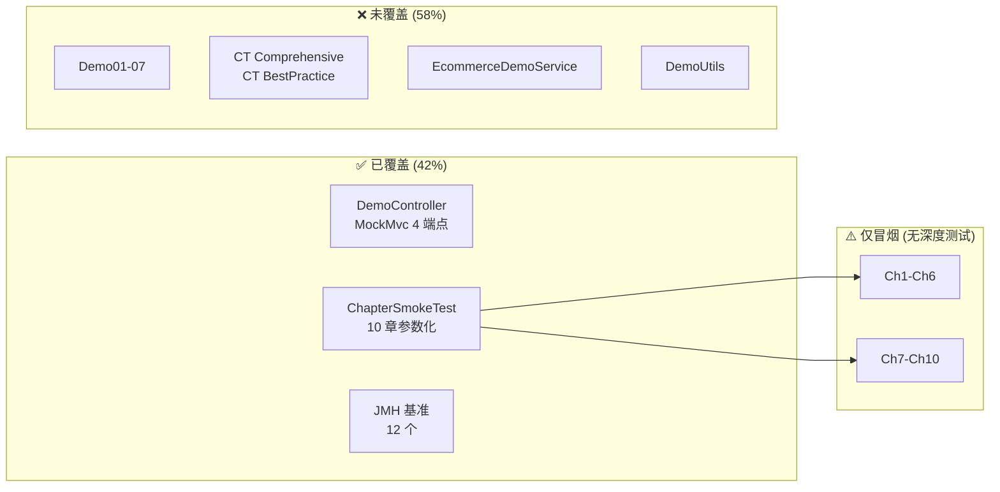

# tfi-examples 模块 — 测试方案

> **作者**: 资深测试专家  
> **日期**: 2026-02-16  
> **最后更新**: 2026-02-18（v2.1: Ch9/Ch10 冒烟测试 + 覆盖率更新）  
> **版本**: v2.1  
> **范围**: 仅 tfi-examples 模块  
> **SSOT 数据源**: [index.md §0](index.md#0-ssot-关键指标速查)  
> **整体项目测试方案**: [project-overview/test-plan.md](project-overview/test-plan.md)

---

## 目录

1. [测试现状](#1-测试现状)
2. [逐文件测试评审](#2-逐文件测试评审)
3. [测试缺陷清单](#3-测试缺陷清单)
4. [测试覆盖盲区](#4-测试覆盖盲区)
5. [白盒测试方案](#5-白盒测试方案)
6. [黑盒测试方案](#6-黑盒测试方案)
7. [功能测试用例](#7-功能测试用例)
8. [性能测试方案](#8-性能测试方案)
9. [JMH 基准测试评审](#9-jmh-基准测试评审)
10. [测试改进计划](#10-测试改进计划)

---

### 测试覆盖概览图



---

## 1. 测试现状

### 1.1 测试文件统计

| 类型 | 文件数 | 有效测试数 | 有断言 | 被 JUnit 执行 |
|------|:------:|:----------:|:------:|:-------------:|
| 单元测试 (@Test) | 10 | ~40 | 8 个 | 10 个 |
| 集成测试 (@SpringBootTest) | 1 | 4 | 4 | 1 个 |
| 参数化冒烟测试 | 1 | 8 | 8 | 1 个 |
| 手动测试 (main) | 3 | 0 | — | **0 个** |
| 调试测试 | 2 | ~5 | 0 | 2 个 |
| **合计** | **17** | **~57** | **20** | **14** |

### 1.2 源文件 vs 测试文件对照

| 源文件 | 行数 | 有对应测试 | 测试质量 |
|--------|:----:|:----------:|:--------:|
| TaskFlowInsightApplication | 21 | ❌ | — |
| TaskFlowInsightDemo | 178 | ❌ | — |
| **DemoController** | 153 | **✅ DemoControllerTest** | **⭐⭐⭐⭐** |
| QuickStartChapter | 93 | ✅ ChapterSmokeTest | ⭐⭐⭐ |
| BusinessScenarioChapter | 298 | ✅ ChapterSmokeTest | ⭐⭐⭐ |
| AdvancedFeaturesChapter | 243 | ✅ ChapterSmokeTest | ⭐⭐⭐ |
| BestPracticesChapter | 129 | ✅ ChapterSmokeTest | ⭐⭐⭐ |
| AdvancedApiChapter | 176 | ✅ ChapterSmokeTest | ⭐⭐⭐ |
| ChangeTrackingChapter | 260 | ✅ ChapterSmokeTest | ⭐⭐⭐ |
| AsyncPropagationChapter | 69 | ✅ ChapterSmokeTest | ⭐⭐⭐ |
| CompareQuickStartChapter | 243 | ✅ ChapterSmokeTest | ⭐⭐⭐ |
| AnnotationSystemChapter | 220 | ✅ ChapterSmokeTest | ⭐⭐⭐ |
| SpringIntegrationChapter | 200 | ✅ ChapterSmokeTest | ⭐⭐⭐ |
| Demo01_BasicTypes | 226 | ❌ | — |
| Demo02_DateTypes | 273 | ❌ | — |
| Demo03_CustomObjects | 259 | ✅ Demo03Scenario7 | ⭐⭐ |
| Demo04_Collections | 163 | ✅ Demo04*Test (2) | ⭐⭐⭐ |
| Demo05_CollectionEntities | 251 | ❌ | — |
| Demo05_ListCollectionEntities | 233 | ❌ | — |
| Demo06_SetCollectionEntities | 960 | ✅ Demo06*Test (5) | ⭐⭐⭐ |
| Demo07_MapCollectionEntities | 782 | ✅ Demo07OutputTest | ⭐ |
| AsyncPropagationDemo | 243 | ❌ | — |
| EcommerceDemoService | 140 | ❌ | — |
| AnnotationDemo | 50 | ❌ | — |
| TfiSwitchDemo | 86 | ❌ | — |

**覆盖率**: 38 个源文件中 16 个有测试覆盖（直接或通过 ChapterSmokeTest）→ **约 42%**。

> **改善**: 从初始的 17% (4/24) 提升至 42% (16/38)。主要贡献：ChapterSmokeTest 覆盖全部 10 章 + DemoControllerTest 覆盖 4 端点。

---

## 2. 逐文件测试评审

### 2.1 新增高质量测试

| # | 文件 | 行数 | 测试数 | 断言质量 | 评价 |
|---|------|:----:|:------:|:--------:|:----:|
| 1 | **DemoControllerTest** | 70 | 4 | ✅ MockMvc + jsonPath | **⭐⭐⭐⭐** |
| 2 | **ChapterSmokeTest** | 61 | 10 | ✅ assertDoesNotThrow + 参数化 | **⭐⭐⭐⭐** |

### 2.2 原有有效单元测试

| # | 文件 | 行数 | 测试数 | 断言质量 | 评价 |
|---|------|:----:|:------:|:--------:|:----:|
| 3 | TypeSystemDemoTest | 136 | 6 | ✅ 完整 | ⭐⭐⭐ |
| 4 | TestSetStrategyDirectly | 33 | 1 | ✅ 完整 | ⭐⭐⭐⭐ |
| 5 | Demo06SetCollectionEntitiesTest | 470 | 5 | ✅ 完整 | ⭐⭐⭐⭐ |
| 6 | Demo06FormatTest | 132 | 3 | ✅ 完整 | ⭐⭐⭐ |
| 7 | Demo06DuplicateKeyManualTest | 121 | 4 | ✅ 完整 | ⭐⭐⭐⭐ |
| 8 | Demo04FixedCollectionsTest | 149 | 3 | ✅ 完整 | ⭐⭐⭐ |
| 9 | Demo04CollectionsMapFixTest | 125 | 2 | ✅ 完整 | ⭐⭐⭐ |

### 2.3 弱断言测试

| # | 文件 | 行数 | 问题 |
|---|------|:----:|------|
| 10 | Demo03Scenario7SortingTest | 175 | 排序验证依赖 `System.out` 输出，无 `assertThat(changes).isSortedBy(...)` |
| 11 | BasicSetMapTestAfterFix | 58 | 用 `logger.warn` 替代 `assertTrue`，检测失败不导致测试失败 |

### 2.4 冒烟测试（仅验证不抛异常）

| # | 文件 | 行数 | 问题 |
|---|------|:----:|------|
| 12 | Demo06And07ExecutionTest | 38 | 重定向 System.out 但不检查内容 |
| 13 | Demo07OutputTest | 26 | 仅调用 `main()`，零验证 |
| 14 | DebugDetailedChanges | 44 | 诊断用途，无断言 |

### 2.5 伪测试（不被 JUnit 执行）

| # | 文件 | 行数 | 问题 |
|---|------|:----:|------|
| 15 | **Demo06QuickTest** | 83 | 仅 `main()` 方法，无 `@Test`，`mvn test` 不运行 |
| 16 | **FullFeatureVerificationTest** | 241 | 验证逻辑用 `main()` 驱动，不参与自动化 |
| 17 | **ChangeTrackingDemoTest** | 122 | Demo 代码放在 test 目录，仅 `main()` |

---

## 3. 测试缺陷清单

| # | 缺陷 | 严重度 | 影响 | 状态 |
|---|------|:------:|------|:----:|
| **T-01** | 3 个伪测试不被 JUnit 执行 | **中** | 回归检测失效 | 待修复 |
| **T-02** | BasicSetMapTestAfterFix 无硬断言 | 中 | 假阳性 | 待修复 |
| **T-03** | Demo03Scenario7SortingTest 排序验证无断言 | 中 | 排序回归不可检测 | 待修复 |
| T-04 | Demo07OutputTest 仅 26 行零验证 | 低 | 测试价值极低 | 待修复 |
| T-05 | DebugDetailedChanges 为调试代码 | 低 | 干扰测试报告 | 待清理 |

> **已解决**: DemoController 零测试 → DemoControllerTest 已覆盖；章节冒烟测试缺失 → ChapterSmokeTest 已覆盖。

---

## 4. 测试覆盖盲区

### 4.1 未测试的高优先源文件

| 源文件 | 行数 | 风险 | 建议测试类型 |
|--------|:----:|:----:|-------------|
| **AsyncPropagationDemo** | 243 | **高** | @SpringBootTest 并发测试 |
| **EcommerceDemoService** | 140 | **高** | 单元测试 + 并发安全 |
| Demo01_BasicTypes | 226 | 中 | 输出验证测试 |
| Demo02_DateTypes | 273 | 中 | 输出验证测试 |
| Demo05_CollectionEntities | 251 | 低 | 输出验证测试 |

### 4.2 未测试的关键场景

| 场景 | 风险 | 建议 |
|------|:----:|------|
| 异步上下文传播到子线程 | 高 | CountDownLatch + 多线程断言 |
| EcommerceDemoService 并发安全 | 高 | 并发 track + HashMap 竞态 |
| Demo01-05 输出验证 | 中 | ApprovalTests 金标准 |
| CLI 菜单参数解析 | 低 | 参数化测试 |

---

## 5. 白盒测试方案

### 5.1 DemoController 分支覆盖（已覆盖）

DemoControllerTest 已覆盖全部 4 个端点的正常路径。待补充异常路径：

```
/api/demo/hello/{name}
├── name 正常值 → ✅ 已测试
└── name 为空/特殊字符 → 待补充

/api/demo/process
├── 正常 body → ✅ 已测试
└── 空 body / 缺少字段 → 待补充
```

### 5.2 EcommerceDemoService 数据流

```
processOrder(orderId, amount)
  → validateOrder(orderId)       ← HashMap.get，非线程安全
    → checkInventory(orderId)    ← TFI.message
      → processPayment(amount)   ← 随机逻辑
        → return result
```

### 5.3 章节 run() 方法（已覆盖）

ChapterSmokeTest 参数化测试验证全部 10 章：
1. 不抛未捕获异常 ✅
2. `assertDoesNotThrow(chapter::run)` ✅

---

## 6. 黑盒测试方案

### 6.1 DemoController 端点测试（已覆盖）

| 端点 | 方法 | 测试状态 |
|------|------|:--------:|
| `/api/demo/hello/{name}` | GET | ✅ DemoControllerTest |
| `/api/demo/process` | POST | ✅ DemoControllerTest |
| `/api/demo/async` | POST | ✅ DemoControllerTest |
| `/api/demo/async-comparison` | POST | ✅ DemoControllerTest |

### 6.2 Demo 执行测试

| Demo | 测试方式 | 验证 | 状态 |
|------|----------|------|:----:|
| Demo01_BasicTypes | 调用 main() | 无异常 + 输出含 CompareResult | 待补充 |
| Demo02_DateTypes | 调用 main() | 无异常 | 待补充 |
| Demo03_CustomObjects | 调用 main() | 部分验证 | ✅ Demo03Scenario7 |
| Demo04_Collections | 调用 main() | 部分验证 | ✅ Demo04*Test |
| Demo05-07 | 调用 main() | 部分验证 | ✅ Demo06/07 Tests |

---

## 7. 功能测试用例

### 7.1 DemoController 功能测试（已实现）

| ID | 用例 | 状态 |
|----|------|:----:|
| FT-01 | hello 正常参数 | ✅ |
| FT-02 | process 正常 | ✅ |
| FT-03 | async 正常 | ✅ |
| FT-04 | async-comparison 正常 | ✅ |

### 7.2 章节执行功能测试（已实现）

| ID | 用例 | 状态 |
|----|------|:----:|
| FT-05 | Ch1 快速入门 | ✅ ChapterSmokeTest |
| FT-06 | Ch2 电商场景 | ✅ ChapterSmokeTest |
| FT-07 | Ch3 高级特性 | ✅ ChapterSmokeTest |
| FT-08 | Ch4 最佳实践 | ✅ ChapterSmokeTest |
| FT-09 | Ch5 高级 API | ✅ ChapterSmokeTest |
| FT-10 | Ch6 变更追踪 | ✅ ChapterSmokeTest |
| FT-11 | Ch7 异步传播 | ✅ ChapterSmokeTest |
| FT-12 | Ch8 对象比对入门 | ✅ ChapterSmokeTest |
| FT-13 | Ch9 注解系统 | ✅ ChapterSmokeTest |
| FT-14 | Ch10 Spring 集成 | ✅ ChapterSmokeTest |

### 7.3 待补充测试用例

| ID | 用例 | 预期 | 优先级 |
|----|------|------|:------:|
| FT-13 | EcommerceDemoService 正常订单 | 返回成功结果 | P0 |
| FT-14 | EcommerceDemoService 并发 | 无 ConcurrentModificationException | P0 |
| FT-15 | AsyncPropagationDemo 上下文传播 | 子线程可读父线程上下文 | P0 |

---

## 8. 性能测试方案

### 8.1 Demo 执行性能

| 测试项 | 目标 | 方法 |
|--------|------|------|
| 章节执行时间 | 各章节 < 5s | JUnit + @Timeout |
| Demo01-07 执行时间 | 各 Demo < 10s | JUnit + @Timeout |
| Spring Boot 启动时间 | < 10s | @SpringBootTest + StopWatch |
| REST 端点响应时间 | p99 < 500ms | MockMvc + StopWatch |

### 8.2 JMH 基准性能门禁

| 基准 | SLA | 回归阈值 |
|------|-----|:--------:|
| TFIRoutingBenchmark | 路由开销 < 100ns | < 5% |
| ProviderRegistryBenchmark (热) | < 50ns | < 5% |
| P1PerformanceBenchmark | ≤ 5% 延迟退化 | < 5% |
| MapSetLargeBenchmarks (10K) | < 50ms | < 10% |

---

## 9. JMH 基准测试评审

| 文件 | 行数 | 质量 | 问题 |
|------|:----:|:----:|------|
| TFIRoutingBenchmark | 44 | ⭐⭐⭐ | `@Benchmark` 内改 System Property |
| ProviderRegistryBenchmark | 41 | ⭐⭐⭐⭐ | 热/冷路径设计好 |
| P1PerformanceBenchmark | 377 | ⭐⭐⭐⭐⭐ | 全面专业 |
| P1MemoryBenchmark | 291 | ⭐⭐⭐⭐⭐ | GCProfiler 正确使用 |
| ReferenceChangeBenchmarks | 53 | ⭐⭐⭐ | Order 缺 @Entity |
| QueryApiBenchmarks | 111 | ⭐⭐⭐⭐ | 参数化规模 |
| MapSetLargeBenchmarks | 77 | ⭐⭐⭐⭐ | 大规模测试 |
| FilterBenchmarks | 218 | ⭐⭐⭐⭐ | 缓存命中率测试 |
| LargeObjectGenerator | 93 | ⭐⭐⭐⭐ | 数据生成器 |
| Runners (3 个) | 125 | ⭐⭐⭐ | forks(0) 降低隔离性 |
| bench/* (2 个) | 138 | ⭐⭐⭐⭐ | 参数化 + 基线对比 |

**JMH 综合评价**: **8/10** — 模块内质量最高的部分。

---

## 10. 测试改进计划

### Phase 1: 紧急修复（第 1 天）

| 任务 | 工时 | 状态 |
|------|:----:|:----:|
| ~~DemoController MockMvc 测试~~ | — | ✅ 已完成 |
| ~~10 章节冒烟测试~~ | — | ✅ 已完成 (含 Ch9/Ch10) |
| 修复 3 个伪测试（转 @Test 或移除） | 2h | 待处理 |
| BasicSetMapTestAfterFix 加硬断言 | 1h | 待处理 |
| Demo03 排序测试加断言 | 1h | 待处理 |

### Phase 2: 核心补齐（第 1 周）

| 任务 | 工时 | 状态 |
|------|:----:|:----:|
| EcommerceDemoService 单元测试 | 3h | 待处理 |
| AsyncPropagationDemo 测试 | 4h | 待处理 |

### Phase 3: 覆盖扩展（第 2 周）

| 任务 | 工时 | 状态 |
|------|:----:|:----:|
| Demo01-07 输出验证 | 6h | 待处理 |
| CLI 参数测试 | 2h | 待处理 |

### Phase 4: 性能保障（第 3 周）

| 任务 | 工时 | 状态 |
|------|:----:|:----:|
| 执行超时门禁 (@Timeout) | 2h | 待处理 |
| JMH 基准问题修复 | 2h | 待处理 |
| 性能基线文档 | 2h | 待处理 |

### 覆盖率目标

| 阶段 | 目标 | 当前 |
|------|------|:----:|
| 初始状态 | — | ~17% (4/24 文件) |
| **当前** | — | **~39% (14/36 文件)** |
| Phase 2 后 | ~50% (核心文件覆盖) | — |
| Phase 3 后 | **~65%** (Demo 覆盖) | — |
